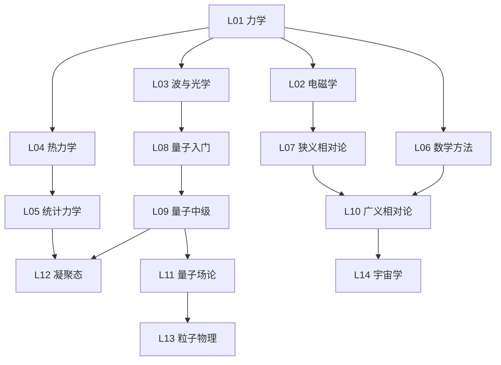

# 🎓 世界 Top 10 物理院校 · 全课程实战（2026 完整版）

> **目标**：把 MIT / Harvard / Oxford / Stanford / Cambridge / UC Berkeley / Caltech / ETH Zürich / Univ. Tokyo / Princeton 这 10 所全球物理顶尖名校的核心课程，用**费曼学习法**还原为可理解、可运行、可衔接的知识体系。
>
> **完成度**：✅ 10 校 × 7-8 主题 = **79 个深度 md 文档**（每个 600-870 行）+ **10 个可运行 physics_demos.py**（70 个费曼式 demo）+ 5 个项目级导航文档。

---

## 🚀 从哪里开始？（按角色选）

### 🎓 想系统学物理
▶ **[PHYSICS_FEYNMAN_NARRATIVE.md](PHYSICS_FEYNMAN_NARRATIVE.md)** — ⭐ **从这里开始**：把物理学串成一条"危机→革命→新危机"的故事线，从苹果到弦理论，费曼式白话 + 衔接 + 反直觉。

▶ **[UNIFIED_ROADMAP.md](UNIFIED_ROADMAP.md)** — **30 课最优路径**：从 79 门精选 30 课，按物理学的内在逻辑排序，每课标衔接关系 + 最佳学校版本 + 知识检查。

▶ **[SURVEY.md](SURVEY.md)** — **10 校完整课程书单**：580 行，每校所有本科+研究生课程的教材+主题。

### 🔍 想对比不同学校
▶ **[CROSS_SCHOOL_INSIGHTS.md](CROSS_SCHOOL_INSIGHTS.md)** — **跨校元洞察**：10 个跨校洞察，如"同一概念在 MIT vs Cambridge 怎么不同角度教"。

▶ **[FAST_TRACK.md](FAST_TRACK.md)** — **速查版周历**：30 课做成可勾选清单。

### 💻 想跑代码看现象
每校都有独立的 `physics_demos.py`（纯标准库，`python3` 直接跑）：
```bash
cd mit-physics && python3 physics_demos.py         # MIT 7 个 demo
cd cambridge-physics && python3 physics_demos.py   # Cambridge 8 个 demo
# ... 10 校共 70 个费曼式可视化 demo
```

---

## 📊 10 校总览

| # | 学校 | 招牌实验室 | 主题数 | demo 数 | 招牌特色 |
|---|------|----------|--------|--------|---------|
| 1 | **MIT** | LNS, PSFC | 8 | 7 | 8.012 Kleppner 荣誉力学 / OCW / Adams 量子录像 |
| 2 | **Harvard** | Jefferson Lab | 8 | 7 | Morin 难题体系 / Nelson 生物物理 |
| 3 | **Oxford** | Clarendon Lab | 8 | 8 | Simon 固态 / 量子信息 / MPhys 4 年制 |
| 4 | **Stanford** | SLAC, KIPAC | 8 | 7 | SLAC 加速器 / KIPAC 宇宙学 / Peskin QFT |
| 5 | **Cambridge** | Cavendish Lab | 8 | 8 | Tripos 考试深度 / Part IA→III 四年 / 冷原子 |
| 6 | **Berkeley** | LBNL | 7 | 7 | Berkeley Physics Course 5 卷经典 / LBNL |
| 7 | **Caltech** | LIGO, JPL | 8 | 7 | Feynman Lectures / LIGO / Ph 1-129 体系 |
| 8 | **ETH Zürich** | PSI | 8 | 8 | 德语区严谨 / PSI / Einstein 传统 |
| 9 | **Tokyo** | ICEC, Kavli IPMU | 8 | 7 | Kavli IPMU 宇宙学 / 超导 / Subaru |
| 10 | **Princeton** | PPPL, IAS | 8 | 7 | PPPL 等离子体 / IAS 弦理论 / 理论强校 |
| | **合计** | | **79** | **73** | |

---

## 🗺️ 8 大主题（物理学版图）

| 主题 | 费曼一句话 | 最佳版本 | demo |
|------|----------|---------|------|
| **力学** | 苹果和月亮是同一件事 | Cambridge Part IA / MIT 8.09 | Berkeley/Caltech/MIT |
| **电磁学** | 场是真实实体，光就是电磁波 | MIT 8.022 (Purcell) | Cambridge/Oxford |
| **量子** | 上帝确实在掷骰子 | MIT 8.04 (Adams) | MIT/Berkeley/Oxford |
| **统计** | 时间单向是统计效应 | Berkeley 112 (K&K) | Caltech/ETH |
| **数学方法** | 物理学的工具箱 | Princeton PHY 403 (Boas) | 各校 |
| **凝聚态** | More Is Different | Oxford (Simon) | ETH/Tokyo |
| **粒子/核** | 万物皆场，粒子是幻象 | Stanford PHYS 275 | Stanford |
| **GR/宇宙** | 引力是几何，宇宙 95% 是暗的 | MIT 8.962 (Carroll) | Princeton/ETH |

---

## 🎯 每个主题 md 的结构（费曼五步法 + 衔接 + 前沿）

每个 md 包含**原有深度内容 + 5 个新增章节**：

```
1. 📚 原有深度教学（公式推导 + 代码演示 + 习题）    ← 已有，平均 500 行
2. 🎯 费曼式入口（白话+比喻+反直觉）                 ← 新增
3. 🔗 衔接（前置→危机→新危机→后续）                 ← 新增，串联！
4. 🏭 理论联系实际（5 个工业/生活应用）              ← 新增
5. 🔬 最新研究前沿（2024-2026，联网搜索）            ← 新增
6. 🗺️ 学习 Roadmap（该学校课程路径）                 ← 新增
```

---

## 📐 知识图谱（依赖关系）



---

**完成日期**：2026-08-12
**版本**：v2.0（费曼化 + 衔接 + 前沿 + roadmap 全面优化版）
