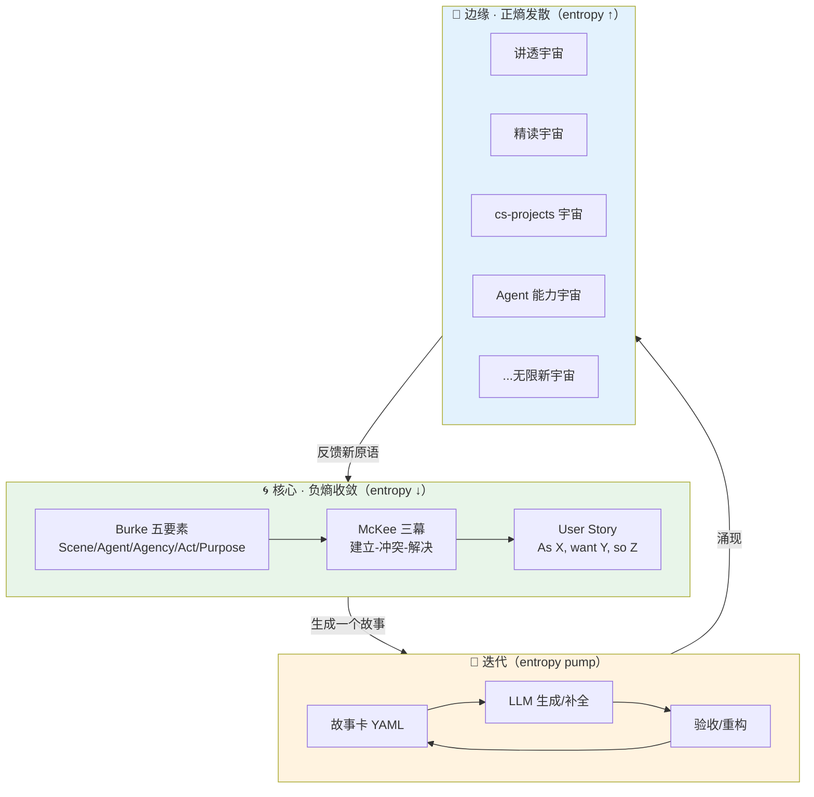

# 00 · 宣言：语言即世界，故事即原语

> 「我的语言的界限，意味着我的世界的界限。」
> —— 维特根斯坦《逻辑哲学论》§5.6 (1921)

> 「凡不可言说之物，必须保持沉默。」
> —— 维特根斯坦《逻辑哲学论》§7

这两句话不是修辞。它是本宣言的地基。如果一个领域**无法被你用语言清晰讲述成一个故事**，那它就**不在你的世界里**——你只能沉默地被它支配。反过来说：**你能把多少东西讲成故事，你就有多大的世界。**

work4ai 这个项目，本质上就是一场「用故事把 AI 这个混沌宇宙迭代成一个可居住世界」的实验。本文档把这件事的底层逻辑钉死。

---

## 一、七步推理链：从「语言」到「世界」

每一步都带学术锚点，可被追溯、可被反驳。

### 步骤 1 —— 语言不是描述世界，语言构造可被思考的世界

早期维特根斯坦（SEP "Wittgenstein", rev. 2021）：语言是世界的图画（picture theory），命题是事实的逻辑骨架。**语言的边界 = 可思考的边界 = 世界的边界。** 你说不出「不可说」的东西，不是因为它不存在，而是它不在你的世界内。

### 步骤 2 —— 意义不在「图象对应」，而在「语言游戏中的使用」

后期维特根斯坦《哲学研究》(1953) 自我推翻了图象论：一个词的意义，不在于它对应哪个对象，而在于它在**生活形式（Lebensform）**里被如何**使用**——也就是**语言游戏（Sprachspiel）**。语言从静态图象，变成了**动态的游戏 / 叙事**。

> 👉 这一推是关键：它把「语言」从字典推进到了「故事」。因为语言游戏的最小完整单位，不是词语，不是命题，而是**一段被讲出来的、有情境有目的的叙事**。

### 步骤 3 —— 故事是不可归约的意义单元（叙事认识论）

Jerome Bruner《Actual Minds, Possible Worlds》(1986)：人类有**两种平行、不可归约**的认识模式：

- **Paradigmatic（范式型）**：逻辑-科学，追求真理、普遍性、抽象。
- **Narrative（叙事型）**：追求或然、情境、人的意图与转变。

叙事不是范式思维的退化版或前科学版，它是**独立的、与逻辑-科学平起平坐的意义建构方式**。一个纯逻辑的人看不懂《哈姆雷特》，一个纯叙事的人推不动微积分——两个世界缺一不可。

> 👉 推论：知识有两种组织原语——**命题/公式** 和 **故事**。work4ai 里「讲透 X」系列的「直觉→数学→代码」三幕，本质就是把 paradigmatic 与 narrative 两套原语**焊在一起**。

### 步骤 4 —— 故事有原子结构（戏剧五大要素）

Kenneth Burke《A Grammar of Motives》(1945) 的 **sceame pentad（戏剧五大要素）**：任何完整故事都可拆为五个原子，反过来五个原子的组合能生成一切故事。

| Burke 要素 | 含义 | 软件工程映射 | 知识工程映射 |
|---|---|---|---|
| **Scene** 场景 | 在哪里发生 | 上下文 / 运行环境 | 前置知识 / 学习者所处水平 |
| **Agent** 行动者 | 谁在行动 | 用户 / 系统 / 角色（User Story 的 "As a X"）| 学习者 / 概念本身拟人化 |
| **Agency** 手段 | 用什么做 | 功能 / API / 工具 | 概念 / 公式 / 代码 |
| **Act** 行动 | 做了什么 | 交互 / 操作 | 从困惑到掌握的转变动作 |
| **Purpose** 目的 | 为了什么 | 业务价值（"so that Z"）| 能解决某类问题 |

**Joseph Campbell《The Hero with a Thousand Faces》(1949)** 的「千面英雄」、**Propp《Morphology of the Folktale》(1928)** 的 31 功能、**McKee《Story》(1997)** 的三幕剧，都是这五个原子在不同尺度上的投影。

> 👉 推论：故事不是模糊的文学概念，它是**有原子结构的可计算对象**。可以做成 schema、可以填进 YAML、可以喂给 LLM、可以并行生成。

### 步骤 5 —— AI 早期就把故事当作知识表示（Schank）

Roger Schank（耶鲁 AI 学派）《Tell Me a Story》(1990)：人类记忆不是命题清单，而是**故事记忆**。知识 = 可被检索重用的故事（scripts, MOPs, scenes, thematic abstraction units）。我们理解新事物，靠的是「这让我想起某个旧故事」。

> 👉 推论：LLM 不是例外。**LLM 本质是一台叙事引擎**——
> - 训练目标 next-token prediction = 学「叙事如何统计性地延续」；
> - context window = 一段正在被讲述的故事；
> - prompt engineering = 叙事编辑；
> - RAG = 故事检索；
> - fine-tuning = 把某种叙事风格内化进权重。
> 你不是在「调 API」，你是在**和一个叙事引擎共创故事**。

### 步骤 6 —— 简单原语 × 迭代 = 复杂世界（涌现）

复杂系统的统一生成机制：**极简规则 + 迭代 = 涌现复杂**。

- **Conway's Game of Life** (1970)：4 条规则 + 迭代 → 图灵完备。
- **Wolfram《A New Kind of Science》(2002)**：计算等价性——简单规则迭代产生等价于任何复杂系统的行为。
- **Turing《The Chemical Basis of Morphogenesis》(1952)**：反应-扩散方程 + 迭代 → 一切生物形态。
- **Mandelbrot 集**：z → z² + c 的迭代 → 无限复杂的分形。
- **Boyd & Richerson 文化演化**：故事（文化模因 meme）通过迭代复制 + 变异 → 文化世界。

> 👉 推论：「迭代出整个世界」不是诗，是宇宙、生命、文化、代码共享的**同一种生成机制**。**故事是认知层的「那个简单原语」**，对应物理层的原子、生物层的细胞、代码层的函数。

### 步骤 7 —— 软件工程已经隐式地把故事当原语用了五十年

| 软件工件 | 它其实是哪种故事 | Burke 五要素 |
|---|---|---|
| **User Story** (Beck/Cockburn) | `As a X, I want Y, so that Z` | Agent + Act + Purpose |
| **BDD Gherkin** | `Given-When-Then` | Scene + Act + 结果 |
| **Domain Storytelling / Event Storming** | 用领域语言讲业务时间线 | 全五要素 |
| **Event Sourcing** | 状态 = 事件故事的可重放投影 | Act 序列 |
| **Git commit / PR / Issue** | 不同粒度的叙事工件 | Agent + Act + Purpose |
| **ADR** (Architecture Decision Record) | 一个决策的故事（情境-选项-决定-后果）| Scene + Agency + Act |
| **Postmortem** | 一场事故的故事（时间线-根因-教训）| 全五要素 |
| **测试用例** (Arrange-Act-Assert) | 故事三幕的另一化身 | Scene + Act + 验收 |

> 👉 结论：软件工程**不是**「一群人写代码」，它**是**「一群 Agent 用故事协作，迭代出一个世界」。这个洞察是本宣言的工程支点。

---

## 二、熵的辩证：「简单可迭代 = 世界级」，是熵减还是熵增？

这是用户提出的核心张力。答案：**两者皆是，辩证统一**。

### 2.1 三块物理基石

**(a) Schrödinger《What is Life?》(1944) 第 6 章 "Order, Disorder and Entropy"**
生命「以负熵为食」（it feeds upon negative entropy）。有机体通过持续从环境汲取低熵（有序），抵抗走向热力学平衡（=死亡）。所以「生命 = 局部熵减机器」。

**(b) Prigogine 耗散结构（Nobel 1977）**
孤立系统必然熵增（热力学第二定律）。但**开放系统**可通过持续的能量/物质/信息流入，在内部形成「耗散结构」——**局部有序度上升**，代价是把熵更快地排到环境。所以「有序」与「熵增」不矛盾：**核心熵减 ⟺ 边缘向环境熵增**。

**(c) Shannon《A Mathematical Theory of Communication》(1948)**
信息 = 熵的减少 = 不确定性的消除。一个「好故事 / 好抽象」降低了接收者的认知不确定性，所以是**认知层的负熵**。

### 2.2 软件熵

- **Brooks《No Silver Bullet》(1986)** 区分 **accidental complexity**（偶然复杂性，可被工具/抽象消除）与 **essential complexity**（本质复杂性，问题固有）。
- **Hunt & Thomas《The Pragmatic Programmer》** 提出 **software rot / 破窗效应**：代码库随时间无序度上升，除非持续投入「负熵」（重构、测试、抽象）。

**所以软件工程本质是一项反熵活动。**

### 2.3 合题：世界级 = 耗散结构在认知/软件层的等价

| | 只熵减（核心收敛但不发散） | 只熵增（发散但不收敛） | **世界级（耗散结构）** |
|---|---|---|---|
| 表现 | 过度抽象、僵化、enterprise Java 重型框架 | spaghetti code、feature 垃圾堆 | **核心简单如公理 + 边缘可组合如宇宙** |
| 世界大小 | 小（生不出新东西） | 崩溃（结构垮了） | **无限（指数级可能的故事）** |
| 例子 | 死的水坝、COBOL 巨石 | 早期的野鸡 MVP | Unix pipes · HTTP · TCP/IP · Git · Linux · React · Excel · LLM token · DNA · 自然语言本身 |

**迭代，就是「把熵从核心泵到边缘」的机制**：每轮迭代，核心因抽象收敛而熵减，边缘因组合爆炸而熵增。这正是普里高津耗散结构在认知/软件层的等价形式。

### 2.4 回到「故事」

故事就是认知层的这种耗散原语——

- **核心熵减**：所有故事收敛到 Burke 五要素 / McKee 三幕 / User Story 三段式。极简。
- **边缘熵增**：五要素的组合产生人类全部叙事（Campbell 千面英雄、Propp 31 功能、所有小说电影游戏）。
- **迭代**：每个新故事微调原语组合，文化世界因此演化。

**所以你的命题完全成立：**
> 「一切能扩展到世界级的软件或产品，都因为『简单可迭代』」
> = 它们都自觉地把自己做成一个**以故事（或等价原语）为中心的耗散结构**，核心负熵收敛，边缘正熵发散，通过迭代把熵从中心泵到边缘，从而「迭代出整个世界」。

---

## 三、概念图：故事原语如何生成世界

---

## 四、对 work4ai 的意义

work4ai 已经**无意识地**演化出了 5 种叙事原语：

1. **讲透五幕**（直觉→数学→代码→不足→应用）—— 学习者的转变故事
2. **精读四幕**（动机→源码逐段→跑通→对接）—— 论文/源码的侦探故事
3. **周时间线**（cs61a 的 week/lecture/day）—— 学习者的成长史诗
4. **主题矩阵**（9 校 cs-projects 的 topic1..12）—— 知识图谱的网格故事
5. **史诗编年**（知识故事集的 15 集）—— 学科的发展史

它们都是 **Burke 五要素的不同投影**（详见 `03-五原语统一表.md`）。work4ai 还复用了一个共享骨架：9 校 cs-projects 的 `core/`（eval/llm/rag/react/tools/hybrid_search）—— 这是「Agent 技术栈」的故事骨架被复用了 9 次。

**本宣言要做的，是把这套隐式实践显式化：**

1. 把 5 种原语统一到 Burke 五要素 + 故事卡 schema（`01-原语DSL.md`）。
2. 把熵论辩证做成可引用的论文级论证（`02-熵论辩证.md`）。
3. 让每一个新内容（讲透、精读、Agent 能力宇宙……）都从一张故事卡开始，可并行生成、可迭代、可验收。

---

## 四之补 · 与项目已有元理论的关系（重要，避免两套体系打架）

本项目根目录已有一份成熟的元理论：[`故事即世界迭代器-元理论.md`](../故事即世界迭代器-元理论.md)（608 行）。它已完整论证了**同一条主线**：

> 世界 = 语言 = 故事 = 迭代 = 熵治理（五条断言，逐级推出）

并已叠加 RL 视角、毛泽哲（矛盾论/实践论/反对本本）、道教、佛教、禅宗、阳明心学、玄学、墨家、法家、兵家、纵横家、阴阳家、名家、杂家、农家等 **15+ 个哲学视角**的重读。

**那么本目录 `故事原语/` 的增量价值在哪？答：它是已有元理论的「工程化补全层」，不是平行体系。** 具体互补关系：

| 已有元理论（哲学层） | 本目录 `故事原语/`（工程层） | 互补关系 |
|---|---|---|
| 断言 2「故事=角色+冲突+转变+时间」 | Burke **sceame pentad** 五要素（Scene/Agent/Agency/Act/Purpose）+ 三重映射 | 已有给出故事的「四元定义」；本目录给出 Burke 的「五元原子」+ 软件/知识/LLM 三世界的显式映射表 |
| 断言 4「简单+可迭代=熵治理」（提了薛定谔） | `02-熵论辩证.md` 钉死 **Schrödinger + Prigogine 耗散结构 + Shannon + Brooks** | 已有点到薛定谔负熵；本目录把 Prigogine 耗散结构（诺奖）和「核心熵减⟺边缘熵增」的等式展开为可引用的论文级论证 |
| `故事化框架-生成器.md`（prompt 级模板） | `story_card_template.yaml`（结构化 schema）+ `story_map_generator.py` | 已有是自然语言 prompt；本目录是**机器可读的 YAML 卡 + 可运行生成器**，让每张故事卡可被扫描/追踪/迭代 |
| L1-L4 四层管线 | Burke 五要素 × McKee 三幕 × User Story 三段 的**等价性证明** | 已有是「四层管线」；本目录证明五种流行叙事模板（含已有的讲透五幕）都是 Burke 五要素的投影——**统一了所有模板** |

**一句话**：已有元理论回答「**为什么**故事能迭代出世界」（哲学论证）；本目录回答「**怎么**把任何领域塞进一张可计算的故事卡，并并行生成」（工程落地）。两者是 **Why 层与 How 层**，不是竞争关系。

**使用方式**：读哲学动机 → [`故事即世界迭代器-元理论.md`](../故事即世界迭代器-元理论.md)；要批量生产内容 → 用本目录的 [`story_card_template.yaml`](./story_card_template.yaml) 起卡 + [`story_map_generator.py`](./story_map_generator.py) 扫描进度。

---

## 五、一句话收束

> **语言即世界。故事是语言游戏的最小完整单元。简单的故事原语 × 迭代 = 涌现的复杂世界。世界级的软件/知识/产品，都是自觉或不自觉地把自己做成了「以故事为中心的耗散结构」——核心负熵收敛到极简原语，边缘正熵发散到无限组合，迭代把熵从中心泵到边缘。**
>
> work4ai 要做的，就是**用故事原语，把 AI 这个混沌宇宙，迭代成一个可居住的世界。**

---

📌 **下一步**
- 读 `01-原语DSL.md`：拿到故事卡 schema，开始填卡。
- 读 `02-熵论辩证.md`：把熵的部分钉死到论文引用精度。
- 读 `03-五原语统一表.md`：看 5 种已有原语如何统一。
- 用 `story_map_generator.py` 扫描整个 work4ai，生成动态故事地图。

✍️ **练习**（教学模式）
- 选 work4ai 里任意一篇你写的「讲透」文章，用 Burke 五要素重新拆解它。你会发现它已经隐式包含了全部五要素——这会说服你「故事原语」不是强加，是显化。
- 找一个你认为「世界级」的软件（Git / HTTP / React / Excel 任选），证明它符合「核心熵减 + 边缘熵增」模式。如果找不到反例，本宣言就成立。

---

## ☯ 毛泽东哲学视角

> 承接 [`毛泽东哲学视角-总入口.md`](毛泽东哲学视角-总入口.md)。

| 三论 | 本主题的对应 |
|------|------------|
| **矛盾论**（抓主要矛盾）| 本主题总存在一对核心矛盾（如精度-效率、容量-数据、表达力-可控性）；先锁定它，再谈优化 |
| **实践论**（认识循环）| 本主题的一切结论须经"实践—认识—再实践"检验：数据中来，实验中验，部署中发展 |
| **反对本本主义**（调查）| 本主题的结论不可照搬论文/大厂做法/旧经验，须在自己的数据与场景里调查后才有发言权 |

**核心洞察**：矛盾论定方向（找瓶颈），实践论定真伪（靠实验），反对本本主义定落地（靠调查）——三论闭环是认识本主题的最小完备认识纪律。

**通用锚点**：[`毛泽东哲学视角-锚点块.md`](毛泽东哲学视角-锚点块.md)

---

## ☯ 道教核心视角

> 承接 [`道教核心视角-总入口.md`](道教核心视角-总入口.md)。

| 道教视角 | 本主题的对应 |
|---------|------------|
| **道法自然** | 本主题有其不可违抗的'道'（根本规律/上限）；认清它、顺势，而非微观对抗 |
| **无为而无不为** | 本主题的'减法'在哪——去掉什么（正则/简化/不折腾）反而增强 |
| **阴阳反覆** | 本主题的对立面共处一体、物极必反；找动态平衡（冲气以为和）而非消灭一方 |
| **齐物逍遥** | 本主题如何'依乎天理'（顺应内在结构）、超越哪些人为分别、什么是筌什么是鱼 |

**核心洞察**：认清道（根本规律）顺势，去掉妄为（减法/不折腾），在对立中守动态平衡（冲气求和、知物极必反），臻于依乎天理、游刃有余。

**通用锚点**：[`道教核心视角-锚点块.md`](道教核心视角-锚点块.md)

---

## 🪷 佛教核心视角

> 承接 [`佛教核心视角-总入口.md`](佛教核心视角-总入口.md)。

| 佛教视角 | 本主题的对应 |
|---------|------------|
| **缘起性空** | 本主题依因缘（数据/架构/算力/目标）生灭，无独立自性；改变因缘即改变现象 |
| **四圣谛** | 本主题的苦（症状）→集（根因）→灭（判据）→道（系统路径），集谛优先 |
| **中道** | 本主题要避开两极端（过/欠），且一切方法/SOTA 皆无常 |
| **禅与觉察** | 对真实状态保持正念觉察（可观测），穿透'相'（表象）见本质，应无所住 |

**核心洞察**：万法因缘生无自性（空=可塑性），用四圣谛诊断根因，以中道不落两边且知无常，对表象保持正念觉察、应无所住。

**通用锚点**：[`佛教核心视角-锚点块.md`](佛教核心视角-锚点块.md)

---

## 🍵 禅宗核心视角

> 承接 [`禅宗核心视角-总入口.md`](禅宗核心视角-总入口.md)。

| 禅宗视角 | 本主题的对应 |
|---------|------------|
| **不立文字** | 直指本主题的本质，别被形式/规则/文档/框架绑架——用最少约束达目的 |
| **见性顿悟** | 本主题的'本来面目'（内部机制/本质）如何照见（见性）；涌现/突变（顿悟）在哪，顿渐如何不二 |
| **平常心是道** | 本主题最朴素够用的方案是什么；人们执着（住）于什么指标/方法；如何回归平常（见山还是山） |
| **指月之指** | 本主题里什么是'指'（工具/指标/手段）、什么是'月'（真实目的）——别把指当月 |

**核心洞察**：直指本质不拘形式（不立文字），照见本来面目与顿渐不二（见性顿悟），回归朴素不执着（平常心是道），始终辨清手段与目的（指月之指）。

**通用锚点**：[`禅宗核心视角-锚点块.md`](禅宗核心视角-锚点块.md)

---

## 💡 阳明心学视角

> 承接 [`阳明心学-总入口.md`](阳明心学-总入口.md)。

| 阳明心学视角 | 本主题的对应 |
|---------|------------|
| **心即理** | 本主题的'心'（表征/架构）是什么——它构建了怎样的世界，表征之外对模型等于无意义 |
| **知行合一** | 本主题的'知'（理论/训练）与'行'（部署/使用）如何合一——不能行=其实未知 |
| **致良知** | 本主题的本具能力（良知）是什么——如何致（激活/推充）而非从零外灌 |
| **事上磨炼** | 本主题该在什么真实场景中磨炼检验——而非书斋指标空谈 |

**核心洞察**：理在心中（心即理），真知必行（知行合一），能力本具只需推充（致良知），在事上检验磨炼（事上磨炼）。

**通用锚点**：[`阳明心学-锚点块.md`](阳明心学-锚点块.md)

---

## 🎋 玄学核心视角

> 承接 [`玄学核心视角-总入口.md`](玄学核心视角-总入口.md)。

| 玄学视角 | 本主题的对应 |
|---------|------------|
| **贵无（以无为本）** | 本主题的'无'（根本/潜能/简单原理）是什么；'有'（复杂能力/显现）如何从'无'生出 |
| **得意忘言** | 本主题的'言'（工具/框架/指标）与'意'（本质/目标）如何分判；有没有得言忘意 |
| **名教与自然** | 本主题的'自然'（涌现/内生能力）与'名教'（规范/约束）的张力；有没有名教伤自然 |
| **本末体用** | 本主题何为'本'（体/原理）、何为'末'（用/实现）；如何崇本息末、不舍本逐末 |

**核心洞察**：认清'无'为本体（贵无），守意而超越工具（得意忘言），任自然而节名教（名教与自然），辨本末以崇本息末（本末体用）。

**通用锚点**：[`玄学核心视角-锚点块.md`](玄学核心视角-锚点块.md)
