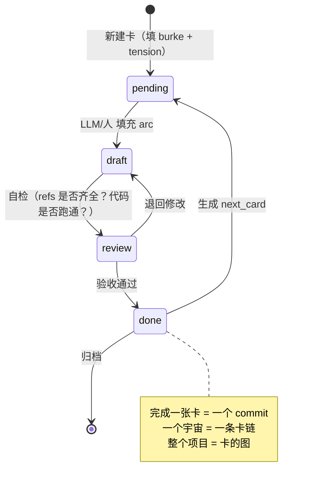

# 01 · 原语 DSL：把故事变成可计算对象

`00-MANIFESTO.md` 论证了「故事是认知原语」。本文档把它落到**工程**：定义一套最小的「故事卡」schema，让任何知识/代码内容都能从一张卡开始，可填、可生成、可验收、可迭代。

设计原则（呼应熵论）：
- **核心熵减**：schema 字段尽可能少，但覆盖 Burke 五要素 + 三幕。
- **边缘熵增**：字段值是自由文本 + 引用，可组合出无限故事。
- **可迭代**：每张卡有 `status` 和 `next_card`，形成可推进的链/图。

---
## 一、故事卡 Schema（v1）

```yaml
# ===== 必填：身份 =====
card_id: <UNIVERSE>-<NN>          # 如 NLP-03, MEM-01
title: <一句话标题>
universe: <所属宇宙>               # 如 讲透NLP, universe-memory

# ===== 必填：Burke 五要素（叙事原子）=====
burke:
  scene:    <场景：在哪里/在什么前提下>
  agent:    <行动者：谁/什么在动>
  agency:   <手段：用什么概念/工具/API>
  act:      <行动：发生了什么转变>
  purpose:  <目的：为了解决什么>

# ===== 必填：戏剧张力（没有冲突就没有故事）=====
tension: <agent 想要 X，但遇到 Y>

# ===== 必填：三幕弧（McKee）=====
arc:
  - <第一幕 建立：情境与冲突浮现>
  - <第二幕 冲突：尝试-失败-转折>
  - <第三幕 解决：转变与新的平衡>

# ===== 流转 =====
status: pending | draft | review | done | deprecated
next_card: <CARD-ID | null>        # 完成本卡后推进到哪
refs:                              # 学术/工程引用（带年份）
  - "<作者, 标题, 年份>"

# ===== 可选：LLM 生成提示 =====
prompt_hint: <生成本卡内容时给 LLM 的额外约束>
updated: <YYYY-MM-DD>
```

**为什么是这套字段，而不是别的？**

| 字段 | 对应 | 为什么必须有 |
|---|---|---|
| `burke` 五要素 | 叙事原子 | 缺任何一个，故事就不完整（没有 scene 的故事悬空，没有 purpose 的故事无意义） |
| `tension` | 戏剧冲突 | 「agent 想要 X 但遇到 Y」是故事的发动机；没有冲突就是说明书不是故事 |
| `arc` 三幕 | 叙事弧 | 保证内容有「转变」——读者读完后状态不同 |
| `status` / `next_card` | 迭代性 | 让卡片能像 git commit 一样链式推进，可重放 |
| `refs` | 学术诚实 | 强制每个论断可追溯，杜绝幻觉 |

---
## 二、三重映射：同一个原语，三个世界的投影

Burke 五要素是抽象原语。它在三个具体世界里长得不一样，但**同构**。

### 2.1 软件工程投影

| Burke | User Story | BDD Gherkin | Event Storming | Git Commit | ADR |
|---|---|---|---|---|---|
| Scene | （隐含上下文）| `Given` | 外部系统/触发 | repo 状态 | 决策时的情境 |
| Agent | `As a X` | （隐含系统）| actor / command | author | 决策者 |
| Agency | `I want Y` | （系统行为）| command / event | changed files | 考虑的选项 |
| Act | （隐含交互）| `When ... Then` | domain event | the change | 选定方案 |
| Purpose | `so that Z` | 验收价值 | business value | commit msg | 决策后果 |

**结论**：你以为是 5 种不同的工件，其实是 Burke 五要素的 5 种填法。

### 2.2 知识工程投影（work4ai「讲透 X」系列）

| Burke | 「讲透五幕」里的化身 | 例（讲透 Attention） |
|---|---|---|
| Scene | 直觉（前置认知） | 「你读一句话，眼睛会自动盯住关键词」 |
| Agent | 学习者（你） | 想理解 Transformer 的你 |
| Agency | 数学 + 代码 | Q/K/V 点积 + softmax + PyTorch |
| Act | 从困惑到掌握的转变 | 从「attention 是啥」到「能徒手写 multi-head」 |
| Purpose | 能解决某类问题 | 能读懂/调优任何 Transformer 模型 |
| Tension | 认知冲突 | 「为什么不能直接用 RNN？长依赖为什么会爆？」 |

### 2.3 LLM 投影

| Burke | LLM 里的化身 |
|---|---|
| Scene | system prompt + context window（故事的舞台）|
| Agent | LLM（被赋予角色的行动者）|
| Agency | tools / function calling（行动的手段）|
| Act | next-token 生成（叙事的逐 token 延续）|
| Purpose | user intent（故事要达成的目标）|
| Tension | 约束 vs 自由度（temperature / grammar / budget）|

**这解释了为什么 prompt engineering 本质是叙事编辑**：你在编排 scene / agent / purpose，让 LLM 沿着你想要的弧（arc）生成。

---
## 三、三种「幕」结构的等价性

三种流行的叙事模板，其实是同一个东西的三个尺度：

```
McKee 三幕         讲透五幕            User Story 三段
─────────────     ─────────────       ─────────────
建立               直觉                As a X
  ↓                 ↓                   
冲突(尝试-失败)     数学 + 代码          I want Y
  ↓                 ↓                   
解决               不足 + 应用          so that Z
```

把任何一种翻译成另一种都不会丢信息。**所以 work4ai 的 5 种已有原语（讲透五幕/精读四幕/周时间线/主题矩阵/史诗编年）都能填进同一张故事卡**——它们的差异只在 `arc` 的粒度，不在 schema。

---
## 四、故事卡的生命周期（迭代机制）



**迭代 = 推进卡片状态**。每一张 done 的卡都是一个不可变的知识 commit。整个 work4ai 就是一张巨大的故事卡图（Story Card Graph）。

---
## 五、三个填好的示例卡

### 示例 1：知识卡（讲透类）

```yaml
card_id: NLP-08
title: 讲透 Attention：从眼睛到 QKV
universe: 讲透NLP
burke:
  scene: 你读一句话时，眼睛自动聚焦关键词
  agent: 想理解 Transformer 的学习者
  agency: Q/K/V 点积 + softmax + PyTorch
  act: 从「attention 是黑盒」到「徒手写 multi-head」
  purpose: 能读懂/调优任何 Transformer
tension: RNN 处理长依赖会爆，如何让模型「动态聚焦」？
arc: [直觉(cashier类比), 数学(scaled dot-product), 代码(50行multi-head), 不足(平方复杂度), 应用(ViT/GPT/CV)]
status: done
next_card: NLP-09
refs: ["Vaswani et al., Attention Is All You Need, 2017"]
```

### 示例 2：工程卡（Agent 能力类）

```yaml
card_id: MEM-01
title: 讲透 Agent 记忆：从上下文到长期自传
universe: universe-memory
burke:
  scene: LLM 单次对话只能记住有限上下文
  agent: 想造「越用越懂我」的 Agent 的工程师
  agency: 向量检索 + 知识图谱 + 时间衰减
  act: 从「无记忆」到「有可检索的长期经验」
  purpose: 让 Agent 跨会话保持人格与知识
tension: 全塞进 context 会爆且贵，不塞又失忆——如何分层？
arc: [直觉(人脑三段记忆), 数学(cosine+RRF+Ebbinghaus), 代码(200行Memory类), 不足(污染/幻觉固化), 应用(客服/coding/陪伴选型)]
status: pending
next_card: MEM-02
refs: ["Schrödinger, 1944", "mem0 Oryza 2025", "Letta MemGPT 2024"]
```

### 示例 3：研究卡（前沿追踪类）

```yaml
card_id: FRT-42
title: 世界模型 2026：从 Sora 到 V-JEPA 2
universe: universe-predictive
burke:
  scene: model-based RL 与生成模型在 2024-2026 合流
  agent: 想理解「智能即预测」的研究者
  agency: JEPA / diffusion world model / Dreamer V3
  act: 从「预测下一帧」到「预测抽象状态」的范式跃迁
  purpose: 判断世界模型路线在机器人/VLA 上的天花板
tension: 像素级预测清晰但无用，抽象预测有用但难训
arc: [直觉(预测编码+Friston), 数学(MDP transition+JEPA loss), 代码(gridworld MCTS), 不足(distribution shift), 应用(Cosmos/Sora2/Genie2)]
status: pending
next_card: null
refs: ["LeCun JEPA 2022", "V-JEPA 2 2025", "NVIDIA Cosmos 2025"]
updated: 2026-08-13
```

---
## 六、并行生成规则（最大化并行度的关键）

故事卡的设计直接决定了**哪些卡可以并行**：

- **同 `universe` 内的卡**：按 `next_card` 形成链，**串行**（后一张依赖前一张的术语/符号）。
- **不同 `universe` 的卡**：**完全并行**（不同宇宙的 agent 各干各的，文件 ownership 不冲突）。
- **同宇宙内 tension 独立的卡**：可并行（如「讲透 RL」里 policy-based 和 value-based 两条线可并行）。

**所以「尽可能增加并行度」= 尽量把内容拆成「不同宇宙的卡」，每个宇宙派一个 agent。** 这就是为什么本工程要建 10+ 个独立宇宙（memory / codegen / collab / swarm / predictive / cache / learning / cv / multimodal / ...）——它们两两正交，可同时填。

---
📌 **下一步**
- 读 `02-熵论辩证.md`：把熵的部分钉死。
- 用本 schema 给你正在做的任何一篇文章填一张卡，感受它如何强制你想清「冲突」和「转变」。

✍️ **练习**
- 拿一篇你写过的笔记，反推它的 Burke 五要素。如果某要素空缺，那篇文章大概率「不像故事」——这就是它读起来干的根因。
