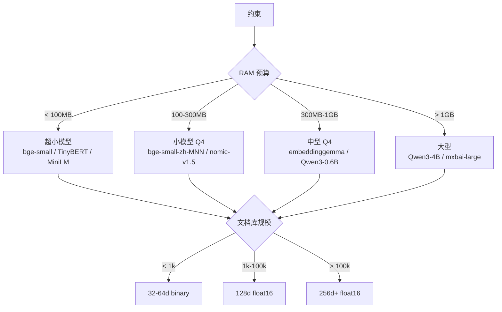

# 00 · 端侧约束全景：CPU / RAM / 存储 / 电池 / 延迟预算表

> **本章核心**：把"端侧 AI 工程"的约束拆成 6 个独立维度，给出每类的预算表、测量方法、压缩目标。**这一章不教任何算法**，只教"你有多少预算、可以花在哪里"。

---

## 一、为什么需要这一章

云端 AI 工程师的脑子里只有 3 个约束：**GPU 时长、API 成本、模型质量**。

端侧 AI 工程师要同时管理 **6 个约束**，每个都不能超：

| # | 约束 | 超了会怎样 |
|---|---|---|
| 1 | **RAM** | App 被 OS 杀掉 |
| 2 | **持续存储** | 用户卸载 App |
| 3 | **CPU** | 设备发烫、电池狂掉 |
| 4 | **GPU/NPU** | 推理慢、卡顿 |
| 5 | **电池** | 用户卸载 App |
| 6 | **延迟** | 用户感觉卡，弃用 |

每个约束都有硬上限。**端侧 AI 工程的本质是"6 维空间里的工程权衡"**。

---

## 二、6 类约束的预算表

### 2.1 RAM（运行时内存）

| 平台 | 总 RAM | App 可用 | AI 任务建议预算 | 现实原因 |
|---|---|---|---|---|
| **iOS**（iPhone 12+） | 4-8 GB | ~1-2 GB | **< 500 MB** | iOS 后台杀 App 阈值 |
| **Android**（中端） | 4-8 GB | ~1-2 GB | **< 300 MB** | 厂商激进内存清理 |
| **Android**（低端） | 2-3 GB | 500 MB-1 GB | **< 150 MB** | Redmi / OPPO 中低端 |
| **浏览器标签页** | 不定 | 100-500 MB | **< 100 MB** | 单标签 RAM 限额 |
| **树莓派 4** | 4-8 GB | 任意 | **< 1 GB** | Linux 进程限 |
| **嵌入式**（ESP32 等） | 512 KB-1 MB | 100-500 KB | **< 100 KB** | 微控制器级别 |

**典型分配**（端侧 RAG，1 万文档库）：
- 模型加载：50-200 MB（量化后）
- 嵌入库索引：5-50 MB（视 dim 和量化）
- 推理 buffer：20-100 MB
- 总计：< 350 MB（Android 中端设备安全）

### 2.2 持续存储（持久化）

| 平台 | 总存储 | App 配额 | AI 任务建议预算 | 现实原因 |
|---|---|---|---|---|
| iOS App | 任意 | 用户决定 | **< 200 MB** | 超 200MB 下载率显著降 |
| Android App (APK) | 任意 | 100-200 MB 推荐 | **< 100 MB** | Google Play 限制 |
| Android AAB | 任意 | 200 MB | **< 150 MB** | 动态分发 |
| 浏览器 IndexedDB | 几 GB | 用户配额 | **< 50 MB** | 用户清理即丢 |
| 嵌入式 SD 卡 | 任意 | 任意 | < 1 GB | I/O 慢 |

**典型分配**：
- 模型文件：50-200 MB
- 嵌入库（含索引）：5-50 MB
- 配置 + 日志：1-5 MB

### 2.3 CPU

| 平台 | 核心 | 单核性能 | AI 任务可占用 | 备注 |
|---|---|---|---|---|
| iPhone A14+ | 6 核 | 高 | 2-3 核 | NPU 优先 |
| 高端 Android（骁龙 8 Gen2+）| 8 核 | 中-高 | 2-4 核 | NPU 优先 |
| 中端 Android（骁龙 7 系）| 8 核 | 中 | 2-3 核 | NPU 弱 |
| 低端 Android（联发科 P 系列）| 4-8 核 | 低 | 1-2 核 | 无 NPU |
| 树莓派 4 | 4 核 | 低 | 全部 | 100% 占用 OK |
| 浏览器 | 2-8 核 | 中 | 2 核 | Web Worker |

**典型基准**（参考）：
- bge-small-zh-v1.5-MNN（29MB / 4 层 BERT）在骁龙 7 Gen1：~30ms / embedding
- embeddinggemma-300m Q4 在骁龙 8 Gen2：~15ms / embedding（用 NPU）
- jina-v5-nano Q5_K_M in llama.cpp 在 iPhone A15：~25ms / embedding

### 2.4 GPU / NPU

| 平台 | 类型 | 算力（TOPS）| 适合做什么 |
|---|---|---|---|
| iPhone A14+ | Neural Engine | 11-16 TOPS | 全模型推理 |
| 高端 Android | NPU | 8-30 TOPS | 全模型推理 |
| 中端 Android | NPU | 2-8 TOPS | 量化模型推理 |
| 低端 Android | GPU only | 1-2 TOPS | 小模型推理 |
| 浏览器 | WebGL / WebGPU | 0.5-4 TFLOPS | 小模型推理 |

**碎片化问题**：Android NPU 厂商多样（高通 Hexagon / 联发科 APU / ARM Ethos），算子支持差异大。MNN/TFLite 帮你抹平差异，但性能可能差 2-5×。

### 2.5 电池

| 操作类型 | 典型能耗 | 用户感知 |
|---|---|---|
| CPU 满载 1 秒 | ~0.1% 电量 | 无感 |
| CPU 满载 10 秒 | ~1% | 设备温热 |
| CPU 持续满载 1 分钟 | ~5% | 发烫 |
| NPU 满载 1 秒 | ~0.05% | 无感 |

**端侧 AI 经验法则**：单次 AI 操作 < 1 秒、< 1% 电量，用户不会感知。

### 2.6 延迟

| 任务 | 用户容忍 p99 | 工程目标 p99 |
|---|---|---|
| 实时语音转写 | 100ms | < 50ms |
| 输入法预测 | 50ms | < 30ms |
| 搜索建议（每输入一字）| 100ms | < 80ms |
| 端侧 RAG 检索 | 500ms | < 200ms |
| 文档分类（用户主动触发）| 2s | < 1s |
| 批量嵌入（后台）| 用户不感知 | 几分钟内完成 |

---

## 三、约束间的 trade-off（最关键的工程洞察）

### 3.1 RAM vs 延迟

**用 RAM 换延迟**：模型预加载到 RAM（多 200 MB）→ 推理快 5×（不用冷启动）。

**用延迟换 RAM**：模型按需加载（少 200 MB）→ 推理慢 5×。

### 3.2 存储 vs CPU

**用存储换 CPU**：存预计算的 embedding（多 50 MB）→ 检索时不用算 embedding（CPU 省 99%）。

**用 CPU 换存储**：每次实时算 embedding（少 50 MB）→ 每次检索都费 CPU。

### 3.3 精度 vs 所有

降低精度（量化、剪枝、MRL 截断）能：
- 缩小模型 → 省 RAM、省存储
- 加速推理 → 省 CPU、省电池、降延迟
- **代价**：精度下降

精度是**唯一一个可以"卖"给其他约束的维度**——只要业务能容忍。

---

## 四、端侧 AI 任务的"6 维预算模板"

填这张表，就知道你的工程空间：

```
任务：端侧 RAG（手机本地知识库）
├─ RAM:        200 MB
├─ 存储:       150 MB
├─ CPU 占用:   ≤ 2 核
├─ NPU 使用:   可选（碎片化兼容）
├─ 电池:       每次检索 < 0.5%
└─ 延迟 p99:   < 200ms
```

按这个预算，反推：
- **模型大小** ≤ 100 MB（Q4 量化后）
- **嵌入库** ≤ 30 MB（10万文档 × 128d × 2字节 float16）
- **索引开销** ≤ 20 MB（HNSW 索引）
- **推理 buffer** ≤ 50 MB

候选模型：
- ✅ bge-small-zh-MNN（29 MB）+ Matryoshka-Adaptor（200 KB）
- ✅ jina-v5-text-nano Q5_K_M（170 MB，但 ⚠️ 非商用）
- ❌ embeddinggemma-300m（300 MB Q4，超预算）
- ❌ Qwen3-Embedding-0.6B（350 MB Q4，超预算）

---

## 五、测量方法（必备工具）

### 5.1 测 RAM

```bash
# Android (adb shell)
adb shell dumpsys meminfo com.your.app

# iOS (Xcode Instruments)
# 用 Allocations instrument

# Linux/macOS
ps -o pid,rss,vsz,comm -p <PID>
top -pid <PID>
```

### 5.2 测存储

```bash
# Android: Settings > Storage > Apps
# 或:
adb shell du -sh /data/data/com.your.app/

# iOS: Settings > General > iPhone Storage
```

### 5.3 测 CPU / 电池

```bash
# Android
adb shell top -m 5
adb shell dumpsys batterystats com.your.app

# iOS: Xcode Energy Log
```

### 5.4 测延迟

```python
import time
def benchmark(model, inputs, n=100):
    times = []
    for x in inputs[:n]:
        t0 = time.perf_counter()
        model(x)
        times.append(time.perf_counter() - t0)
    times.sort()
    print(f"p50: {times[n//2]*1000:.1f}ms  p99: {times[int(n*0.99)]*1000:.1f}ms")
```

---

## 六、6 维预算的工程模板（拿走即用）

### 6.1 端侧 RAG（10 万文档库）

```
[模型]    bge-small-zh-MNN + Adaptor    29 + 0.2 MB
[嵌入库]  sqlite-vec 128d binary         1.6 MB
[索引]    sqlite-vec vec0 virtual table  5 MB
[Buffer]  推理 + tokenizer               50 MB
─────────────────────────────────────────
[RAM 总]   ~85 MB    [存储总]  ~36 MB
[CPU]     2 核, ~30ms/embedding
[p99 延迟] 50ms (embed) + 10ms (search) = 60ms ✓
```

### 6.2 浏览器扩展（10k 文档库）

```
[模型]    all-MiniLM-L6-v2 ONNX int8    23 MB
[嵌入库]  IndexedDB 128d binary          160 KB
[索引]    自实现 HNSW or sqlite-wasm     2 MB
[Buffer]  推理 + tokenizer                30 MB
─────────────────────────────────────────
[RAM 总]   ~55 MB    [存储总]  ~25 MB
[CPU]     2 核 Web Worker, ~80ms/embedding
[p99 延迟] 80ms (embed) + 20ms (search) = 100ms ✓
```

### 6.3 嵌入式设备（树莓派 Zero，500MB RAM）

```
[模型]    TinyBERT int8                   15 MB
[嵌入库]  sqlite-vec 64d binary            8 KB / 千文档
[索引]    sqlite-vec                      1 MB
[Buffer]                                   10 MB
─────────────────────────────────────────
[RAM 总]   ~30 MB    [存储总]  ~17 MB
[CPU]     1 核, ~200ms/embedding
[p99 延迟] 200ms (embed) + 5ms (search) = 205ms ✓
```

---

## 七、约束驱动的"反向工程"

给定约束，反推技术选择：



---

## 八、常见误区

### 误区 1：只看模型大小，不看推理时 RAM

模型 .safetensors 文件 30 MB，**但推理时还要 tokenizer、activation buffer、KV cache**——总 RAM 可能 100 MB+。

### 误区 2：忽略 NPU 碎片化

iOS Neural Engine 表现稳定。**Android NPU 各厂商差异 5-10×**——你的模型在骁龙上 15ms，在联发科上可能 150ms。

### 误区 3：低估索引开销

10 万文档 × 768d × float32 = 300 MB（库本身），但 **HNSW 索引还要 1.5×** = 450 MB 总占用。MRL 截断到 128d = 50 MB 库 + 75 MB 索引 = 125 MB（**省 70%**）。

### 误区 4：忽略冷启动

模型从存储加载到 RAM 需要 **1-3 秒**（视设备）。App 启动时如果阻塞用户，体验崩盘。**预热（warmup）是端侧 AI 的标配**。

### 误区 5：用 GPU 跑小模型

GPU 启动开销（kernel 编译、内存迁移）≈ 几十毫秒。**小模型（< 100M）在 CPU 上反而更快**——别盲目用 GPU。

---

📌 **下一步**：
- 看 6 类压缩技术怎么帮你满足预算 → [01 维度压缩](01-维度压缩.md)
- 想了解 sqlite-vec 全栈部署 → [07 端侧 RAG 架构](07-端侧RAG架构实战.md)
- 想选推理引擎 → [06 推理引擎对比](06-端侧推理引擎对比.md)
