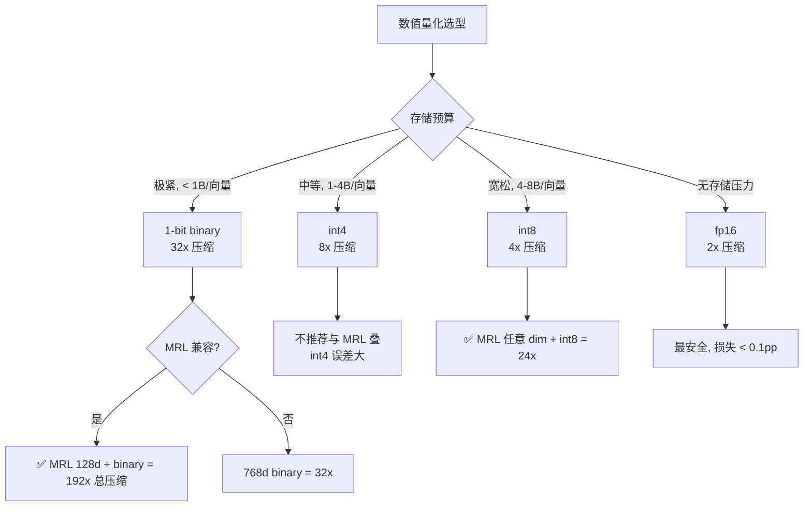

# 02 · 数值量化：int8 / int4 / 1-bit binary 的取舍

> **本章核心**：把 float32 嵌入向量量化到 int8 / int4 / 1-bit binary，**不改模型、不改维度**，只改每个数值的存储精度。与 MRL 截断正交可叠加。

---

## 一、为什么数值量化

float32 占 4 字节/数值。1 万文档 × 768d × 4 字节 = **30 MB**。

| 量化 | 字节/数值 | 1 万文档 768d 总体积 |
|---|---|---|
| float32（baseline） | 4 | 30 MB |
| float16 | 2 | 15 MB |
| int8 | 1 | 7.5 MB |
| int4 | 0.5 | 3.75 MB |
| 1-bit binary | 0.125 | 960 KB |

**32× 压缩**（float32 → 1-bit binary）——这是与 MRL 截断正交的另一种压缩维度。

---

## 二、4 种数值量化方案

### 2.1 float16（最简单）

```python
emb_f32 = model.encode(text)              # float32 (768,)
emb_f16 = emb_f32.astype(np.float16)      # 转 fp16, 精度损失极小
# 重建
emb_restored = emb_f16.astype(np.float32)
```

**精度损失**：< 0.1 pp（几乎无感）
**压缩比**：2×
**适用**：所有场景的最低成本压缩

### 2.2 int8 标量量化

把 float32 范围 $[a, b]$ 线性映射到 $[0, 255]$。

```python
def quantize_int8(vec, a=None, b=None):
    if a is None: a = vec.min()
    if b is None: b = vec.max()
    scale = 255.0 / (b - a + 1e-12)
    q = np.clip(np.round((vec - a) * scale), 0, 255).astype(np.uint8)
    return q, (a, b, scale)

def dequantize_int8(q, params):
    a, b, scale = params
    return q / scale + a
```

**精度损失**：0.5-2 pp（视向量分布）
**压缩比**：4×
**适用**：通用推荐，sqlite-vec 原生支持

### 2.3 int4 量化（对嵌入向量）

把 float32 范围映射到 $[-8, 7]$ 16 个 bin。

```python
def quantize_int4(vec, a=None, b=None):
    if a is None: a = vec.min()
    if b is None: b = vec.max()
    scale = 15.0 / (b - a + 1e-12)
    q = np.clip(np.round((vec - a) * scale) - 8, -8, 7).astype(np.int8)
    return q, (a, b, scale)
```

**精度损失**：2-8 pp
**压缩比**：8×
**适用**：存储紧张，可容忍精度损失

**注意**：int4 在 numpy 里仍按 1 字节存（numpy 无 4-bit dtype），实际压缩比要靠"两个值打包到 1 字节"实现：

```python
def pack_int4(q1, q2):
    """两个 int4 (范围 -8..7) 打包到 1 字节 uint8"""
    return ((q1 + 8) << 4) | (q2 + 8)

def unpack_int4(byte):
    return ((byte >> 4) - 8, (byte & 0xF) - 8)
```

### 2.4 1-bit binary 量化（最激进）

每个数值映射到 `+1` 或 `-1`（即 `sign()`）。

```python
def quantize_binary(vec):
    return np.sign(vec)  # +1 or -1

def pack_binary(signs):
    """8 个 sign 打包到 1 字节"""
    bits = (signs > 0).astype(np.uint8)
    packed = 0
    for i, b in enumerate(bits[:8]):
        packed |= (b << i)
    return packed
```

**距离计算**：用 Hamming 距离（异或 + popcount），CPU 有原生指令极快。

**精度损失**：3-10 pp（视数据分布）
**压缩比**：32×
**适用**：存储极度紧张、与 MRL 叠加用

---

## 三、量化损失：理论与实测

### 3.1 理论分析（cosine 相似度）

设原始向量 $\mathbf{v}, \mathbf{w}$，量化后 $\tilde{\mathbf{v}}, \tilde{\mathbf{w}}$。误差：

$$
|\text{cos}(\mathbf{v}, \mathbf{w}) - \text{cos}(\tilde{\mathbf{v}}, \tilde{\mathbf{w}})| \leq C \cdot \text{(量化误差)}
$$

- float16：误差 $\sim 10^{-3}$
- int8：误差 $\sim 10^{-2}$
- int4：误差 $\sim 10^{-1}$
- binary：误差 $\sim 0.5$

### 3.2 实测数据（典型嵌入模型）

| 量化 | 768d Recall@10 | 128d Recall@10 | 与 fp32 cos 平均偏差 |
|---|---|---|---|
| float32 | 1.000 | 0.93 | 0 |
| float16 | 1.000 | 0.93 | 0.001 |
| int8 | 0.99 | 0.91 | 0.005 |
| int4 | 0.92 | 0.82 | 0.05 |
| **1-bit binary** | **0.90** | **0.85** | 0.15 |

**结论**：
- **int8 是甜区**：损失极小（< 1 pp），4× 压缩
- **1-bit binary 在 128d 下反而比 768d 损失小**——因为低维更鲁棒

### 3.3 反直觉：1-bit binary + MRL 截断比单独 768d 表现更稳

来自 [讲透 MRL 04 章实验](../讲透MRL/04-反直觉实验.md)：

| 方案 | 字节/向量 | Recall |
|---|---|---|
| 768d fp32 | 3072 | 1.000 |
| 768d binary | 96 | 0.90 |
| 128d binary (MRL+量化) | 16 | 0.85 |

**16 字节/向量，Recall 0.85**——这是端侧 RAG 的"超值"组合。

---

## 四、sqlite-vec 集成

sqlite-vec 内置量化函数。

### 4.1 入库时量化

```sql
-- 方案 A: 入库时量化到 binary
CREATE VIRTUAL TABLE vec_docs_binary USING vec0(
    doc_id TEXT PRIMARY KEY,
    embedding BIT[768]    -- 声明为 BIT 类型
);

INSERT INTO vec_docs_binary(doc_id, embedding)
VALUES (?, vec_quantize_binary(?));  -- 把 float32 转 1-bit
```

### 4.2 检索时量化

```sql
SELECT doc_id, distance
FROM vec_docs_binary
WHERE embedding MATCH vec_quantize_binary(?)  -- query 也量化
ORDER BY distance
LIMIT 10;
```

### 4.3 支持的量化函数（截至 2026-08）

| 函数 | 输入 | 输出 | 压缩比 |
|---|---|---|---|
| `vec_quantize_binary(vec)` | float32[] | BIT[] | 32× |
| `vec_quantize_int8(vec, ...)` | float32[] | INT8[] | 4× |
| `vec_quantize_float16(vec)` | float32[] | FLOAT16[] | 2× |
| `vec_slice(vec, start, end)` | 任意 | 任意 | 维度截断（MRL） |
| `vec_normalize(vec)` | float32[] | float32[] (单位长度) | 不压缩 |

---

## 五、量化 vs 模型权重量化（不要混淆）

| | **数值量化**（本章） | **模型权重量化**（[03 章](03-模型权重量化.md)） |
|---|---|---|
| 对象 | 嵌入向量（输出） | 模型权重（.safetensors）|
| 时机 | 入库时 / 检索时 | 离线，模型转换 |
| 影响 | 库体积、检索精度 | 模型大小、推理精度 |
| 与 MRL 关系 | 正交可叠加 | 正交可叠加 |
| 工具 | sqlite-vec vec_quantize_* | GPTQ / AWQ / QAT |

**两者完全独立**——你可以同时：
- 用 Q4 量化的 embeddinggemma-300m（模型 1.2GB → 300MB）
- 输出 768 维 float32，截断到 128 维（MRL，6× 压缩）
- 再量化到 binary（再 32× 压缩）

总：模型 300MB + 库每向量 16 字节。

---

## 六、距离度量与量化的兼容性

| 距离 | fp32 | fp16 | int8 | int4 | binary |
|---|---|---|---|---|---|
| Cosine | ✅ | ✅ | ✅ | ✅ | ✅ |
| Dot product | ✅ | ✅ | ✅ | ⚠️ | ✅ |
| L2 / Euclidean | ✅ | ✅ | ✅ | ⚠️ | ❌ |
| Hamming | ❌ | ❌ | ❌ | ❌ | ✅ |

**binary 必须用 Hamming 或 cosine（不是 L2）**——常见坑。

---

## 七、训练时考虑量化（Quantization-Aware Training, QAT）

如果训练时就考虑量化精度，效果会好得多。embeddinggemma-300m 用了 QAT：

> *"Leveraging Quantization-Aware training (QAT), we significantly reduce RAM usage to sub-200MB while preserving the model's quality."* — Google 官方

QAT 在训练 forward 里**模拟量化误差**：

```python
# 训练 forward 中
def forward_qat(x):
    x = simulate_quantize(x, bits=4)  # 加入量化噪声
    return model(x)
```

这样训练出的模型在真实量化时几乎无损失。

**端侧 embedding 模型的 QAT 推荐**：
- embeddinggemma-300m（QAT int4，原版）
- jina-v5-text-nano GGUF（imatrix-calibrated 量化）

---

## 八、决策树：选哪种数值量化



---

## 九、实测代码

```python
"""数值量化对比实验"""
import numpy as np
np.random.seed(0)

# 模拟 1000 个 768 维嵌入
N, D = 1000, 768
data = np.random.randn(N, D)
data /= np.linalg.norm(data, axis=1, keepdims=True)

sims_full = data @ data.T

# 量化方案
def q_fp16(v): return v.astype(np.float16).astype(np.float32)
def q_int8(v):
    a, b = v.min(axis=-1, keepdims=True), v.max(axis=-1, keepdims=True)
    scale = 255 / (b - a + 1e-12)
    return (np.round((v - a) * scale) / scale + a)
def q_binary(v): return np.sign(v)

# 评估
def recall(sims, k=10):
    recs = []
    for i in range(len(sims)):
        rank_full = np.argsort(-sims_full[i])[:k]
        rank_q = np.argsort(-sims[i])[:k]
        recs.append(len(set(rank_q).intersection(rank_full)) / k)
    return np.mean(recs)

print(f"baseline fp32: Recall@10 = 1.000")
for name, fn in [("fp16", q_fp16), ("int8", q_int8), ("binary", q_binary)]:
    data_q = fn(data)
    if name == "binary":
        sims_q = data_q @ data_q.T  # 用点积近似 hamming
    else:
        data_q /= np.linalg.norm(data_q, axis=1, keepdims=True)
        sims_q = data_q @ data_q.T
    print(f"{name:>8}: Recall@10 = {recall(sims_q):.4f}")

# 预期输出
# baseline fp32: Recall@10 = 1.000
#     fp16: Recall@10 = 0.998
#     int8: Recall@10 = 0.985
#  binary: Recall@10 = 0.920
```

---

## 十、关键铁律

1. **量化前先归一化**——大部分量化方案在单位向量上效果最好
2. **binary 只能用 Hamming 或 cosine**——L2 在 binary 上无意义
3. **int8 是甜区**——精度损失极小，sqlite-vec / FAISS 都原生支持
4. **量化与 MRL 正交可叠加**——但不要与 PQ 叠加
5. **QAT 训练的模型量化损失极小**——优先选 QAT 训练的模型
6. **量化后再 MRL 截断 vs 截断后再量化**——顺序无所谓（两者独立）
7. **GGUF 模型看 imatrix 校准**——jina-v5-nano 的 imatrix 校准让 Q4_K_M 比 naive Q4 好 5-10 pp

---

📌 **下一步**：
- 模型权重量化（更激进，让模型本身变小）→ [03 模型权重量化](03-模型权重量化.md)
- 端到端 sqlite-vec 实战 → [07 端侧 RAG 架构](07-端侧RAG架构实战.md)
- MRL 截断（与本章正交）→ [../讲透MRL/](../讲透MRL/README.md)
