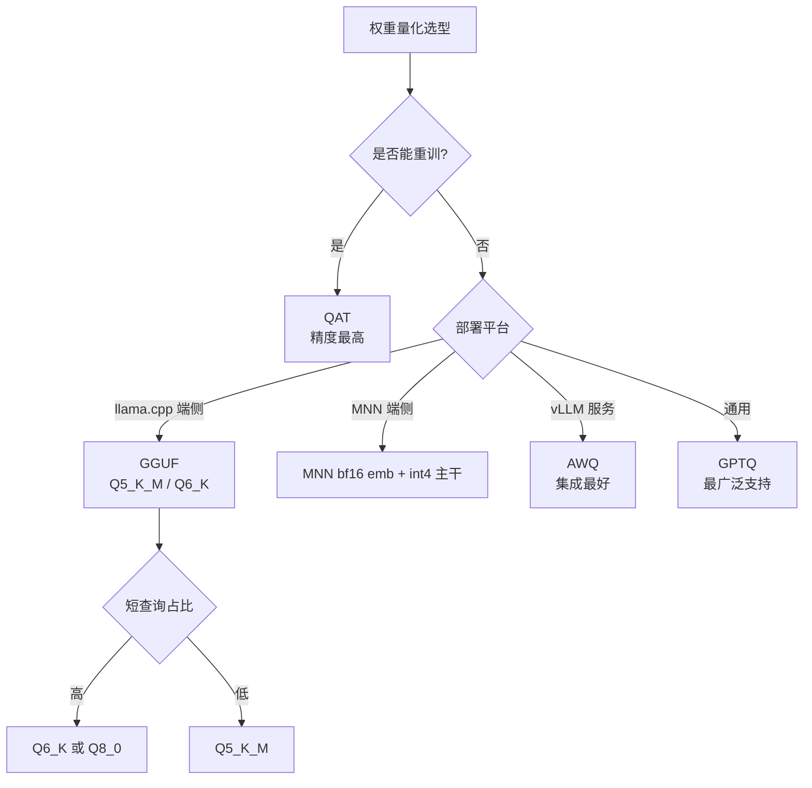

# 03 · 模型权重量化：GPTQ / AWQ / MatQuant / QAT

> **本章核心**：把 `.safetensors` 模型权重从 float32 量化到 int4 / int8，**真正缩小模型本身**——RAM 占用、加载时间、推理 FLOPs 都下降。与 [02 数值量化](02-数值量化.md)（输出向量量化）完全不同。

---

## 一、本章与 02 章的区别（关键）

| | 02 数值量化 | 03 模型权重量化（本章） |
|---|---|---|
| 对象 | **嵌入向量**（输出） | **模型权重**（.safetensors） |
| 时机 | 入库时 / 检索时 | **离线转换** |
| 影响 | 库体积、检索精度 | **模型大小、推理精度、RAM** |
| 量化粒度 | 每个数值独立 | 通常**按 channel / group** |
| 工具 | sqlite-vec `vec_quantize_*` | GPTQ / AWQ / llama.cpp / MNN |
| 是否影响推理 | 不影响（只改存储） | **影响**（推理路径不同） |

---

## 二、为什么权重量化更复杂

输出向量量化是把每个数值独立映射到 int（线性变换）。**模型权重量化必须考虑推理路径**：

```
forward = matmul(x, W) + b
```

如果 $W$ 量化到 int4，但 $x$ 还是 float32，**每次 forward 都要反量化 $W$** → 反而变慢。

正确做法：
- **量化感知训练 QAT**：训练时就模拟量化误差，让权重"适应"低精度
- **后训练量化 PTQ**：训练后用小校准集调整量化参数

---

## 三、4 种主流权重量化方案

### 3.1 GPTQ（一 shot PTQ，最流行）

**论文**：Frantar et al. ICLR 2023，*"GPTQ: Accurate Post-Training Quantization for Generative Pre-trained Transformers"*

**核心思想**：基于二阶信息（Hessian）的逐层量化，每量化一个权重就更新剩余权重补偿误差。

```bash
# AutoGPTQ 一键量化
pip install auto-gptq optimum

python -c "
from optimum.intel import ORTModelForCausalLM
from transformers import AutoTokenizer
model_id = 'Qwen/Qwen2.5-0.5B'
quant_model = ORTModelForCausalLM.from_pretrained(
    model_id, export=True, provider='CPUExecutionProvider'
)
"
```

**特点**：
- **一 shot**：用 128-1024 条校准数据，几分钟完成
- **int4 是甜区**：精度损失 < 1 pp，模型缩小 4×
- **int2 严重掉点**：要用 MatQuant 解决

### 3.2 AWQ（Activation-aware，更准）

**论文**：Lin et al. MLSys 2024，*"AWQ: Activation-aware Weight Quantization for LLM Compression and Acceleration"*

**核心洞察**：不是所有权重同等重要——**激活值大的通道对应权重更重要**，应该保护它们（保持高精度或 fp16）。

**实现**：
1. 跑校准数据，统计每通道激活幅度
2. 高激活通道的权重不量化（或用更精细的 group）
3. 其余通道 int4 量化

**特点**：
- 比 GPTQ 精度更高（特别是 LLM 推理）
- 推理时用专门的 kernel 加速
- 集成进 vLLM / TensorRT-LLM

### 3.3 GGUF（llama.cpp 格式，端侧首选）

GGUF 不是单一量化方案，而是**一组量化级别**，从 2-bit 到 8-bit，含 K-quants（重要性感知）和 I-quants（重要性 + 不规则）：

| 量化 | 每权重 bit | 推荐场景 |
|---|---|---|
| F16 | 16 | 基线 |
| Q8_0 | 8 | 高精度 |
| **Q6_K** | 6.5 | 接近 fp16 精度 |
| **Q5_K_M** | 5.5 | **★ 生产 CPU 推荐**（jina-v5-nano 默认） |
| Q4_K_M | 4.5 | 内存紧张（**短文本可能崩**）|
| IQ4_XS | 4.25 | 极限内存 |
| Q3_K_M | 3.5 | 不推荐 |
| IQ2_M | 2.5 | 实验性 |
| IQ1_S | 1.5 | 几乎不可用 |

**K-quants vs I-quants**：
- K-quants：按 group 大小调整量化粒度（重要 group 用更多 bit）
- I-quants：用 importance matrix（imatrix）校准，更激进

**imatrix 校准**（重要！）：

```bash
# 用代表语料计算 importance matrix
./llama-imatrix -m model-f16.gguf -f calibration_data.txt -o model.imatrix

# 用 imatrix 做量化
./llama-quantize --imatrix model.imatrix model-f16.gguf model-q4km.gguf Q4_K_M
```

jina-v5-text-nano 的官方 GGUF 全部用了 imatrix 校准——这是为什么它的 Q4_K_M 在 medium 文本上 cos > 0.96 的原因。

### 3.4 MNN 量化（端侧 MNN 推荐）

阿里 MNN 工具链的量化：

```bash
# 用 MNNConvert
MNNConvert -f ONNX \
    --modelFile model.onnx \
    --MNNModel model.mnn \
    --fp16    # 或 --quantizeConfig config.json
```

**特点**：
- int8 / int4 / bf16 embedding 表分离（关键！）
- 4bit QAT 配合训练，效果接近 fp16
- 与 mnn-llm 框架深度集成

### 3.5 MatQuant（MRL 推广到权重位宽）

**论文**：Nair et al. ICML 2025，详见 [讲透 MRL 06 章 §3.2](../讲透MRL/06-前沿综述-2022-2026论文谱系.md)。

**核心**：int8 模型的"前 4 个 bit"是 int4 模型——一个 checkpoint 运行时按需切片。

**状态**：仍较新，工程化工具少（MatGPTQ arXiv:2602.03537 在跟进）。

### 3.6 QAT（Quantization-Aware Training）

训练时就模拟量化误差，模型"学会"在低精度下工作。

```python
# PyTorch 示例
import torch.ao.quantization as quant

model_fp32 = MyModel()
model_fp32.qconfig = quant.get_default_qconfig('fbgemm')
model_prepared = quant.prepare_qat(model_fp32.train())
# 正常训练...
model_int8 = quant.convert(model_prepared.eval())
```

**特点**：
- 精度最高（几乎是 fp32）
- 需要完整训练流程，不是一 shot
- embeddinggemma-300m 用 QAT 训练，所以官方 sub-200MB

---

## 四、int4 量化的实际数字（bge-small-zh-v1.5）

参考你 mem0 项目的实测（[CONVERSION_NOTES.md](~/ai/photo/ocr/mem0/models/CONVERSION_NOTES.md)）：

| 量化 | 模型大小 | 单 embedding 延迟（MNN CPU）| cos vs fp32 |
|---|---|---|---|
| fp32 原版 | 91 MB | ~50ms | 1.000 |
| bf16 embedding + int8 主干 | 50 MB | ~40ms | 0.998 |
| **bf16 embedding + int4 主干（MNN）** | **29 MB** | **~30ms** | **1.000** |

> 注：embedding 层（词表 × hidden）bf16 分离存储是关键，**不要量化 embedding 表**——会严重影响精度。

---

## 五、jina-v5-text-nano 量化级别选择（一手核实）

来自 [jina-v5-text-nano-text-matching-GGUF](https://huggingface.co/jinaai/jina-embeddings-v5-text-nano-text-matching-GGUF) README 量化表：

| 量化 | 大小 | very_short cos（2-4 tokens）| short cos（5-15）| medium cos（16-30）|
|---|---|---|---|---|
| F16 | 480 MB | 1.0000 | 1.0000 | 1.0000 |
| Q8_0 | 280 MB | 0.9963 | 0.9998 | 0.9988 |
| Q6_K | ~220 MB | 0.9829 | 0.9989 | 0.9845 |
| **Q5_K_M** | **170 MB** | **0.9409** ⚠️ | 0.9971 | 0.9836 |
| Q5_K_S | ~165 MB | 0.9534 | 0.9968 | 0.9727 |
| **Q4_K_M** | **152 MB** | **0.9122** ❌ | 0.9911 | 0.9560 |
| IQ4_XS | 130 MB | 0.8298 ❌ | 0.9867 | 0.8897 |
| Q3_K_M | 110 MB | 0.7457 ❌ | 0.9683 | 0.8799 |

**生产建议**：
- 短查询 / 关键词检索（人名、地名、单词）：**Q6_K 或 Q8_0**
- 一般中文段落：**Q5_K_M**（推荐）
- 内存极紧：IQ4_XS（可接受 medium 文本精度）
- 不要用：Q4_K_M 及以下（very_short 输入精度崩）

---

## 六、量化流程（端到端）

### 6.1 bge-small-zh → MNN Q4

```bash
# 1. 下载原版
modelscope download --model BAAI/bge-small-zh-v1.5 --local_dir ./bge-small-zh

# 2. 转 ONNX (用 optimum)
pip install optimum onnx onnxslim onnxruntime
optimum-cli export onnx --model ./bge-small-zh --trust-remote-code ./bge-small-onnx

# 3. 转 MNN + 量化
pip install MNN
MNNConvert -f ONNX \
    --modelFile ./bge-small-onnx/model.onnx \
    --MNNModel ./bge-small.mnn \
    --weightQuantBits 4 \    # 4bit 主干
    --fp16                    # embedding 表 fp16

# 4. 验证 (onnxruntime 对比)
python verify_mnn.py
```

### 6.2 jina-v5-text-nano → GGUF Q5_K_M

```bash
# 直接下官方 GGUF
modelscope download --model jinaai/jina-embeddings-v5-text-nano-text-matching-GGUF \
                    --local_dir ./jina-v5-nano-gguf

# 选 Q5_K_M (生产推荐)
ls jina-v5-nano-gguf/v5-nano-text-matching-Q5_K_M.gguf

# 用 llama.cpp 跑
./llama-embedding -m jina-v5-nano-gguf/v5-nano-text-matching-Q5_K_M.gguf \
                  --pooling last \
                  -p "Document: 机器学习"
```

### 6.3 embeddinggemma-300m（官方 QAT int4）

```python
# embeddinggemma 本身就是 QAT 训练的, 直接用
from sentence_transformers import SentenceTransformer
model = SentenceTransformer("google/embeddinggemma-300m")  # 已是 QAT 版

# 转 MNN (用你的 convert_to_mnn.sh)
./convert_to_mnn.sh google/embeddinggemma-300m 4
```

---

## 七、QAT vs PTQ：什么时候选哪个

| 场景 | 推荐 |
|---|---|
| 用别人训好的模型 | **PTQ**（GPTQ / AWQ / GGUF） |
| 你能控制训练流程 | **QAT**（精度最高） |
| 端侧 RAG（中文） | **GGUF Q5_K_M**（imatrix 校准）|
| LLM 推理服务 | **AWQ**（vLLM 集成） |
| 多端部署 | **MatQuant**（一份 checkpoint 多精度）|

---

## 八、量化陷阱

### 陷阱 1：embedding 表不要量化

```python
# ✗ 错误: 全部 int4
model_quant = quantize_all_weights(model, bits=4)

# ✓ 正确: embedding 表 bf16, 主干 int4
model_quant = quantize_transformer_layers(model, bits=4)
model_quant.embeddings = model.embeddings.to(torch.bfloat16)
```

**原因**：词表 × hidden 矩阵很大（如 21128 × 512 = 10.8M 参数），量化后词嵌入精度严重下降。

### 陷阱 2：outlier channel

部分 channel 的权重幅度比其他大 10-100×，量化后被压成 0。**对策**：
- AWQ 自动识别并保护 outlier channel
- SmoothQuant：把激活的"难度"转移到权重

### 陷阱 3：极短输入崩

jina-v5-nano Q4_K_M 在 2-4 token 输入上 cos < 0.92。**对策**：
- 用 Q5_K_M 或 Q6_K
- 或对短查询走 fallback（直接用 tokenizer 找词嵌入）

### 陷阱 4：量化后 batch 推理慢

某些量化方案在 batch=1 时快，batch>1 时变慢（kernel 不优化）。**对策**：测端侧实际场景的 batch。

---

## 九、决策树



---

## 十、关键铁律

1. **embedding 表用 bf16，主干 int4**——量化 embedding 表是大忌
2. **GGUF 优先选 imatrix 校准版**——精度提升 5-10 pp
3. **Q4_K_M 不一定够用**——短文本场景要看 cos 表，可能要 Q5_K_M
4. **AWQ 比 GPTQ 精度高**——但 kernel 集成少
5. **QAT 是终极方案**——但需训练资源
6. **不要量化 norm 层**——LayerNorm / RMSNorm 的权重小但敏感
7. **量化后必须实测**——cos 相似度对比 fp32 baseline
8. **MatQuant 是未来**——一份 checkpoint 多精度切片，但工程化未成熟

---

📌 **下一步**：
- 模型架构压缩（剪枝 / 2D-MRL）→ [04 模型剪枝与层数截断](04-模型剪枝与层数截断.md)
- 端侧推理引擎对比 → [06 推理引擎对比](06-端侧推理引擎对比.md)
- 完整端侧 RAG 部署 → [07 端侧 RAG 架构实战](07-端侧RAG架构实战.md)
