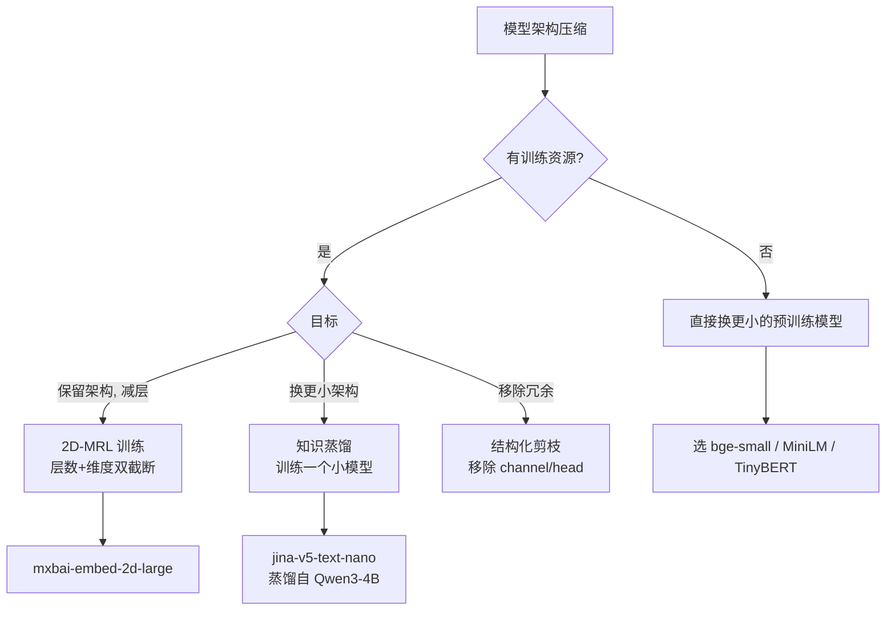

# 04 · 模型剪枝与层数截断：2D-MRL / 蒸馏 / 结构化剪枝

> **本章核心**：真正能"缩小模型架构本身、降低推理 FLOPs"的 4 种技术——结构化剪枝、非结构化剪枝、层数截断（2D-MRL）、知识蒸馏。
>
> **关键定位**：[MRL 截断](../讲透MRL/)只缩小输出，[数值量化](02-数值量化.md)只缩小存储，**本章才是真正让模型推理更快**。

---

## 一、为什么需要本章

前面三章的局限：

| 技术 | 缩小模型权重 | 缩小输出 | 降低推理 FLOPs |
|---|---|---|---|
| MRL 截断 | ❌ | ✅ | ❌ |
| 数值量化 | ❌（推理时反量化）| ✅ | ⚠️（专用 kernel 才快）|
| 模型权重量化 | ✅ | ❌ | ⚠️（专用 kernel 才快）|
| **剪枝 / 蒸馏**（本章）| ✅ | ❌ | **✅** |

**想让推理真的快**（不只是权重小），必须减少计算量——本章是唯一选项。

---

## 二、4 种技术概览

| 技术 | 移除什么 | 精度损失 | 训练成本 | 工程复杂度 |
|---|---|---|---|---|
| **非结构化剪枝** | 单个权重置 0 | 中（需稀疏 kernel 加速）| 低 | 高（kernel） |
| **结构化剪枝** | 整个 channel / head | 中-高 | 中 | 中 |
| **层数截断** | 整个 Transformer 层 | 中-高（2D-MRL 减小）| 高（2D-MRL 训练） | 低 |
| **知识蒸馏** | 训练更小的"学生" | 低 | 高（完整训练） | 低 |

---

## 三、非结构化剪枝（Magnitude Pruning）

### 3.1 核心思想

把绝对值小的权重直接置 0（小于阈值 $\theta$）：

```python
def magnitude_prune(weight, sparsity=0.5):
    """把 sparsity 比例的最小权重置 0"""
    threshold = np.quantile(np.abs(weight), sparsity)
    mask = np.abs(weight) > threshold
    return weight * mask, mask
```

### 3.2 稀疏度 vs 精度

| 稀疏度 | 模型体积（理论） | 实际推理速度 | 精度损失 |
|---|---|---|---|
| 0% | 100% | 1× | 0 |
| 50% | 50% | **1×（不加速！）** | 1-2 pp |
| 80% | 20% | 1.5×（需稀疏 kernel）| 5-10 pp |
| 95% | 5% | 2-3×（专用硬件） | 严重 |

**关键陷阱**：稀疏存储容易（CSR 格式），但稀疏矩阵乘法在普通 GPU/CPU 上**不加速**——需要专用 kernel（如 cuSPARSE / Neural Magic）。

### 3.3 适用场景

- 有专用稀疏硬件（NVIDIA A100 2:4 稀疏）
- 极致压缩且不在乎推理速度
- 学术研究

**不推荐端侧 RAG**——稀疏 kernel 在 ARM CPU 上几乎无优化。

---

## 四、结构化剪枝（Channel / Head Pruning）

### 4.1 核心思想

整个 channel 或 attention head 一起移除，**保持稠密矩阵运算**：

```python
def channel_prune(conv_weight, channels_to_keep):
    """卷积层 channel 剪枝"""
    return conv_weight[channels_to_keep, :, :, :]
```

### 4.2 移除什么

- **CNN**：整个 channel（filter）
- **Transformer**：整个 attention head 或整个 neuron
- **MLP**：整个 hidden unit

### 4.3 评估"重要性"

剪枝前要先评估哪个 channel 重要：

| 方法 | 思想 |
|---|---|
| **Magnitude** | 权重绝对值小的 channel 不重要 |
| **Gradient** | 梯度小的 channel 不重要 |
| **Taylor expansion** | $\|w \cdot \nabla w\|$ 小的不重要 |
| **Activation** | 激活值小的 channel 不重要 |
| **Greedy** | 逐个尝试，按精度损失排序 |

### 4.4 实测（典型 BERT 模型）

| 剪枝策略 | 剪枝率 | 推理加速 | 精度损失 |
|---|---|---|---|
| Head pruning（重要性）| 30% heads | 1.3× | 1 pp |
| Head pruning | 50% heads | 1.7× | 3 pp |
| Channel pruning | 30% | 1.4× | 2 pp |
| Channel pruning | 50% | 1.8× | 5 pp |

### 4.5 适用场景

- 有训练资源做敏感性分析
- 模型有冗余（如大模型剪成小模型）
- 工程化产品

---

## 五、层数截断（Layer Pruning / Depth Pruning）

### 5.1 核心思想

移除 Transformer 的部分**层**。比如 12 层 BERT 减成 6 层，参数减半。

### 5.2 简单实现（性能差）

```python
# 简单粗暴: 直接砍掉最后几层
model.encoder.layer = model.encoder.layer[:6]  # 保留前 6 层
```

**问题**：每层都贡献信息，砍掉会严重掉点。

### 5.3 2D-MRL（推荐方案）

Wang SIGIR 2025（详见 [讲透 MRL 06 章 §3.5](../讲透MRL/06-前沿综述-2022-2026论文谱系.md)）：

训练时在**多个嵌套深度**上算 loss：

$$
\mathcal{L}_{\text{2D-MRL}} = \sum_{\ell \in \{4, 6, 8, 12\}} \sum_{m \in \{128, 256, 512, 768\}} \mathcal{L}_{\text{base}}(\ell, m)
$$

部署时按需选 $(\ell, m)$ 组合：
- $(12, 768)$：100% 算力
- $(6, 256)$：~17% 算力，精度掉 5-10 pp
- $(4, 128)$：~6% 算力，精度掉 15-20 pp

### 5.4 开源实现

- HF: [mixedbread-ai/mxbai-embed-2d-large-v1](https://huggingface.co/mixedbread-ai/mxbai-embed-2d-large-v1)（13-24 层可截）
- ST: `Matryoshka2dLoss`

### 5.5 实测（mxbai-embed-2d-large-v1，来自 [Mixedbread 博客](https://www.mixedbread.com/blog/mxbai-embed-2d-large-v1)）

| 层数 | 维度 | SciFact nDCG | STS Spearman |
|---|---|---|---|
| 24（全）| 1024 | 68.64 | 79.59 |
| 18 | 1024 | 67.0 (-2.4%) | 77.0 (-3.3%) |
| 13 | 1024 | 65.0 (-5.3%) | 75.0 (-6.1%) |
| 24 | 128 | 65.27 (-4.9%) | 75.0 |
| **13（半层数）+ 128（1/8 维）** | | **60.0 (-12.6%)** | **68.0 (-14.5%)** |

**结论**：层数和维度同时压缩到 50%/12.5% 时，精度还保留 85%+。**这是端侧推理真正的加速方案**。

---

## 六、知识蒸馏（Knowledge Distillation）

### 6.1 核心思想

用大模型（teacher）的输出训练小模型（student），让 student 模仿 teacher。

```
[Teacher 大模型] ─► soft labels (logits)
                       ↓ KL divergence loss
[Student 小模型] ─► 训练
```

### 6.2 算法

```python
def distillation_loss(student_logits, teacher_logits, true_labels,
                      temperature=2.0, alpha=0.5):
    """student 跟 teacher 学."""
    # soft target loss (KL divergence)
    soft_loss = F.kl_div(
        F.log_softmax(student_logits / temperature, dim=1),
        F.softmax(teacher_logits / temperature, dim=1),
        reduction='batchmean'
    ) * (temperature ** 2)
    # hard target loss (CE)
    hard_loss = F.cross_entropy(student_logits, true_labels)
    return alpha * soft_loss + (1 - alpha) * hard_loss
```

### 6.3 嵌入模型蒸馏

embedding 模型的蒸馏有特殊性：**输出不是 logits 而是向量**。

```python
def embedding_distill_loss(student_emb, teacher_emb, temperature=0.05):
    """让 student 嵌入 mimics teacher 嵌入的相似度结构"""
    # teacher 的相似度作为 soft label
    sim_teacher = teacher_emb @ teacher_emb.T / temperature
    sim_student = student_emb @ student_emb.T / temperature
    # KL 让 student 模仿 teacher 的相似度分布
    return F.kl_div(
        F.log_softmax(sim_student, dim=1),
        F.softmax(sim_teacher, dim=1),
        reduction='batchmean'
    )
```

### 6.4 实际案例

- **jina-v5-text-nano**：从 Qwen3-Embedding-4B 蒸馏而来
- **embeddinggemma-300m**：训练时用了 Gemini 知识蒸馏
- **TinyBERT**：从 BERT-base 蒸馏到 4 层

### 6.5 蒸馏 vs 剪枝

| | 蒸馏 | 剪枝 |
|---|---|---|
| 训练资源 | 高（完整训练） | 低（PTQ 风格） |
| 最终模型架构 | 任意（自己设计） | 受限于原模型 |
| 精度 | 高 | 中 |
| 工程复杂度 | 中 | 高（剪枝策略） |

**推荐**：如果训练资源够，**蒸馏 > 剪枝**——更彻底、效果更好。

---

## 七、组合策略（端侧 embedding 模型）

```
[原模型 768d 12 层 91MB]
    ↓ 2D-MRL 训练 (新增 loss 项)
[MRL 模型 768d 12 层 91MB, 可截层+截维]
    ↓ 部署时选 (6 层, 256 维)
[激活 50% 层 + 33% 维]
    ↓ 模型权重量化 Q4
[模型 30MB]
    ↓ 输出 256d, 数值量化到 binary
[嵌入 32 字节/向量]
```

总收益：
- 模型：91 MB → 30 MB（3× 缩小）
- 推理 FLOPs：12 层×768d → 6 层×256d（6× 加速）
- 嵌入存储：3072 → 32 字节（96× 压缩）

---

## 八、决策树



---

## 九、关键铁律

1. **非结构化剪枝 ≠ 加速**——除非有稀疏硬件 / kernel
2. **结构化剪枝要重训**——一次性剪掉掉点严重
3. **2D-MRL 是端侧推理加速的真正解**——同时减层+减维
4. **蒸馏 > 剪枝**（如有训练资源）
5. **层数截断的损失大于维度截断**——同样的压缩比下
6. **剪枝前先做敏感性分析**——有些层/heads 移除影响小
7. **embedding 模型蒸馏要保留相似度结构**——不只是 logits

---

## 十、实验：自己实现简单层数截断

```python
"""演示: bge-small (4 层) 截断到 2 层的精度损失"""
from transformers import AutoModel, AutoTokenizer
import torch, numpy as np

model = AutoModel.from_pretrained("BAAI/bge-small-zh-v1.5")
tokenizer = AutoTokenizer.from_pretrained("BAAI/bge-small-zh-v1.5")

texts = ["机器学习", "deep learning", "人工智能", "cooking recipe"]
inputs = tokenizer(texts, padding=True, truncation=True, return_tensors="pt")

# 全 4 层
with torch.no_grad():
    out_full = model(**inputs)
emb_full = out_full.last_hidden_state.mean(dim=1)  # mean pooling
emb_full = emb_full / emb_full.norm(dim=1, keepdim=True)
sims_full = emb_full @ emb_full.T

# 截到前 2 层 ( bypass 后 2 层)
def forward_first_n_layers(model, inputs, n_layers):
    # 跑 embedding + 前 n 层 encoder
    embeddings = model.embeddings(inputs["input_ids"])
    encoder = model.encoder.layer[:n_layers]
    hidden = embeddings
    for layer in encoder:
        hidden = layer(hidden)[0]
    return hidden

emb_truncated = forward_first_n_layers(model, inputs, 2).mean(dim=1)
emb_truncated = emb_truncated / emb_truncated.norm(dim=1, keepdim=True)
sims_trunc = emb_truncated @ emb_truncated.T

print("全 4 层 sims:")
print(np.round(sims_full.numpy(), 3))
print("\n前 2 层 sims:")
print(np.round(sims_trunc.numpy(), 3))
print("\n差值:")
print(np.round((sims_full - sims_trunc).numpy(), 3))
```

---

📌 **下一步**：
- 检索加速（与本章正交）→ [05 ANN 检索加速](05-ANN检索加速.md)
- 端侧推理引擎怎么选 → [06 推理引擎对比](06-端侧推理引擎对比.md)
- 端到端实战 → [07 端侧 RAG 架构实战](07-端侧RAG架构实战.md)
