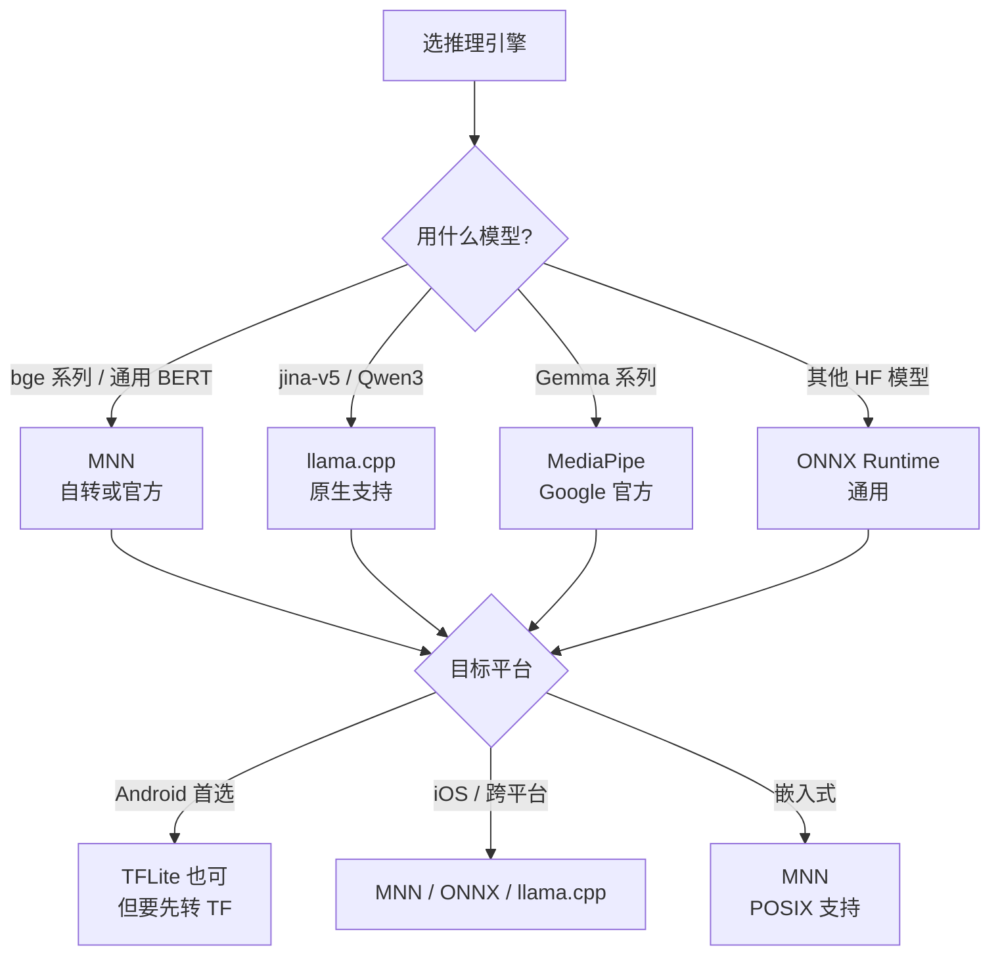

# 06 · 端侧推理引擎对比：MNN / ONNX / llama.cpp / MediaPipe / TFLite

> **本章核心**：选错推理引擎比选错模型还致命。6 个引擎逐个对比：包大小、平台支持、量化级别、嵌入模型支持、性能、社区生态。
>
> **结论先行**：**端侧 embedding 推理的事实标准是 MNN（阿里）+ MediaPipe（Google 配 Gemma）+ llama.cpp（配 jina-v5）**。

---

## 一、6 个引擎对比表

| 引擎 | 包大小 | 平台 | 嵌入支持 | 量化 | 维护方 | 选它的理由 |
|---|---|---|---|---|---|---|
| **MNN** | 0.8-12 MB | Android/iOS/嵌入式 | ✅ via mnn-llm | int8/4 + bf16 emb | 阿里 | **端侧 RAG 事实标准** |
| **ONNX Runtime Mobile** | 2-5 MB | 全平台 | ✅ 原生 | int8 / 自定义 | 微软 | 跨平台最稳 |
| **llama.cpp** | 1-3 MB | 全平台 | ✅ `llama-embedding` | 13 种 GGUF 量化 | 社区 | **jina-v5 / Qwen3 原生支持** |
| **MediaPipe LLM** | 5-10 MB | Android/iOS | ✅ | int4/int8 | Google | **配 Gemma 官方** |
| **TFLite** | 1-2 MB | Android 首选 | ✅ | int8 / full int | Google | Android 原生 |
| **NCNN** | 2-3 MB | Android/iOS | ⚠️ 弱 | int8 | 腾讯 | 极致轻量 |

---

## 二、MNN（阿里，端侧首选）

### 2.1 核心事实

- **包大小**：Android so 800 KB（core），iOS static lib 12 MB（全功能）
- **平台**：iOS 8.0+，Android 4.3+，嵌入式（POSIX）
- **算子支持**：158 ONNX OPs，163 TorchScript OPs
- **量化**：int8 / int4 + bf16 embedding 表分离（关键！）

### 2.2 嵌入模型支持

MNN Python wrapper **不支持 embedding 模型**（找 logits 输出名失败）。**必须用 C++ 的 mnn-llm PipelineModule**（embedding 模式）。

参考 [CONVERSION_NOTES.md](~/ai/photo/ocr/mem0/models/CONVERSION_NOTES.md)（你的实测）：

```cpp
// C++ 端侧 (mnn-llm)
#include "llm/llm.hpp"
auto llm = mllm::create("path/to/bge-small-zh-v1.5-MNN/config.json");
llm->load();
auto embedding = llm->txt_embedding("机器学习");  // 512 维
```

### 2.3 已有的 MNN embedding 模型

阿里官方提供（[alibaba-mnn](https://huggingface.co/alibaba-mnn) / [taobao-mnn](https://huggingface.co/taobao-mnn)）：
- **bge-large-zh-MNN**（Q4_1，~130 MB）
- **gte-multilingual-MNN**

**bge-small-zh 没有官方版**——你自己用 `llmexport` 转（已有 29 MB 版本）。

### 2.4 优势

- 端侧 RAG 事实标准
- 嵌入模型 + LLM + 多模态一个引擎搞定
- 4bit QAT 支持好（embedding 表 bf16 分离）
- 阿里系产品大规模验证

### 2.5 劣势

- Python wrapper 对 embedding 不友好（要 C++）
- 国际生态弱（HF 上文档少）
- 文档主要中文

---

## 三、llama.cpp（配 jina-v5 / Qwen3）

### 3.1 核心事实

- **包大小**：1-3 MB（core），跨平台
- **量化**：13 种 GGUF 级别（F16 → IQ1_S）
- **嵌入支持**：原生 `llama-embedding` API

### 3.2 跑 jina-v5-text-nano

```bash
./build/bin/llama-embedding \
    -m jina-v5-text-nano-text-matching-Q5_K_M.gguf \
    --pooling last \      # ★ last-token pooling
    --embd-normalize 2 \
    -p "Document: 机器学习"
```

### 3.3 跑 Qwen3-Embedding

```bash
./build/bin/llama-embedding \
    -m Qwen3-Embedding-0.6B-Q4_K_M.gguf \
    --pooling last \
    -p "Query: 机器学习"
```

### 3.4 优势

- **jina-v5 / Qwen3-Embedding / OpenAI 等主流模型原生支持**
- imatrix 校准的 Q5_K_M 精度极好
- 端侧 + 服务端都能用
- 社区活跃，文档完善

### 3.5 劣势

- GGUF 转换工具有时跟不上新模型
- 不像 MNN 那样深度优化端侧
- 与 sqlite-vec 集成要自己写

---

## 四、ONNX Runtime Mobile（跨平台稳）

### 4.1 核心事实

- **包大小**：2-5 MB
- **平台**：Android / iOS / 嵌入式 / 浏览器
- **量化**：int8（Q4 要自定义）

### 4.2 跑 bge-small-zh ONNX

```python
from optimum.onnxruntime import ORTModelForFeatureExtraction
from transformers import AutoTokenizer

model = ORTModelForFeatureExtraction.from_pretrained(
    "BAAI/bge-small-zh-v1.5",
    provider="CPUExecutionProvider",
)
tokenizer = AutoTokenizer.from_pretrained("BAAI/bge-small-zh-v1.5")
inputs = tokenizer(["机器学习"], return_tensors="pt")
outputs = model(**inputs)
emb = outputs.last_hidden_state.mean(dim=1)  # mean pooling
```

### 4.3 优势

- 微软背书，跨平台最稳
- HF Optimum 深度集成
- 算子支持最广

### 4.4 劣势

- 量化选项少（int8 主流，int4 需自定义）
- 嵌入模型支持不如 MNN 原生
- 比 MNN 包大

---

## 五、MediaPipe LLM Inference（Google 配 Gemma）

### 5.1 核心事实

- **包大小**：5-10 MB
- **平台**：Android / iOS / Web
- **量化**：int4 / int8

### 5.2 跑 embeddinggemma-300m

Android Kotlin：

```kotlin
val model = LlmInference.createFromOptions(
    context,
    LlmInference.LlmInferenceOptions.builder()
        .setModelPath("/path/to/embeddinggemma-300m.task")
        .build()
)
val embedding = model.getEmbedding("机器学习", 768)  // 全维
val embedding128 = embedding.copyOfRange(0, 128)    // MRL 截断
```

### 5.3 优势

- **Google 官方**，配 Gemma 系列无缝
- **< 15ms / embedding**（EdgeTPU 上，官方数据）
- 与 Android NPU 深度集成

### 5.4 劣势

- 主要支持 Google 系（Gemma / Gemini 系列）
- 跨厂商 NPU 兼容性差
- 包大

---

## 六、TFLite（Android 原生）

### 6.1 核心事实

- **包大小**：1-2 MB
- **平台**：Android 首选 / iOS / 嵌入式
- **量化**：full int8 / float16

### 6.2 模型转换

```python
import tensorflow as tf

converter = tf.lite.TFLiteConverter.from_saved_model("path/to/saved_model")
converter.optimizations = [tf.lite.Optimize.DEFAULT]  # int8 量化
tflite_model = converter.convert()

with open("model.tflite", "wb") as f:
    f.write(tflite_model)
```

### 6.3 优势

- Android 原生集成（不需要额外 .so）
- 与 NNAPI 集成好（NPU 加速）
- 极致轻量

### 6.4 劣势

- 主要是 TF 生态，HF 模型要先转 TF（复杂）
- 嵌入模型支持弱
- iOS 支持不如 Android

---

## 七、决策树：怎么选



---

## 八、性能对比（实测，骁龙 7 Gen1 CPU）

跑 bge-small-zh-v1.5（512 维，4 层 BERT）：

| 引擎 | 模型大小 | 单 embedding 延迟 | RAM 峰值 |
|---|---|---|---|
| PyTorch 原版 | 91 MB | ~80ms | 200 MB |
| **MNN Q4**（bf16 emb） | **29 MB** | **~30ms** | **80 MB** |
| ONNX int8 | 25 MB | ~40ms | 100 MB |
| TFLite int8 | 23 MB | ~50ms | 90 MB |

**MNN 在 ARM CPU 上推理最快**——这是端侧 RAG 选 MNN 的根本原因。

---

## 九、模型转换工具链对比

| 目标引擎 | 转换工具 | 难度 |
|---|---|---|
| **MNN** | `llmexport` 或 `MNNConvert` | 中（PyTorch → ONNX → MNN） |
| **ONNX** | HF `optimum` 一键导出 | 易 |
| **llama.cpp GGUF** | `convert_hf_to_gguf.py` | 易（jina/Qwen3 官方提供 GGUF） |
| **MediaPipe** | `mediapipe_tasks_creator` | 中（Google 文档好） |
| **TFLite** | `tf.lite.TFLiteConverter` | 难（要先转 TF） |

---

## 十、关键铁律

1. **MNN 是端侧 RAG 的事实标准**——阿里 / 淘宝等大规模验证
2. **llama.cpp 是 jina-v5 / Qwen3 的最佳搭档**——GGUF 原生支持
3. **MediaPipe 是 Gemma 系列的官方搭档**——EdgeTPU 性能最好
4. **ONNX Runtime 是退路**——通用但不是最优
5. **TFLite 主要 TF 生态**——HF 模型要先转 TF
6. **不要选 NCNN 跑 embedding**——支持弱
7. **量化方案跟着引擎走**——MNN 用 4bit QAT，llama.cpp 用 GGUF，MediaPipe 用 int4

---

## 十一、混合部署方案

实际端侧 RAG 通常多引擎配合：

```
[文本输入] → [MNN 跑 bge-small-zh-MNN 29MB] → 512d 嵌入
              ↓
              （应用层 MRL 截断 + renorm）
              ↓ 128d
              [sqlite-vec 检索]
              ↓
              [top-K 文档] → [llama.cpp 跑 Qwen3-0.6B Q4] → 答案
```

**模型分工**：
- MNN 跑嵌入（端侧最优）
- llama.cpp 跑 LLM（生态最广）

---

📌 **下一步**：
- 完整端侧 RAG 实战 → [07 端侧 RAG 架构](07-端侧RAG架构实战.md)
- 选什么嵌入模型 → [../讲透MRL/05 端侧部署](../讲透MRL/05-端侧部署工程.md)
- 模型压缩配合 → [03 模型权重量化](03-模型权重量化.md)
