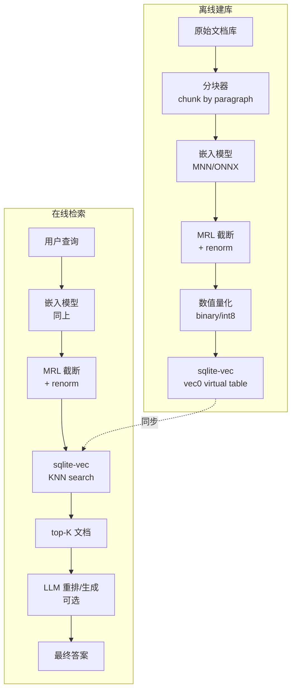
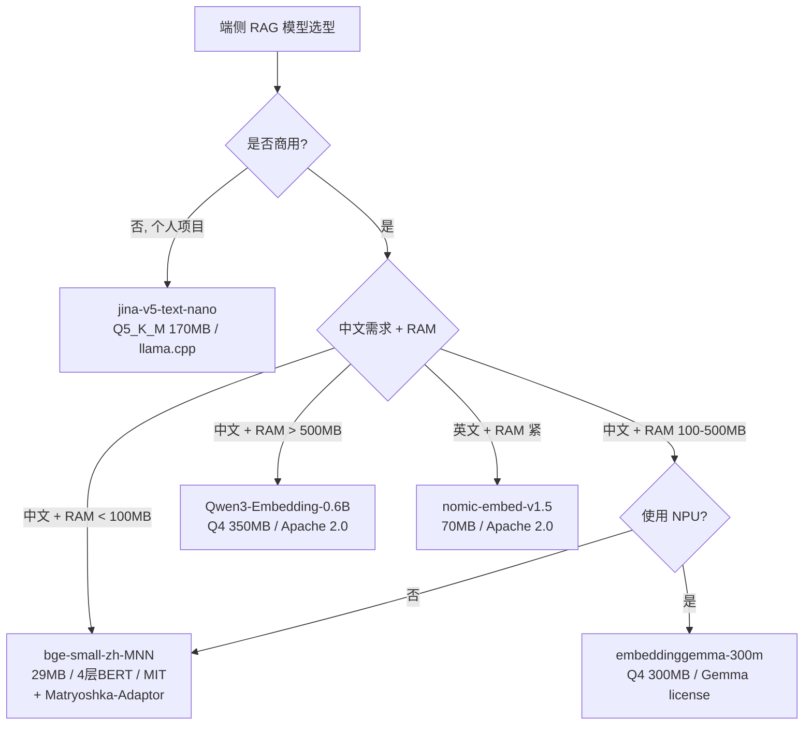

# 07 · 端侧 RAG 架构实战：sqlite-vec + MNN + 全栈决策

> **本章核心**：把前 6 章的技术栈组装成一个真实可部署的端侧 RAG 系统。含 3 个端到端 demo（手机 Android / 浏览器 / 嵌入式）、5 个真实问题排查、3 个性能优化技巧。

---

## 一、端侧 RAG 架构总览



---

## 二、3 个端到端 Demo

### 2.1 Android 手机端（10 万文档库）

**目标**：内存 < 200MB，p99 < 200ms

**栈**：
- 模型：bge-small-zh-v1.5-MNN（29 MB）+ Matryoshka-Adaptor（200 KB）
- 嵌入库：sqlite-vec 128d binary（10 万 × 16 字节 = 1.6 MB）
- 推理引擎：MNN（C++ via JNI）
- LLM 重排：可选，Qwen3-0.6B Q4（350 MB）—— 超 RAM 预算时不加

**实现步骤**：

```kotlin
// Android Kotlin (伪代码)
class RAGSystem {
    private lateinit var mnn: MNNPipeline
    private lateinit var db: SQLiteDatabase

    fun init() {
        // 1. 加载模型 (异步预热)
        mnn = MNNPipeline(assets, "bge-small-zh-v1.5-MNN/config.json")
        mnn.warmup()  // 跑一遍 dummy 推理, 避免 cold start

        // 2. 打开 sqlite-vec
        db = openOrCreateDatabase("rag.db", MODE_PRIVATE, null)
        db.enableLoadExtension(true)
        SQLiteVec.load(db)
        // 表已离线建好, 直接用
    }

    fun query(text: String, topK: Int = 5): List<Doc> {
        // 1. 嵌入 (30ms)
        val emb512 = mnn.txtEmbedding(text)  // FloatArray(512)
        // 2. 应用 Matryoshka-Adaptor (0.1ms)
        val embAdapted = adaptor.forward(emb512)
        // 3. MRL 截断到 128d + renorm (0.01ms)
        val emb128 = truncateAndRenorm(embAdapted, 128)
        // 4. 量化到 binary (0.01ms)
        val embBinary = quantizeBinary(emb128)
        // 5. sqlite-vec 检索 (10ms)
        val results = db.rawQuery("""
            SELECT doc_id, distance FROM vec_docs
            WHERE embedding MATCH ? AND k = ?
            ORDER BY distance
        """, arrayOf(embBinary.toBlob(), topK.toString())).useCursor { ... }
        return results
    }
}
```

**预期性能**：
- 推理：~30ms（嵌入） + ~10ms（检索） = **40ms 总延迟**
- RAM：29 MB（模型） + 1.6 MB（库） + 50 MB（buffer） = **~80 MB**
- 存储：29 + 1.6 = **~30 MB**

### 2.2 浏览器扩展（10k 文档库）

**目标**：内存 < 100MB，p99 < 100ms

**栈**：
- 模型：all-MiniLM-L6-v2 ONNX int8（23 MB）
- 嵌入库：IndexedDB（存向量） + 自实现 HNSW
- 推理引擎：ONNX Runtime Web

**实现**：

```javascript
// service-worker.js (浏览器扩展)
import { ORT } from 'onnxruntime-web';
import initSqlJs from 'sql.js';

let model, db;

async function init() {
    // 1. 加载 ONNX 模型
    const modelBuffer = await fetch('model.onnx').then(r => r.arrayBuffer());
    model = await ORT.InferenceSession.create(modelBuffer, {
        executionProviders: ['wasm'],
        graphOptimizationLevel: 'all'
    });

    // 2. 加载 sqlite-wasm (浏览器版 sqlite)
    const SQL = await initSqlJs();
    db = new SQL.Database();
    // 注: 浏览器版 sqlite-vec 用 WASM 版本
}

async function embed(text) {
    const tokens = tokenize(text);
    const input = new ORT.Tensor('int64', tokens, [1, tokens.length]);
    const output = await model.run({ input });
    let emb = output.last_hidden_state.data;
    // mean pooling
    emb = meanPool(emb);
    // MRL 截断 + renorm (假设模型已 MRL 训练)
    emb = truncateAndRenorm(emb, 128);
    return emb;
}
```

**性能**：
- 嵌入：~80ms（WASM 慢）
- 检索：~20ms（10k 文档 flat search 够）
- 总：~100ms

### 2.3 嵌入式设备（树莓派 Zero，500MB RAM）

**目标**：内存 < 100MB，可容忍几秒延迟

**栈**：
- 模型：TinyBERT int8（15 MB）
- 嵌入库：sqlite-vec 64d binary
- 推理引擎：MNN

```python
import sqlite_vec, mnn, numpy as np

# 加载模型
model = mnn.load_model("tinybert-int8.mnn")

# sqlite-vec
db = sqlite3.connect("rag.db")
db.enable_load_extension(True)
sqlite_vec.load(db)

def query(text, k=5):
    emb = model.infer(text)             # ~500ms on Pi Zero
    emb_t = emb[:64]                    # MRL 截断
    emb_t /= np.linalg.norm(emb_t)
    emb_b = np.sign(emb_t)              # binary
    
    cursor = db.execute("""
        SELECT doc_id FROM vec_docs
        WHERE embedding MATCH ?
        ORDER BY distance LIMIT ?
    """, (emb_b.tobytes(), k))
    return cursor.fetchall()
```

**性能**：
- 嵌入：~500ms
- 检索：~10ms
- 总：~510ms（可接受）

---

## 三、模型选择决策树



---

## 四、性能调优 5 招

### 4.1 模型预热（避免 cold start）

```kotlin
// App 启动时跑 dummy 推理, 把模型权重加载到 CPU cache
mnn.warmup()  // 跑一次推理, 丢弃结果
```

**收益**：第一次真实查询从 2 秒降到 30ms。

### 4.2 批量嵌入（离线建库时）

```python
# ✗ 慢: 一次一个
for doc in docs:
    emb = model.encode(doc)

# ✓ 快: 批量
embs = model.encode(docs, batch_size=32)
```

**收益**：10 倍以上加速。

### 4.3 sqlite-vec PRAGMA

```sql
PRAGMA journal_mode = WAL;       -- 写时不阻塞读
PRAGMA synchronous = NORMAL;     -- 平衡 fsync 频率
PRAGMA cache_size = -50000;      -- 50MB cache
PRAGMA mmap_size = 268435456;    -- 256MB mmap
```

**收益**：检索延迟降 2-3×。

### 4.4 索引选择

| 文档数 | 推荐索引 |
|---|---|
| < 1k | 不用索引（flat search） |
| 1k-10k | sqlite-vec 默认 KNN |
| 10k-100k | sqlite-vec + binary 量化 |
| > 100k | 自实现 HNSW（hnswlib） |

### 4.5 异步嵌入缓存

```python
from functools import lru_cache

@lru_cache(maxsize=1000)
def cached_embed(text: str) -> bytes:
    return model.encode(text, truncate_dim=128).tobytes()
```

**收益**：高频 query 命中缓存，0ms 返回。

---

## 五、5 个常见问题排查

### 5.1 sqlite-vec 加载失败

**症状**：`sqlite3.OperationalError: error loading extension`

**原因**：sqlite3 Python 默认禁用 extension loading。

**解决**：
```bash
# 用 pysqlite3-binary 替代 (支持 extensions)
pip install pysqlite3-binary
python -c "import sys; sys.modules['sqlite3'] = __import__('pysqlite3')"
```

### 5.2 MNN Python wrapper 返回 nan

**症状**：`'text' -> dim=(1,), norm=nan`

**原因**：MNN Python `Llm` 类找 `logits` 输出失败（embedding 模型输出名不同）。

**解决**：用 C++ mnn-llm 的 PipelineModule，或用 ONNX Runtime 验证。

### 5.3 检索结果全是同一批

**症状**：不管 query 什么，top-10 都是固定的文档。

**原因**：嵌入向量未归一化（MRL 截断后忘了 renorm）。

**解决**：
```python
emb_t = emb[:128]
emb_t = emb_t / np.linalg.norm(emb_t)  # ★ 必须
```

### 5.4 binary 量化后召回暴跌

**症状**：从 fp32 转 binary 后 Recall@10 从 0.95 降到 0.5。

**原因**：binary 用了 L2 距离（不对）。

**解决**：binary 必须用 Hamming 距离，sqlite-vec 自动选。

### 5.5 GGUF Q4_K_M 短查询返回错结果

**症状**：jina-v5-nano Q4_K_M 对"张三"这样的单词查询给出无关结果。

**原因**：Q4_K_M 在 very_short 输入上 cos < 0.92（见 [03 章 jina 表](03-模型权重量化.md#五jina-v5-text-nano-量化级别选择一手核实)）。

**解决**：换 Q5_K_M 或 Q6_K。

---

## 六、3 个完整代码示例

### 6.1 最简端侧 RAG（30 行 Python）

```python
"""最简端侧 RAG, sqlite-vec + sentence-transformers"""
import sqlite_vec, sqlite3, numpy as np
from sentence_transformers import SentenceTransformer

db = sqlite3.connect(":memory:")
db.enable_load_extension(True)
sqlite_vec.load(db)

db.execute("CREATE VIRTUAL TABLE docs USING vec0(id INTEGER PRIMARY KEY, emb FLOAT[128], text TEXT)")
model = SentenceTransformer("nomic-ai/nomic-embed-text-v1.5", truncate_dim=128)

# 建库
texts = ["机器学习", "deep learning", "做饭的菜谱", "how to cook"]
embs = model.encode(texts, normalize_embeddings=True)
for i, (text, emb) in enumerate(zip(texts, embs)):
    db.execute("INSERT INTO docs(id, emb, text) VALUES (?, ?, ?)",
               [i, emb.astype(np.float32).tobytes(), text])

# 查询
query_emb = model.encode(["AI"], normalize_embeddings=True)[0]
for row in db.execute("""
    SELECT text, distance FROM docs
    WHERE emb MATCH ? AND k = 3
    ORDER BY distance
""", [query_emb.astype(np.float32).tobytes()]):
    print(row)
```

### 6.2 MNN C++ 端侧推理（伪代码）

```cpp
#include "llm/llm.hpp"

int main() {
    auto llm = mllm::create("bge-small-zh-v1.5-MNN/config.json");
    llm->load();
    
    std::string text = "[CLS]为这个句子生成表示以用于检索相关文章：机器学习[SEP]";
    auto emb = llm->txt_embedding(text);  // std::vector<float>(512)
    
    // MRL 截断 + renorm
    int DIM = 128;
    float truncated[DIM];
    float norm = 1e-12f;
    for (int i = 0; i < DIM; ++i) { truncated[i] = emb[i]; norm += emb[i]*emb[i]; }
    norm = std::sqrt(norm);
    for (int i = 0; i < DIM; ++i) truncated[i] /= norm;
    
    // 入库或检索 (sqlite-vec C API)
    sqlite3* db;
    sqlite3_open("rag.db", &db);
    sqlite3_stmt* stmt;
    sqlite3_prepare_v2(db, "INSERT INTO docs(emb) VALUES (?)", -1, &stmt, nullptr);
    sqlite3_bind_blob(stmt, 1, truncated, DIM * sizeof(float), SQLITE_STATIC);
    sqlite3_step(stmt);
    
    return 0;
}
```

### 6.3 浏览器扩展（service-worker.js）

```javascript
self.importScripts('onnxruntime-web.js', 'sql-wasm.js');

let model, db;

async function init() {
    // 加载 ONNX 模型
    const buf = await fetch('miniLM-int8.onnx').then(r => r.arrayBuffer());
    model = await ort.InferenceSession.create(buf);
    
    // 加载 sqlite-wasm
    const SQL = await initSqlJs();
    db = new SQL.Database();
    db.run(`CREATE VIRTUAL TABLE docs USING vec0(id INTEGER, emb FLOAT[128])`);
}

async function query(text, topK = 5) {
    const tokens = tokenize(text);
    const feeds = { input_ids: new ort.Tensor('int64', tokens, [1, tokens.length]) };
    const out = await model.run(feeds);
    let emb = meanPool(out.last_hidden_state.data);
    emb = truncate(emb, 128);
    emb = normalize(emb);
    
    db.run(`SELECT id, distance FROM docs WHERE emb MATCH ? AND k = ? ORDER BY distance`,
           [floatArrayToBlob(emb), topK]);
    // ... 处理结果
}
```

---

## 七、端侧 RAG 完整预算模板

```
项目: Android 端侧 RAG (10 万中文文档)

[模型]
  bge-small-zh-v1.5-MNN               29 MB
  + Matryoshka-Adaptor                0.2 MB
  ───────────────────────────────────
  模型总计                              29.2 MB

[嵌入库]
  10 万 × 128d × 1 byte (binary)      1.6 MB
  + HNSW 索引 (1.5×)                  2.4 MB
  + 元数据 (text + doc_id)            5 MB
  ───────────────────────────────────
  库总计                                9 MB

[运行时]
  模型加载到 RAM                       29 MB
  嵌入库加载到 RAM                     9 MB
  tokenizer + 推理 buffer             30 MB
  ───────────────────────────────────
  RAM 峰值                              68 MB ✓ (< 200MB)

[延迟]
  嵌入推理 (MNN, bge-small Q4)        30 ms
  截断 + renorm + binary              0.1 ms
  sqlite-vec 检索                     10 ms
  ───────────────────────────────────
  p99 总延迟                            40 ms ✓ (< 200ms)

[存储]
  模型 + 库 + 元数据                   38 MB ✓ (< 100MB)

[质量]
  Recall@5 vs 全维 fp32               ~0.92 ✓
```

---

## 八、关键铁律

1. **永远先做预热**——避免用户首次查询慢
2. **MRL 截断后必须 renorm**——前 N 章重复多次
3. **embeddinggemma / jina-v5 / Qwen3 商用要看 license**——只有 nomic / embeddinggemma / Qwen3 商用 OK
4. **sqlite-vec 是端侧 RAG 事实标准**——Alex Garcia 维护
5. **GGUF Q4_K_M 短文本崩**——用 Q5_K_M
6. **MNN Python wrapper 不支持 embedding**——用 C++
7. **冷启动 + 推理 = 总延迟**——别只测推理
8. **嵌入库 + 索引 + 元数据 = 库总体积**——别只算向量

---

📌 **下一步**：
- 看学术前沿 → [08 前沿综述](08-前沿综述-端侧AI-2024-2026.md)
- MRL 深入 → [../讲透MRL/](../讲透MRL/README.md)
- 你 mem0 项目的具体方案 → [bge-small-zh-v1.5 + Matryoshka-Adaptor](../讲透MRL/03-从零实现.md)
