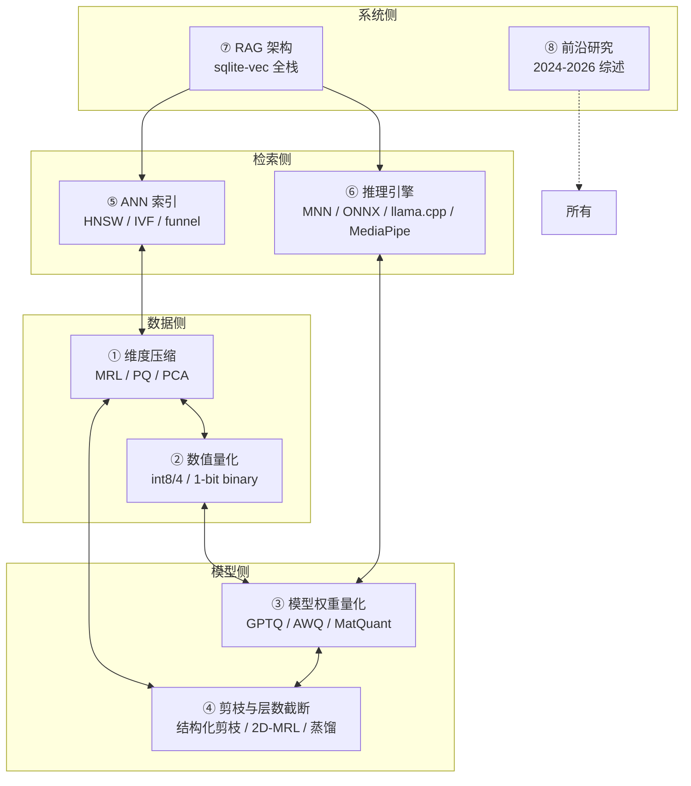
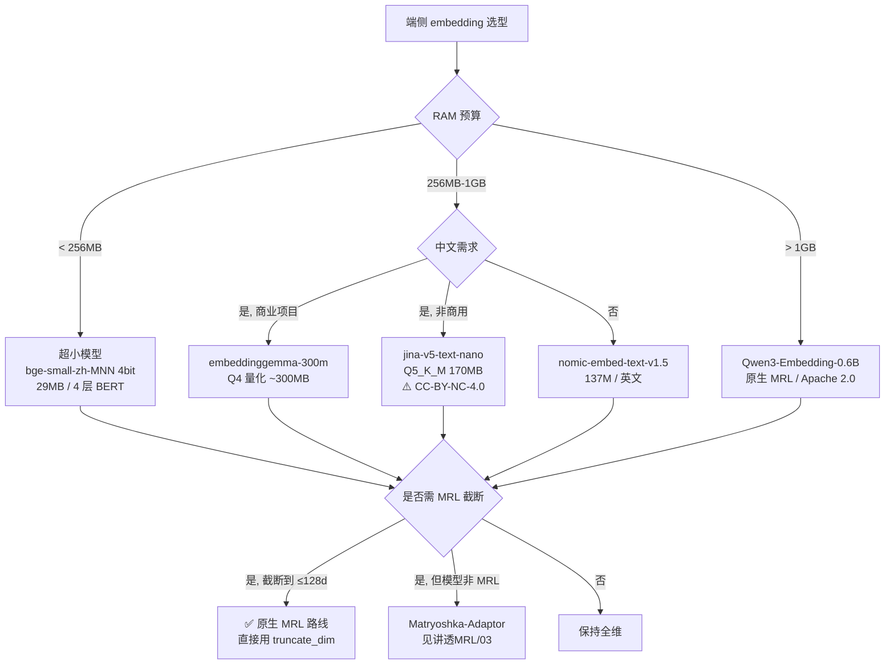
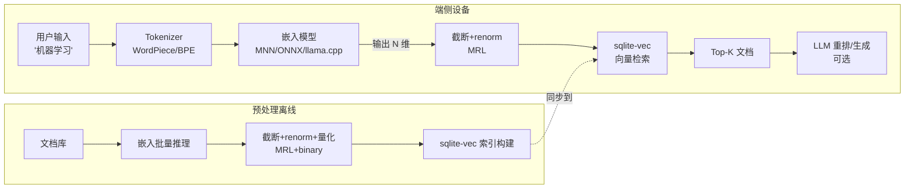

# 端侧 AI 压缩技术

> **一句话定位**：把"AI 模型塞进手机 / 边缘设备 / 浏览器"这件事拆成 8 个独立但正交的技术轴——维度压缩、数值量化、模型权重量化、剪枝与层数截断、ANN 索引、推理引擎、RAG 架构、前沿研究。每章独立可读，合起来是端侧 AI 全栈。
>
> **本系列与 [讲透 MRL](../讲透MRL/) 的关系**：MRL 是"维度压缩"轴的一种核心技术，本系列把它放在更大的端侧压缩谱系里展开。

---

## 为什么需要这个系列

端侧 AI 工程师每天面对的约束：

| 约束 | 手机 | 树莓派 | 浏览器 |
|---|---|---|---|
| RAM | 2-8 GB（可用） | 0.5-4 GB | 100-500 MB（标签页）|
| 持续存储 | 50-500 MB（app 配额） | SD 卡任意 | IndexedDB 几 GB |
| CPU | 4-8 核 ARM | 4 核 ARM | 2-8 核 x86 |
| GPU/NPU | 有（但碎片化） | 无 | WebGL/WebGPU（受限）|
| 电池 | 4-10 小时 | 不限 | 不限 |
| 延迟 SLA | p99 < 200ms | < 500ms | < 100ms |
| 模型大小预算 | < 100 MB | < 500 MB | < 50 MB |

云端 1B 参数的模型塞不进任何上述环境。**端侧 AI 的本质是"在精度-延迟-存储-RAM-电池"五维空间里做工程权衡**。

## 技术地图：8 个独立轴



**关键洞察**：这 8 个轴**大部分正交可叠加**。比如：
- MRL 截断 768→128（轴 1） + 1-bit binary 量化（轴 2） = 192× 存储压缩
- 模型 Q4 量化（轴 3） + 层数剪枝（轴 4） = 模型 RAM 占用降 10×
- HNSW 索引（轴 5） + MRL 截断（轴 1） = 检索延迟降 10×

## 目录与学习路径

| 章节 | 文档 | 解决的问题 | 与本系列其他章关系 |
|---|---|---|---|
| 00 | [00-端侧约束全景.md](00-端侧约束全景.md) | 端侧有什么预算？ | 全系列基础 |
| 01 | [01-维度压缩.md](01-维度压缩.md) | 输出向量怎么变小？ | 与 [讲透 MRL](../讲透MRL/) 互引 |
| 02 | [02-数值量化.md](02-数值量化.md) | float 怎么变 int / bit？ | 与 01 正交可叠加 |
| 03 | [03-模型权重量化.md](03-模型权重量化.md) | 模型 .safetensors 怎么变小？ | 与 02 不同对象 |
| 04 | [04-模型剪枝与层数截断.md](04-模型剪枝与层数截断.md) | 模型架构怎么变小？ | 唯一能改 FLOPs 的轴 |
| 05 | [05-ANN检索加速.md](05-ANN检索加速.md) | 检索 1M 向量怎么 < 10ms？ | 与 01 强协同 |
| 06 | [06-端侧推理引擎对比.md](06-端侧推理引擎对比.md) | MNN / ONNX / llama.cpp 怎么选？ | 全栈落地 |
| 07 | [07-端侧RAG架构实战.md](07-端侧RAG架构实战.md) | sqlite-vec + 嵌入模型怎么拼？ | 综合实战 |
| 08 | [08-前沿综述-端侧AI 2024-2026.md](08-前沿综述-端侧AI-2024-2026.md) | 学术前沿在哪？ | 与 [讲透 MRL 06 章](../讲透MRL/06-前沿综述-2022-2026论文谱系.md)互补 |

## 端侧 embedding 模型选型决策树（截至 2026-08）



## 端侧 embedding 模型对比表（含一手核实的量化数据）

### 小型模型（< 300MB Q4）

| 模型 | 原版权重 | Q4 量化 | 推荐量化 | dim | MRL | 中文 | 商用 |
|---|---|---|---|---|---|---|---|
| **bge-small-zh-v1.5**（MNN 自转） | 91 MB | **29 MB** | Q4 + bf16 emb | 512 | ❌ | ✅ | ✅ MIT |
| **jina-v5-text-nano** | 480 MB（fp16） | **152 MB**（Q4_K_M）/ **170 MB**（Q5_K_M 推荐）| **Q5_K_M**（不是 Q4！）| 768 | ✅ 32-768 | ✅ 15 语 | ⚠️ **CC-BY-NC-4.0 非商用** |
| **embeddinggemma-300m** | 1.2 GB | ~**300 MB**（QAT） | QAT int4 | 768 | ✅ 128-768 | 多语含中 | ✅ Gemma license |
| **nomic-embed-v1.5** | 274 MB | ~**70 MB** | Q4_K_M | 768 | ✅ 64-768 | 英 | ✅ Apache 2.0 |

### 中型模型（300MB-1GB Q4）

| 模型 | 原版权重 | Q4 量化 | dim | MRL | 中文 | 商用 |
|---|---|---|---|---|---|---|
| **bge-base-zh-v1.5** | 205 MB | ~60 MB | 768 | ❌ | ✅ | ✅ MIT |
| **nomic-embed-v2-moe** | 610 MB | ~180 MB | 768 | ✅ 256-768 | ✅ | ✅ Apache 2.0 |
| **bge-m3**（官方 MNN）| 1.1 GB | ~130 MB（官方 Q4_1）| 1024 | ❌ | ✅ SOTA | ✅ MIT |

### 大型模型（> 1GB Q4，需 NPU/高端手机）

| 模型 | 原版权重 | Q4 量化 | dim | MRL | 备注 |
|---|---|---|---|---|---|
| Qwen3-Embedding-0.6B | 1.2 GB | ~350 MB | 1024 | ✅ 32-1024 | 中文 SOTA，Apache 2.0 |
| bge-large-zh-v1.5 | 325 MB | ~95 MB | 1024 | ❌ | 中等规模 |
| jina-v5-text-small | 1.4 GB（fp16）| ~420 MB | 1024 | ✅ 32-1024 | CC-BY-NC-4.0 |

## 关键铁律（实测）

1. **jina-v5-text-nano 的 Q4_K_M 在 < 4 个 token 的输入上精度崩**（cos < 0.91），**生产应用 Q5_K_M**（[jina 官方 GGUF README 量化级别表](https://huggingface.co/jinaai/jina-embeddings-v5-text-nano-text-matching-GGUF)）
2. **bge-small-zh-v1.5 不是 MRL**，截断要赌——用 Matryoshka-Adaptor 升级（[讲透 MRL 03 章](../讲透MRL/03-从零实现.md)）
3. **embeddinggemma 必须用 sentence-transformers 加载**（含 Dense 投影层），不能直接用 transformers
4. **jina-v5 用 last-token pooling**，不是 mean pooling——用错会全错
5. **MNN 的 Python wrapper 不支持 embedding 模型**（找不到 logits 输出名），要 C++ 端侧用 mnn-llm 的 PipelineModule
6. **CC-BY-NC-4.0 = 非商用**——jina-v5-text-nano 不能进商业产品，能用的是 embeddinggemma-300m / Qwen3-Embedding / nomic-embed-v2
7. **MNN 模型 + sqlite-vec** 是端侧 RAG 的"事实标准"（Alex Garcia + 阿里 MNN 团队都推这条路）
8. **模型文件绝不进 git**——用 `MODELSCOPE_CACHE` 环境变量指向仓库外

## 端侧推理引擎速查

| 引擎 | 平台 | 包大小 | 嵌入支持 | 量化支持 | 选它的理由 |
|---|---|---|---|---|---|
| **MNN**（阿里） | Android/iOS/嵌入式 | 800KB-12MB | ✅ via mnn-llm | int8/4，bf16 emb | 端侧 RAG 事实标准 |
| **ONNX Runtime Mobile** | 全平台 | 2-5MB | ✅ 原生 | int8（Q4 需自定义）| 微软背书，跨平台 |
| **llama.cpp** | 全平台 | 1-3MB | ✅ `llama-embedding` | 13 种 GGUF 量化级别 | jina-v5 / Qwen3 原生支持 |
| **MediaPipe LLM Inference** | Android/iOS | 5-10MB | ✅ | int4/int8 | Google 官方，配 Gemma |
| **TFLite** | Android（首选） | 1-2MB | ✅ | int8/full int | Android 原生集成 |
| **NCNN**（腾讯） | Android/iOS | 2-3MB | ⚠️ 弱 | int8 | 极致轻量 |

## 环境与运行

```
python 3.12  |  numpy 1.26  |  matplotlib 3.10  |  torch 2.10 (CPU)
+ 可选: sqlite-vec, MNN, sentence-transformers, onnxruntime
```

模型下载路径：**仓库外**（默认 `~/.cache/modelscope/hub/` 或 `~/ai/models/`）。

## 一图看懂端侧 RAG 全栈



## 与讲透 MRL 的交叉引用

- 想深入 MRL 原理 → [讲透 MRL 全系列](../讲透MRL/README.md)
- 想看 MRL 截断的实证 → [讲透 MRL 04 章 反直觉实验](../讲透MRL/04-反直觉实验.md)
- 想把非 MRL 模型改造成可截断 → [讲透 MRL 03 章 Matryoshka-Adaptor](../讲透MRL/03-从零实现.md)
- 想了解 MRL 不能做什么 → [讲透 MRL 07 章 批判收尾](../讲透MRL/07-批判收尾.md)

---

📌 **下一步**：从 [00 章 端侧约束全景](00-端侧约束全景.md) 开始建立预算表，或直接跳你最关心的那一章。
