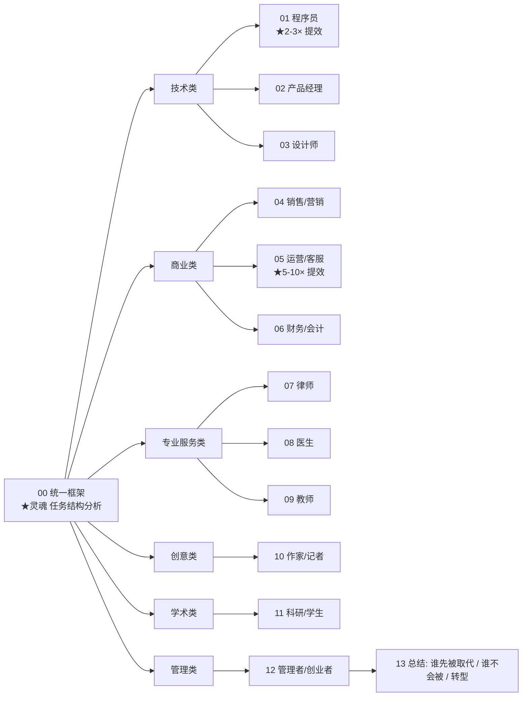

# 讲透 AI for 职业 (AI for Every Profession, 透) · 完整版

> **AI 不是"行业"，是"每个人的工具"。** 本系列按**职业**分类，每个职业一篇——讲你的工作会被 AI 怎么重塑、哪些任务用 AI 提效最高、哪些任务 AI 还做不好、转型路径。从程序员到律师到医生到作家到销售——**让每个知识工作者都能找到自己的 AI 用法**。

**1 篇总览 + 12 个职业 + 1 篇总结，共 14 篇。**

---

## 这份教程为谁而写

- 程序员/产品/设计，**想让 AI 真的提效而不是玩具**的人。
- 销售/营销/运营，**不知道哪些任务能交给 AI**的人。
- 律师/医生/教师，**担心 AI 取代自己**的人。
- 作家/记者，**想知道 AI 是威胁还是工具**的人。
- 管理者/创业者，**想团队级 AI 转型**的人。

## 教学宪法（每章遵守）

每个职业按统一框架讲：**该职业的核心任务清单 → 每个任务的 AI 自动化潜力（高/中/低）→ 推荐工具 + prompt 模板 → 实战案例 → 转型建议**。诚实标注哪些任务 AI 做得好、哪些做不好。

## 灵魂：每个职业都有 AI 适配的"任务结构"

$$
\boxed{\text{职业的 AI 适配度} = \text{任务结构} \times \text{容错率} \times \text{创意 vs 重复}}
$$

- **程序员**：60% 任务高度结构化（写代码、调试）→ AI 提效 1.5-3×
- **客服**：80% 任务重复（标准化问答）→ AI 提效 5-10×
- **作家**：30% 任务创意（叙事）+ 70% 任务可辅助（资料、改稿）→ AI 提效 2×
- **护士**：20% 任务可辅助（记录）+ 80% 任务物理操作 → AI 提效 1.2×

## 核心实证（实验 00）

> 同一个 AI（GPT-4o），在不同职业任务上的"自动化潜力"差异巨大。

| 职业 | 高潜力任务占比 | 中潜力 | 低潜力 | 提效倍数 |
|------|:----------:|:----:|:----:|:------:|
| **程序员** | 60% | 25% | 15% | **2-3×** |
| **客服** | 80% | 15% | 5% | **5-10×** |
| **作家/编辑** | 30% | 50% | 20% | **2×** |
| **律师** | 40% | 35% | 25% | **1.5-2×** |
| **医生（诊断）** | 30% | 40% | 30% | **1.3×** |
| **外科医生** | 5% | 15% | 80% | **1.05×** |
| **销售** | 35% | 40% | 25% | **1.5×** |
| **教师** | 25% | 45% | 30% | **1.3-1.5×** |

**核心洞见**：**AI 不替代职业，替代职业里的"任务"**。每个职业都有可被 AI 提效的部分。

## 目录与学习路径



| 章节 | 文档 | 职业的 AI 适配度 | 关键工具 |
|------|------|:-----------:|---------|
| **总览** | | | |
| 00 | [00-AI for 所有职业.md](00-AI for 所有职业.md) | 统一框架 | 任务分析器 |
| **技术类** | | | |
| 01 | 01-AI for 程序员.md | ⭐⭐⭐⭐⭐ 高 | Copilot/Cursor/Claude |
| 02 | 02-AI for 产品经理.md | ⭐⭐⭐⭐ 中高 | PRD/Claude/ChatGPT |
| 03 | 03-AI for 设计师.md | ⭐⭐⭐ 中 | Midjourney/Figma AI |
| **商业类** | | | |
| 04 | 04-AI for 销售营销.md | ⭐⭐⭐⭐ 中高 | Jasper/HubSpot AI |
| 05 | 05-AI for 运营客服.md | ⭐⭐⭐⭐⭐ 极高 | Intercom/Zendesk AI |
| 06 | 06-AI for 财务会计.md | ⭐⭐⭐ 中 | Excel AI/财务自动化 |
| **专业服务** | | | |
| 07 | 07-AI for 律师.md | ⭐⭐⭐ 中 | Harvey/Casetext |
| 08 | 08-AI for 医生.md | ⭐⭐ 中低 | Doctolib/Co-Pilot |
| 09 | 09-AI for 教师.md | ⭐⭐⭐ 中 | Khan Academy/ChatGPT |
| **创意类** | | | |
| 10 | 10-AI for 作家记者.md | ⭐⭐⭐⭐ 中高 | Sudowrite/Claude |
| **学术** | | | |
| 11 | 11-AI for 科研学生.md | ⭐⭐⭐⭐ 中高 | ChatGPT/ResearchRabbit |
| **管理** | | | |
| 12 | 12-AI for 管理创业者.md | ⭐⭐⭐ 中 | Notion AI/Linear |
| **总结** | | | |
| 13 | 13-总结: 转型与未来.md | 谁先被取代 / 转型路径 | — |

## 怎么跑

```bash
cd /data/usershare/ai/work4ai/讲透AI for 职业
python3 -u experiments/00_profession_analyzer.py    # 职业任务自动化评估
```

---

## 核心方法论

1. **任务级而非职业级**：不说"程序员会被取代"，而说"程序员哪些任务会被 AI 提效"。
2. **每个职业都给具体 prompt 模板**：能直接复制使用。
3. **诚实标注风险**：哪些任务 AI 现在不行（医疗诊断/法律判断/创意原创）。
4. **转型建议**：每个职业给"AI 时代你的护城河是什么"。

---

## 贯穿全系列的九大核心洞见

1. **AI 替代任务，不替代职业**（00）：每个职业都有可提效的部分。
2. **程序员提效最高**（01）：Copilot 让编码效率 2-3×，但调试/架构仍需人。
3. **客服是最易自动化的知识工作**（05）：80% 任务高度结构化。
4. **法律不是"被 AI 取代"**（07）：基础检索自动，但辩论/谈判需要人。
5. **医生是 AI 最难的领域**（08）：诊断容错率极低，物理操作无法替代。
6. **作家：AI 是助手不是作者**（10）：创意仍是人，但资料/改稿可大幅提效。
7. **教师：AI 是助教**（09）：批改/备课提效，但育人需要人。
8. **科研：AI 改变了"找资料"**（11）：但提出问题仍是科学家。
9. **管理者：AI 让决策更数据驱动**（12）：但战略/激励需要人。

## 前置要求

- 无需技术背景——本系列面向所有职业。
- 推荐先尝试 ChatGPT 或 Claude。

## 与其他系列的关系

- [`../讲透AI应用全景/`](../讲透AI应用全景/)：前者按"领域"分（AI4Science/Math/Code），本系列按"职业"分。
- [`../讲透Prompt/`](../讲透Prompt/)：本系列每个职业会引用具体的 prompt 模板。

---

📌 **下一步**：从 [00-AI for 所有职业.md](00-AI for 所有职业.md) 开始，用任务分析器评估你的职业；或直接跳到对应职业的章节；或直奔 [13-总结: 转型与未来.md](13-总结: 转型与未来.md) 看你的职业在 AI 时代的护城河。
