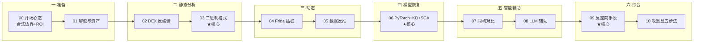

# 讲透 AI 系统逆向工程

> 把一个**闭源、混淆、加固过的端侧 AI 系统**逐步拆解到 95% 行为复刻——这套教程把这种"攻黑盒"经验抽象成**可迁移到任何闭源 AI 系统的方法论**。
>
> 素材来自对一个真实商业端侧 AI 系统（下称**目标系统 X**）的完整逆向工程，所有厂商名、产品代号、内部 URL、类名、文件名已**全量脱敏**。教程只讲**方法、工具、思路**，不复述 X 的内部细节。

---

## 这份教程为谁而写

- **端侧 AI 工程师**：你拿到了一份闭源 APK 或固件，想搞清楚里面跑了什么模型、用了什么向量库、NLU 引擎怎么工作。
- **AI 安全研究员**：你想系统理解"如何逆向一个完整的 AI 系统"——不只是单点漏洞，而是端到端的"黑盒推回白盒"流程。
- **AI 系统学习者**：你想看看工业级 AI 系统在端侧长什么样（向量库、多模态实体、NLU、推理引擎），但只有闭源可看。
- **想做 AI 系统形式化或开源对标的人**：需要先把闭源结构搞清楚，才能 1:1 复刻或形式化验证。

## 与其他讲透系列的关系

```
讲透基础模型   → 模型本身怎么设计（NTP/Attention/Scaling）
讲透PyTorch    → 训练框架内部如何实现
讲透复用权重   → 权重在模型间如何流转（迁移/蒸馏/持续学习）
讲透可解释性   → 白盒模型的内部归因
讲透AI系统逆向工程  → 黑盒 AI 系统 → 白盒  ★你在这里
                    （把别人已经做出来的闭源系统，
                      用方法论 + 工具链 + 实证，
                      推回到可以 1:1 复刻的开源实现）
```

> 这套教程与「讲透可解释性」互补：可解释性讲"白盒模型内部归因"，本教程讲"把黑盒系统变白盒"。两者合一才是完整的"理解 AI 系统"链条。

## 教学宪法

每章三层：**直觉（比喻）→ 方法（工具/原理）→ 实证（脚本跑通的输出）**。诚实标注每个手段的**适用前提、工作量、ROI、法律风险**。所有命令都给出可复现的最小实验（用公开 APK / 自造二进制做靶子，不依赖任何商业系统实体）。

---

## 全景目录与学习路径



| 章节 | 文档 | 核心问题 | 实验 |
|------|------|---------|------|
| 00 | **00-开场与心态.md** | 为什么要学、攻黑盒哲学、合法边界、ROI 矩阵 | — |
| 01 | [01-准备层-解包与资产抽取.md](01-准备层-解包与资产抽取.md) | APK 解包、assets 抽取、JADX-GPT 配置 | `01_unpack_apk` |
| 02 | 02-静态分析-DEX反编译.md | smali / class_data / annotation / String table xref | `02_dex_parse` |
| 03 | **03-二进制格式逆向.md ★** | FlatBuffer vtable walker / marisa-trie / AC 自动机 | `03_flatbuffer_walker` `06_marisa_loader` |
| 04 | 04-动态插桩-Frida.md | Java.perform / Interceptor / Stalker / Waydroid | `04_frida_template` |
| 05 | 05-数据反推-SQLite与NLU.md | SQLite 全量 / 跨 APK 一致性 / tag_pattern 反推 | `05_sqlite_dump` |
| 06 | **06-模型恢复.md ★** | PyTorch 网络重建 / 中段权重切分 / KD 蒸馏 / SCA | `07_weight_loader` |
| 07 | 07-同构对比与文档考古.md | 开源 TFLite 等价模型 / 官方 SDK 文档 / APK 历史版本 | — |
| 08 | 08-LLM辅助逆向.md | LLM4Decompile / SK²Decompile / BRIDGE / 语义反推 | — |
| 09 | **09-反逆向手段与对策.md ★** | Signature 混淆 / 分层反逆向 / assets 加密 / 加固检测 | — |
| 10 | **10-攻黑盒五步法与案例索引.md ★** | 方法论汇总 + 案例索引（脱敏链接）| — |

> ★ 标记的是**核心章节**，新人优先读 00 → 03 → 06 → 09 → 10 即可建立完整方法论。

## 七大方法层速查

| # | 方法层 | 一句话 | ROI | 工作量 |
|---|-------|--------|-----|--------|
| 1 | **静态二进制分析** | IDA/Ghidra/JADX 反编译 + LLM4Decompile 补位 | ⭐⭐⭐ | 数小时-数天 |
| 2 | **动态插桩** | Frida hook Java/Native、Stalker 全 trace | ⭐⭐⭐⭐ | 半天-1 天（需真机）|
| 3 | **格式重建** | FlatBuffer vtable walker / 二进制结构推断 | ⭐⭐⭐⭐⭐ | 1 小时-1 天 |
| 4 | **数据反推** | 从 SQLite / 配置反推系统语义 | ⭐⭐⭐⭐⭐ | 1 小时 |
| 5 | **模型恢复** | PyTorch 重建 + 权重切分 + KD 蒸馏 + SCA | ⭐⭐⭐⭐ | 半天-数周 |
| 6 | **同构对比** | 开源等价模型 / 官方 SDK 文档 / 历史版本 | ⭐⭐⭐⭐⭐ | 30min-2h |
| 7 | **LLM 辅助** | LLM 反编译 / LLM 推断规则 / LLM 语义对齐 | ⭐⭐⭐⭐ | 1 小时 |

> 七大方法不是单选，是**组合拳**：业界公开的逆向工程案例研究证明，**只靠方法 3+4+6（格式重建 + 数据反推 + 同构对比），不依赖任何真机/硬件，就能达到 95% 还原度**。需要硬件的方法（2 动态插桩、5 SCA）是锦上添花。

## 环境与运行

```
Python 3.11+
依赖：androguard 3.4+、frida、marisa-trie、numpy、torch、sqlite3（标准库）
可选：jadx-gui、ghidra、ida、binary-ninja（任一）
平台：Linux/Mac（Waydroid 用于 arm64 真机模拟，可选）
```

```bash
cd 讲透AI系统逆向工程/experiments && bash run_all.sh    # 一键跑通全部实验
```

## 实证速览（全部基于公开/自造靶子）

| 实验 | 关键数字 | 说明 |
|------|---------|------|
| 02 DEX 字段解析 | 自造 Bean 类，全部字段明文 | `@androidx/annotation/Keep` 是字段名不混淆的原因 |
| 03 FlatBuffer walker | 自造 .vndl-like 文件，18 字段反推 14 个 | d4l3k Go gist 思路复刻 |
| 05 SQLite dump | 自造 NLU-like db 反推 subIntent 映射 | 数据反推 1 小时攻破 |
| 06 marisa-trie 加载 | 加载公开 jieba 词典，统计词长分布 | marisa-trie.load() 必须 str path |
| 07 权重装载 | 自造 ResidualMLP，中段 FP32 装载与原模型对拍 0 误差 | 验证权重切分思路 |

---

## ⚖️ 合法性与道德声明

**本教程只讲方法论，不复述任何商业系统的内部细节。** 所有命令、脚本、实验都基于：
1. **公开 APK**（F-Droid / APKMirror 上的开源应用）
2. **自造靶子**（自己写的 FlatBuffer 二进制、自造 SQLite db）
3. **开源学术工具**（LLM4Decompile、Frida、Ghidra 等的开源文档）

**严禁**用于：
- 绕过技术保护措施（DRM / 加密 / 签名校验）
- 窃取商业机密
- 攻击未授权设备
- 发布任何商业系统的内部细节（即使你逆向出来了）

**允许**用于：
- 学术研究（论文、学位论文）
- 互操作性研究（开源对标）
- 安全审计（已获授权）
- 自有设备的个人学习

详见 [00-开场与心态.md](00-开场与心态.md) §合法边界。

---

## 📚 权威深度资源索引

### 反编译 / 二进制分析
- **LLM4Decompile**（2025-10 SK²Decompile）：https://github.com/albertan017/LLM4Decompile
- **BRIDGE (ACL 2026)**：ARM64 → LLVM IR
- **Ghidra + GhidraGPT / GhidraNLP**：开源反编译 + LLM 重命名
- **Decompile-Bench**：OSS-Fuzz 23,400 真实函数评测集

### FlatBuffer 逆向
- **d4l3k Go gist**（vtable walker 鼻祖）：https://gist.github.com/d4l3k/ef2edb288608d2037abfd57e9fb138b9
- **FlatCrawler**（C# 交互式）：https://github.com/kwsch/FlatCrawler
- **flatcc `--annotate`**：https://github.com/dvidelabs/flatcc

### 动态插桩
- **Frida 官方文档**：https://frida.re/docs/
- **Waydroid**：https://waydro.id/

### 模型提取
- **TCHES 2026**：MobileNetV1 88.4% / 170 万 MLP 93.2%（side-channel）
- **Caliber 2026**：LLM API 蒸馏防御（反向可作攻击）
- **USENIX Security 2024 SoK**：DNN 物理侧信道综述

### Android 应用分析
- **androguard**：https://github.com/androguard/androguard
- **JADX**：https://github.com/skylot/jadx
- **APKTool**：https://ibotpeaches.github.io/Apktool/

### 📖 按主题速查

| 我想搞懂 | 先读 |
|---------|------|
| 攻黑盒整体方法论 | [00-开场](00-开场与心态.md) + [10-攻黑盒五步法](10-攻黑盒五步法与案例索引.md) |
| 闭源二进制格式怎么拆 | [03-二进制格式逆向](03-二进制格式逆向.md) |
| 端侧模型怎么从二进制恢复成 PyTorch | [06-模型恢复](06-模型恢复.md) |
| 怎么 hook 一个闭源 Android AI 应用 | [04-动态插桩](04-动态插桩-Frida.md) |
| 怎么从 NLU 数据库反推意图体系 | [05-数据反推](05-数据反推-SQLite与NLU.md) |
| 厂商会用什么手段反逆向 | [09-反逆向手段](09-反逆向手段与对策.md) |
| LLM 能帮上什么忙 | [08-LLM辅助逆向](08-LLM辅助逆向.md) |

---

📌 **下一步**：
- **完全新手** → 从 [00-开场与心态](00-开场与心态.md) 开始（建立方法论框架）。
- **想看方法论总结** → 直奔 [10-攻黑盒五步法与案例索引](10-攻黑盒五步法与案例索引.md)。
- **想跑实验** → `cd experiments/ && bash run_all.sh`。
- **想直接搞 FlatBuffer** → [03-二进制格式逆向](03-二进制格式逆向.md) + `experiments/03_flatbuffer_walker.py`。

---


---

## 🎭 欺骗动力学视角：系统黑箱

> 承接 [`欺骗动力学-社会进步的隐秘引擎.md`](../欺骗动力学-社会进步的隐秘引擎.md) §5。

### 三问

1. **讲透AI系统逆向工程 防的是什么欺骗？** → 闭源系统的内部行为被刻意隐藏或模糊。
2. **被什么攻破？** → 混淆 / 加固 / 反逆向手段。
3. **沉淀进哪条主链？** → 验证主链——逆向工程 = 强制让黑箱暴露内部 = 识诈的工程化。

### 一句话

> 逆向工程是识诈的硬核形态：你不让我看，我偏要看清楚你到底在做什么。
