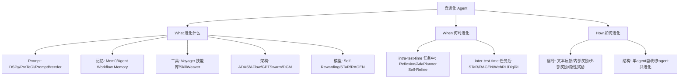

# 05 自进化延伸：从 Reflexion 到 Agent 自己改自己

> 讲透Agent 延伸章 · 素材锚点：[PaperAgent精华合入 §九](../PaperAgent精华合入-总入口.md)（Self-Evolving Agents 综述 arXiv:2507.21046）+ 一级论文全部核实（2026-08-17）
> 定位：01-04 章讲的是"固定 Agent 怎么工作"，本章讲"**Agent 怎么变得更好**"——AG5（反思=经验回放）的全面展开与升级。

---

## 1. 灵魂：一句话钉死

> **自进化 = 把"改进 Agent"本身变成 Agent 工作流的一部分**——改的对象从 prompt（浅）一路升级到工具、记忆、架构、权重（深），Reflexion 只是这张地图上的第一格。

01 章的三范式是**推理时**的行为模式；本章是**跨会话**的能力增长——两者的关系像"考试技巧"与"持续上学"。

## 2. 直觉：进化的"什么/何时/如何"

[arXiv:2507.21046](https://arxiv.org/abs/2507.21046)（普林斯顿王梦迪团队，首个系统综述）给的三维分类：

**记忆口诀**：改什么（5 层，浅→深：prompt→记忆→工具→架构→权重）；何时改（任务中快改 vs 任务后慢改）；怎么改（什么信号驱动 + 单体还是群体）。

## 3. 数学：自改的稳定性条件

自进化系统的核心方程是"改进算子 $E$ 对性能 $J$ 的单调性"：

$$J(\text{Agent}_{t+1}) = J\big(E(\text{Agent}_t, \text{feedback}_t)\big) \geq J(\text{Agent}_t)$$

难点：$E$ 不是梯度下降——反馈是**文本**（不可微）、评估是**采样**（有噪声）、空间是**离散**（组合爆炸）。三种稳定性来源：
1. **验证门**（harness 镜"验证即证据"）：只接受通过测试的改动——SWE-Dev/DigiRL 的做法；
2. **课程渐进**（curriculum）：难度递增防早期崩溃——AgentGen 双向进化/WebRL 自进化课程；
3. **群体冗余**：多 agent 互相评审，坏改动被淘汰——DGM 的存档（archive）机制。

失败模式即三条件不满足：**奖励 hacking**（信号被游戏）、**模型坍缩**（自训数据污染，见讲透学习型Agent）、**灾难性遗忘**（改权重丢旧能力）。

## 4. 方法谱系速查（一级论文，arXiv 全核实 ✅）

| 论文 | arXiv | What 层 | 机制一句话 | 深度定位 |
|---|---|---|---|---|
| Reflexion | [2303.11366](https://arxiv.org/abs/2303.11366) | 记忆（轻）| 失败→自然语言反思→下轮避开 | 入门：inter-time + 文本反馈 |
| **Self-Rewarding LM** | [2401.10020](https://arxiv.org/abs/2401.10020) | **模型（权重）**| LLM 自评自奖励（self-judging）驱动迭代 DPO 训练自己 | 深水区第一步：自造训练信号 |
| ADAS | [2408.08435](https://arxiv.org/abs/2408.08435) | 架构 | 元 agent 在**图灵完备代码空间**里搜索 agent 设计 | 架构层开山：设计=搜索问题 |
| AFlow | [2410.10762](https://arxiv.org/abs/2410.10762) | 架构 | 可复用算子 + **MCTS** 搜工作流代码图 | ADAS 实用化：自动工作流超人写 |
| RAGEN | [2504.20073](https://arxiv.org/abs/2504.20073) | 模型（RL）| 多轮交互=MDP，环境奖励在线 RL 微调策略 | Echo Trajectory 现象分析 |
| EvoAgentX | [2507.03616](https://arxiv.org/abs/2507.03616) | **全栈整合** | 五层平台，TextGrad/AFlow/MIPRO 三优化器分工进化 prompt/工具/拓扑 | 工程集成形态：GAIA +20% |
| (DGM Darwin Gödel Machine) | (2505.22954 待核) | 架构+代码 | agent 自改自身代码，存档+评估保进化不退化 | RSI 方向（留观）|

## 5. 实验：文本反馈 vs 权重更新的直觉

最小实验设计（留作 experiments/ 扩展）：玩具情感分类 agent（复用 [讲透Prompt 09_apo.py](../讲透Prompt/experiments/09_apo.py) 的 simulate_llm），对比三条进化路径：
- **P1 仅 prompt**（反馈写入系统提示）：修复"否定词"缺陷一轮见效，但修不了 80% 否定处理上限；
- **P2 仅记忆**（错误案例存 episodic 库，下轮检索）：对重复任务增益，新任务无感；
- **P3 权重更新**（模拟：把否定处理成功率 80%→95%）：唯一能突破 prompt 上界的路径——对应 AlignPro 结论：**能力缺口只有动权重能补**。
预期反直觉点：P1+P2 组合在预算 1/10 时达到 P3 九成效果——"浅层自进化性价比之王"。

## 6. 不足：自进化的四个坑

1. **奖励 hacking**：自评自奖（Self-Rewarding）的信号可能被游戏——改进≠真变好，需外部验证锚点。
2. **模型坍缩**：自生成数据回训（STaR 类）的分布窄化风险——讲透学习型Agent 已有专论。
3. **评估滞后**：进化循环快于基准更新——"进化到测试集上"而非"进化到能力上"（与 [Prompt-SE实证线 §四](../讲透Prompt/Prompt-SE实证线-软件工程.md) 的 Goodhart 警示同源）。
4. **安全缺口**：自改代码/工具的 agent（SICA/DGM）一旦目标偏移，无人工闸门可拦——harness 镜"Scope 边界"子系统在此是刚需。

## 7. 应用：三档落地

- **轻档（今天就能做）**：给任何 agent 加 Reflexion 层——失败任务把"教训摘要"写进 memory，下会话检索注入。opencode 的 `.agent/MEMORY.md` 正是这个形态。
- **中档（工程化）**：DSPy/MIPRO 优化 agent 的系统提示与工具描述（[讲透Prompt/09](../讲透Prompt/09-Prompt自动优化.md) 三步落地的 agent 版）；
- **重档（平台级）**：EvoAgentX 形态——工作流拓扑本身参与进化（AFlow MCTS），评估层当进化压力源。

## ✍️ 练习

**A**：给 09_apo.py 加第四条路径 P3（模拟权重更新），验证"prompt 上界"假说。
**B**：把 What 五层映射到 [PaperAgent精华合入 §九](../PaperAgent精华合入-总入口.md) 的 What 轴，找出讲透Agent 01-04 章各覆盖哪层。
**C**（Deep Thinking）：如果评估函数本身也是 LLM，自进化系统会出现什么新失效模式？（提示：自评-自改闭环的 Goodhart 二阶效应）

## 📌 下一步

自进化是 2025-2026 Agent 研究的主轴（PaperAgent §十 Agentic RL 的六大能力里 Self-Improvement 即其一）。横向：与 [讲透学习型Agent/](../讲透学习型Agent/README.md)（Model Collapse 边界）、[讲透记忆/](../讲透记忆/README.md)（What-记忆层展开）、harness 镜（验证即证据=进化稳定器）三点互锁。

---
立项：2026-08-17 · 一级论文 arXiv 全核实（2401.10020/2504.20073/2507.03616 经 abs+综述交叉；2303.11366/2408.08435/2410.10762 双源；DGM 2505.22954 单源待核）
