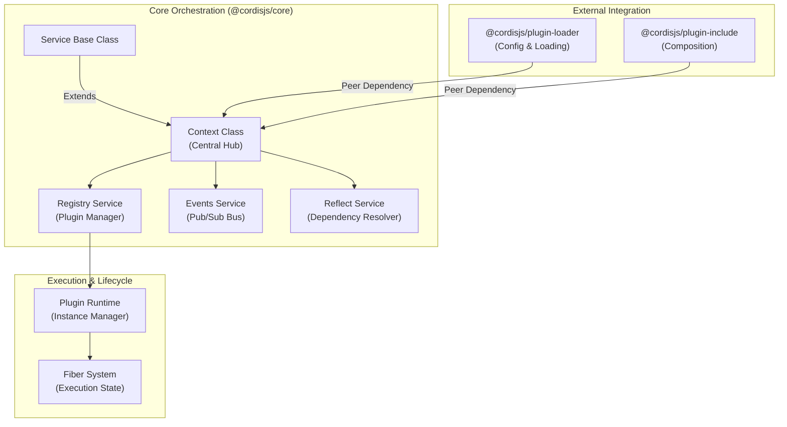
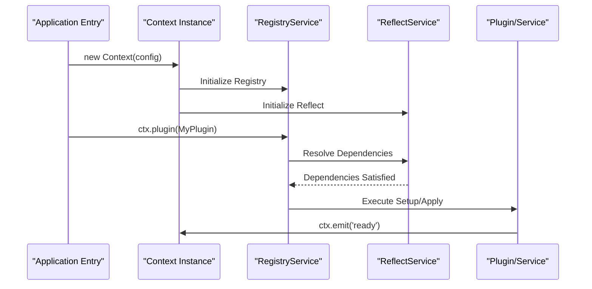

# Overview

Relevant source files

The following files were used as context for generating this wiki page:

- [.github/workflows/build.yml](.github/workflows/build.yml)
- [README.md](README.md)
- [package.json](package.json)
- [packages/core/README.md](packages/core/README.md)
- [packages/core/package.json](packages/core/package.json)

## Purpose and Scope

This document provides a high-level introduction to Cordis, a meta-framework for modern JavaScript applications. It explains the core purpose, high-level architecture, and implementation details of the framework's foundation. Cordis is designed to provide a robust environment for building modular applications through a plugin-centric architecture, dependency injection, and comprehensive lifecycle management.

Sources: [packages/core/package.json:2-3](), [package.json:1-10]()

## What is Cordis

Cordis is a meta-framework that facilitates the development of modular applications by providing a centralized orchestration layer. It manages the lifecycle of components (plugins), coordinates their interactions via a service-based dependency injection system, and provides a unified event bus for communication.

The framework is distributed primarily through the `cordis` package, which acts as the main entry point for applications, and `@cordisjs/core`, which contains the fundamental logic.

| Feature | Description |
|---------|-------------|
| **Context-Based Orchestration** | Uses a `Context` object as the primary interface for all framework operations. |
| **Plugin System** | Supports dynamic loading and management of plugins with full lifecycle tracking. |
| **Service Pattern** | Provides a `Service` base class for creating reusable, injectable components. |
| **Lifecycle Management** | Manages resource cleanup and state transitions through a "Fiber" system. |

Sources: [packages/core/package.json:1-9](), [package.json:1-10]()

## High-Level Architecture

The Cordis architecture is centered around the `Context` class, which serves as the container for services and plugins. The system follows a hierarchical structure where contexts can be branched, isolated, or intercepted to create scoped environments.

### System Architecture Diagram

This diagram bridges the natural language concepts of the framework to the specific code entities defined in the core package.

Sources: [packages/core/package.json:33-48](), [packages/core/package.json:7-17]()

### Data and Control Flow

When an application starts, the `Context` initializes its core services. Plugins are registered via the `Registry`, which creates a `Runtime` for each plugin. Dependencies between plugins and services are resolved by the `Reflect` service using property interception.

Sources: [packages/core/package.json:7-17](), [packages/core/package.json:33-44]()

## Implementation Details

### The Context and Service Pattern
The core of Cordis is the `Context` class. It acts as a proxy-like container where services are attached as properties. The `Service` class allows developers to define named units of functionality that other plugins can depend on.

### Dependency Injection
Cordis uses a "demand-driven" dependency injection model. Instead of passing dependencies in constructors, plugins declare their requirements. The framework's `ReflectService` manages these declarations, ensuring that a plugin's logic only executes when its required services are available.

### Monorepo Organization
Cordis is managed as a monorepo using Yarn workspaces. The `packages/` directory contains the core framework and its standard plugins.

| Path | Role |
|------|------|
| `packages/core` | The engine of the framework, containing the `Context` and `Service` logic. |
| `external/*` | Third-party or auxiliary packages integrated into the workspace. |
| `package.json` | Root configuration for `yakumo` build tools and `vitest` testing. |

Sources: [package.json:7-10](), [package.json:14-19](), [packages/core/package.json:1-17]()

## Development Infrastructure

Cordis uses a specialized toolchain for building and testing across its packages, orchestrated primarily via `yakumo`:

- **Yakumo**: A workspace-aware task runner used for building (`yakumo esbuild`, `yakumo tsc`) and publishing. It is invoked via `node` with `tsx` and `@cordisjs/unyaml` for configuration handling.
- **Vitest**: The primary testing framework, integrated with `yakumo-vitest` for workspace-wide execution.
- **TSX**: Used to execute TypeScript files directly during development and within the `yakumo` script environment.
- **CI/CD**: GitHub Actions handle linting, building (specifically ensuring `core` builds first), and testing on multiple Node.js versions (24, 26).

Sources: [package.json:12-20](), [package.json:21-37](), [.github/workflows/build.yml:43-46](), [.github/workflows/build.yml:56-76]()
