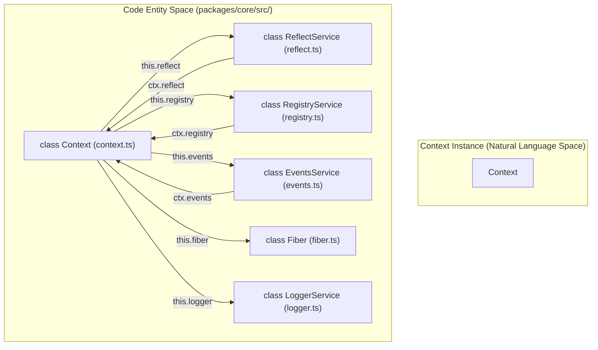
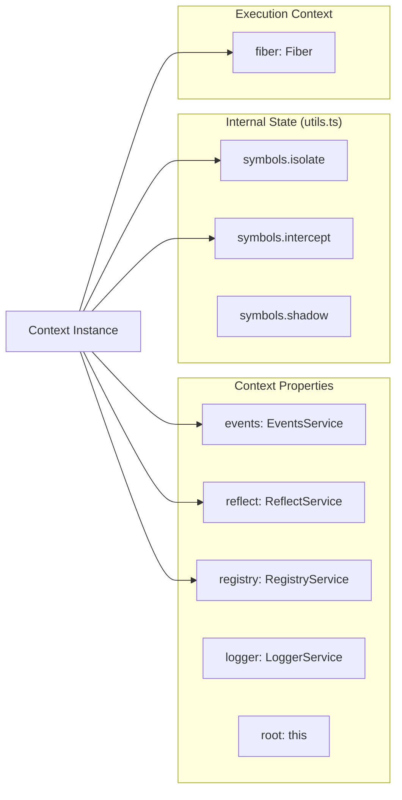
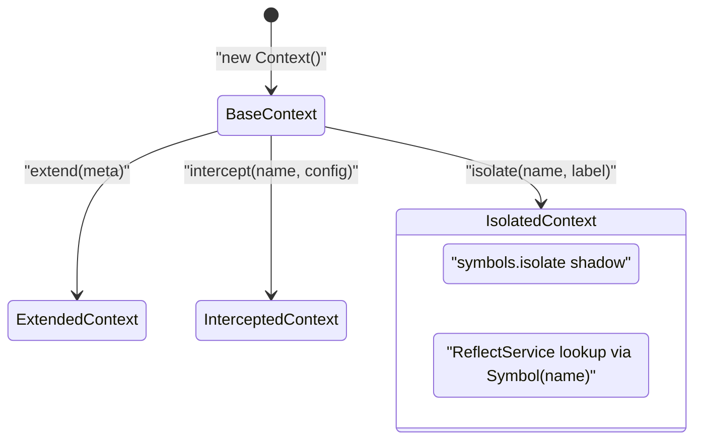
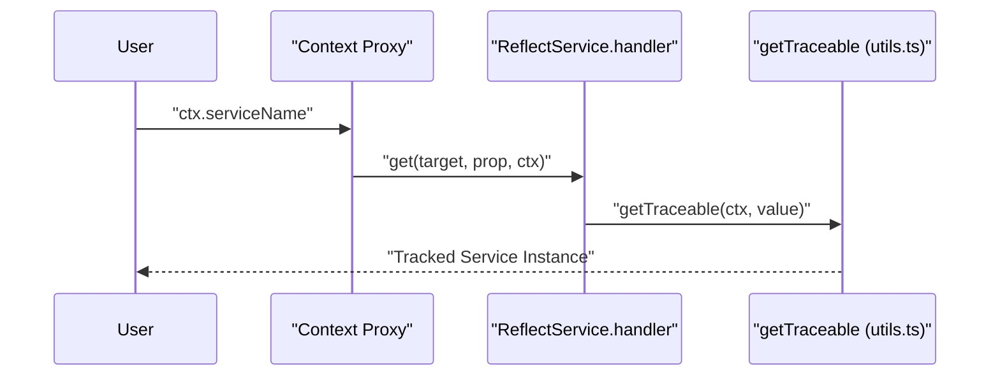

# Core Architecture

<details>
<summary>Relevant source files</summary>

The following files were used as context for generating this wiki page:

- [packages/core/src/context.ts](packages/core/src/context.ts)
- [packages/core/src/fiber.ts](packages/core/src/fiber.ts)
- [packages/core/src/reflect.ts](packages/core/src/reflect.ts)
- [packages/core/src/utils.ts](packages/core/src/utils.ts)
- [packages/core/tests/fiber.spec.ts](packages/core/tests/fiber.spec.ts)
- [packages/core/tests/reflect.spec.ts](packages/core/tests/reflect.spec.ts)

</details>


This document covers the fundamental architectural components that form the foundation of the Cordis framework. It explains how the core services work together to provide dependency injection, event communication, plugin management, and context isolation. For detailed information about specific systems, see [Context System](#3.1), [Reflection and Dependency Injection](#3.2), and [Core Utilities](#3.3).

## Overview

The Cordis core architecture is built around a central `Context` class that orchestrates several specialized services. Each service handles a specific aspect of the framework's functionality, working together to provide a cohesive plugin ecosystem.

### Core Components

| Component | Class | Purpose |
|-----------|--------|---------|
| Context System | `Context` | Central orchestrator and service container |
| Registry Service | `RegistryService` | Plugin registration and lifecycle management |
| Events Service | `EventsService` | Publish-subscribe event communication |
| Reflection Service | `ReflectService` | Dependency injection and property access |
| Fiber System | `Fiber` | Execution scope and resource management |

Sources: [packages/core/src/context.ts:9-19](), [packages/core/src/reflect.ts:61-61](), [packages/core/src/fiber.ts:103-103]()

## Context as Central Orchestrator

### Core Services Architecture

The `Context` class serves as the central orchestrator, automatically instantiating and managing the core services. It utilizes a `Proxy` with `ReflectService.handler` to intercept property access for dependency injection.



The services are instantiated in the `Context` constructor [packages/core/src/context.ts:36-49]() and form a circular dependency graph where each service has access to the context and other services.

Sources: [packages/core/src/context.ts:36-49](), [packages/core/src/reflect.ts:62-133]()

### Service Integration Points

The `Context` interface defines the primary surface area for interaction with the framework's subsystems.



Sources: [packages/core/src/context.ts:9-19](), [packages/core/src/context.ts:37-46](), [packages/core/src/utils.ts:47-71]()

## Context Extension and Isolation

### Extension Mechanisms

The `Context` class provides three primary extension mechanisms to create branched execution scopes:

| Method | Purpose | Returns |
|--------|---------|---------|
| `extend(meta)` | Create derived context with additional properties or shadow context [packages/core/src/context.ts:55-63]() | Extended context |
| `isolate(name, label)` | Create isolated scope for a specific service name using symbols [packages/core/src/context.ts:65-69]() | Isolated context |
| `intercept(name, config)` | Override service configuration for the current scope [packages/core/src/context.ts:71-77]() | Intercepted context |

### Context Isolation Flow

Isolation is achieved by shadowing the `symbols.isolate` dictionary. This ensures that when a service is requested, the `ReflectService` looks up the service instance associated with the specific symbol in that context's scope via `_getImpl` [packages/core/src/reflect.ts:154-160]().



Sources: [packages/core/src/context.ts:55-77](), [packages/core/src/reflect.ts:154-160]()

## Symbol-Based Internal State

### Core Symbols

Cordis relies heavily on symbols defined in `utils.ts` to manage internal state without polluting the public API of services and contexts.

| Symbol | Code Identifier | Purpose |
|--------|----------|---------|
| `symbols.isolate` | `Context.isolate` | Service isolation mapping [packages/core/src/utils.ts:60]() |
| `symbols.intercept` | `Context.intercept` | Service configuration overrides [packages/core/src/utils.ts:61]() |
| `symbols.effect` | `Context.effect` | Lifecycle effect registration [packages/core/src/utils.ts:58]() |
| `symbols.filter` | `Context.filter` | Event filtering logic [packages/core/src/utils.ts:59]() |
| `symbols.tracker` | `Service.tracker` | Traceable object metadata [packages/core/src/utils.ts:69]() |

Sources: [packages/core/src/utils.ts:47-71](), [packages/core/src/context.ts:22-25]()

## Context Identity and Type System

### Context Detection

The framework provides a type-safe way to detect `Context` instances, even across different versions or bundles, using a global symbol identity:

```typescript
static is(value: any): value is Context {
  return !!value?.[Context.is as any]
}
```

This method uses `Symbol.for('cordis.is')` to ensure cross-realm compatibility [packages/core/src/context.ts:27-34]().

### Proxy Integration and Traceability

The `Context` uses a `Proxy` wrapper created in the constructor [packages/core/src/context.ts:39](). This proxy works with `getTraceable` [packages/core/src/utils.ts:110-118]() to ensure that when a service method is called, it receives the correct context "shadow" (the specific context instance that accessed the service), allowing for caller-sensitive logic.



Sources: [packages/core/src/reflect.ts:62-98](), [packages/core/src/utils.ts:110-118]()

## Service Lifecycle Integration

### Constructor Sequence

The `Context` constructor follows a strict sequence to bootstrap the framework:

1. **State Initialization**: Creates `symbols.isolate` and `symbols.intercept` null-prototype objects [packages/core/src/context.ts:37-38]().
2. **Proxy Bootstrapping**: Returns a `Proxy` of itself immediately to allow services to interact with the proxied context during their own construction [packages/core/src/context.ts:39-48]().
3. **Service Wiring**: Instantiates `Fiber`, `ReflectService`, `RegistryService`, `EventsService`, and `LoggerService` in order [packages/core/src/context.ts:42-46]().
4. **Lifecycle Reset**: Clears initial disposables to ensure a clean state for the root context [packages/core/src/context.ts:47]().

Sources: [packages/core/src/context.ts:36-49]()
