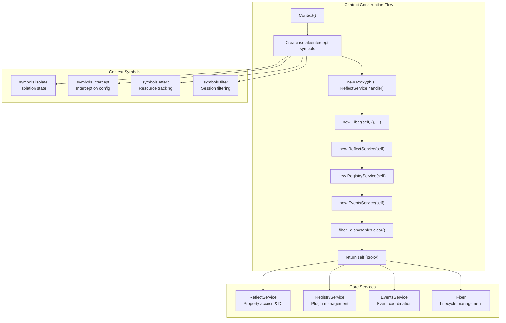
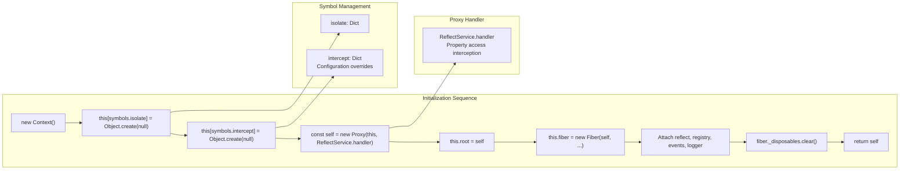
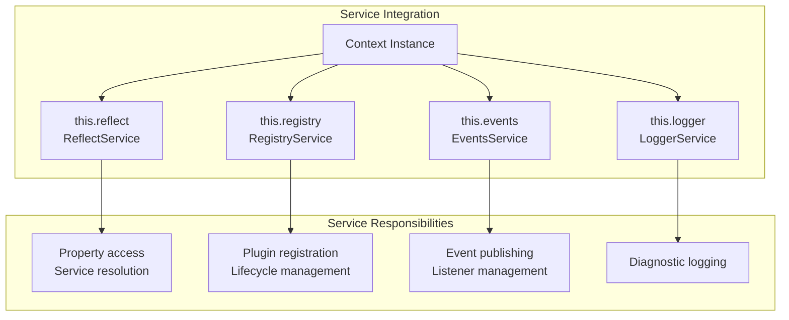
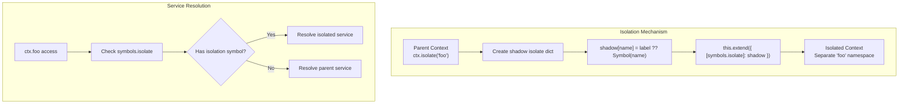
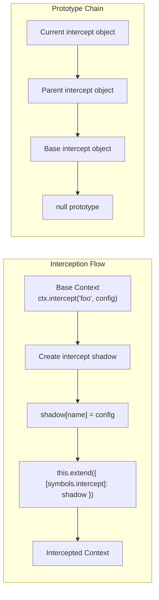
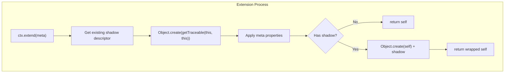
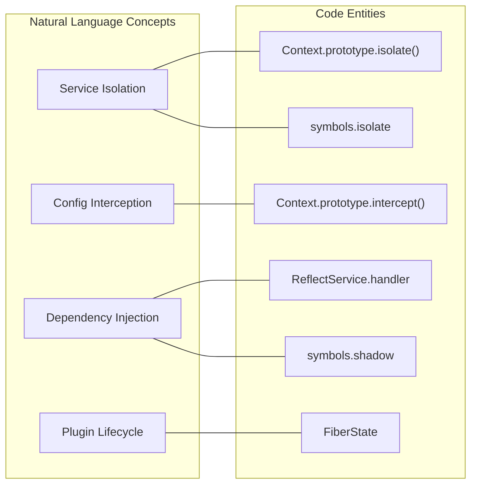
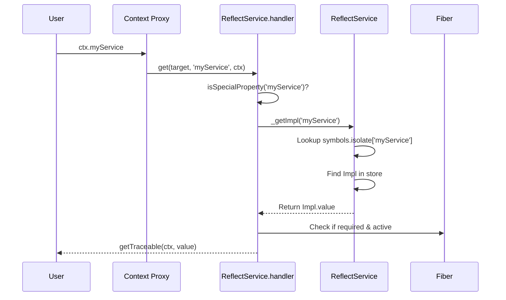

# Context System

Relevant source files

The following files were used as context for generating this wiki page:

- [packages/core/src/context.ts](packages/core/src/context.ts)
- [packages/core/src/reflect.ts](packages/core/src/reflect.ts)
- [packages/core/tests/associate.spec.ts](packages/core/tests/associate.spec.ts)

The Context System serves as the central orchestrator in Cordis, managing service lifecycle, dependency injection, event coordination, and resource isolation. It provides the foundational container that holds all framework services and enables plugin communication through a unified interface.

This document covers the `Context` class implementation, its initialization process, and the core mechanisms for isolation, interception, and extension. For information about the specific services managed by Context, see [Reflection and Dependency Injection](#3.2). For details about plugin registration and management, see [Registry Service](#4.1).

## Core Architecture

The Context class acts as a central hub that orchestrates multiple core services through a proxy-based architecture. Each Context instance maintains its own service instances while supporting hierarchical relationships through extension and isolation.

Sources: [packages/core/src/context.ts:9-19](), [packages/core/src/context.ts:36-49]()

## Context Creation and Initialization

The Context constructor implements a sophisticated initialization sequence that creates a proxy-wrapped instance with integrated service management. The proxy mechanism enables transparent property access and service injection by using the `ReflectService.handler` [packages/core/src/context.ts:39]().

Sources: [packages/core/src/context.ts:36-49]()

## Service Management

Context manages four core services that provide the foundation for all framework functionality. These services are instantiated during Context construction and remain available throughout the Context lifecycle.

| Service | Purpose | Implementation |
|---------|---------|-------------|
| `ReflectService` | Property access, dependency injection | [packages/core/src/reflect.ts:61-148]() |
| `RegistryService` | Plugin registration and lifecycle | [packages/core/src/registry.ts]() |
| `EventsService` | Event publishing and subscription | [packages/core/src/events.ts]() |
| `LoggerService` | Logging and diagnostics | [packages/core/src/logger.ts]() |
| `Fiber` | Internal state and resource tracking | [packages/core/src/fiber.ts]() |

Sources: [packages/core/src/context.ts:15-18](), [packages/core/src/context.ts:43-46]()

## Isolation System

The isolation system enables creating specialized Context instances that maintain separate service namespaces while inheriting from a parent Context. Each isolated service receives a unique symbol identifier stored in `[symbols.isolate]` [packages/core/src/context.ts:10]() that prevents conflicts between different isolation scopes.

The isolation system supports both automatic symbol generation and explicit label sharing through the `ctx.isolate()` method [packages/core/src/context.ts:65-69]().

Sources: [packages/core/src/context.ts:65-69](), [packages/core/src/reflect.ts:154-160]()

## Interception System

The interception system allows Context instances to override service configurations without affecting the underlying service implementation. Intercepted configurations are stored in `[symbols.intercept]` [packages/core/src/context.ts:11]() and applied during service invocation through a prototype chain mechanism.

The interception mechanism uses prototype inheritance to layer configuration overrides via the `ctx.intercept()` method [packages/core/src/context.ts:71-77]().

Sources: [packages/core/src/context.ts:71-77]()

## Extension Mechanism

The extension mechanism creates new Context instances that inherit properties and behaviors from parent contexts while allowing additional metadata and customization. Extensions support both simple property extension and shadow object preservation via the `ctx.extend()` method [packages/core/src/context.ts:55-63]().

The extension system maintains prototype chains that preserve context traceability while enabling customization. It uses `getTraceable` to ensure that the context reference remains correct even when proxied or extended [packages/core/src/context.ts:57]().

Sources: [packages/core/src/context.ts:55-63](), [packages/core/src/utils.ts:13-25]()

## Association and Property Injection

Cordis supports complex associations where services can be injected into non-service classes or nested under other services. This is managed by `ReflectService` and the `symbols.tracker` symbol.

| Feature | Code Entity | Purpose |
|---------|-------------|---------|
| Service Tracker | `symbols.tracker` | Defines how a class associates with a Context [packages/core/src/reflect.ts:139-142]() |
| Property Injection | `ctx.provide()` | Reserves a property name for future service injection [packages/core/src/reflect.ts:175-203]() |
| Service Mixin | `ctx.mixin()` | Maps properties from one service/context to another [packages/core/src/reflect.ts:144-147]() |
| Property Accessors | `ctx.accessor()` | Defines custom getters/setters on the Context proxy [packages/core/src/reflect.ts:14]() |

### Natural Language to Code Entity Mapping

The following diagram bridges the conceptual "Context System" features to their implementation in the codebase.

Sources: [packages/core/src/context.ts:65-77](), [packages/core/src/reflect.ts:62-133](), [packages/core/src/fiber.ts:4]()

### Data Flow: Property Access

When a property is accessed on a `Context` instance, it flows through the `ReflectService.handler`.

Sources: [packages/core/src/reflect.ts:62-98](), [packages/core/src/reflect.ts:150-160]()
