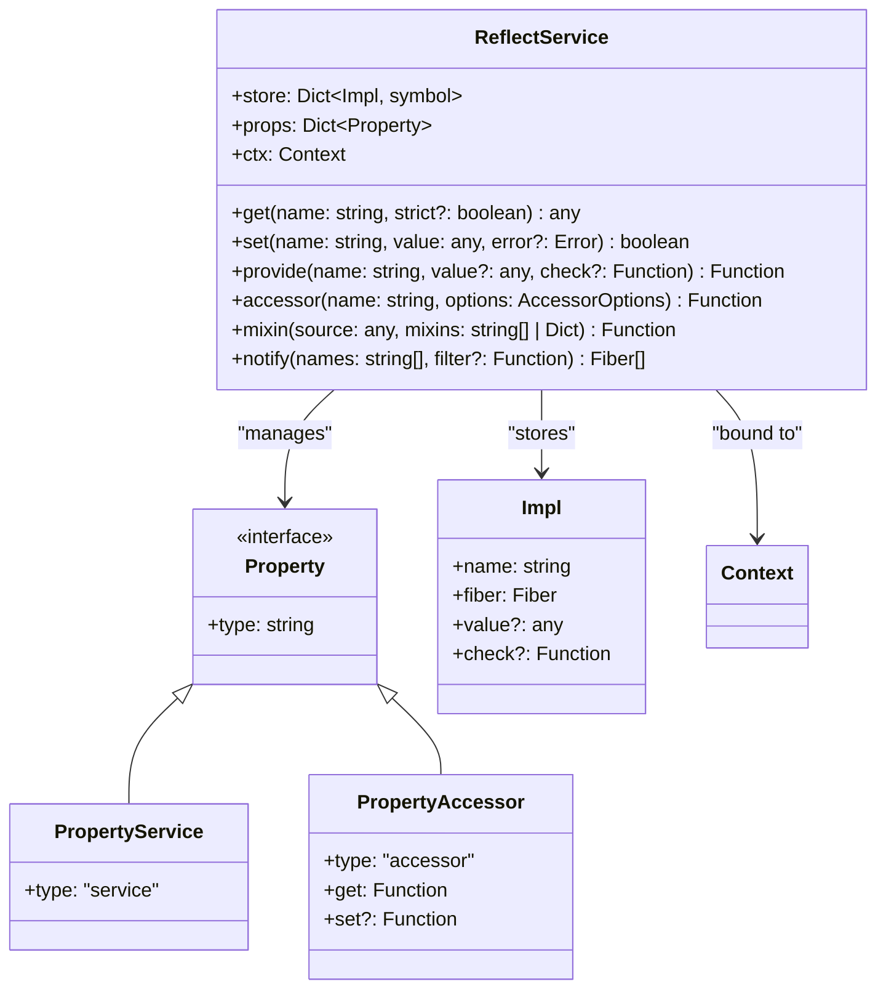
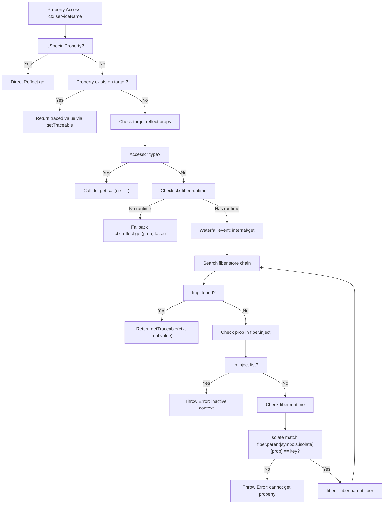
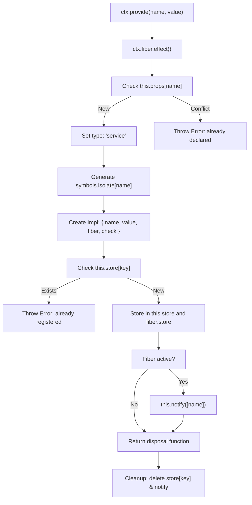
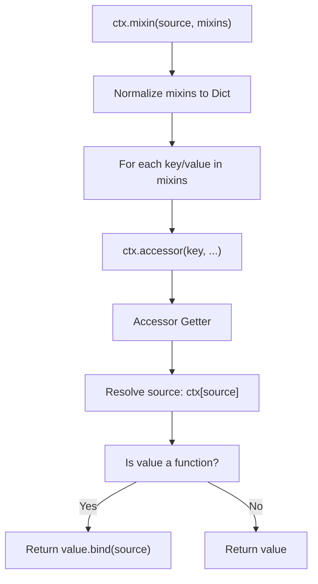

# Reflection and Dependency Injection

Relevant source files

The following files were used as context for generating this wiki page:

- [packages/core/src/reflect.ts](packages/core/src/reflect.ts)
- [packages/core/src/service.ts](packages/core/src/service.ts)
- [packages/core/tests/service.spec.ts](packages/core/tests/service.spec.ts)

This document covers the `ReflectService` class and its role in managing property access, service provision, and dependency resolution within Cordis contexts. The reflection system provides the foundation for dependency injection, service isolation, and dynamic property access throughout the framework.

For information about the broader Context system that hosts the ReflectService, see [Context System](3.1). For details about plugin lifecycle management that integrates with dependency injection, see [Fiber Lifecycle](4.2).

## Core Components

The reflection and dependency injection system centers around the `ReflectService` class, which manages service registration, property access, and dependency resolution through a sophisticated proxy-based mechanism.

### ReflectService Class Structure

Sources: [packages/core/src/reflect.ts:61-148]()

### Property Types and Implementation Model

The system distinguishes between two types of properties: services and accessors. Services represent concrete values or instances, while accessors provide computed property access with custom getter/setter logic.

| Property Type | Purpose | Configuration |
|---------------|---------|---------------|
| `service` | Direct value storage and retrieval | Requires `provide()` call |
| `accessor` | Computed property access | Custom `get`/`set` functions |

The `Impl` interface represents active service implementations, tracking the providing `Fiber`, current value, and optional validation logic [packages/core/src/reflect.ts:54-59]().

Sources: [packages/core/src/reflect.ts:40-59]()

## Dependency Injection Mechanism

### Property Access Proxy Handler

The `ReflectService` implements dependency injection through a comprehensive `ProxyHandler<Context>` that intercepts property access on `Context` instances [packages/core/src/reflect.ts:62-63](). This handler manages the resolution chain from local context to parent contexts.

Sources: [packages/core/src/reflect.ts:62-98]()

### Service Resolution Chain

Service resolution follows a hierarchical chain through fiber contexts, respecting isolation boundaries and injection requirements. The system searches from the current fiber upward through parent fibers until a matching service implementation is found [packages/core/src/reflect.ts:81-93](). The `getTraceable` utility is used to ensure the returned service instance is correctly bound to the requesting context [packages/core/src/reflect.ts:68]().

Sources: [packages/core/src/reflect.ts:62-98](), [packages/core/src/reflect.ts:150-160]()

## Service Provision

### Provider Registration

Services are registered using the `provide()` method, which creates an implementation entry and manages its lifecycle through the `fiber.effect()` system [packages/core/src/reflect.ts:175-176](). Each service is isolated using unique symbols stored in `symbols.isolate` to prevent cross-context conflicts [packages/core/src/reflect.ts:184-185]().

Sources: [packages/core/src/reflect.ts:175-203]()

### Service Lifecycle and Notification

When services become available or unavailable, the system notifies dependent fibers that have injection requirements [packages/core/src/reflect.ts:205-206](). This notification mechanism ensures that dependent plugins are properly refreshed when their dependencies change.

The `notify()` method identifies affected fibers by checking their injection requirements and isolation boundaries, then triggers fiber refresh for those with matching dependencies [packages/core/src/reflect.ts:213-222]().

Sources: [packages/core/src/reflect.ts:205-224]()

## Accessor Pattern

Accessors provide computed property access with custom getter and setter logic. They enable dynamic property behavior without requiring direct service provision [packages/core/src/reflect.ts:47-52]().

The `accessor()` method registers these definitions in `this.props` [packages/core/src/reflect.ts:226-234](). When accessed via the proxy, the `get` or `set` functions are executed with the context as the `this` context [packages/core/src/reflect.ts:76]().

Sources: [packages/core/src/reflect.ts:47-52](), [packages/core/src/reflect.ts:74-77](), [packages/core/src/reflect.ts:226-234]()

## Mixin System

The mixin system provides a mechanism for exposing service methods directly on context instances. It creates accessor properties that dynamically resolve to the underlying service and bind method calls appropriately [packages/core/src/reflect.ts:236-240]().

The mixin system enables the `ReflectService` to expose commonly used service methods directly on context instances, such as `ctx.on()` for events and `ctx.plugin()` for registry operations [packages/core/src/reflect.ts:144-147]().

Sources: [packages/core/src/reflect.ts:236-262]()

## Service Base Class

The `Service` class provides a standard implementation for creating Cordis services. It handles automatic provision and context tracking [packages/core/src/service.ts:5-18]().

- **Initialization**: The constructor calls `ctx.reflect.provide` to register the instance [packages/core/src/service.ts:33]().
- **Callable Services**: If `symbols.invoke` is defined, the service instance becomes a callable function while retaining its properties [packages/core/src/service.ts:26-28]().
- **Config Resolution**: The `[symbols.resolveConfig]` method merges configurations across the interception chain [packages/core/src/service.ts:51-67]().

Sources: [packages/core/src/service.ts:5-80]()

## Integration with Core Systems

### Context Integration

The `ReflectService` integrates deeply with the `Context` system through module augmentation, adding methods like `get()`, `set()`, `provide()`, `accessor()`, and `mixin()` directly to `Context` instances [packages/core/src/reflect.ts:6-17]().

### Fiber and Effect System Integration

The `ReflectService` leverages the fiber effect system for managing service lifecycles and cleanup. All service registrations and accessor definitions are wrapped in effects [packages/core/src/reflect.ts:176](), ensuring proper disposal when fibers are terminated.

The integration ensures that service provision is automatically cleaned up when the providing fiber is disposed [packages/core/src/reflect.ts:195-201](), maintaining system integrity and preventing memory leaks.

Sources: [packages/core/src/reflect.ts:6-18](), [packages/core/src/reflect.ts:138-148](), [packages/core/src/reflect.ts:175-203]()
