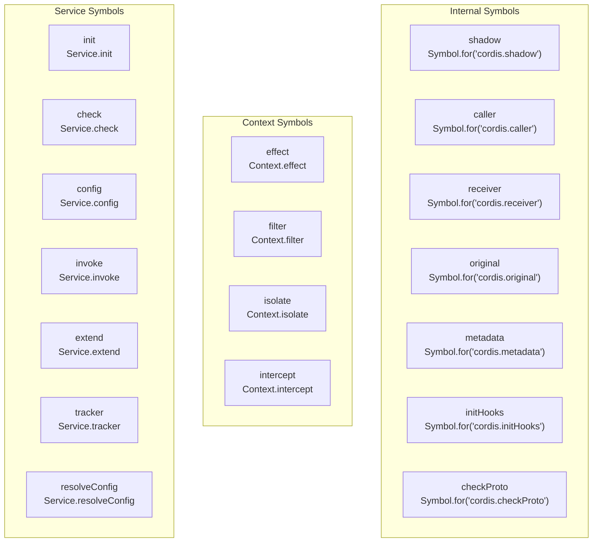
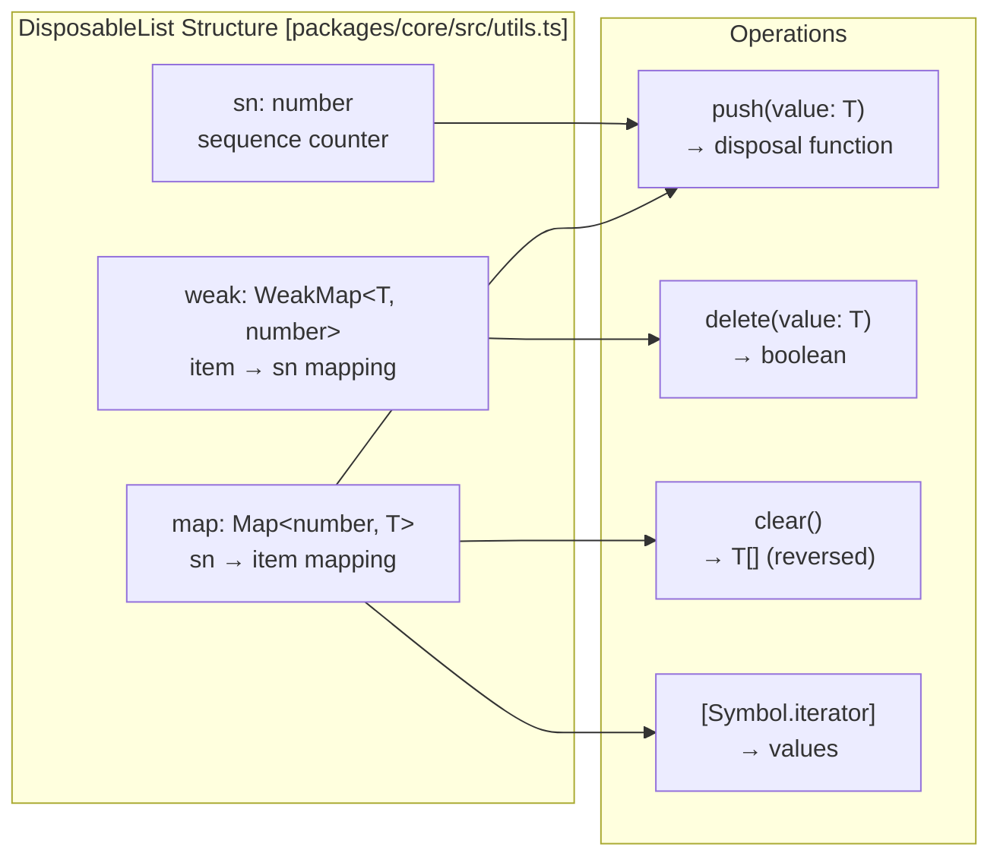
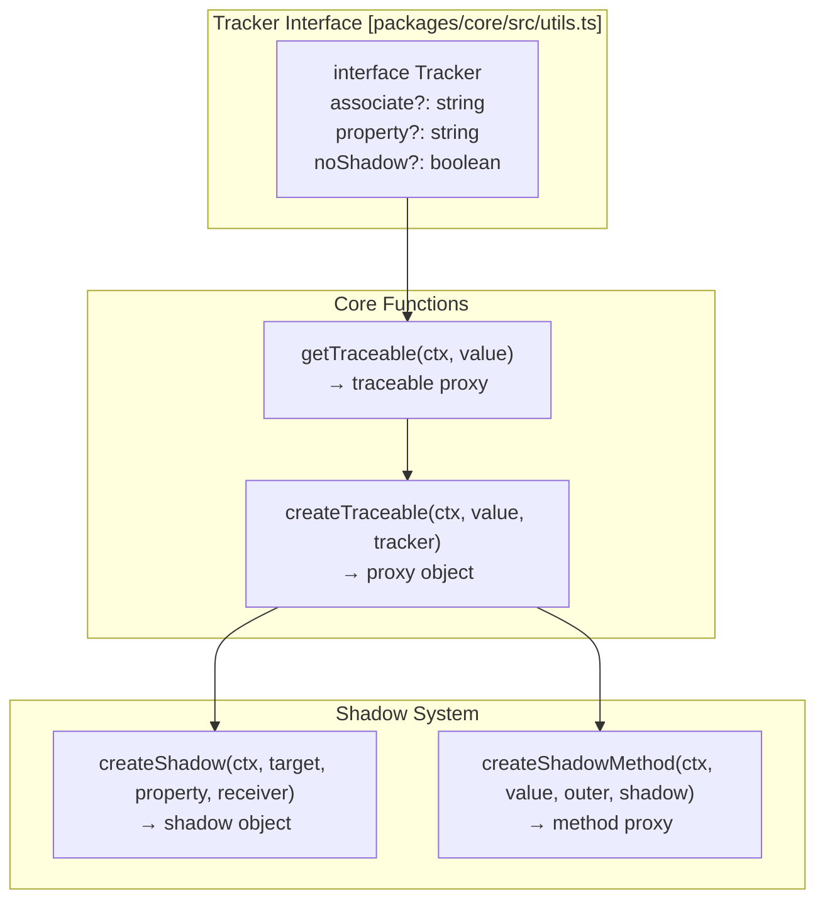

# Core Utilities

Relevant source files

The following files were used as context for generating this wiki page:

- [packages/core/src/fiber.ts](packages/core/src/fiber.ts)
- [packages/core/src/utils.ts](packages/core/src/utils.ts)
- [packages/core/tests/dispose.spec.ts](packages/core/tests/dispose.spec.ts)
- [packages/core/tests/fiber.spec.ts](packages/core/tests/fiber.spec.ts)
- [packages/core/tests/invoke.spec.ts](packages/core/tests/invoke.spec.ts)
- [packages/core/tests/isolate.spec.ts](packages/core/tests/isolate.spec.ts)
- [packages/core/tests/plugin.spec.ts](packages/core/tests/plugin.spec.ts)
- [packages/core/tests/reflect.spec.ts](packages/core/tests/reflect.spec.ts)
- [packages/core/tests/utils.ts](packages/core/tests/utils.ts)

The Core Utilities module provides foundational infrastructure that supports the Cordis framework's internal operations. This includes symbol management for internal communication, disposable resource tracking, object traceability systems, and error handling mechanisms.

For information about the Context system that uses these utilities, see [Context System](3.1). For details about the Reflection and Dependency Injection system, see [Reflection and Dependency Injection](3.2).

## Symbol System

The framework uses a centralized symbol registry to ensure consistent internal communication between components. The `symbols` object provides well-known symbols organized into three categories.

### Symbol Categories

**Internal Symbols** manage object lifecycle and metadata:
- `shadow`: Marks shadow objects in the traceability system [packages/core/src/utils.ts:49]().
- `caller`: Identifies the calling context in a traceable proxy [packages/core/src/utils.ts:50]().
- `receiver`: Identifies the original receiver in proxy operations [packages/core/src/utils.ts:51]().
- `original`: References the unwrapped original object [packages/core/src/utils.ts:52]().
- `metadata`: Stores object metadata information [packages/core/src/utils.ts:53]().
- `initHooks` and `checkProto`: Support initialization and prototype validation [packages/core/src/utils.ts:54-55]().

**Context Symbols** correspond to `Context` methods and enable method interception [packages/core/src/utils.ts:58-61]().

**Service Symbols** correspond to `Service` class methods and lifecycle hooks [packages/core/src/utils.ts:64-70]().

Sources: [packages/core/src/utils.ts:47-71]()

## Disposable Collections

Cordis provides the `DisposableList<T>` class for managing collections of objects requiring lifecycle management, such as event listeners or plugin effects.

### DisposableList Implementation

The `DisposableList<T>` class provides a data structure for managing collections of disposable items with automatic cleanup capabilities. It uses a combination of a `Map` for ordered storage and a `WeakMap` for efficient lookups [packages/core/src/utils.ts:4-7]().

Key characteristics:
- **Weak Reference Support**: Items must extend `WeakKey` to enable the `WeakMap` association [packages/core/src/utils.ts:4-7]().
- **Sequence Numbers**: Each item gets a unique sequence number (`sn`) for ordering [packages/core/src/utils.ts:14-15]().
- **Disposal Functions**: `push()` returns a function that removes the specific item from the map [packages/core/src/utils.ts:17-18]().
- **Reverse Order Cleanup**: `clear()` returns items in reverse insertion order for proper disposal [packages/core/src/utils.ts:26-30]().

Sources: [packages/core/src/utils.ts:4-39]()

## Object Traceability System

The traceability system enables the framework to create proxy objects that track property access, method calls, and context propagation. This is essential for dependency injection and service interception.

### Traceability Components

### Proxy Behavior

The traceability system creates proxies via `createTraceable` that implement specific logic for Cordis symbols and context association [packages/core/src/utils.ts:157-162]():

- **Cordis Symbols**: Intercepts `symbols.original` to return the target and `symbols.caller` to return the calling context [packages/core/src/utils.ts:164-165]().
- **Context Injection**: Returns the current `ctx` when the property matches `tracker.property` [packages/core/src/utils.ts:166]().
- **Service Association**: If `tracker.associate` is set, property access is redirected to the context's reflected properties [packages/core/src/utils.ts:170-172]().
- **Shadow Methods**: Functions accessed through the proxy are wrapped in `createShadowMethod` to ensure the correct `thisArg` (the shadow context) is used during execution [packages/core/src/utils.ts:184-186]().

Sources: [packages/core/src/utils.ts:41-45](), [packages/core/src/utils.ts:110-190]()

## Error Handling Mechanisms

Cordis defines specialized error classes to handle configuration validation and framework-level operational failures.

### ValidationError

The `ValidationError` class is used when a plugin configuration fails to meet the schema defined via `StandardSchemaV1` [packages/core/src/fiber.ts:16-28]().

- **Standard Schema Integration**: It consumes issues from the `~standard` validation result [packages/core/src/fiber.ts:37-42]().
- **Formatting**: It automatically formats validation issues into a readable string, including the path to the invalid property [packages/core/src/fiber.ts:20-26]().

### CordisError

The `CordisError` class provides a structured way to throw framework-specific errors using a predefined set of error codes [packages/core/src/fiber.ts:87-99]().

| Code | Meaning |
|------|---------|
| `INACTIVE_EFFECT` | Attempted to create an effect or register a plugin on a context that has already been disposed [packages/core/src/fiber.ts:97](). |

Sources: [packages/core/src/fiber.ts:14-46](), [packages/core/src/fiber.ts:87-99]()

## Utility Functions

Several helper functions support framework operations across the monorepo.

### Type and Object Utilities

| Function | Purpose | Key Logic |
|----------|---------|-----------|
| `isConstructor(func)` | Detects constructor functions | Checks `prototype` and excludes generators [packages/core/src/utils.ts:76-86]() |
| `isObject(value)` | Type guard for objects/functions | Returns `true` for objects and functions [packages/core/src/utils.ts:97-99]() |
| `joinPrototype(p1, p2)` | Merges prototype chains | Recursively combines prototypes preserving descriptors [packages/core/src/utils.ts:88-95]() |
| `getPropertyDescriptor(t, p)` | Walks prototype chain | Finds property descriptor up the prototype chain [packages/core/src/utils.ts:101-108]() |
| `withProps(target, props)` | Creates property proxy | Overlays additional properties on target object [packages/core/src/utils.ts:120-132]() |

### Constructor Detection

The `isConstructor` function distinguishes constructor functions from regular functions by checking for a `prototype` and excluding `GeneratorFunction` and `AsyncGeneratorFunction` [packages/core/src/utils.ts:76-86](). This is used by the `Fiber` to decide whether to instantiate a plugin class or call a plugin function [packages/core/src/fiber.ts:150-159]().

Sources: [packages/core/src/utils.ts:73-108](), [packages/core/src/utils.ts:120-139](), [packages/core/src/fiber.ts:150-159]()
