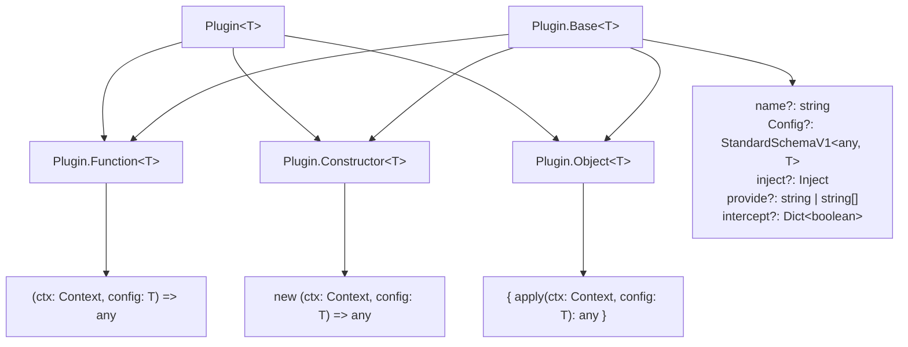
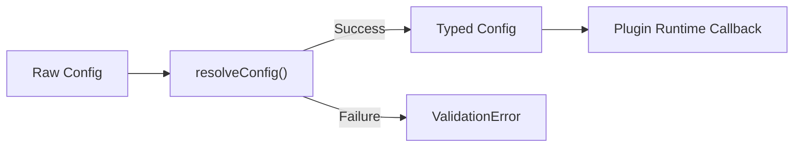
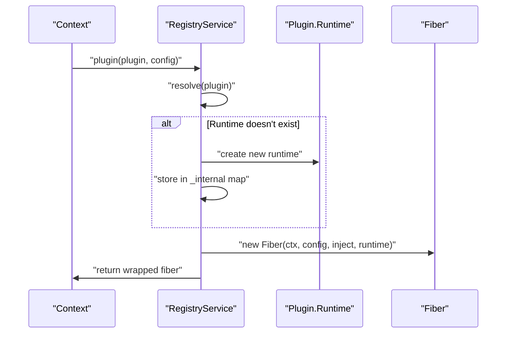
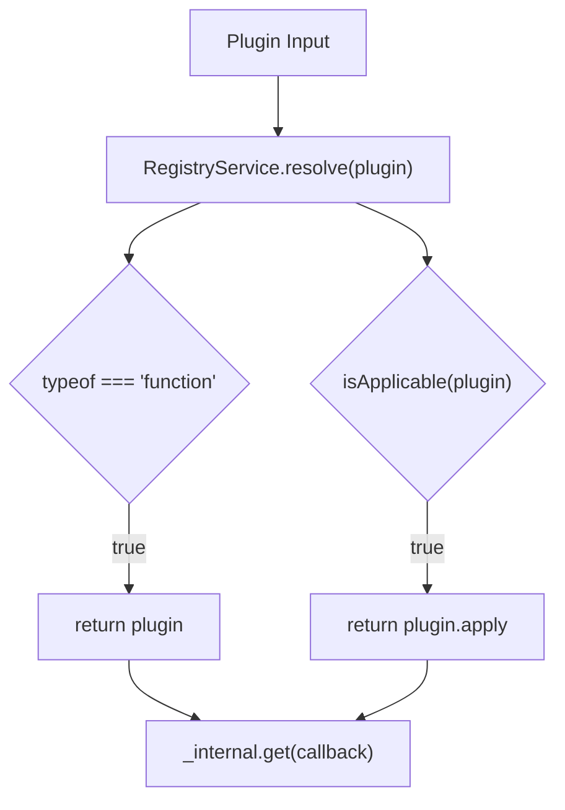
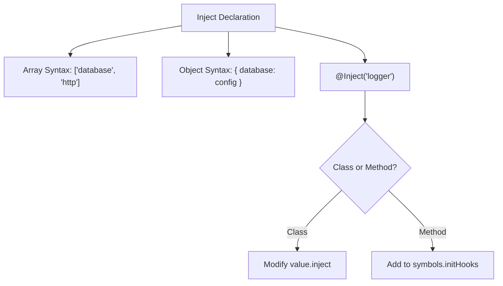
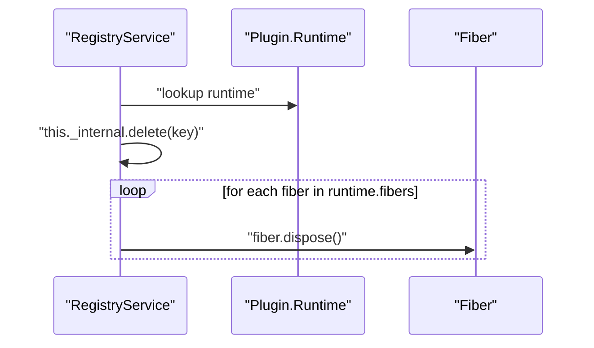

# Plugin System

Relevant source files

The following files were used as context for generating this wiki page:

- [packages/core/src/fiber.ts](packages/core/src/fiber.ts)
- [packages/core/src/registry.ts](packages/core/src/registry.ts)
- [packages/core/src/service.ts](packages/core/src/service.ts)
- [packages/core/tests/fiber.spec.ts](packages/core/tests/fiber.spec.ts)
- [packages/core/tests/reflect.spec.ts](packages/core/tests/reflect.spec.ts)

The Plugin System is the core mechanism through which Cordis applications are composed and extended. It provides a unified interface for registering, managing, and executing modular components with automatic dependency injection, lifecycle management, and runtime coordination.

This document covers plugin types, registration processes, dependency injection, and runtime management. For detailed registry service operations, see [Registry Service](#4.1). For plugin execution states and resource cleanup, see [Fiber Lifecycle](#4.2). For the service base class pattern, see [Service Pattern](#4.3).

## Plugin Types and Structure

Cordis supports three distinct plugin types, each providing different patterns for component organization and instantiation.

### Plugin Type Definitions

Sources: [packages/core/src/registry.ts:63-92]()

### Plugin Base Properties

All plugin types extend `Plugin.Base<T>` which provides common metadata and configuration capabilities:

| Property | Type | Purpose |
|----------|------|---------|
| `name` | `string?` | Plugin identifier for debugging and logging |
| `Config` | `StandardSchemaV1?` | Schema for configuration validation and transformation |
| `inject` | `Inject` | Dependency injection requirements |
| `provide` | `string \| string[]` | Services this plugin provides |
| `intercept` | `Dict<boolean>` | Context interception configuration |

Sources: [packages/core/src/registry.ts:69-75]()

### Configuration Validation

Plugins use the `Config` property (supporting [Standard Schema](https://github.com/standard-schema/spec)) to validate and transform raw configuration objects. Validation occurs during the Fiber initialization phase via `resolveConfig`.

Sources: [packages/core/src/fiber.ts:34-46](), [packages/core/src/fiber.ts:16-28](), [packages/core/src/fiber.ts:173-178]()

## Plugin Registration Process

Plugin registration involves resolving the plugin type, creating runtime state, and establishing dependency relationships.

### Registration Flow

Sources: [packages/core/src/registry.ts:193-214]()

### Plugin Resolution

The `RegistryService` resolves various plugin formats into a single executable function (the `callback`):

Sources: [packages/core/src/registry.ts:144-150](), [packages/core/src/registry.ts:7-9]()

## Dependency Injection System

Cordis uses a declarative dependency injection system. Plugins specify their requirements via the `inject` property or the `@Inject` decorator.

### Injection Declaration Patterns

Injection can be defined as an array of service names or a dictionary mapping service names to configurations.

Sources: [packages/core/src/registry.ts:11-40]()

### Dependency Resolution

The `Inject.resolve` utility flattens the injection requirements, including those inherited through the prototype chain.

| Feature | Description |
|---------|-------------|
| **Inheritance** | Uses `symbols.checkProto` to resolve `inject` properties from parent classes. |
| **Method Injection** | Uses `symbols.initHooks` to trigger injection when a class method is called. |
| **Validation** | Ensures `@Inject` is only used on classes or class methods. |

Sources: [packages/core/src/registry.ts:43-61](), [packages/core/src/registry.ts:25-35]()

## Plugin Runtime Management

The `RegistryService` manages the lifecycle of all registered plugins and their associated `Fiber` instances.

### Registry Service Operations

The `RegistryService` maintains an internal map of plugin functions to `Plugin.Runtime` objects.

| Method | Description |
|--------|-------------|
| `plugin()` | Registers a plugin and creates a new `Fiber`. |
| `inject()` | A shorthand for registering a temporary plugin with specific dependencies. |
| `delete()` | Unregisters a plugin and disposes of all its active fibers. |
| `has() / get()` | Checks for or retrieves the runtime associated with a plugin. |

Sources: [packages/core/src/registry.ts:125-214]()

### Plugin Deletion and Cleanup

When a plugin is deleted, the `RegistryService` iterates through all `fibers` tracked by that plugin's `Runtime` and calls `fiber.dispose()`.

Sources: [packages/core/src/registry.ts:162-171]()

## Context Integration

The plugin system is exposed directly on the `Context` interface.

*   `ctx.plugin(plugin, config)`: The primary entry point for adding functionality to a Cordis application. [packages/core/src/registry.ts:121]()
*   `ctx.inject(deps, callback)`: Creates a one-off plugin that executes once dependencies are met. [packages/core/src/registry.ts:120]()

Both methods return a `Fiber` that is also `PromiseLike`, allowing users to `await` the plugin's successful initialization via the `then` method proxying to `fiber.await()`. [packages/core/src/registry.ts:208-212]()

For more details on how these plugins are executed and transitioned through states, see [Fiber Lifecycle](#4.2). For creating plugins as persistent services, see [Service Pattern](#4.3).

Sources: [packages/core/src/registry.ts:118-123](), [packages/core/src/registry.ts:207-213]()
