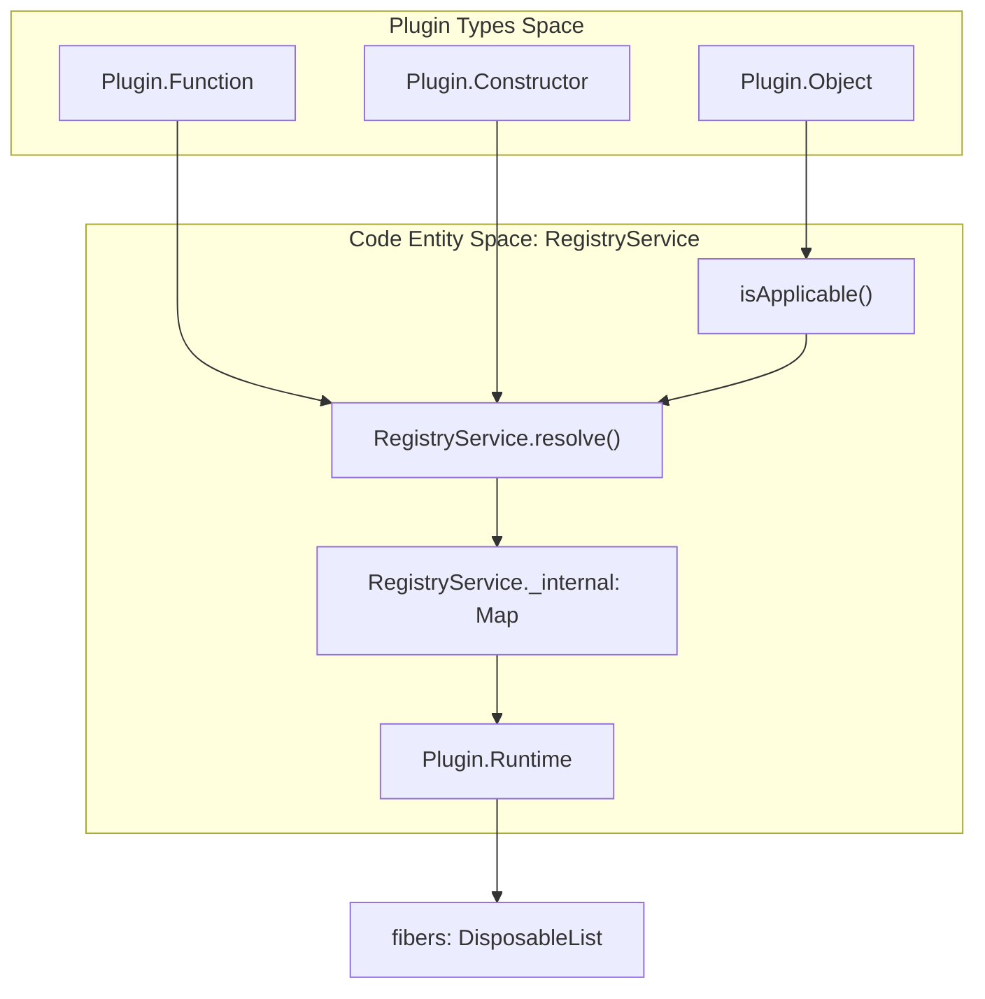
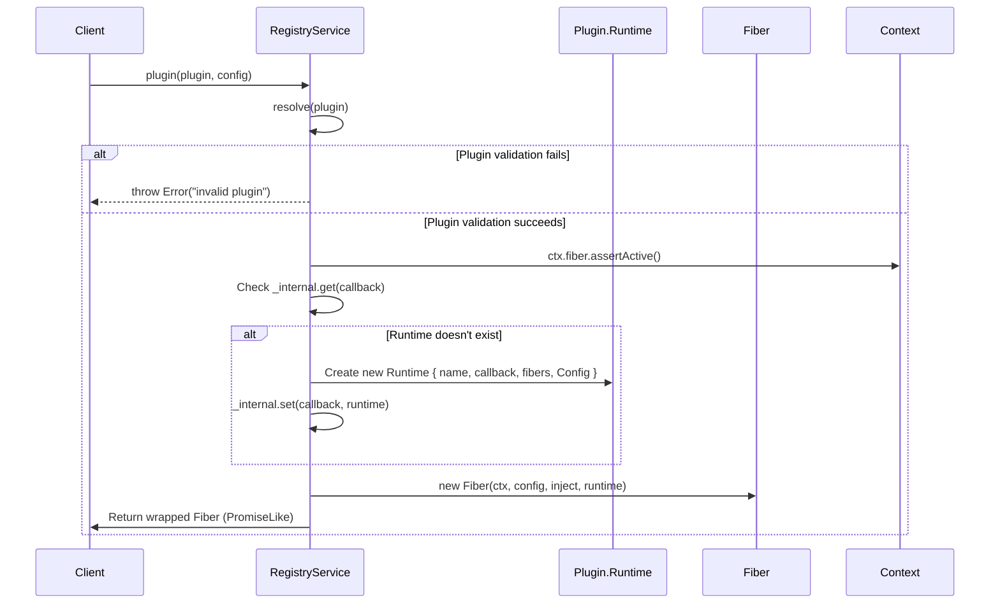
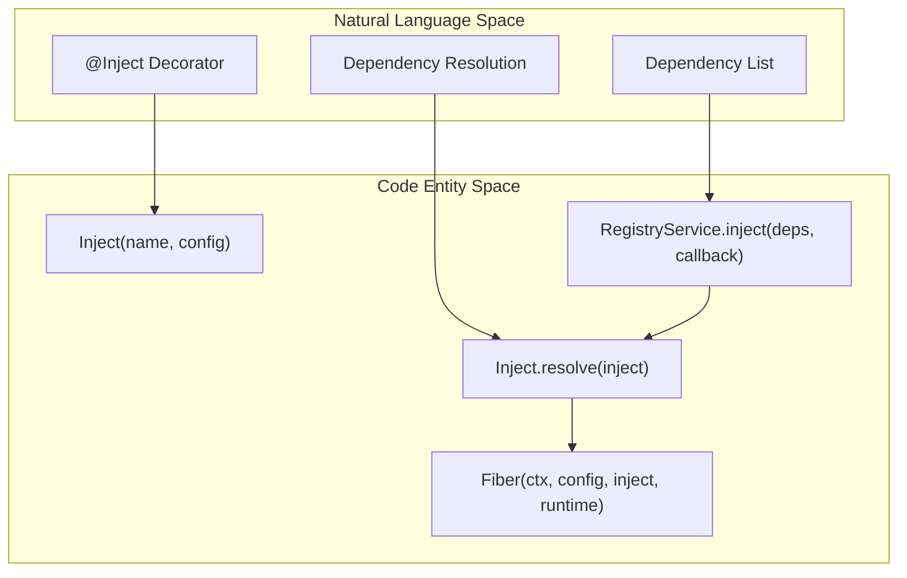
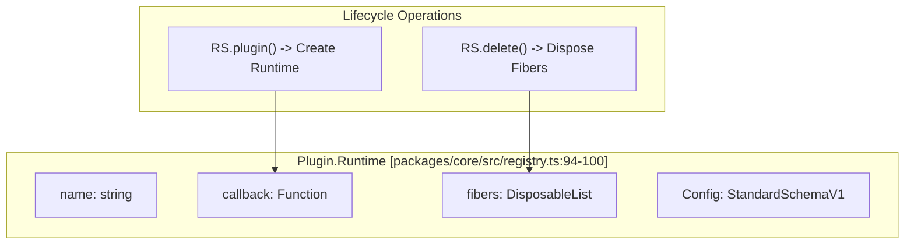

# Registry Service

Relevant source files

The following files were used as context for generating this wiki page:

- [packages/core/src/registry.ts](packages/core/src/registry.ts)
- [packages/core/tests/decorator.spec.ts](packages/core/tests/decorator.spec.ts)

The Registry Service is the core component responsible for managing plugin registration, dependency injection, and plugin lifecycle coordination within the Cordis framework. It maintains an internal registry of active plugins, handles plugin resolution and validation, and orchestrates the creation of `Fiber` instances that manage plugin execution states.

For information about the actual plugin execution and lifecycle states, see [Fiber Lifecycle](4.2). For details about the base `Service` class that many plugins extend, see [Service Pattern](4.3).

## Core Components

The Registry Service operates through several key components that work together to manage the plugin ecosystem:

### Plugin Types and Resolution

The Registry Service supports three distinct plugin types, each with different invocation patterns but unified through a common resolution mechanism:

Sources: [packages/core/src/registry.ts:63-92](), [packages/core/src/registry.ts:144-150](), [packages/core/src/registry.ts:127-127]()

### Registry Service Structure

The `RegistryService` class maintains the central registry and provides methods for plugin management. It tracks the number of registered plugins and manages their associated `Plugin.Runtime` metadata.

| Property/Method | Type | Description |
|-----------------|------|-------------|
| `_internal` | `Map<Function, Plugin.Runtime>` | Internal storage mapping plugin callbacks to their runtime state. [packages/core/src/registry.ts:127-127]() |
| `counter` | `number` | Incremental counter used for unique identification. [packages/core/src/registry.ts:136-138]() |
| `size` | `number` | Returns the number of unique plugins registered. [packages/core/src/registry.ts:140-142]() |
| `resolve(plugin)` | `Function` | Extracts the executable function (the "callback") from a plugin. [packages/core/src/registry.ts:144-150]() |
| `plugin(plugin, config)` | `Fiber` | The primary entry point for registering a plugin instance. [packages/core/src/registry.ts:193-213]() |

Sources: [packages/core/src/registry.ts:125-214]()

## Plugin Registration Process

The registration process involves multiple steps to validate, resolve, and initialize plugins within the framework.

### Registration Flow

Sources: [packages/core/src/registry.ts:193-213]()

### Plugin Resolution Logic

The resolution process determines how different plugin types are handled. If a plugin is a function, it is used directly. If it is an object with an `apply` method, that method is used as the entry point.

| Plugin Input | Resolved Callback |
|--------------|-------------------|
| `function myPlugin(ctx) {}` | `myPlugin` |
| `class MyPlugin { constructor(ctx) {} }` | `MyPlugin` |
| `{ apply: (ctx) => {} }` | `plugin.apply` |

Sources: [packages/core/src/registry.ts:7-9](), [packages/core/src/registry.ts:144-150]()

## Dependency Injection Integration

The Registry Service integrates closely with Cordis's dependency injection system through the `Inject` decorator and resolution mechanism.

### Inject Decorator System

The `@Inject` decorator allows classes or methods to declare dependencies on specific services. When used on a class, it modifies the `inject` property of the constructor. When used on a method, it sets up an initialization hook that waits for the dependencies to be available before calling the method.

Sources: [packages/core/src/registry.ts:17-40](), [packages/core/src/registry.ts:43-61](), [packages/core/src/registry.ts:189-191]()

### Inject Resolution Process

The `Inject.resolve` function processes dependency specifications into a normalized dictionary. It handles arrays of strings, simple objects, and prototype-linked injection objects (used by decorators to support inheritance).

*   **Arrays:** `['foo', 'bar']` becomes `{ foo: null, bar: null }`. [packages/core/src/registry.ts:45-48]()
*   **Objects:** `{ foo: config }` is used directly. [packages/core/src/registry.ts:54-58]()
*   **Inheritance:** If `symbols.checkProto` is present, it recursively merges dependencies from the prototype chain. [packages/core/src/registry.ts:49-53]()

## Runtime Management

### Plugin Runtime Structure

Each unique plugin callback is associated with a `Plugin.Runtime` object. While a plugin might be applied multiple times (creating multiple `Fiber` instances), there is only one `Runtime` per unique callback function.

Sources: [packages/core/src/registry.ts:94-100](), [packages/core/src/registry.ts:162-171](), [packages/core/src/registry.ts:199-206]()

### Registry Operations

The Registry Service provides standard collection-like operations for managing the plugin ecosystem.

| Method | Behavior |
|--------|----------|
| `get(plugin)` | Retrieves the `Runtime` associated with the plugin if it exists. [packages/core/src/registry.ts:152-155]() |
| `has(plugin)` | Checks if a plugin is currently registered in the internal map. [packages/core/src/registry.ts:157-160]() |
| `delete(plugin)` | Removes the plugin from the registry and calls `dispose()` on all associated `Fiber` instances. [packages/core/src/registry.ts:162-171]() |
| `inject(deps, cb)`| A convenience method that creates an anonymous plugin with specific dependencies. [packages/core/src/registry.ts:189-191]() |

## Context Integration

The `RegistryService` is exposed via the `Context` class, allowing developers to call `ctx.plugin()` or `ctx.inject()` directly.

1.  **Context.plugin:** Delegates to `registry.plugin`. [packages/core/src/registry.ts:121-121]()
2.  **Context.inject:** Delegates to `registry.inject`. [packages/core/src/registry.ts:120-120]()
3.  **Active Check:** Before creating a fiber, the registry calls `ctx.fiber.assertActive()` to ensure the parent context has not been disposed. [packages/core/src/registry.ts:197-197]()
4.  **Promise Wrapping:** The `plugin()` method returns a `Fiber` wrapped in a `PromiseLike` interface. This allows users to `await ctx.plugin(...)`, which waits for the plugin's `Fiber` to reach an `ACTIVE` or `FAILED` state. [packages/core/src/registry.ts:208-212]()

Sources: [packages/core/src/registry.ts:118-124](), [packages/core/src/registry.ts:193-213]()
