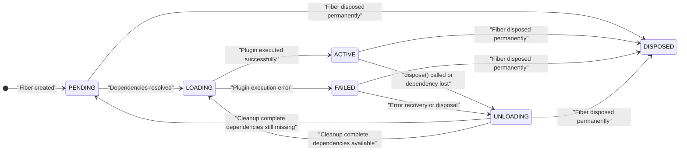
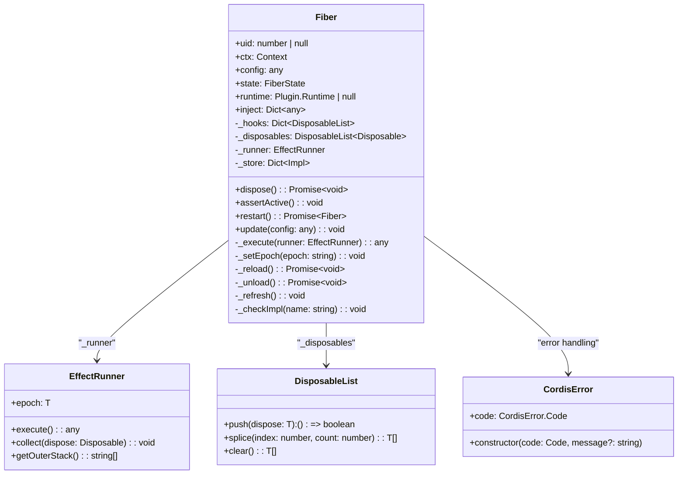
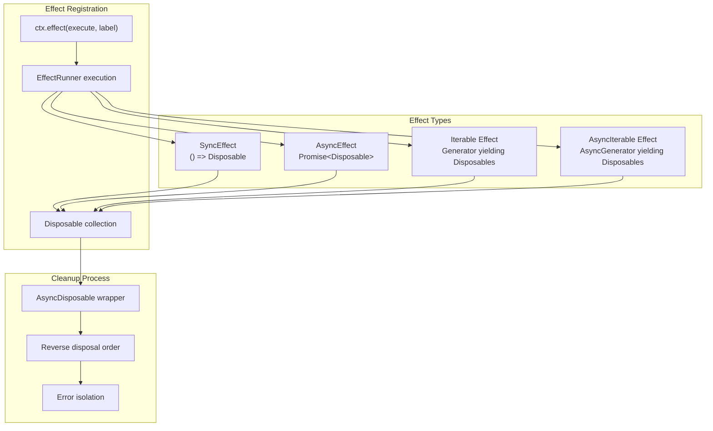
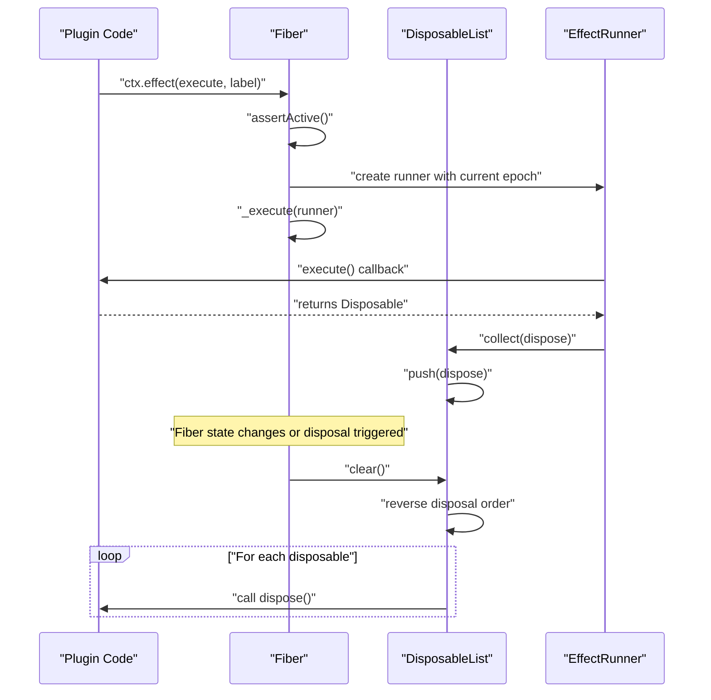
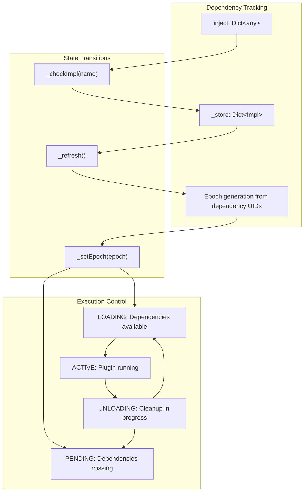
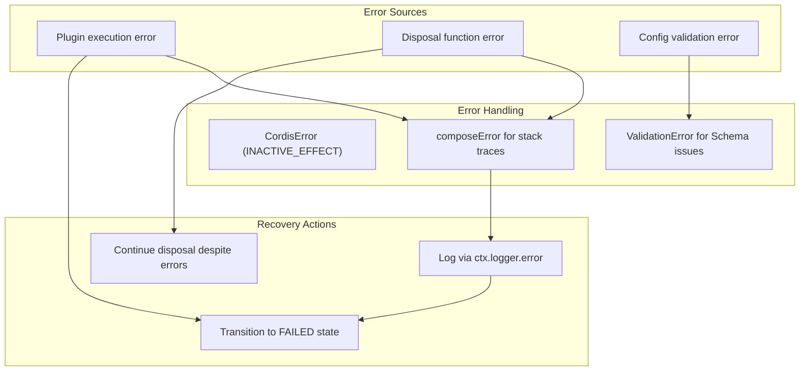
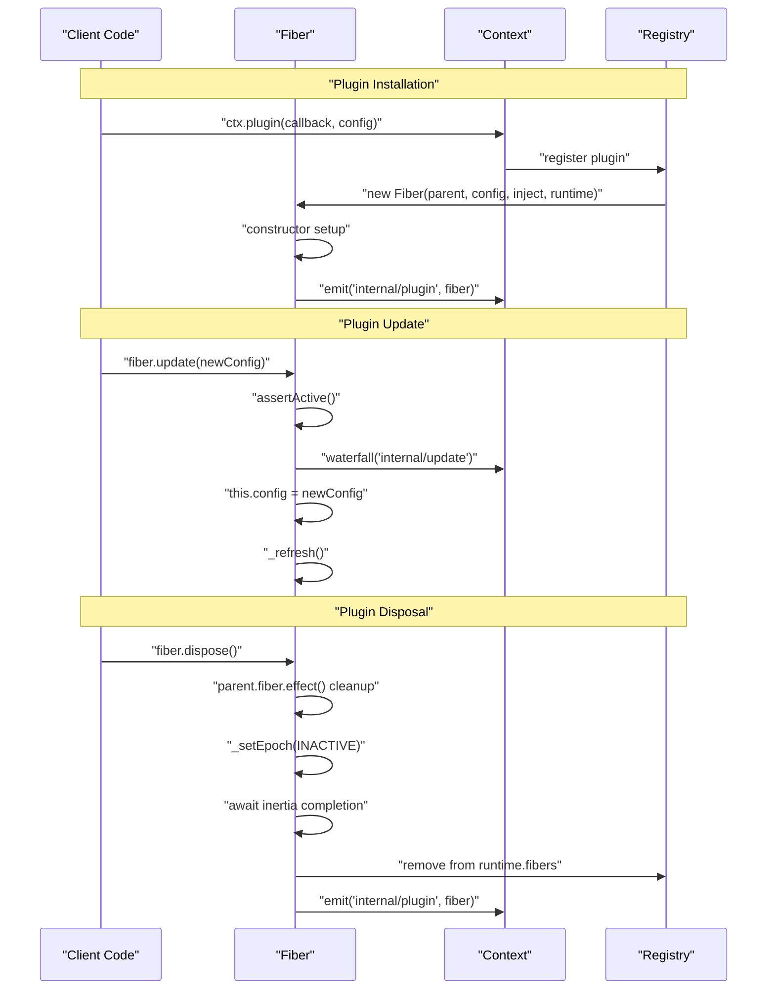

# Fiber Lifecycle

Relevant source files

The following files were used as context for generating this wiki page:

- [packages/core/src/fiber.ts](packages/core/src/fiber.ts)
- [packages/core/tests/dispose.spec.ts](packages/core/tests/dispose.spec.ts)
- [packages/core/tests/fiber.spec.ts](packages/core/tests/fiber.spec.ts)
- [packages/core/tests/invoke.spec.ts](packages/core/tests/invoke.spec.ts)
- [packages/core/tests/plugin.spec.ts](packages/core/tests/plugin.spec.ts)
- [packages/core/tests/reflect.spec.ts](packages/core/tests/reflect.spec.ts)

The Fiber Lifecycle system manages the execution states, resource cleanup, and lifecycle transitions of plugins within the Cordis framework. Each plugin instance is associated with a `Fiber` object that tracks its dependencies, manages its effects, and handles state transitions between loading, active, failed, and disposal states.

## Fiber States

The fiber lifecycle is governed by a state machine with six distinct states, each representing a different phase in a plugin's execution lifecycle.

### State Definitions

| State | Description | Key Characteristics |
|-------|-------------|-------------------|
| `PENDING` | Waiting for required dependencies | No plugin execution, dependency checking active |
| `LOADING` | Dependencies available, plugin executing | Transitional state during plugin startup |
| `ACTIVE` | Plugin successfully loaded and running | Effects registered, service available |
| `FAILED` | Plugin execution encountered an error | Error state, awaiting recovery or disposal |
| `DISPOSED` | Fiber permanently destroyed | Terminal state, no recovery possible |
| `UNLOADING` | Plugin being cleaned up | Transitional state during cleanup |

Sources: [packages/core/src/fiber.ts:78-85]()

## Fiber Class Architecture

The `Fiber` class serves as the central orchestrator for plugin lifecycle management, integrating dependency tracking, effect management, and state transitions.

### Core Fiber Components

Sources: [packages/core/src/fiber.ts:103-121](), [packages/core/src/fiber.ts:71-76](), [packages/core/src/fiber.ts:87-91](), [packages/core/src/utils.ts:52-54]()

## Effect System

The effect system provides a structured approach to resource management, allowing plugins to register cleanup functions and manage their lifecycle dependencies.

### Effect Types and Patterns

### Effect Execution Flow

The effect system supports multiple execution patterns to accommodate different resource management needs:

| Pattern | Use Case | Implementation |
|---------|----------|---------|
| **Synchronous Return** | Simple cleanup functions | `typeof effect === 'function'` [packages/core/src/fiber.ts:240-243]() |
| **Asynchronous Return** | Async resource initialization | `effect instanceof Promise` [packages/core/src/fiber.ts:244-247]() |
| **Generator Yield** | Multiple related resources | `Symbol.iterator in effect` [packages/core/src/fiber.ts:248-261]() |
| **Async Generator** | Streaming resource management | `Symbol.asyncIterator in effect` [packages/core/src/fiber.ts:262-277]() |

Sources: [packages/core/src/fiber.ts:54-65](), [packages/core/src/fiber.ts:229-281](), [packages/core/tests/dispose.spec.ts:6-240]()

## Disposable Pattern

The disposable pattern ensures predictable cleanup of resources when plugins are unloaded or when the application shuts down.

### Disposable Management

Sources: [packages/core/src/fiber.ts:129-131](), [packages/core/src/fiber.ts:229-281](), [packages/core/src/fiber.ts:405-426]()

## Dependency Management

Fibers track their dependencies through the `inject` system and automatically transition states based on service availability.

### Dependency Resolution Flow

The dependency system uses epochs (strings composed of dependency UIDs) to determine when a fiber should reload or unload. If any required service is missing, the epoch is set to an empty string, causing the fiber to transition to `PENDING`. [packages/core/src/fiber.ts:340-353]()

Sources: [packages/core/src/fiber.ts:326-339](), [packages/core/src/fiber.ts:340-353](), [packages/core/src/fiber.ts:355-369]()

## Error Handling

The fiber system provides comprehensive error handling during plugin execution, configuration validation, and disposal phases.

### Error Management Strategy

| Error Type | Handler | Recovery Strategy |
|------------|---------|------------------|
| **Plugin Execution** | `_reload()` try-catch | Transition to `FAILED` state, log error [packages/core/src/fiber.ts:382-390]() |
| **Disposal Errors** | `_unload()` catch | Log error via `ctx.logger.error`, continue cleanup [packages/core/src/fiber.ts:417-422]() |
| **Config Validation** | `resolveConfig()` | Throw `ValidationError` with issue paths [packages/core/src/fiber.ts:34-46]() |
| **Inactive Context** | `assertActive()` check | Throw `CordisError('INACTIVE_EFFECT')` [packages/core/src/fiber.ts:224-227]() |

Sources: [packages/core/src/fiber.ts:16-28](), [packages/core/src/fiber.ts:87-91](), [packages/core/src/fiber.ts:371-391](), [packages/core/tests/fiber.spec.ts:65-105]()

## Lifecycle Operations

The fiber provides several key operations for managing the plugin lifecycle programmatically.

### Core Lifecycle Methods

### Lifecycle Method Reference

| Method | Purpose | Returns | Key Behavior |
|--------|---------|---------|--------------|
| `dispose()` | Clean shutdown of fiber | `Promise<void>` | Sets uid to null, cleans up effects, clears registry entry if last fiber [packages/core/src/fiber.ts:179-198]() |
| `restart()` | Reload plugin with current config | `Promise<Fiber>` | Forces a `_refresh()` cycle [packages/core/src/fiber.ts:431-439]() |
| `update(config)` | Update config and restart | `void` | Emits update waterfall, then calls `_refresh()` [packages/core/src/fiber.ts:441-449]() |
| `assertActive()` | Verify fiber is active | `void` | Throws if fiber is already disposed [packages/core/src/fiber.ts:224-227]() |

Sources: [packages/core/src/fiber.ts:170-199](), [packages/core/src/fiber.ts:431-458](), [packages/core/tests/plugin.spec.ts:145-163]()
