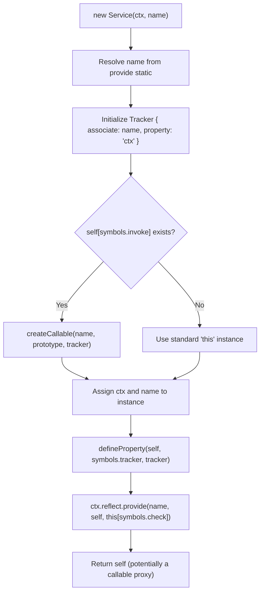
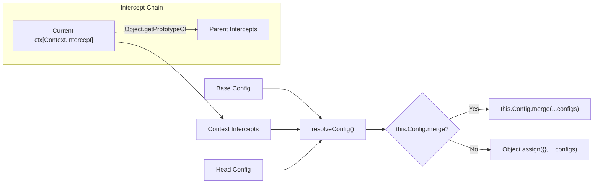
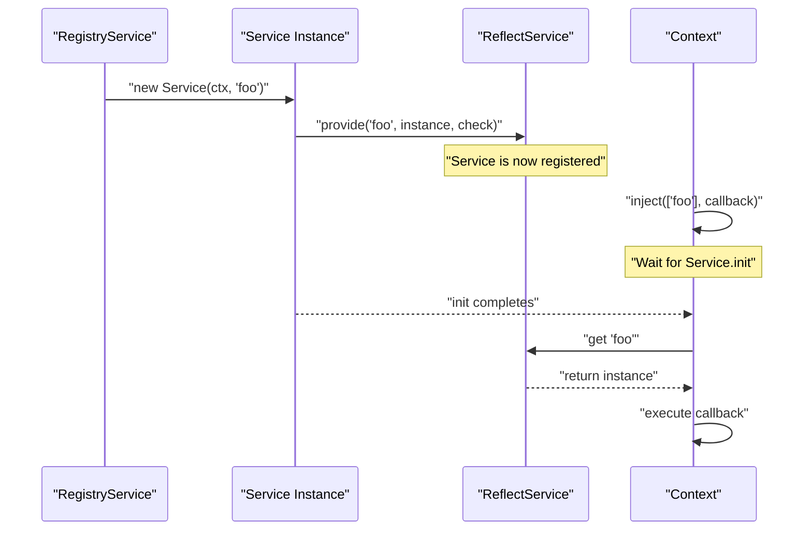

# Service Pattern

<details>
<summary>Relevant source files</summary>

The following files were used as context for generating this wiki page:

- [packages/core/src/service.ts](packages/core/src/service.ts)
- [packages/core/tests/service.spec.ts](packages/core/tests/service.spec.ts)
- [packages/utils/readme.md](packages/utils/readme.md)
- [packages/utils/src/index.ts](packages/utils/src/index.ts)
- [packages/utils/tsconfig.json](packages/utils/tsconfig.json)

</details>


The Service Pattern in Cordis provides the foundational base class for creating modular, configurable components that integrate seamlessly with the framework's dependency injection and lifecycle management systems. Services serve as the primary building blocks for extensible applications, offering standardized initialization, configuration resolution, and resource management capabilities.

For information about how services are registered and managed by the framework, see [Registry Service](#4.1). For details about service lifecycle management, see [Fiber Lifecycle](#4.2).

## Service Base Class

The `Service` class is an abstract base class that defines the contract and common functionality for all service implementations in Cordis. It provides integration points with the `Context` system, dependency injection, and configuration management.

### Core Structure

```mermaid
classDiagram
    class Service {
        <<abstract>>
        +static init: symbol
        +static check: symbol
        +static config: symbol
        +static invoke: symbol
        +static extend: symbol
        +static tracker: symbol
        +static resolveConfig: symbol
        +name: string
        +ctx: Context
        +constructor(ctx, name)
        +filter(ctx): boolean
        +extend(props): Service
        +resolveConfig(base, head): T
    }
    
    class Context {
        +reflect: ReflectService
        +isolate: object
        +intercept: object
    }
    
    Service --> Context : "protected ctx"
    Service --> "symbols" : "uses static symbols"
```

The `Service` class defines several key static symbols that control different aspects of service behavior:

| Symbol | Purpose |
|--------|---------|
| `Service.init` | Asynchronous initialization method used to block dependency resolution until setup is complete. |
| `Service.check` | Dependency availability checker passed to the reflection system. |
| `Service.config` | Configuration schema or current configuration instance. |
| `Service.invoke` | Marks service as callable, triggering `createCallable` in constructor. |
| `Service.extend` | Service extension mechanism for creating derived instances. |
| `Service.tracker` | Object traceability information for identifying context associations. |
| `Service.resolveConfig` | Configuration resolution logic involving the interception chain. |

**Sources:** [packages/core/src/service.ts:5-15]()

### Service Construction

When a service is instantiated, the constructor performs several critical setup operations to ensure the instance is correctly tracked and registered within the context hierarchy.



1. **Name Resolution**: The service name is determined from the constructor parameter or falls back to the static `provide` property [packages/core/src/service.ts:18-19]().
2. **Tracker Creation**: A `Tracker` object is created to facilitate object traceability, specifically marking the `ctx` property as the associated context [packages/core/src/service.ts:22-25]().
3. **Callable Services**: If the service has the `symbols.invoke` symbol, it is transformed into a callable function while maintaining its prototype chain [packages/core/src/service.ts:26-28]().
4. **Registration**: The service registers itself with the `ReflectService` via `ctx.reflect.provide`, making it available for dependency injection [packages/core/src/service.ts:33]().

**Sources:** [packages/core/src/service.ts:18-35]()

## Service Lifecycle

Services participate in a sophisticated lifecycle managed by the Cordis framework, with several key phases and integration points.

### Initialization and Dependencies

Services can define dependencies using static properties and implement asynchronous initialization that delays the availability of the service to other components.

- **Static Dependencies**: The `static inject` property lists required service names [packages/core/tests/service.spec.ts:38](), [packages/core/tests/service.spec.ts:134]().
- **Initialization**: The `Service.init` method performs asynchronous setup. If defined, `inject` callbacks for this service are blocked until the promise returned by `init` resolves [packages/core/tests/service.spec.ts:13-17](), [packages/core/tests/service.spec.ts:26-34]().
- **Dependency Checking**: The `Service.check` method (associated with `symbols.check`) validates dependency availability [packages/core/src/service.ts:33]().

**Sources:** [packages/core/tests/service.spec.ts:7-34](), [packages/core/tests/service.spec.ts:133-164]()

### Configuration Resolution

The `Service` class provides a `resolveConfig` mechanism that merges configurations from the context's interception chain.



The resolution process iterates through the `ctx[Context.intercept]` prototype chain, collecting configuration fragments associated with the service's name [packages/core/src/service.ts:52-59](). It then merges these with optional `base` and `head` configurations [packages/core/src/service.ts:60-66]().

**Sources:** [packages/core/src/service.ts:51-67]()

## Service Integration

Services are tightly integrated with Cordis's core systems, particularly the `Context` and dependency injection mechanisms.

### Context Integration and Isolation

Services integrate with contexts through several mechanisms:

- **Service Provision**: Services register themselves with `ctx.reflect.provide()` [packages/core/src/service.ts:33]().
- **Isolation Filtering**: The `[symbols.filter](ctx)` method ensures services operate within correct isolation boundaries by comparing the isolation symbols in the target context against the service's home context [packages/core/src/service.ts:37-39]().

**Sources:** [packages/core/src/service.ts:33](), [packages/core/src/service.ts:37-39]()

### Dependency Injection

Services participate in Cordis's dependency injection system both as providers and consumers. A service instance can access other services via `this.ctx` [packages/core/tests/service.spec.ts:45-49]().



**Sources:** [packages/core/tests/service.spec.ts:36-74]()

## Advanced Features

### Callable Services and Extension

Services can be made callable or extended to create specialized instances:

- **Callable Wrapping**: If `symbols.invoke` is present, the constructor returns a proxy created via `createCallable` [packages/core/src/service.ts:26-28]().
- **Service Extension**: The `[symbols.extend]` method creates a new object inheriting from the service (or a new callable if the service is callable) and assigns new properties to it [packages/core/src/service.ts:41-49]().

**Sources:** [packages/core/src/service.ts:26-28](), [packages/core/src/service.ts:41-49]()

### Instance Checking

The `Service` class implements a custom `Symbol.hasInstance` to correctly identify service instances even when they are wrapped in proxies or exist across different prototype chains. It traverses the constructor prototype chain to find a match [packages/core/src/service.ts:69-79]().

**Sources:** [packages/core/src/service.ts:69-79]()

### Traceable Utilities

Utilities like the `List` class leverage service-level tracking. By defining `Service.tracker` on the utility instance, operations like `List.push` can be automatically wrapped in `ctx.effect` to ensure clean resource disposal when the associated context is destroyed [packages/utils/src/index.ts:8-21]().

**Sources:** [packages/utils/src/index.ts:4-21]()
