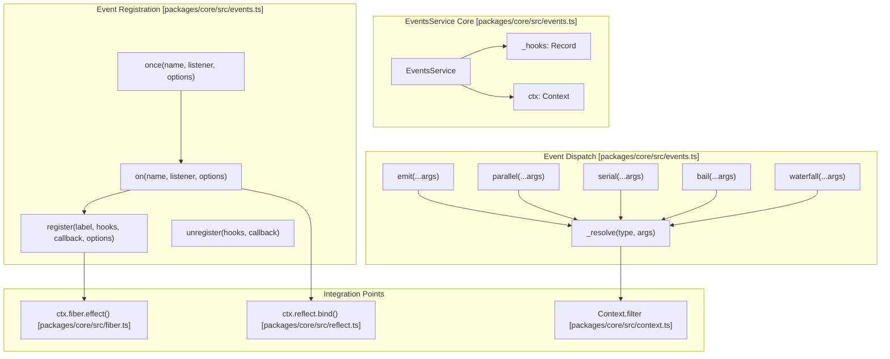
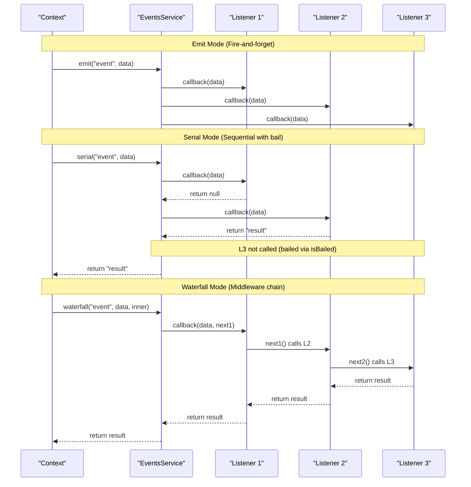
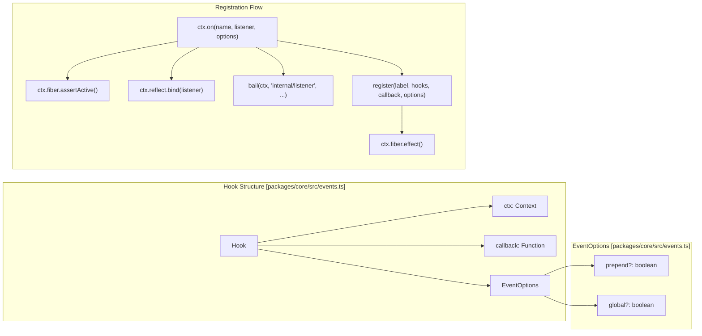
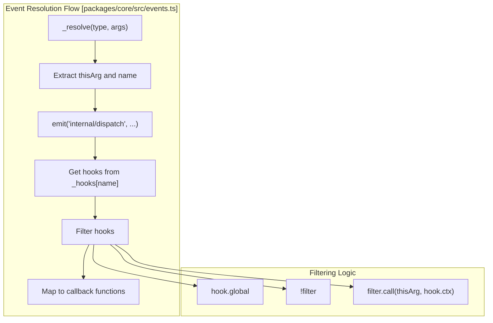

# Event System

Relevant source files

The following files were used as context for generating this wiki page:

- [packages/core/src/events.ts](packages/core/src/events.ts)
- [packages/core/tests/events.spec.ts](packages/core/tests/events.spec.ts)

The Event System provides publish-subscribe communication capabilities within the Cordis framework. It enables loosely coupled communication between components through a centralized event bus managed by the `EventsService` class. The system supports multiple dispatch modes for different event handling patterns and integrates seamlessly with the Context system and Fiber lifecycle management.

For information about the broader Context system that hosts the Event System, see [Context System](). For details about plugin lifecycle management that interacts with events, see [Fiber Lifecycle]().

## EventsService Architecture

The `EventsService` class serves as the central event bus for all Cordis contexts. It maintains event hooks, handles event registration and dispatch, and provides multiple execution modes for different event handling patterns.

Title: EventsService Logic and Entity Space

Sources: [packages/core/src/events.ts:45-167]()

## Dispatch Modes

The Event System supports five distinct dispatch modes, each serving different communication patterns. The system uses the `isBailed` utility to determine if a return value should stop execution in `serial` and `bail` modes (defined as not being `null`, `false`, or `undefined` [packages/core/src/events.ts:6-8]()).

| Mode | Method | Execution | Return Value | Use Case |
|------|--------|-----------|--------------|----------|
| `emit` | `emit()` | Synchronous, all listeners | `void` | Fire-and-forget notifications |
| `parallel` | `parallel()` | Asynchronous, concurrent | `Promise<void>` | Independent async operations; throws `AggregateError` on failure |
| `serial` | `serial()` | Asynchronous, sequential | `Promise<result>` | Ordered processing with early exit via `isBailed` |
| `bail` | `bail()` | Synchronous, sequential | `result` | Synchronous processing with early exit via `isBailed` |
| `waterfall` | `waterfall()` | Synchronous/Asynchronous | `result` | Middleware-style processing using a `next` callback |

Title: Dispatch Execution Flow

Sources: [packages/core/src/events.ts:14](), [packages/core/src/events.ts:89-126](), [packages/core/src/events.ts:6-8]()

## Event Registration and Hooks

Events are registered through the `on()` and `once()` methods, which create `Hook` objects stored in the `_hooks` registry. Each hook contains context information and callback references. Registration is lifecycle-aware and requires the fiber to be active [packages/core/src/events.ts:150]().

Title: Registration and Hook Entity Space

Sources: [packages/core/src/events.ts:35-43](), [packages/core/src/events.ts:128-158]()

## Internal Events

The Event System defines a set of internal events that enable system-level communication and monitoring. These events are often prefixed with `internal/`.

| Event | Purpose | Parameters | Context |
|-------|---------|------------|---------|
| `internal/plugin` | Plugin lifecycle notifications | `fiber: Fiber` | System |
| `internal/status` | Fiber state changes | `fiber: Fiber, oldValue: FiberState` | System |
| `internal/service` | Service registration | `name: string, value: any` | Context |
| `internal/update` | Configuration updates | `config: any, noSave: boolean, next: () => void` | Fiber |
| `internal/get` | Property access interception | `ctx: Context, name: string, error: Error, next: () => any` | System |
| `internal/set` | Property modification interception | `ctx: Context, name: string, value: any, error: Error, next: () => boolean` | System |
| `internal/listener` | Event listener registration | `name: string, listener: any, options: EventOptions` | Context |
| `internal/dispatch` | Event dispatch monitoring | `type: string, name: string, args: any[], thisArg: any` | System |

Sources: [packages/core/src/events.ts:169-176](), [packages/core/src/events.ts:75-77]()

## Context Integration

### Event Filtering and Scope

Events can be filtered based on context relationships using the `Context.filter` mechanism. The `_resolve` method handles this logic, checking if a listener's context is compatible with the dispatching context [packages/core/src/events.ts:72-81]().

Sources: [packages/core/src/events.ts:72-81]()

### Fiber Lifecycle Integration

Event listeners are automatically managed through the Fiber lifecycle system. When a context becomes inactive, its event listeners are automatically disposed of through the effect system via `ctx.fiber.effect()` [packages/core/src/events.ts:130-134]().

The `internal/update` event receives special handling in the constructor. Listeners for `internal/update` that are not global are stored in the Fiber's own `_hooks` collection (a `DisposableList`) rather than the global `EventsService._hooks` [packages/core/src/events.ts:54-60]().

Sources: [packages/core/src/events.ts:54-70](), [packages/core/src/events.ts:128-134]()

### Reflection Integration

Event listeners are bound through the reflection system using `ctx.reflect.bind()` [packages/core/src/events.ts:151](). This ensures that when an event listener is called, its `this` context is correctly set to the context that registered it, allowing access to services and other context-bound properties.

Sources: [packages/core/src/events.ts:151]()
