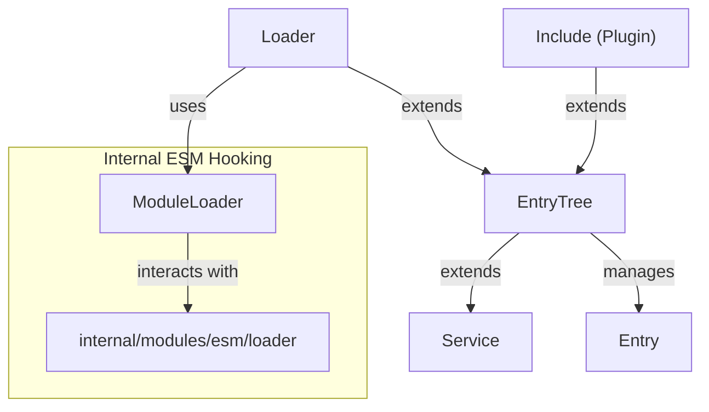
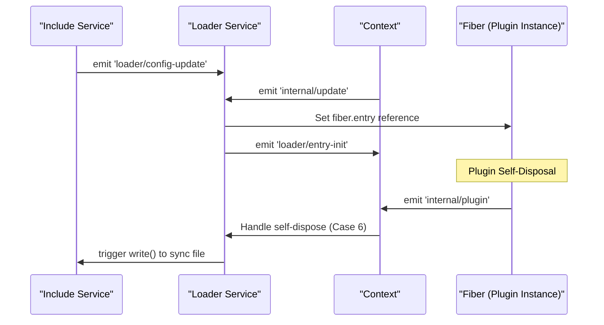
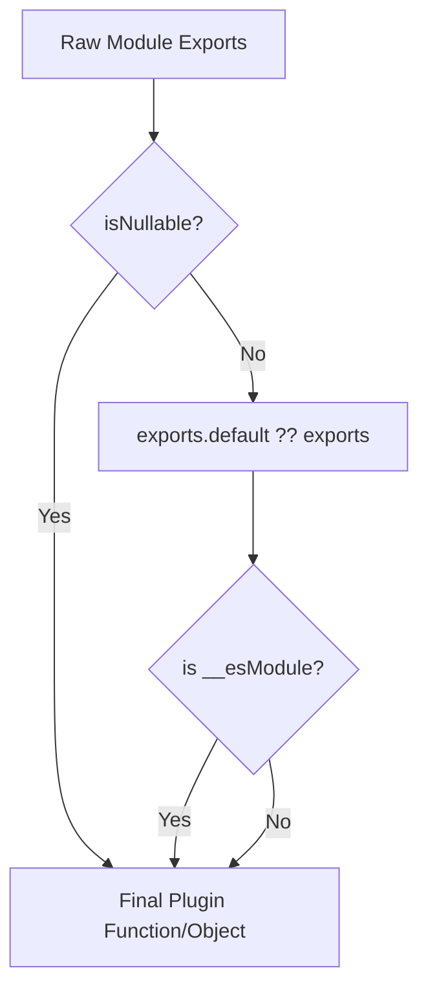
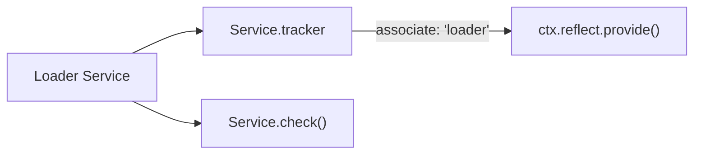
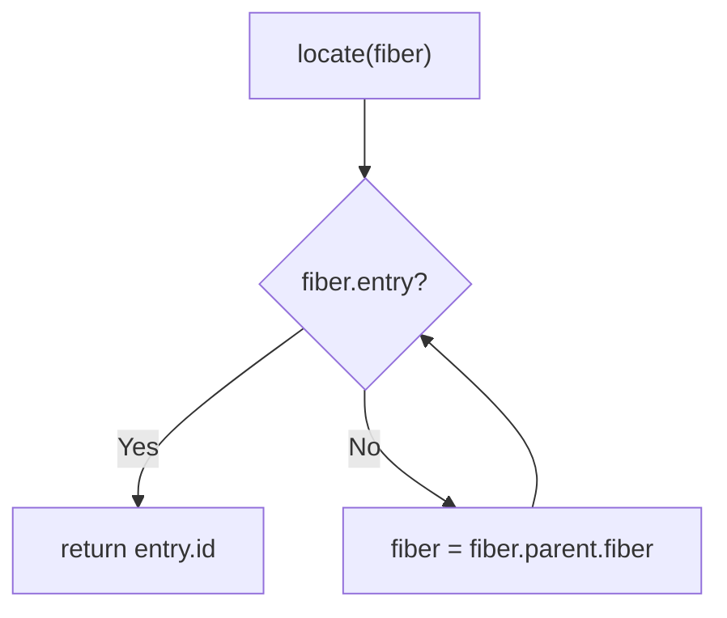

# Plugin Loader

Relevant source files

The following files were used as context for generating this wiki page:

- [packages/hmr/src/index.ts](packages/hmr/src/index.ts)
- [packages/include/src/index.ts](packages/include/src/index.ts)
- [packages/loader/package.json](packages/loader/package.json)
- [packages/loader/src/index.ts](packages/loader/src/index.ts)
- [packages/loader/src/internal.ts](packages/loader/src/internal.ts)

The Plugin Loader is the core system responsible for configuration file management, module resolution, and dynamic plugin loading in Cordis. It serves as the bridge between static configuration files and the runtime plugin system, handling the initialization, updates, and lifecycle management of plugins based on file-based configurations.

For information about the Entry and EntryTree systems that manage hierarchical plugin configurations, see [Entry and EntryTree](#6.1). For Hot Module Replacement functionality, see [Hot Module Replacement](#6.2).

## Purpose and Architecture

The Plugin Loader system is built around the `Loader` class, which extends `EntryTree` to provide configuration-driven plugin management. It coordinates between static configuration files (managed via `Include` plugins) and the dynamic runtime plugin system, enabling declarative plugin orchestration and live configuration updates.

## Loader Service Architecture

**Core Components:**

| Component | Purpose | Key Methods / Properties |
|-----------|---------|-------------|
| `Loader` | Main orchestration class for the root plugin tree. | `locate()`, `unwrapExports()`, `internal` |
| `ModuleLoader` | Provides access to Node.js internal ESM loader hooks for Node 22-24. | `fromInternal()`, `resolveSync()`, `load()` |
| `Include` | Service that loads and watches specific config files (YAML/JSON). | `read()`, `refresh()`, `write()`, `applyPatches()` |
| `Entry` | Individual plugin configuration instance within a tree. | `options`, `update()`, `stop()` |

Sources: [packages/loader/src/index.ts:47-55](), [packages/loader/src/internal.ts:96-123](), [packages/include/src/index.ts:48-68]()

## Event Integration and Lifecycle

The Loader integrates deeply with the Cordis event system to manage plugin lifecycle events and configuration updates. It listens for `internal/update` to sync runtime changes back to the source files and `internal/plugin` to manage the relationship between `Fiber` instances and their configuration `Entry`.

### Event Flow Diagram

### Key Events

| Event | Purpose | Handler Location |
|-------|---------|------------------|
| `'internal/update'` | Syncs runtime config changes back to `Entry` and triggers file write. | [packages/loader/src/index.ts:74-80]() |
| `'internal/plugin'` | Tracks plugin-to-entry mapping and handles automatic disabling on self-dispose. | [packages/loader/src/index.ts:88-124]() |
| `'loader/config-update'` | Broadcasted when a configuration file is modified on disk. | [packages/loader/src/index.ts:18]() |
| `'loader/entry-init'` | Emitted when a new `Entry` is initialized by the loader. | [packages/loader/src/index.ts:19]() |

Sources: [packages/loader/src/index.ts:15-35](), [packages/loader/src/index.ts:74-124]()

## Module Resolution and Loading

The Loader handles module resolution through the `ModuleLoader` component, which wraps Node.js internal ESM loader logic. It supports different Node.js versions (v1 for Node 22/23, v2 for Node 24+) to maintain compatibility with internal loader API changes.

### Module Export Handling

The `unwrapExports()` method ensures compatibility between CommonJS and ESM by extracting the default export when appropriate, specifically handling `__esModule` markers generated by compilers like esbuild.

Sources: [packages/loader/src/index.ts:156-163](), [packages/loader/src/internal.ts:50-94]()

## Service Integration

The Loader is a registered Cordis service. It provides metadata about the environment and utilities for identifying which plugin entry owns a specific context.

### Service Configuration

The service integration includes:
- **Service Tracking**: Uses `Service.tracker` to associate contexts with the loader without shadowing via `noShadow: true`.
- **Service Provision**: Registered via `ctx.reflect.provide('loader', this, this[Service.check])`.
- **Environment Data**: Exposes `envData` (e.g., `startTime`) shared via `process.env.CORDIS_SHARED`.

Sources: [packages/loader/src/index.ts:50-55](), [packages/loader/src/index.ts:66-72](), [packages/loader/src/index.ts:133-137]()

## Runtime Entry Resolution

The Loader provides mechanisms to locate which configuration `Entry` is responsible for a given context or fiber.

### Fiber Entry Resolution

The `locate()` method traverses the fiber hierarchy upwards. This is essential for mapping running plugin instances back to their unique identifiers in configuration files.

Sources: [packages/loader/src/index.ts:144-151]()
