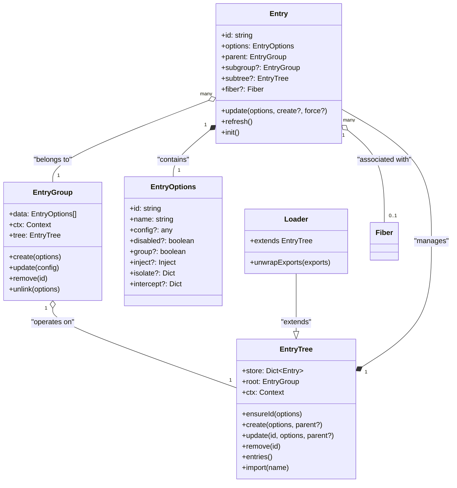
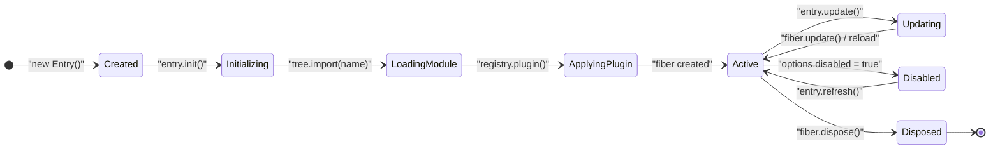
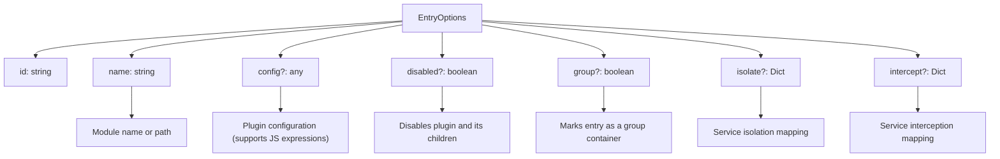
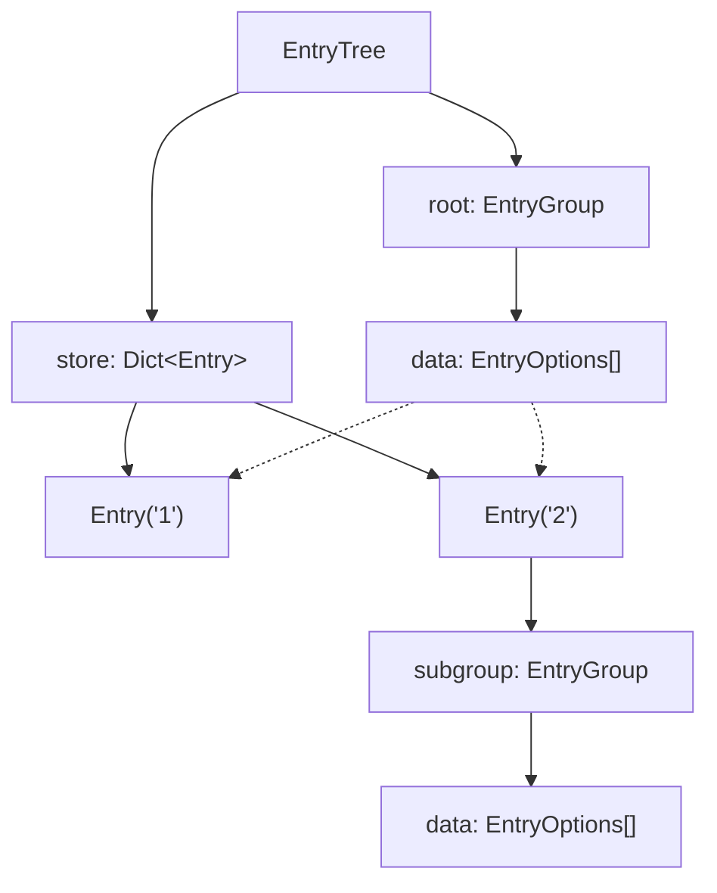

# Entry and EntryTree

Relevant source files

The following files were used as context for generating this wiki page:

- [packages/group/package.json](packages/group/package.json)
- [packages/include/package.json](packages/include/package.json)
- [packages/loader/src/config/entry.ts](packages/loader/src/config/entry.ts)
- [packages/loader/src/config/group.ts](packages/loader/src/config/group.ts)
- [packages/loader/src/config/isolate.ts](packages/loader/src/config/isolate.ts)
- [packages/loader/src/config/tree.ts](packages/loader/src/config/tree.ts)
- [packages/loader/src/config/utils.ts](packages/loader/src/config/utils.ts)
- [packages/loader/tests/group.spec.ts](packages/loader/tests/group.spec.ts)
- [packages/loader/tests/index.spec.ts](packages/loader/tests/index.spec.ts)
- [packages/loader/tests/isolate.spec.ts](packages/loader/tests/isolate.spec.ts)
- [packages/loader/tests/utils.ts](packages/loader/tests/utils.ts)

This document covers the Entry and EntryTree systems within the Cordis plugin loader. These components manage plugin configurations, hierarchical organization, and file-based configuration loading. For information about the broader plugin loading system, see [Plugin Loader](#6). For details about hot module replacement functionality, see [Hot Module Replacement](#6.2).

## Purpose and Scope

The Entry and EntryTree systems form the core data management layer of the Cordis plugin loader. An `Entry` represents a single plugin configuration with its associated metadata, while `EntryTree` provides the hierarchical container that manages collections of entries. Together, they handle configuration persistence, plugin lifecycle coordination, and hierarchical plugin organization through groups.

## System Architecture

### Core Components

Sources: [packages/loader/src/config/entry.ts:34-44](), [packages/loader/src/config/tree.ts:6-19](), [packages/loader/src/config/group.ts:5-13]()

### Entry Lifecycle and State Management

Sources: [packages/loader/src/config/entry.ts:146-173](), [packages/loader/src/config/entry.ts:100-134](), [packages/loader/tests/index.spec.ts:70-95]()

## Entry System

### Entry Structure

The `Entry` class represents a single plugin configuration within the loader system. Each entry contains configuration options, references to its parent group, and an associated fiber for execution management. It extends the context with a unique `Entry.key` symbol [packages/loader/src/config/entry.ts:35-48]().

| Property | Type | Purpose |
|----------|------|---------|
| `id` | `string` | Unique identifier (concatenated with parent IDs using `:`) [packages/loader/src/config/entry.ts:56-62]() |
| `options` | `EntryOptions` | Configuration data including plugin name, config, and flags [packages/loader/src/config/entry.ts:8-15]() |
| `parent` | `EntryGroup` | Reference to containing group [packages/loader/src/config/entry.ts:39]() |
| `subgroup` | `EntryGroup?` | Created if the entry represents a group plugin [packages/loader/src/config/entry.ts:42]() |
| `subtree` | `EntryTree?` | Created if the entry contains a nested configuration tree [packages/loader/src/config/entry.ts:43]() |
| `fiber` | `Fiber?` | Associated execution fiber when the plugin is active [packages/loader/src/config/entry.ts:38]() |

### Entry Options Configuration

The `EntryOptions` interface defines how a plugin is declared in configuration files or memory.

Sources: [packages/loader/src/config/entry.ts:8-15](), [packages/loader/src/config/isolate.ts:5-9](), [packages/loader/src/config/utils.ts:10-20]()

### Entry Operations

Entry instances support several key operations for configuration management:

- **Update**: Modifies entry configuration [packages/loader/src/config/entry.ts:100-134](). If the entry is active, it performs a partial update or full reload. It triggers `loader/patch-context` to update service isolation and interception [packages/loader/src/config/entry.ts:85-92]().
- **Init**: Resolves the plugin module via `tree.import()`, unwraps exports, and registers the plugin into the Cordis registry [packages/loader/src/config/entry.ts:158-172]().
- **Refresh**: Re-initializes a previously disabled entry if it is now enabled [packages/loader/src/config/entry.ts:94-98]().
- **Config Interpolation**: Supports dynamic configuration values using `__jsExpr` which are evaluated in the context of the entry [packages/loader/src/config/utils.ts:10-20]().

Sources: [packages/loader/src/config/entry.ts:100-134](), [packages/loader/src/config/entry.ts:146-173](), [packages/loader/src/config/utils.ts:10-20]()

## EntryTree System

### Tree Structure and Storage

The `EntryTree` class is an abstract base class (extended by `Loader`) that provides the hierarchical container for managing collections of entries. It maintains a flat `store` for quick access by ID [packages/loader/src/config/tree.ts:12]().

Sources: [packages/loader/src/config/tree.ts:6-16](), [packages/loader/src/config/group.ts:8-12]()

### Tree Operations

The EntryTree provides comprehensive CRUD operations for managing plugin configurations:

| Operation | Method | Purpose |
|-----------|--------|---------|
| **Create** | `create(options, parent?, position?)` | Adds a new entry to a specific group and persists changes via `write()` [packages/loader/src/config/tree.ts:76-81](). |
| **Resolve** | `resolve(id)` | Finds an entry by its ID, supporting nested path resolution (e.g., `group:plugin`) [packages/loader/src/config/tree.ts:56-67](). |
| **Update** | `update(id, options, parent?, position?)` | Modifies an entry and optionally moves it between groups [packages/loader/src/config/tree.ts:89-101](). |
| **Remove** | `remove(id)` | Disposes the associated fiber and removes the entry from the tree [packages/loader/src/config/tree.ts:83-87](). |
| **Import** | `import(name, getOuterStack?)` | Resolves plugin modules, supporting `cordis:` built-ins and dynamic imports [packages/loader/src/config/tree.ts:103-120](). |

## Group Hierarchies

### Group Structure

Groups are implemented via `EntryGroup`. A special `Group` plugin (from `@cordisjs/plugin-group`) allows nested configurations to be treated as standard Cordis plugins [packages/loader/src/config/group.ts:73-88]().

- **`EntryGroup`**: The logical container for a list of `EntryOptions` [packages/loader/src/config/group.ts:5-13]().
- **`Group` Plugin**: A service that wraps an `EntryGroup`, reacting to `internal/update` events to synchronize its children [packages/loader/src/config/group.ts:79-81]().

### Service Isolation and Interception

The loader supports advanced service scoping through `isolate` and `intercept` options in `EntryOptions` [packages/loader/src/config/isolate.ts:5-9]().

- **Local Realms**: Created when `isolate[name]` is `true`. The service is scoped strictly to that entry [packages/loader/src/config/isolate.ts:47-55]().
- **Global Realms**: Created when `isolate[name]` is a `string`. Multiple entries can share the same isolated service instance by using the same label [packages/loader/src/config/isolate.ts:57-65]().
- **Context Patching**: When an entry is updated, `loader/patch-context` logic swaps the `Context.isolate` and `Context.intercept` prototypes to reflect the new hierarchy [packages/loader/src/config/isolate.ts:92-149]().

## Integration with Plugin System

### Fiber Association

Each `Entry` maintains a reference to a `Fiber` [packages/loader/src/config/entry.ts:38](). When an entry is initialized, it calls `ctx.registry.plugin()`, which returns a `Fiber` instance [packages/loader/src/config/entry.ts:171](). The entry passes a `getOuterStack` function to provide better error tracing that includes the configuration file location and entry ID [packages/loader/src/config/entry.ts:136-144]().

### Event Integration

The Entry and EntryTree systems emit events to coordinate with other loader components:

- **`loader/entry-init`**: Triggered in the `Entry` constructor. Used by the isolation system to initialize intercept/isolate objects on the context [packages/loader/src/config/entry.ts:49](), [packages/loader/src/config/isolate.ts:87-90]().
- **`loader/patch-context`**: A waterfall event used to apply service isolation, interception, and prototype chain updates before a plugin is applied or updated [packages/loader/src/config/entry.ts:85](), [packages/loader/src/config/isolate.ts:92-149]().
- **`loader/partial-dispose`**: Fired when an entry is removed or disabled, allowing for garbage collection of isolated realms [packages/loader/src/config/isolate.ts:151](), [packages/loader/src/config/group.ts:44]().

Sources: [packages/loader/src/config/entry.ts:49](), [packages/loader/src/config/entry.ts:85](), [packages/loader/src/config/isolate.ts:151](), [packages/loader/src/config/group.ts:44]()
