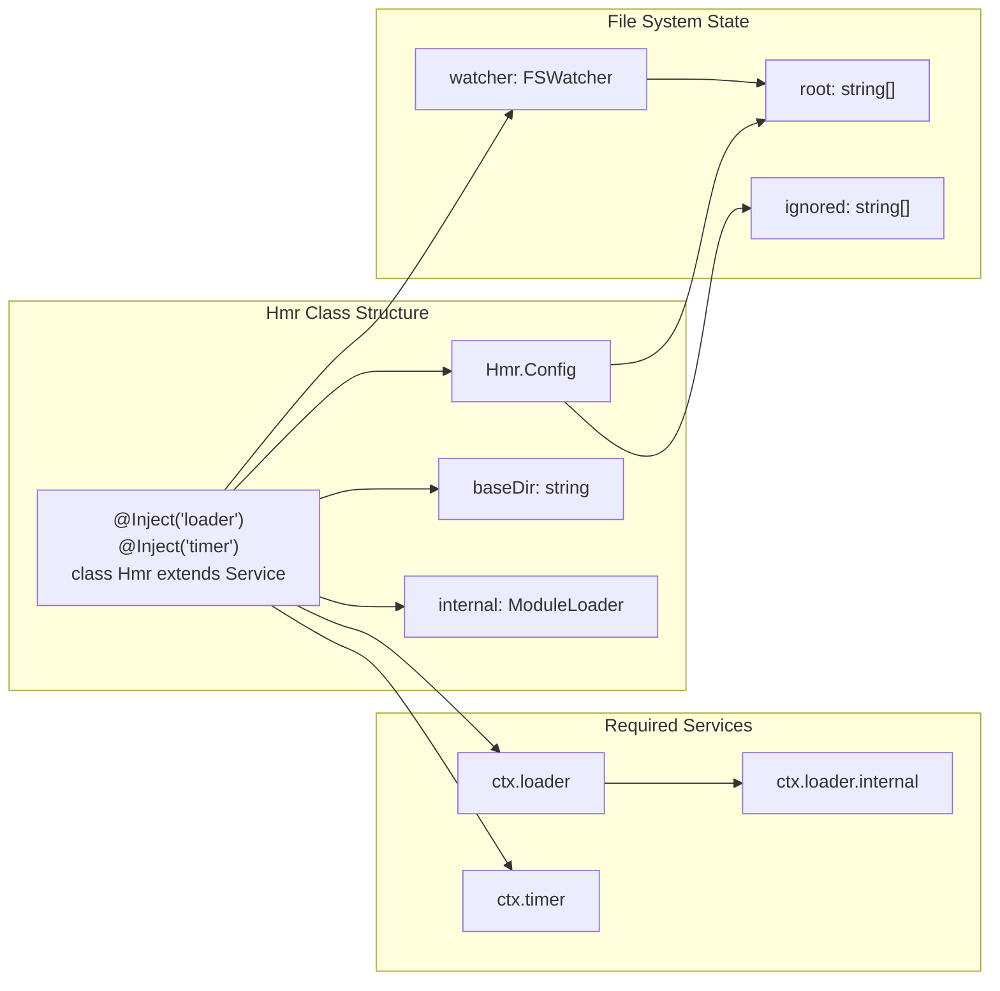
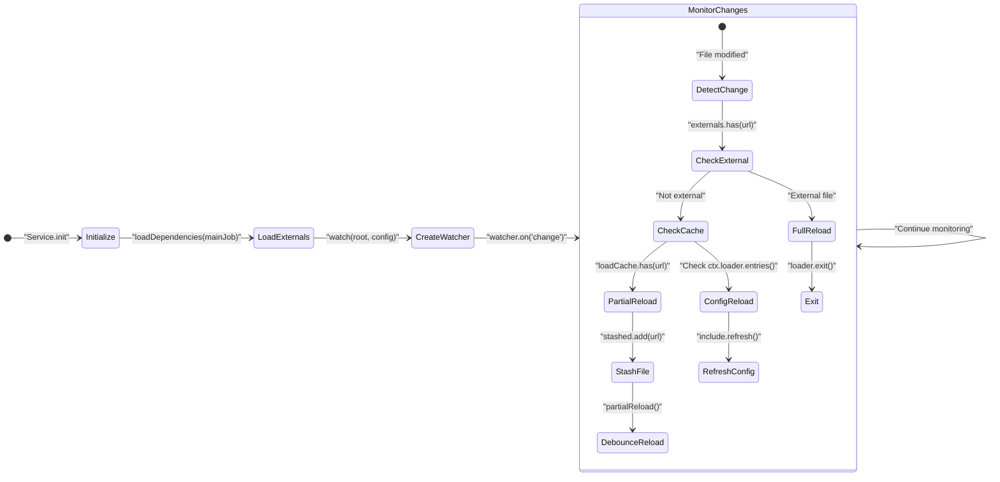
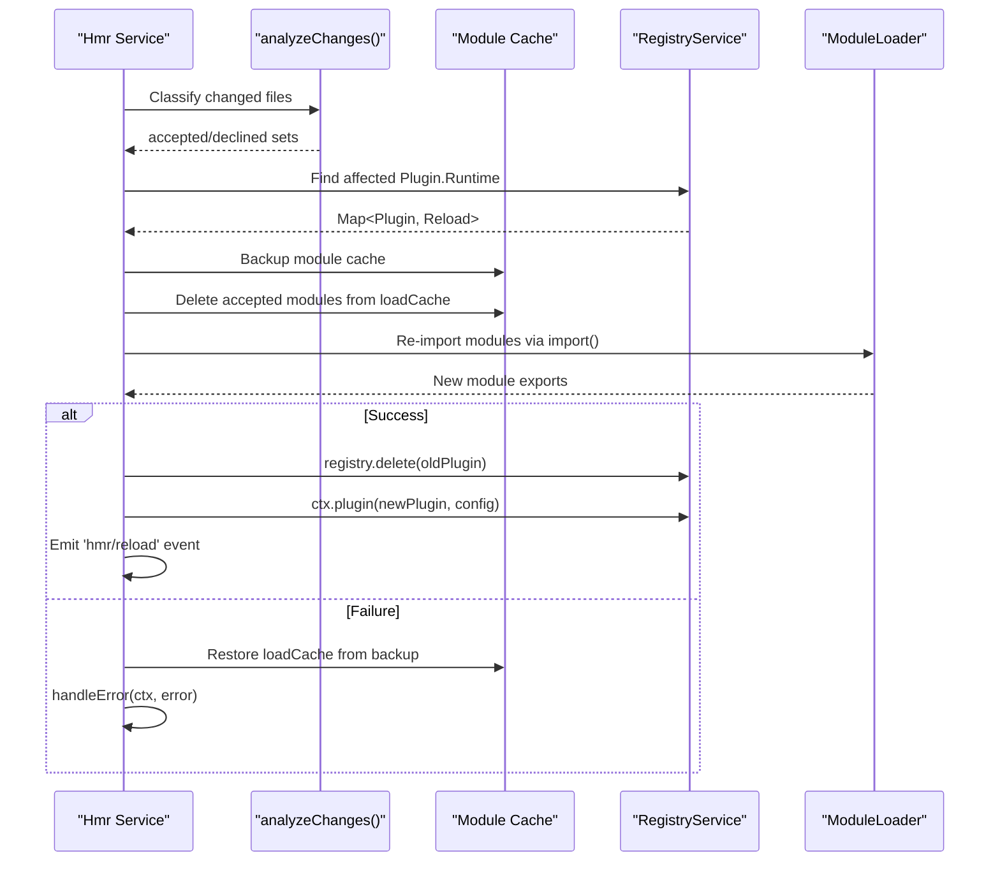

# Hot Module Replacement

<details>
<summary>Relevant source files</summary>

The following files were used as context for generating this wiki page:

- [packages/core/bin.js](packages/core/bin.js)
- [packages/hmr/package.json](packages/hmr/package.json)
- [packages/hmr/src/error.ts](packages/hmr/src/error.ts)
- [packages/hmr/src/index.ts](packages/hmr/src/index.ts)
- [packages/hmr/src/locales/en-US.yml](packages/hmr/src/locales/en-US.yml)
- [packages/hmr/src/locales/zh-CN.yml](packages/hmr/src/locales/zh-CN.yml)
- [packages/hmr/tests/index.spec.ts](packages/hmr/tests/index.spec.ts)
- [packages/include/src/index.ts](packages/include/src/index.ts)
- [packages/loader/src/index.ts](packages/loader/src/index.ts)

</details>


The Hot Module Replacement (HMR) system enables live reloading of plugins during development without restarting the entire application. It monitors file changes, analyzes module dependencies, and selectively reloads only the affected plugins while preserving application state.

For information about the plugin loading system that HMR integrates with, see [Plugin Loader](#6). For details about the service pattern used by HMR, see [Service Pattern](#4.3).

## Architecture Overview

The HMR system is implemented as a service that integrates with the Cordis plugin loader and file system monitoring. It uses dependency analysis to determine which plugins need reloading when files change.

**HMR Service Architecture**

```mermaid
graph TB
    subgraph "HMR Service"
        HMRService["Hmr"]
        Watcher["FSWatcher (chokidar)"]
        DepAnalyzer["loadDependencies()"]
        Classifier["analyzeChanges()"]
        ReloadManager["partialReload()"]
    end
    
    subgraph "File System"
        ConfigFiles["Configuration Files"]
        PluginFiles["Plugin Files"]
        ModuleFiles["Module Dependencies"]
    end
    
    subgraph "Core Services"
        Loader["Loader"]
        Registry["RegistryService"]
        Logger["LoggerService"]
        Timer["TimerService"]
    end
    
    subgraph "Module Cache"
        LoadCache["internal.loadCache"]
        ModuleJobs["ModuleJob instances"]
        Dependencies["Dependency Graph"]
    end
    
    subgraph "Classification Sets"
        Accepted["accepted: Set<string>"]
        Declined["declined: Set<string>"]
        Externals["externals: Set<string>"]
        Stashed["stashed: Set<string>"]
    end
    
    Watcher --> ConfigFiles
    Watcher --> PluginFiles
    Watcher --> ModuleFiles
    
    HMRService --> Watcher
    HMRService --> DepAnalyzer
    HMRService --> Classifier
    HMRService --> ReloadManager
    
    HMRService --> Loader
    HMRService --> Registry
    HMRService --> Logger
    HMRService --> Timer
    
    DepAnalyzer --> LoadCache
    DepAnalyzer --> ModuleJobs
    DepAnalyzer --> Dependencies
    
    Classifier --> Accepted
    Classifier --> Declined
    Classifier --> Externals
    Classifier --> Stashed
    
    ReloadManager --> Registry
    ReloadManager --> LoadCache
```


Sources: [packages/hmr/src/index.ts:1-405](), [packages/loader/src/index.ts:1-164]()

## Service Structure and Dependencies

The `Hmr` class extends `Service` and uses dependency injection to access core Cordis services. It requires the `loader` and `timer` services and must be run in an environment where internal module structures are exposed (via `--expose-internals`).

**HMR Service Dependencies**


Sources: [packages/hmr/src/index.ts:49-85](), [packages/hmr/package.json:33-38]()

## File Monitoring System

The HMR system uses `chokidar` to monitor file changes. It classifies files into three categories: framework externals, cached modules (ESM/CJS), and loader configuration files.

| File Type | Classification | Action |
|-----------|---------------|---------|
| Framework Externals | `externals` set | `loader.exit()` (Full Process Restart) |
| Cached Modules | `stashed` set | `partialReload()` (Plugin HMR) |
| Config Files | `Include` entry | `include.refresh()` (Configuration Reload) |

**File Monitoring Flow**


Sources: [packages/hmr/src/index.ts:97-153](), [packages/include/src/index.ts:187-191]()

## Dependency Analysis

The dependency analysis system traverses the module graph starting from a `ModuleJob`. It skips `node:` built-ins and `node_modules` to focus on user-defined code.

**Module Dependency Analysis**
```mermaid
graph TB
    subgraph "loadDependencies Function"
        TraverseJob["traverse(job: ModuleJob)"]
        CheckIgnored["ignored.has(job.url)"]
        CheckDependencies["dependencies.has(job.url)"]
        CheckNodeModules["job.url.includes('/node_modules/')"]
        AddDependency["dependencies.add(job.url)"]
        GetLinked["await job.linked"]
        RecurseChildren["Promise.all(children.map(traverse))"]
    end
    
    subgraph "Module Job Structure"
        ModuleJob["ModuleJob"]
        JobURL["job.url: string"]
        LinkedJobs["job.linked: Promise<ModuleJob[]>"]
    end
    
    TraverseJob --> CheckIgnored
    TraverseJob --> CheckDependencies
    TraverseJob --> CheckNodeModules
    
    CheckIgnored --> RecurseChildren: "Not ignored"
    CheckDependencies --> RecurseChildren: "Not processed"
    CheckNodeModules --> RecurseChildren: "Not node_modules"
    
    AddDependency --> GetLinked
    GetLinked --> LinkedJobs
    LinkedJobs --> RecurseChildren
```

Sources: [packages/hmr/src/index.ts:31-42](), [packages/hmr/src/index.ts:160-165]()

## Reload Classification System

The `analyzeChanges` method classifies files into `accepted` (to be reloaded) and `declined` (not to be reloaded). A file is accepted if it was directly changed or if any of its dependents are accepted.

**File Classification Algorithm**
```mermaid
graph TD
    subgraph "Classification Sets"
        Accepted["accepted: Set<string>"]
        Declined["declined: Set<string>"]
        Externals["externals: Set<string>"]
        Stashed["stashed: Set<string>"]
    end
    
    subgraph "Classification Process"
        InitSets["Initialize:<br/>accepted = stashed<br/>declined = externals"]
        ProcessPending["Process pending files"]
        IterativeAnalysis["Iterative dependency analysis"]
    end
    
    Stashed --> InitSets
    Externals --> InitSets
    InitSets --> Accepted
    InitSets --> Declined
    
    InitSets --> ProcessPending
    ProcessPending --> IterativeAnalysis
    
    IterativeAnalysis --> Accepted: "Dependent is accepted"
    IterativeAnalysis --> Declined: "All dependents declined"
```

Sources: [packages/hmr/src/index.ts:174-233]()

## Partial Reload Process

The `partialReload` process orchestrates the replacement of old plugin versions with new ones by manipulating the Node.js internal `loadCache`.

**Partial Reload Workflow**


Sources: [packages/hmr/src/index.ts:235-331](), [packages/loader/src/index.ts:88-124]()

## Error Handling and Code Frames

When a reload fails due to a build error (e.g., from `esbuild`), the HMR system uses `@babel/code-frame` to print a formatted error message showing the exact location in the source code.

**Error Handling Implementation**
```mermaid
graph TB
    subgraph "Error Processing"
        HandleError["handleError(ctx, error)"]
        IsBuildFailure["isBuildFailure(error)"]
        CodeFrame["codeFrameColumns()"]
    end
    
    subgraph "Output"
        LoggerWarn["ctx.logger.warn()"]
    end
    
    HandleError --> IsBuildFailure
    IsBuildFailure --> CodeFrame: "If build error"
    CodeFrame --> LoggerWarn
    IsBuildFailure --> LoggerWarn: "If standard error"
```

Sources: [packages/hmr/src/error.ts:1-35]()

## Configuration Schema

The HMR service configuration allows fine-tuning of the watcher behavior and directory resolution.

```typescript
export interface Config extends ChokidarOptions {
  base?: string        // Base directory for relative paths
  root?: string[]      // Files or directories to watch
  ignored?: string[]   // Glob patterns to ignore
  debounce?: number    // Wait time before triggering reload (ms)
}
```

**Default Behavior**
- **Base Directory**: Defaults to `process.cwd()` if not provided [packages/hmr/src/index.ts:84-85]().
- **Ignored Patterns**: Supports glob patterns via `picomatch` [packages/hmr/src/index.ts:108-113]().
- **Debounce**: Consolidates multiple file changes into a single reload event [packages/hmr/src/index.ts:125]().

Sources: [packages/hmr/src/index.ts:334-359](), [packages/hmr/src/locales/en-US.yml:1-4]()
