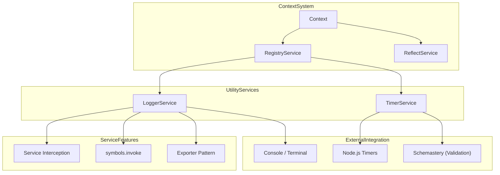
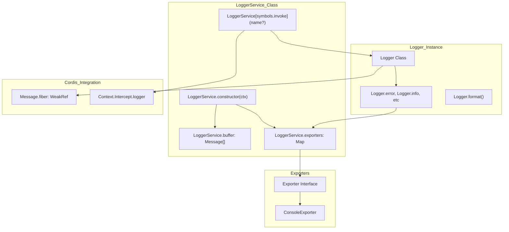

# Utility Services

Relevant source files

The following files were used as context for generating this wiki page:

- [.nycrc.json](.nycrc.json)
- [packages/core/src/logger.ts](packages/core/src/logger.ts)
- [packages/core/tests/logger.spec.ts](packages/core/tests/logger.spec.ts)
- [packages/core/tests/shadow.spec.ts](packages/core/tests/shadow.spec.ts)
- [packages/logger-console/package.json](packages/logger-console/package.json)
- [packages/timer/package.json](packages/timer/package.json)
- [packages/timer/src/index.ts](packages/timer/src/index.ts)
- [packages/timer/tests/index.spec.ts](packages/timer/tests/index.spec.ts)

This document covers the built-in utility services that provide common functionality across Cordis applications. These services extend the core framework with essential capabilities like logging, timing, and other operational features that applications frequently need.

For information about plugin loading and configuration management, see [Plugin Loader](#6). For details about the base Service pattern and lifecycle management, see [Service Pattern](#4.3).

## Overview

Utility services in Cordis are specialized implementations that provide commonly-needed functionality. In the latest architecture, these services are designed to be modular, often consisting of a core service definition and multiple optional exporters or plugins.

The primary utility services include:

| Service | Package | Purpose |
|---------|---------|---------|
| `LoggerService` | `cordis` (core) | Structured logging with multiple exporters and fiber-traceability |
| `TimerService` | `@cordisjs/plugin-timer` | Timing and scheduling functionality |

## Service Architecture

Utility services follow the standard Cordis service pattern, integrating with the context system for dependency injection and lifecycle management.

**Service Integration Architecture**

Sources: [packages/core/src/logger.ts:170-179](), [packages/timer/package.json:1-15]()

## Logger Service Implementation

The `LoggerService` provides structured logging capabilities. It maintains an internal buffer of messages and dispatches them to registered `Exporter` instances.

**Logger Service Architecture**

Sources: [packages/core/src/logger.ts:170-188](), [packages/core/src/logger.ts:226-235](), [packages/core/src/logger.ts:69-125]()

### Exporter Pattern

The logger system is decoupled from the output medium via the `Exporter` interface [packages/core/src/logger.ts:35-41](). 
- **Core Buffer**: By default, `LoggerService` includes a built-in exporter that stores the last 1000 messages in a buffer [packages/core/src/logger.ts:189-201]().
- **Console Output**: The `@cordisjs/plugin-logger-console` package provides a robust `ConsoleExporter` that handles colorization and environment-specific formatting [packages/logger-console/package.json:2-15]().

### Service Invocation and Interception

The `LoggerService` implements `[symbols.invoke]` to allow creating logger instances directly from the context [packages/core/src/logger.ts:226-235](). It automatically resolves the logger name by checking the context's `symbols.intercept` property, allowing for hierarchical configuration of log levels and names [packages/core/src/logger.ts:214-224]().

For details, see [Logger Service](#7.1).

## Timer Service Implementation

The `TimerService` provides a managed way to handle `setTimeout`, `setInterval`, and other scheduling tasks within the Cordis lifecycle. It extends the base `Service` class [packages/timer/src/index.ts:11-15]().

- **Lifecycle Safety**: Timers created through `ctx.timeout()` or `ctx.interval()` are automatically cleared when the context that created them is disposed [packages/timer/src/index.ts:38-39](), [packages/timer/src/index.ts:62-63]().
- **Extended Functionality**: Beyond standard timers, it provides `throttle` and `debounce` utilities that are also tied to the context lifecycle [packages/timer/src/index.ts:117-139]().
- **Async Iteration**: The `interval` method can return an `AsyncIterableIterator`, allowing timers to be used with `for await...of` loops [packages/timer/src/index.ts:64-100]().

For details, see [Timer Service](#7.2).

## Common Service Patterns

Utility services in Cordis often share these implementation traits:

1.  **Callable Services**: Many utilities (like Logger) use `createCallable` so they can be accessed both as a service object (`ctx.logger.exporter()`) and as a function (`ctx.logger('name')`) [packages/core/src/logger.ts:184-188]().
2.  **Module Augmentation**: They extend the `Context` and `Intercept` interfaces to provide type-safe access to their features [packages/core/src/logger.ts:6-10](), [packages/timer/src/index.ts:3-7]().
3.  **Traceability**: They often include metadata about the `Fiber` that triggered the utility action, enabling deep debugging of complex plugin trees [packages/core/src/logger.ts:25-33]().

Sources: [packages/core/src/logger.ts:184-188](), [packages/core/src/logger.ts:6-10](), [packages/timer/src/index.ts:11-15](), [packages/timer/src/index.ts:33-40]()
