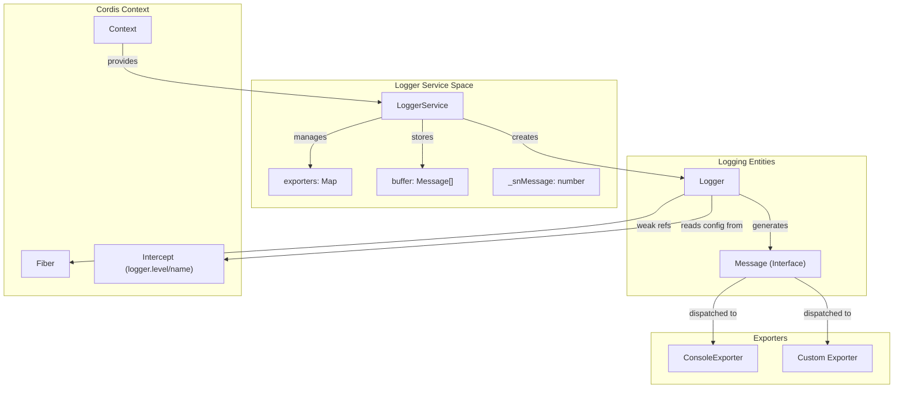
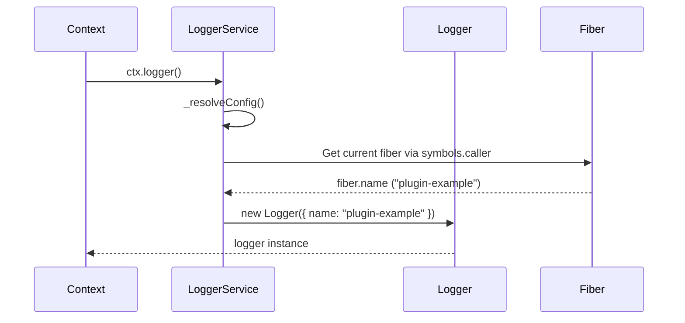
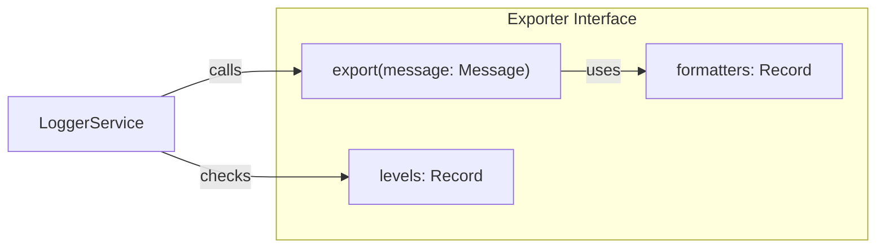
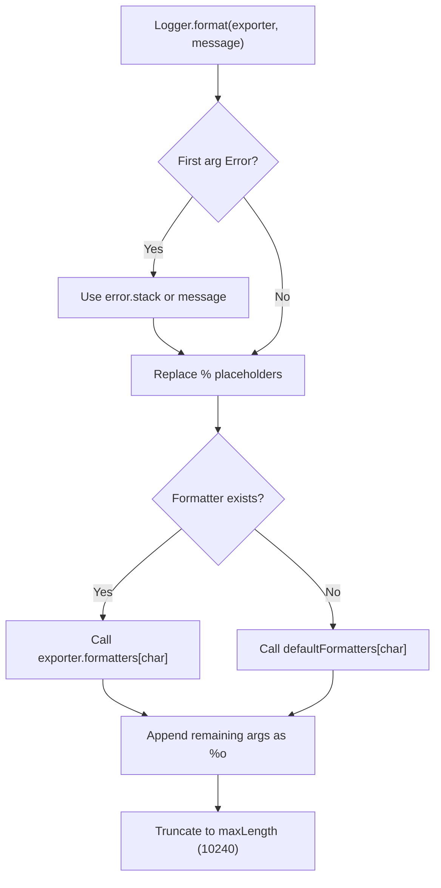

# Logger Service

Relevant source files

The following files were used as context for generating this wiki page:

- [packages/core/src/logger.ts](packages/core/src/logger.ts)
- [packages/core/tests/logger.spec.ts](packages/core/tests/logger.spec.ts)
- [packages/core/tests/shadow.spec.ts](packages/core/tests/shadow.spec.ts)
- [packages/logger-console/package.json](packages/logger-console/package.json)
- [packages/logger-console/src/browser.ts](packages/logger-console/src/browser.ts)
- [packages/logger-console/src/index.ts](packages/logger-console/src/index.ts)
- [packages/logger-console/src/shared.ts](packages/logger-console/src/shared.ts)
- [packages/logger-console/tests/index.spec.ts](packages/logger-console/tests/index.spec.ts)

The Logger Service provides structured logging capabilities for Cordis applications. It manages logger instances, message buffering, and extensible exporters while providing seamless integration with the Cordis context system, plugin lifecycle, and fiber hierarchy.

For information about the broader utility services ecosystem, see [Utility Services](#7). For details about event handling integration, see [Event System](#5).

## Architecture Overview

The Logger Service is implemented as the `LoggerService` class. It manages a collection of `Exporter` objects and provides a factory for `Logger` instances. Unlike typical logging libraries, Cordis loggers are context-aware, automatically deriving their names and metadata from the active `Fiber`.

### Logger System Architecture

Sources: [packages/core/src/logger.ts:170-177](), [packages/core/src/logger.ts:119-125](), [packages/core/src/logger.ts:25-33]()

## Core Components

### LoggerService Class

The `LoggerService` class serves as the central hub. It is a callable service; calling `ctx.logger(name)` returns a new `Logger` instance. It also provides direct logging methods (`info`, `warn`, etc.) which act on a default logger.

Key features include:
- **Message Buffering**: Retains the last 1000 messages by default in `this.buffer` [packages/core/src/logger.ts:171-172]().
- **Exporter Management**: Allows registering output targets via `exporter()`. This registration returns a disposer that is automatically tracked by the context [packages/core/src/logger.ts:206-212]().
- **Context Interception**: Resolves configuration (like log levels) from the context's intercept chain using `_resolveConfig()` [packages/core/src/logger.ts:214-224]().

### Logger Class

The `Logger` class handles the actual logging logic for a specific component. When a log method is called, it:
1. Increments the global message sequence number `_snMessage` [packages/core/src/logger.ts:138]().
2. Filters the message based on the `Exporter`'s level settings, checking specific logger names before falling back to `default` or `LoggerLevel.INFO` [packages/core/src/logger.ts:141-142]().
3. Constructs a `Message` object containing timestamps, levels, and metadata [packages/core/src/logger.ts:143]().
4. Dispatches the message to all active exporters [packages/core/src/logger.ts:144]().

Sources: [packages/core/src/logger.ts:69-148]()

## Integration with Cordis Framework

### Context and Fiber Integration

The Logger Service integrates deeply with the Cordis context system. When `ctx.logger()` is invoked without a name, it automatically derives the name from the current `Fiber` associated with the caller context [packages/core/src/logger.ts:226-231]().

Sources: [packages/core/src/logger.ts:214-231](), [packages/core/tests/logger.spec.ts:73-89]()

### Intercepts and Levels

Log levels can be controlled via the `ctx.intercept()` mechanism. This allows users to override log levels for specific sub-contexts or plugins without global configuration changes [packages/core/tests/logger.spec.ts:67-71]().

| Level | Value | Constant |
|-------|-------|----------|
| ERROR | 0 | `LoggerLevel.ERROR` |
| WARN  | 1 | `LoggerLevel.WARN` |
| INFO  | 2 | `LoggerLevel.INFO` |
| DEBUG | 3 | `LoggerLevel.DEBUG` |

Sources: [packages/core/src/logger.ts:18-23](), [packages/core/src/logger.ts:127-147]()

## Exporter System

Exporters are responsible for the final delivery of log messages (e.g., to terminal, file, or remote server).

### Console Exporter

The `@cordisjs/plugin-logger-console` package provides a sophisticated console exporter. It supports:
- **Coloring**: Automatic 16/256 color selection based on logger name hash [packages/core/src/logger.ts:75-83]().
- **Formatting**: Support for printf-style placeholders like `%s`, `%d`, `%o` (JSON), and `%C` (colored) [packages/core/src/logger.ts:43-54]().
- **Time Tracking**: Displaying time differences between consecutive logs via `showDiff` and `timestamp` tracking [packages/logger-console/src/shared.ts:87-92]().
- **Node.js Integration**: Uses `node:util`'s `inspect` for deep object formatting in Node environments [packages/logger-console/src/index.ts:8-10]().

### Custom Exporter Registration

Custom exporters can be registered using `ctx.logger.exporter()`. This registration is bound to the context's lifecycle; if the plugin that registered the exporter is disposed, the exporter is automatically removed via `ctx.effect` [packages/core/src/logger.ts:206-212]().

Sources: [packages/core/src/logger.ts:35-41](), [packages/core/src/logger.ts:97-103](), [packages/core/tests/logger.spec.ts:37-53]()

## Formatting Logic

The `Logger.format` static method processes log arguments. It handles `Error` objects by extracting stacks and uses a registry of formatters to transform arguments into strings.

Sources: [packages/core/src/logger.ts:85-117]()
