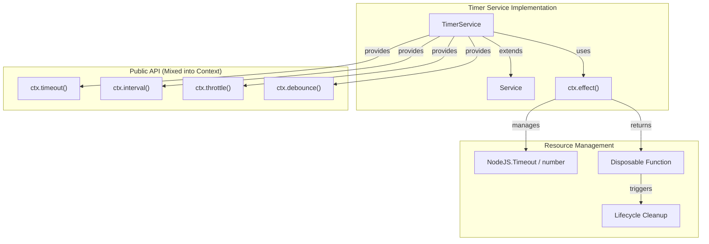
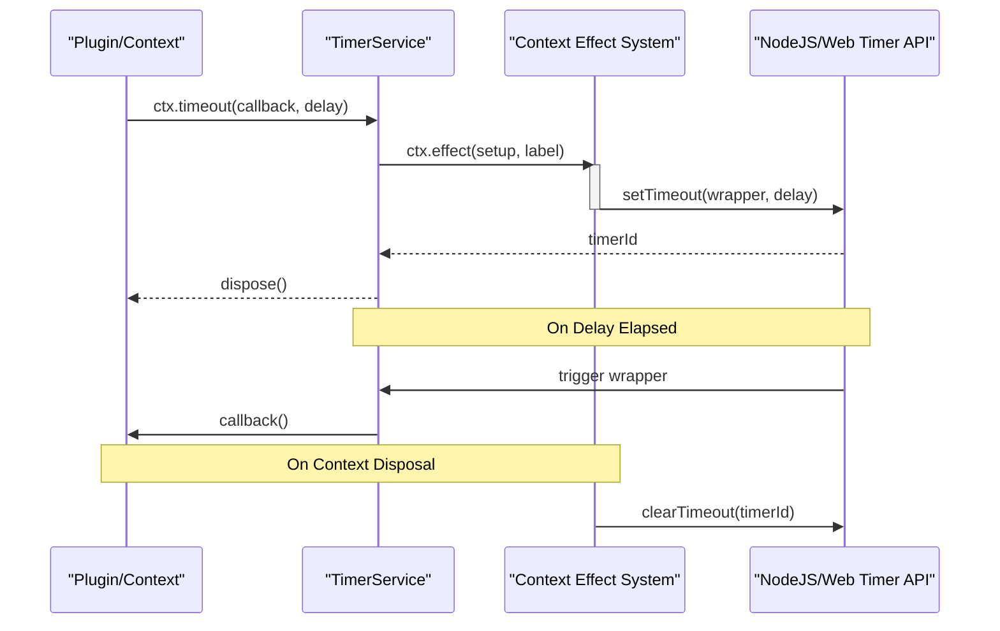

# Timer Service

<details>
<summary>Relevant source files</summary>

The following files were used as context for generating this wiki page:

- [.nycrc.json](.nycrc.json)
- [packages/timer/package.json](packages/timer/package.json)
- [packages/timer/src/index.ts](packages/timer/src/index.ts)
- [packages/timer/tests/index.spec.ts](packages/timer/tests/index.spec.ts)

</details>


The Timer Service provides timing and scheduling functionality for Cordis applications, offering a managed approach to handle timeouts, intervals, throttles, and debounces. This service integrates with the Cordis lifecycle system to ensure proper cleanup and resource management when plugins or contexts are disposed.

## Purpose and Architecture

The Timer Service (`@cordisjs/plugin-timer`) is a utility plugin that extends the base `Service` class [packages/timer/src/index.ts:11-11](). It provides a set of methods that are mixed into the `Context` [packages/timer/src/index.ts:14-14](), allowing any plugin to access timing functions that are automatically scoped to that plugin's lifecycle.

### Timer Service Architecture



Sources: [packages/timer/src/index.ts:11-15](), [packages/timer/src/index.ts:33-40]()

## Package Structure

The Timer Service is distributed as the `@cordisjs/plugin-timer` package.

| Property | Value | Description |
|----------|--------|-------------|
| Package Name | `@cordisjs/plugin-timer` | Official timer service plugin |
| Version | `1.1.2` | Current version |
| Dependencies | `cosmokit` | Utility library dependency |
| Peer Dependencies | `cordis ^4.0.0-rc.8` | Core framework requirement |
| Main Export | `lib/index.js` | Compiled JavaScript entry point |

Sources: [packages/timer/package.json:2-43]()

## Core API and Implementation

The `TimerService` class implements several timing primitives. Most methods use `ctx.effect()` internally to register a cleanup function that calls `clearTimeout` or `clearInterval` when the context is disposed [packages/timer/src/index.ts:33-39]().

### 1. Timeouts (`ctx.timeout`)
Supports both callback and Promise-based usage.
- **Callback**: Returns a dispose function [packages/timer/src/index.ts:27-27]().
- **Promise**: Returns a Promise that resolves after the delay or rejects if the context is disposed before completion [packages/timer/src/index.ts:42-51]().

### 2. Intervals (`ctx.interval`)
Supports both callback and Async Iterator usage.
- **Callback**: Executes the function repeatedly until disposed [packages/timer/src/index.ts:54-54]().
- **Async Iterator**: Allows `for-await-of` loops over time intervals. It handles manual `return()`/`throw()` and automatic rejection on context disposal [packages/timer/src/index.ts:64-100]().

### 3. Throttling and Debouncing
Both use a private `_schedule` helper to manage the underlying timer state and disposal logic [packages/timer/src/index.ts:103-115]().
- **`throttle(callback, delay, noTrailing?)`**: Ensures the callback is called at most once per delay period [packages/timer/src/index.ts:117-132]().
- **`debounce(callback, delay)`**: Postpones execution until after the delay has elapsed since the last call [packages/timer/src/index.ts:134-139]().

### Data Flow: Timer Execution



Sources: [packages/timer/src/index.ts:32-40](), [packages/timer/src/index.ts:103-115]()

## Lifecycle Integration

The Timer Service's primary advantage over native global timers is its integration with Cordis Fibers and Contexts.

### Effect System Integration
By wrapping native timers in `ctx.effect()`, the service ensures that:
1.  **Automatic Cleanup**: When a plugin is unloaded, all timers created via `ctx.timeout` or `ctx.interval` are immediately cleared [packages/timer/src/index.ts:38](), [packages/timer/src/index.ts:62]().
2.  **Traceability**: Each timer is registered with a label (e.g., `'ctx.timeout()'`), aiding in debugging and resource tracking [packages/timer/src/index.ts:39]().
3.  **Safety**: Promise-based timers reject with an error ("Context has been disposed") if the lifecycle ends prematurely, preventing hanging promises [packages/timer/src/index.ts:47]().

### Method Mixins
Upon instantiation, the service mixes its methods into the `Context` prototype using `ctx.mixin()` [packages/timer/src/index.ts:14-14](). This allows developers to call `ctx.timeout()` directly rather than `ctx.timer.timeout()`.

```typescript
constructor(ctx: Context) {
  super(ctx, 'timer')
  ctx.mixin('timer', ['timeout', 'interval', 'throttle', 'debounce', 'setTimeout', 'setInterval'])
}
```

Sources: [packages/timer/src/index.ts:11-15]()

## Testing and Validation
The service is verified using `vitest` and `vi.useFakeTimers()` to ensure precise timing behavior and proper disposal [packages/timer/tests/index.spec.ts:10-15](). Tests cover:
- Basic timeout/interval execution [packages/timer/tests/index.spec.ts:22-30]().
- Manual disposal of timers [packages/timer/tests/index.spec.ts:32-39]().
- Rejection of promises on context disposal [packages/timer/tests/index.spec.ts:51-54]().
- Complex async iterator behavior including breaks and manual returns [packages/timer/tests/index.spec.ts:72-164]().

Sources: [packages/timer/tests/index.spec.ts:20-190]()
