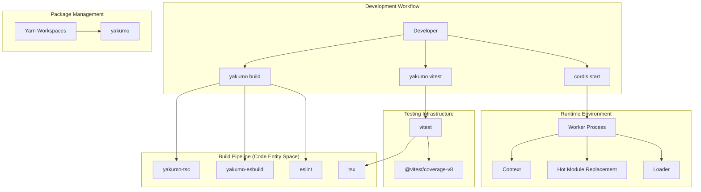
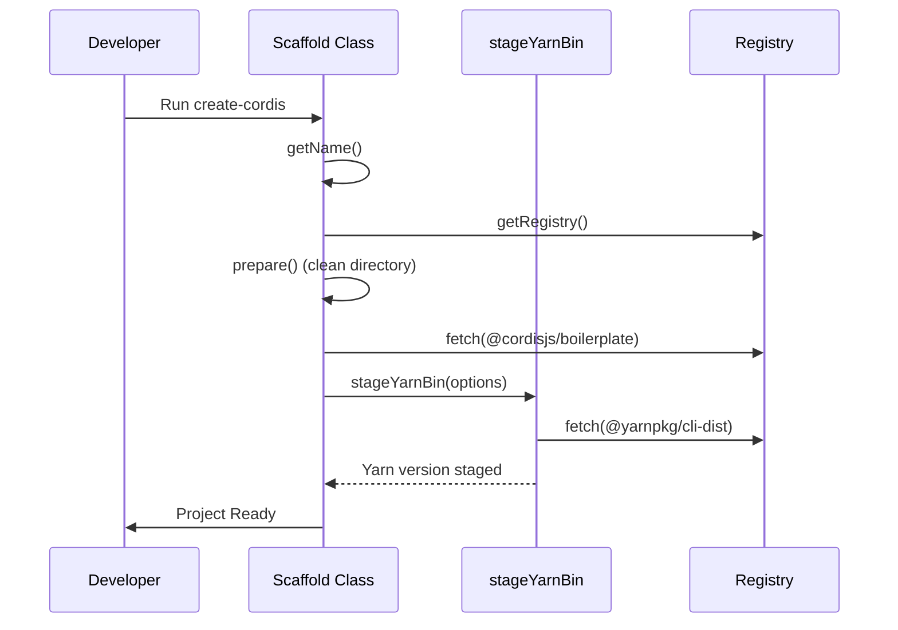
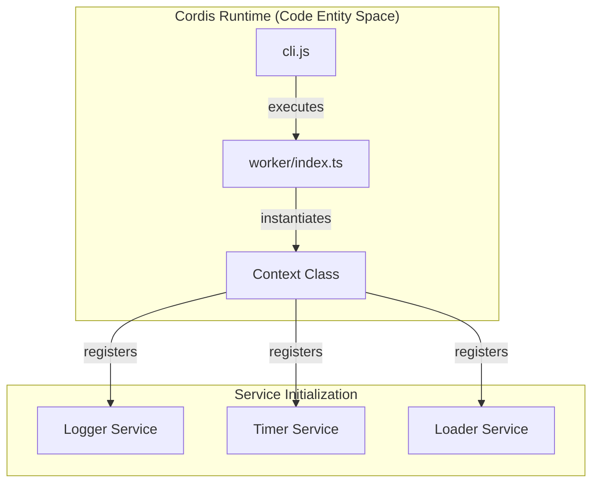

# Development Tools

Relevant source files

The following files were used as context for generating this wiki page:

- [.github/workflows/build.yml](.github/workflows/build.yml)
- [README.md](README.md)
- [package.json](package.json)
- [packages/create/package.json](packages/create/package.json)
- [packages/create/src/bin.ts](packages/create/src/bin.ts)
- [packages/create/src/index.ts](packages/create/src/index.ts)
- [tsconfig.base.json](tsconfig.base.json)
- [yakumo.yml](yakumo.yml)

The Cordis framework provides a comprehensive development toolchain that encompasses build orchestration, testing infrastructure, runtime environments, and scaffolding. This ecosystem enables efficient development, testing, and deployment of Cordis applications through integrated tools that work seamlessly together.

The development tools are organized into two main areas detailed in the following sections:
- [Worker Process and CLI](#8.1) — Runtime environment and command-line interface.
- [Build System and Yakumo](#8.2) — Build orchestration, compilation, and testing infrastructure.

## Overview

### Development Toolchain Architecture

The Cordis development ecosystem integrates multiple specialized tools to provide a complete development experience, transitioning from source code to execution.

**Sources:** [package.json:12-20](), [package.json:21-37](), [yakumo.yml:1-4]()

### Core Development Scripts

The development workflow is orchestrated through npm scripts that integrate multiple tools via `yakumo` [package.json:14]():

| Script | Command | Purpose |
|--------|---------|---------|
| `yakumo` | `node ... yakumo/lib/cli.js` | Primary build orchestration tool [package.json:14]() |
| `build` | `yarn yakumo esbuild && yarn yakumo tsc` | Compile TypeScript and bundle code [package.json:15]() |
| `lint` | `eslint --cache` | Static code analysis and style checking [package.json:13]() |
| `test` | `yarn yakumo vitest --import tsx` | Run test suites with Vitest and TSX support [package.json:16]() |
| `test:json`| `yarn test --coverage --coverage.reporter json` | Generate JSON-format coverage reports [package.json:18]() |

**Sources:** [package.json:12-20]()

## Scaffolding and Setup

Cordis provides a scaffolding tool, `create-cordis`, to quickly set up new applications. This tool handles environment detection, registry resolution, and template extraction. It is designed to be invoked via `npm create cordis` or `yarn create cordis` [packages/create/package.json:2-8]().

### Scaffold Lifecycle

The `Scaffold` class in `packages/create/src/index.ts` manages the initialization of a new project, including cleaning the target directory and fetching the boilerplate template [packages/create/src/index.ts:170-229]().

A critical part of the setup is `stageYarnBin`, which ensures a modern Yarn environment is available in the target project, even if the user is running a legacy version of Yarn [packages/create/src/index.ts:88-168]().

**Sources:** [packages/create/src/index.ts:88-168](), [packages/create/src/index.ts:170-229](), [packages/create/src/bin.ts:4-8]()

## Build System Integration

### Yakumo Build Orchestration

The build system is centered around `yakumo`, a monorepo-aware build orchestrator defined in `yakumo.yml`. It coordinates `yakumo-tsc` for type definitions and `yakumo-esbuild` for bundling.

| Tool | Code Identifier | Role |
|------|-----------------|------|
| **TypeScript** | `yakumo-tsc` | Handles `.d.ts` generation and incremental compilation [package.json:35]() |
| **Bundler** | `yakumo-esbuild` | Fast JavaScript/TypeScript bundling using esbuild [package.json:34]() |
| **Test Runner** | `yakumo-vitest` | Executes unit tests with coverage support [package.json:36]() |

The project uses a base TypeScript configuration `tsconfig.base.json` targeting `es2024` with `esnext` modules [tsconfig.base.json:3-4]().

For detailed information about the build system, see [Build System and Yakumo](#8.2).

**Sources:** [yakumo.yml:1-4](), [package.json:15-16](), [tsconfig.base.json:1-19]()

## Runtime Environment

### CLI and Worker Process System

The runtime environment provides a command-line interface and worker process management. The worker process is responsible for initializing the core `Context` and loading initial services.

The worker system facilitates features like Hot Module Replacement (HMR) and managed plugin lifecycles.

For detailed information about the runtime environment, see [Worker Process and CLI](#8.1).

**Sources:** [package.json:14](), [packages/create/package.json:8-13]()

## Further Information

For more detailed information about specific components of the Development Tools, refer to:

- [Worker Process and CLI](#8.1) — For details on how the worker process manages application instances and the command-line interface.
- [Build System and Yakumo](#8.2) — For details on the monorepo build orchestration and testing infrastructure.
- [Plugin Loader](#6) — For details on how plugins are dynamically loaded into the runtime.
- [Logger Service](#7.1) — For information about the logging service used by the development tools.
