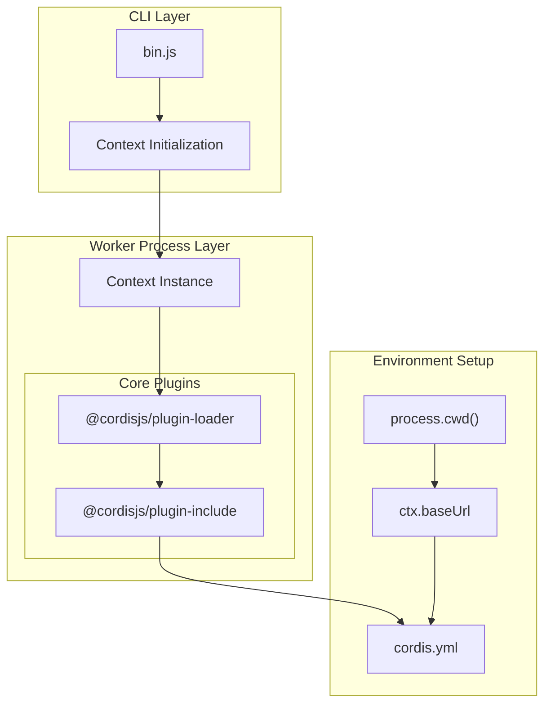
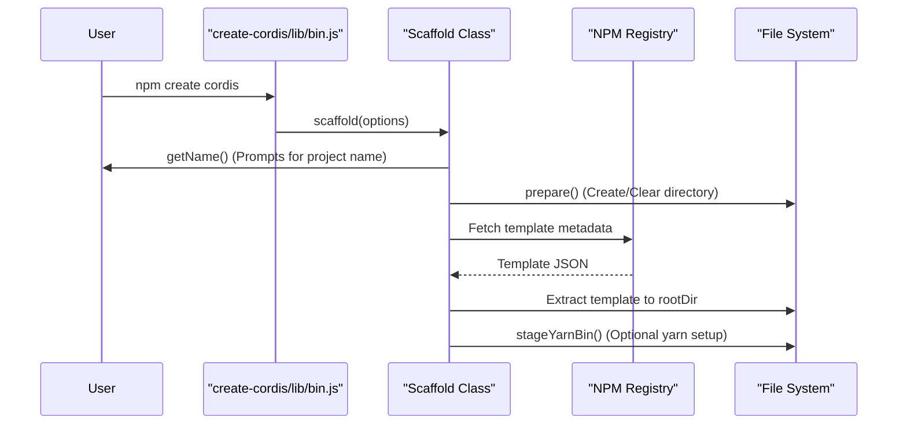
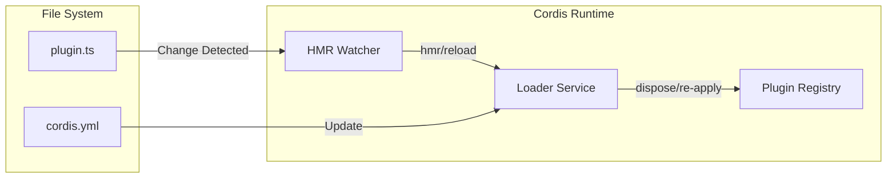

# Worker Process and CLI

Relevant source files

The following files were used as context for generating this wiki page:

- [packages/core/bin.js](packages/core/bin.js)
- [packages/create/README.md](packages/create/README.md)
- [packages/create/package.json](packages/create/package.json)
- [packages/create/src/bin.ts](packages/create/src/bin.ts)
- [packages/create/src/index.ts](packages/create/src/index.ts)
- [packages/hmr/README.md](packages/hmr/README.md)
- [packages/hmr/tests/index.spec.ts](packages/hmr/tests/index.spec.ts)
- [packages/loader/README.md](packages/loader/README.md)
- [tsconfig.base.json](tsconfig.base.json)

The Worker Process and CLI system provides the runtime environment for Cordis applications. This system consists of a command-line interface that serves as the entry point and a worker process system that manages application execution with process isolation, environment variable management, and plugin loading capabilities.

## Architecture Overview

The CLI and Worker Process system employs a layered architecture where the CLI provides the user interface and the worker process manages the actual Cordis application execution via a specialized `Context` instance.

Sources: [packages/core/bin.js:1-16]()

## CLI Entry Point

The Cordis CLI is the primary entry point for applications. In the core package, this is implemented as a lightweight bootstrap script that initializes a `Context` and hooks into the plugin loader.

### CLI Initialization Flow

When the `cordis` command is executed, it performs the following steps:
1. **Context Creation**: A new `Context` instance is instantiated [packages/core/bin.js:7]().
2. **Base URL Resolution**: The current working directory is resolved to a file URL and assigned to `ctx.baseUrl` [packages/core/bin.js:8]().
3. **Loader Activation**: The `@cordisjs/plugin-loader` is registered to the context [packages/core/bin.js:10]().
4. **Configuration Bootstrapping**: The CLI uses `ctx.loader.create` to initialize the `@cordisjs/plugin-include` plugin, pointing it to a local `cordis.yml` configuration file [packages/core/bin.js:11-16]().

Sources: [packages/core/bin.js:1-16]()

## Project Scaffolding (create-cordis)

The `create-cordis` package provides a command-line utility to scaffold new Cordis applications, handling project templates and package manager integration. It targets Node.js version 22 or higher [packages/create/package.json:12-14]().

### Scaffold Lifecycle

### Key Functions in Scaffolding

| Function | File:Line | Description |
|----------|-----------|-------------|
| `scaffold()` | [packages/create/src/index.ts:209-230]() | Main orchestration logic for fetching templates and extracting them. |
| `stageYarnBin()` | [packages/create/src/index.ts:88-168]() | Configures a local Yarn binary if the environment requires it, respecting `.yarnrc.yml`. It handles fetching `@yarnpkg/cli-dist` and caching it [packages/create/src/index.ts:129-158](). |
| `getName()` | [packages/create/src/index.ts:175-184]() | Interactively prompts the user for the project name using `prompts`. |
| `prepare()` | [packages/create/src/index.ts:186-207]() | Ensures the target directory exists and is ready for scaffolding, offering to remove existing files [packages/create/src/index.ts:201-205](). |

Sources: [packages/create/src/index.ts:88-230](), [packages/create/src/bin.ts:4-8](), [packages/create/package.json:1-50]()

## Runtime Configuration and HMR

The worker process environment is designed to support Hot Module Replacement (HMR). This allows the application to reload specific plugins when their source files or configurations change without restarting the entire process.

### HMR Data Flow

### HMR Implementation Details
- **Context Integration**: HMR functionality is typically exposed via `ctx.hmr` [packages/hmr/tests/index.spec.ts:70]().
- **Event Notification**: The system emits `hmr/reload` events containing a map of reloaded files [packages/hmr/tests/index.spec.ts:136-141]().
- **Cleanup**: When a plugin is reloaded, the previous instance is disposed to prevent resource leaks [packages/hmr/tests/index.spec.ts:148-162]().
- **Dependency Management**: HMR tracks dependency chains to ensure that if a module changes, all dependent plugins are correctly reloaded [packages/hmr/tests/index.spec.ts:224-225]().

Sources: [packages/hmr/tests/index.spec.ts:70-225]()

## Package Structure

The Cordis ecosystem separates the core runtime from development and scaffolding tools.

| Package | Role | Binary |
|---------|------|--------|
| `cordis` (core) | Main runtime and context orchestrator | `bin.js` [packages/core/bin.js:1-16]() |
| `create-cordis` | Project initializer and bootstrapper | `lib/bin.js` [packages/create/package.json:8]() |

Sources: [packages/core/bin.js:1-16](), [packages/create/package.json:1-50]()
