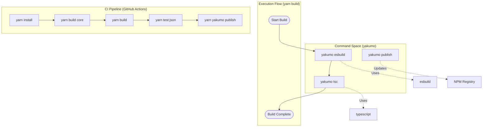
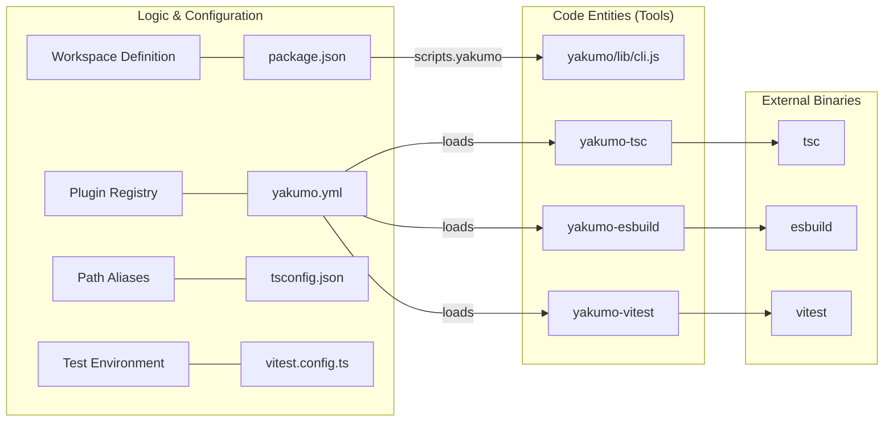

# Build System and Yakumo

Relevant source files

The following files were used as context for generating this wiki page:

- [.eslintignore](.eslintignore)
- [.eslintrc.yml](.eslintrc.yml)
- [.github/workflows/build.yml](.github/workflows/build.yml)
- [.gitignore](.gitignore)
- [.yarnrc.yml](.yarnrc.yml)
- [README.md](README.md)
- [package.json](package.json)
- [tsconfig.json](tsconfig.json)
- [vitest.config.ts](vitest.config.ts)
- [yakumo.yml](yakumo.yml)

Cordis utilizes **Yakumo** as its primary build orchestration tool for managing a multi-package monorepo. Yakumo provides a unified interface for common development tasks including TypeScript compilation, bundling with esbuild, testing with Vitest, and package publishing.

## Monorepo Management

The Cordis codebase is organized as a Yarn workspace monorepo. The root `package.json` defines the workspace structure, encompassing both internal packages and external dependencies. The `nodeLinker` is explicitly set to `node-modules` to ensure compatibility with standard Node.js resolution patterns.

| Component | Location | Purpose |
|-----------|----------|---------|
| **Core Packages** | `packages/*` | Foundational Cordis modules (core, loader, etc.) |
| **External** | `external/*` | Third-party or auxiliary packages managed within the repo |
| **Build Artifacts** | `lib/`, `dist/` | Compiled output (ignored by git) |

Sources: [package.json:7-10](), [.gitignore:1-4](), [.yarnrc.yml:1-1]()

## Yakumo Orchestration

Yakumo acts as a task runner that abstracts tool-specific configurations into a single command interface. It is invoked via the `yakumo` script defined in the root `package.json`, which leverages `tsx` and `@cordisjs/unyaml` for runtime execution.

### Core Build Commands

The build system relies on several Yakumo plugins to handle different stages of the development lifecycle:

*   **`yakumo esbuild`**: Handles fast bundling of packages into executable or distributable formats.
*   **`yakumo tsc`**: Performs type checking and generates `.d.ts` declaration files.
*   **`yakumo vitest`**: Executes unit tests across the workspace.
*   **`yakumo publish`**: Manages versioning and uploading packages to the NPM registry.

Sources: [package.json:14-16](), [package.json:33-36](), [yakumo.yml:1-4]()

### Build Pipeline Flow

The build process is designed to be sequential for reliability, especially during CI/CD. The primary `build` script executes bundling before type generation.

Title: Build Execution and CI Flow

Sources: [package.json:15](), [.github/workflows/build.yml:43-54]()

## TypeScript Configuration

Cordis uses a hierarchical TypeScript configuration. The root `tsconfig.json` extends a base configuration and defines path aliases that map package names to their source directories. This allows for seamless cross-package development without requiring a full rebuild of dependencies.

### Path Mapping
The `compilerOptions.paths` in the root configuration ensures that imports like `cordis` or `@cordisjs/*` resolve directly to `packages/*/src`.

Sources: [tsconfig.json:1-10]()

## Testing Infrastructure

Testing is powered by **Vitest**, integrated into the build system via `yakumo-vitest`.

### Configuration and Environment
The `vitest.config.ts` file configures the test runner to support Cordis-specific features:
*   **Custom Plugins**: Uses `@cordisjs/unyaml/vite` to allow importing YAML files directly in tests.
*   **Process Configuration**: Enables `--expose-internals` and uses `tsx` for on-the-fly TypeScript execution via `execArgv`.
*   **Execution Pool**: Uses `forks` for test isolation.

Sources: [vitest.config.ts:1-10](), [package.json:16]()

### Coverage Reporting
The build system provides multiple coverage reporting formats via the following scripts:
*   `test:text`: Summary in the terminal.
*   `test:json`: Machine-readable output (used in CI).
*   `test:html`: Interactive browser-based report.

Sources: [package.json:17-19]()

## Continuous Integration (CI)

The GitHub Actions workflow (`.github/workflows/build.yml`) automates the validation and deployment process.

1.  **Linting**: Runs `eslint` to ensure code style compliance.
2.  **Two-Stage Build**:
    *   First builds the `core` package to satisfy internal dependencies.
    *   Then builds the entire workspace.
3.  **Test Matrix**: Executes unit tests across multiple Node.js versions (e.g., Node 24, 26).
4.  **Automated Publishing**: On successful pushes to the `main` branch, Yakumo handles the NPM publication with `npmPublishProvenance` enabled.

Sources: [.github/workflows/build.yml:8-76]()

## Build System Entity Mapping

This diagram maps the natural language concepts of the build system to the specific files and tools used in the Cordis repository.

Title: Build System Entity Mapping

Sources: [package.json:14-16](), [yakumo.yml:1-4](), [tsconfig.json:4-9](), [vitest.config.ts:4-10]()
