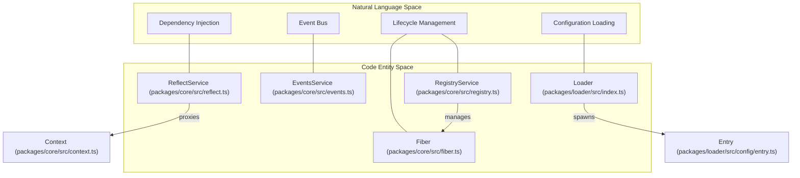
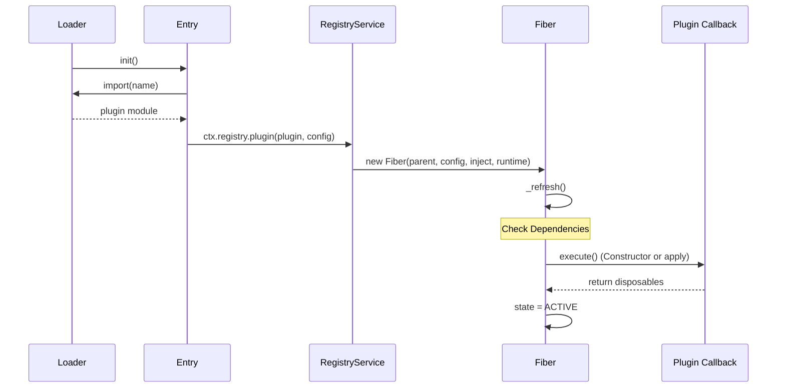

# Glossary

Relevant source files

The following files were used as context for generating this wiki page:

- [packages/core/src/context.ts](packages/core/src/context.ts)
- [packages/core/src/events.ts](packages/core/src/events.ts)
- [packages/core/src/fiber.ts](packages/core/src/fiber.ts)
- [packages/core/src/reflect.ts](packages/core/src/reflect.ts)
- [packages/core/src/registry.ts](packages/core/src/registry.ts)
- [packages/core/src/service.ts](packages/core/src/service.ts)
- [packages/core/src/utils.ts](packages/core/src/utils.ts)
- [packages/core/tests/fiber.spec.ts](packages/core/tests/fiber.spec.ts)
- [packages/core/tests/reflect.spec.ts](packages/core/tests/reflect.spec.ts)
- [packages/hmr/src/index.ts](packages/hmr/src/index.ts)
- [packages/include/src/index.ts](packages/include/src/index.ts)
- [packages/loader/src/index.ts](packages/loader/src/index.ts)

This glossary defines technical terms, jargon, and domain-specific concepts used throughout the Cordis codebase.

## Core Concepts

### Context
The central object of the Cordis framework. It acts as a dependency injection container, event bus, and service orchestrator. Contexts are hierarchical; a child context is created via `ctx.extend()` or `ctx.isolate()`.
*   **Implementation**: `class Context` in [packages/core/src/context.ts:21-78]().
*   **Key Property**: `ctx.root` refers to the top-level context [packages/core/src/context.ts:40-40]().

### Fiber
The internal execution unit that manages the lifecycle of a plugin instance. Every time a plugin is applied, a `Fiber` is created to track its state, configuration, and disposables.
*   **Implementation**: `class Fiber` in [packages/core/src/fiber.ts:103-213]().
*   **States**: Managed via `FiberState` (PENDING, LOADING, ACTIVE, FAILED, DISPOSED, UNLOADING) [packages/core/src/fiber.ts:78-85]().

### Service
A modular component that provides functionality to other parts of the application. Services are registered on the `Context` and can be injected into plugins.
*   **Base Class**: `abstract class Service` in [packages/core/src/service.ts:5-80]().
*   **Pattern**: Services use symbols like `Service.init` [packages/core/src/service.ts:6-6]() and `Service.invoke` [packages/core/src/service.ts:9-9]() to define lifecycle hooks and callable behavior.

### Plugin
A function or object that extends the functionality of a `Context`. Plugins can be registered via `ctx.plugin()`.
*   **Types**: Function, Constructor, or Object with an `apply` method [packages/core/src/registry.ts:63-92]().
*   **Runtime**: The shared metadata for all instances of a specific plugin [packages/core/src/registry.ts:94-100]().

---

## Code Entity Mapping

### Natural Language to Code Entity Space
The following diagram bridges conceptual terms used by developers to the actual class and service names in the codebase.

**System Entity Relationship**

Sources: [packages/core/src/context.ts:43-46](), [packages/core/src/registry.ts:125-214](), [packages/loader/src/index.ts:47-164]()

---

## Technical Jargon & Abbreviations

| Term | Definition | Code Pointer |
| :--- | :--- | :--- |
| **Bail** | An event dispatch mode where execution stops at the first non-null/non-false return value. | [packages/core/src/events.ts:6-8]() |
| **Isolate** | A mechanism to create a "private" version of a service name within a specific context subtree using Symbols. | [packages/core/src/context.ts:65-69]() |
| **Intercept** | Overriding a service's configuration or behavior for a specific context and its children. | [packages/core/src/context.ts:71-77]() |
| **HMR** | Hot Module Replacement. Reloading code changes without restarting the process. | [packages/hmr/src/index.ts:51-153]() |
| **Traceable** | An object wrapped in a Proxy that automatically injects the current `Context` into its method calls. | [packages/core/src/utils.ts:109-117]() |
| **Shadow** | A specialized context property used to track the "origin" of a service call, especially for `noShadow` services. | [packages/core/src/utils.ts:49-49](), [packages/core/src/utils.ts:140-145]() |
| **Waterfall** | An event dispatch mode where each listener receives a `next` callback to control the flow. | [packages/core/src/events.ts:117-126]() |
| **Inertia** | A promise that locks a Fiber's state during asynchronous transitions (loading/unloading) to prevent race conditions. | [packages/core/src/fiber.ts:110-110](), [packages/core/tests/fiber.spec.ts:7-25]() |

---

## Domain Concepts

### Entry and EntryTree
In the `loader` package, an `Entry` represents a specific plugin configuration (usually from a YAML/JSON file). `EntryTree` manages a collection of these entries, often representing a file or a logical group.
*   **Entry**: [packages/loader/src/config/entry.ts:4-4]() (Imported in [packages/loader/src/index.ts:4-4]())
*   **EntryTree**: [packages/loader/src/config/tree.ts:6-6]() (Base class for Loader in [packages/loader/src/index.ts:47-47]())

### Service Notification
When a service is provided or removed, Cordis notifies all dependent `Fibers`. This triggers a re-evaluation of the fiber's state, potentially restarting it if dependencies are now met.
*   **Mechanism**: `ctx.reflect.notify()` [packages/core/src/reflect.ts:205-207]().

### Internal Events
Cordis uses a set of reserved event names (prefixed with `internal/`) to coordinate system-level actions like service registration and plugin status changes.
*   **Definitions**: `interface Events` in [packages/core/src/events.ts:169-175]().

---

## Lifecycle Data Flow

The following diagram illustrates how a plugin transitions from a configuration `Entry` to an active `Fiber`.

**Plugin Activation Flow**

Sources: [packages/loader/src/index.ts:88-124](), [packages/core/src/registry.ts:193-213](), [packages/core/src/fiber.ts:122-213]()
