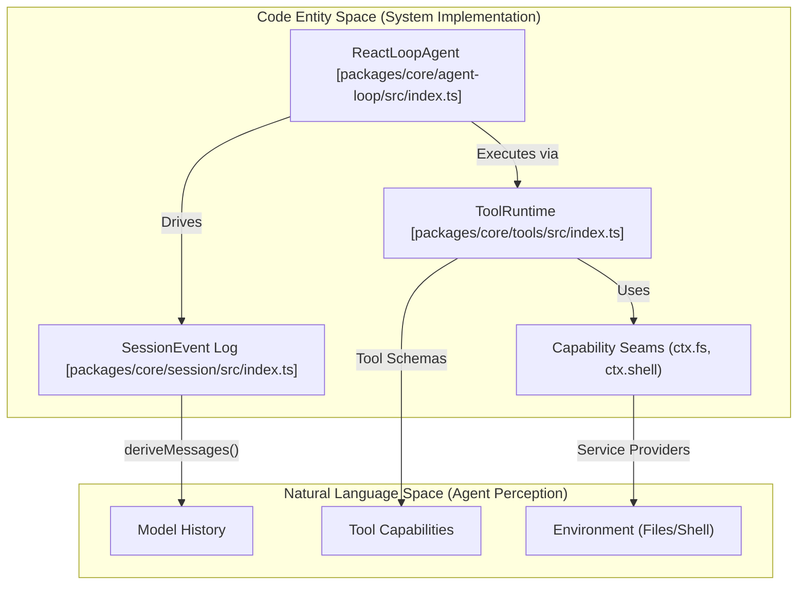
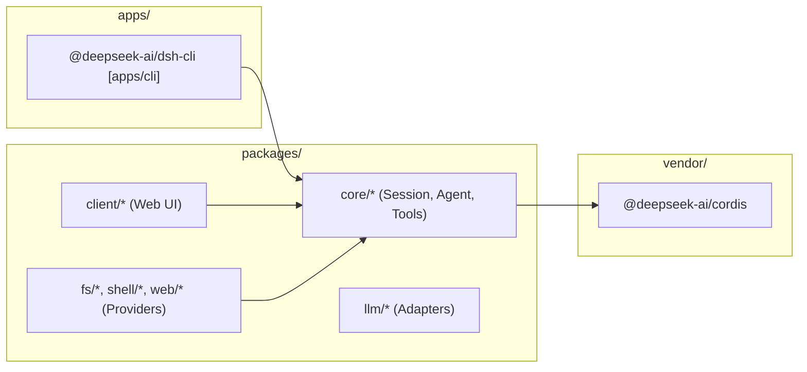

# Overview

<details>
<summary>Relevant source files</summary>

The following files were used as context for generating this wiki page:

- [.agents/notes/implemented/process/2026-07-22-product-first-root-readme.i18n.yaml](.agents/notes/implemented/process/2026-07-22-product-first-root-readme.i18n.yaml)
- [.agents/notes/implemented/process/2026-07-22-product-first-root-readme.md](.agents/notes/implemented/process/2026-07-22-product-first-root-readme.md)
- [.agents/notes/implemented/process/2026-07-22-product-first-root-readme.zh.md](.agents/notes/implemented/process/2026-07-22-product-first-root-readme.zh.md)
- [.agents/notes/implemented/process/2026-07-27-worktree-local-lefthook.i18n.yaml](.agents/notes/implemented/process/2026-07-27-worktree-local-lefthook.i18n.yaml)
- [.agents/notes/implemented/process/2026-07-27-worktree-local-lefthook.md](.agents/notes/implemented/process/2026-07-27-worktree-local-lefthook.md)
- [.agents/notes/implemented/process/2026-07-27-worktree-local-lefthook.zh.md](.agents/notes/implemented/process/2026-07-27-worktree-local-lefthook.zh.md)
- [.agents/notes/implemented/simplification/2026-08-11-quickstart-documentation-home.i18n.yaml](.agents/notes/implemented/simplification/2026-08-11-quickstart-documentation-home.i18n.yaml)
- [.agents/notes/implemented/simplification/2026-08-11-quickstart-documentation-home.md](.agents/notes/implemented/simplification/2026-08-11-quickstart-documentation-home.md)
- [.agents/notes/implemented/simplification/2026-08-11-quickstart-documentation-home.zh.md](.agents/notes/implemented/simplification/2026-08-11-quickstart-documentation-home.zh.md)
- [AGENTS.md](AGENTS.md)
- [README.i18n.yaml](README.i18n.yaml)
- [README.md](README.md)
- [README.zh.md](README.zh.md)
- [docs/capability-seams.md](docs/capability-seams.md)
- [docs/config-catalog.i18n.yaml](docs/config-catalog.i18n.yaml)
- [docs/config-catalog.md](docs/config-catalog.md)
- [docs/config-catalog.zh.md](docs/config-catalog.zh.md)
- [docs/development.i18n.yaml](docs/development.i18n.yaml)
- [docs/development.md](docs/development.md)
- [docs/development.zh.md](docs/development.zh.md)
- [docs/event-producer-consumer.md](docs/event-producer-consumer.md)
- [docs/module-graph.i18n.yaml](docs/module-graph.i18n.yaml)
- [docs/module-graph.md](docs/module-graph.md)
- [docs/module-graph.zh.md](docs/module-graph.zh.md)
- [docs/persistence-catalog.md](docs/persistence-catalog.md)
- [docs/user/index.i18n.yaml](docs/user/index.i18n.yaml)
- [docs/user/index.md](docs/user/index.md)
- [docs/user/index.zh.md](docs/user/index.zh.md)
- [knip.json](knip.json)
- [package.json](package.json)
- [packages/README.i18n.yaml](packages/README.i18n.yaml)
- [packages/README.md](packages/README.md)
- [packages/README.zh.md](packages/README.zh.md)
- [packages/client/ui-conversation/tests/skeleton.client.spec.tsx](packages/client/ui-conversation/tests/skeleton.client.spec.tsx)
- [packages/extensions/cordis-client-runner/src/client/slot-catalog.ts](packages/extensions/cordis-client-runner/src/client/slot-catalog.ts)
- [packages/llm/llm-pi-ai/README.i18n.yaml](packages/llm/llm-pi-ai/README.i18n.yaml)
- [packages/llm/llm-pi-ai/README.md](packages/llm/llm-pi-ai/README.md)
- [packages/llm/llm-pi-ai/README.zh.md](packages/llm/llm-pi-ai/README.zh.md)
- [packages/llm/llm-pi-ai/src/adapter.ts](packages/llm/llm-pi-ai/src/adapter.ts)
- [packages/llm/llm-pi-ai/src/catalog.ts](packages/llm/llm-pi-ai/src/catalog.ts)
- [packages/llm/llm-pi-ai/src/config.ts](packages/llm/llm-pi-ai/src/config.ts)
- [packages/llm/llm-pi-ai/src/index.ts](packages/llm/llm-pi-ai/src/index.ts)
- [packages/llm/llm-pi-ai/tests/adapter.spec.ts](packages/llm/llm-pi-ai/tests/adapter.spec.ts)
- [packages/llm/llm-pi-ai/tests/catalog.spec.ts](packages/llm/llm-pi-ai/tests/catalog.spec.ts)
- [packages/llm/llm-pi-ai/tests/dynamic-config.spec.ts](packages/llm/llm-pi-ai/tests/dynamic-config.spec.ts)
- [pnpm-lock.yaml](pnpm-lock.yaml)
- [scripts/gen-cordis-catalog.ts](scripts/gen-cordis-catalog.ts)
- [scripts/gen-doc-graphs.ts](scripts/gen-doc-graphs.ts)
- [scripts/install-lefthook.mjs](scripts/install-lefthook.mjs)
- [scripts/install-lefthook.spec.ts](scripts/install-lefthook.spec.ts)
- [scripts/run-gates.ts](scripts/run-gates.ts)
- [scripts/snapshots/translation-prompt-v4/request-response.expected.json](scripts/snapshots/translation-prompt-v4/request-response.expected.json)
- [scripts/type-equiv.manifest.json](scripts/type-equiv.manifest.json)
- [tsconfig.base.json](tsconfig.base.json)
- [tsconfig.json](tsconfig.json)

</details>


DeepSeek Harness (`dsh`) is an open-source, plugin-based agent harness developed by [DeepSeek AI](https://deepseek.com). It is designed to be a flexible and extensible foundation for building, testing, and deploying LLM agents.

At its core, `dsh` adopts an **everything-is-a-plugin** philosophy [AGENTS.md:3](). It is powered by a vendored version of the [Cordis](https://github.com/cordiverse/cordis) framework, which allows every component—from model adapters and tool registries to the agent loop itself—to be replaced or extended through configuration [AGENTS.md:3]().

### Core Philosophy: The Capability Seam
The architecture is built around "Capability Seams." A seam is a swappable capability defined by three roles:
1.  **Service Definition**: Declares the interface (e.g., `ctx.llm`, `ctx.fs`).
2.  **Service Provider**: Implements the interface (e.g., `llm-deepseek`, `fs-local`).
3.  **Consumer**: Uses the capability, often a model-facing tool (e.g., `tool-bash` consuming the shell capability).

This pattern allows the entire behavior of the agent to change by swapping a single provider, such as moving from a local filesystem to a remote sandboxed environment [AGENTS.md:18-25]().

### System Architecture: Code to Concept Map

The following diagram bridges the high-level concepts of the agent's "Natural Language Space" (how it perceives and acts) with the "Code Entity Space" (the specific classes and services implementing them).

**Diagram 1: Agent Runtime Composition**

Sources: [AGENTS.md:14-19](), [docs/module-graph.md:26-35](), [docs/event-producer-consumer.md:18-23]()

---

### Monorepo Layout & Navigation

`dsh` is organized as a pnpm monorepo. It separates core logic, API layers, UI components, and various capability providers into distinct package families [package.json:11-18]().

**Diagram 2: Monorepo Structure and Package Flow**

Sources: [AGENTS.md:11-55](), [docs/module-graph.md:8-161]()

#### Key Directories:
*   `apps/`: Entry points like the `dsh` CLI [apps/cli/package.json:102]().
*   `packages/core/`: The "product API spine" including the session, agent, and tools [AGENTS.md:14]().
*   `packages/llm/`: LLM capability definitions and DeepSeek/Pi.ai adapters [AGENTS.md:17]().
*   `vendor/`: Vendored Cordis source and local modifications [AGENTS.md:12]().

For a detailed breakdown of every package group, see [Monorepo Structure & Package Families](#1.2).

---

### Getting Started

To begin developing with DeepSeek Harness, you will need Node.js (22.19+ or 24+) and `pnpm` [package.json:7-9]().

```sh
pnpm install            # Install pnpm workspaces
pnpm run build          # Build host and client aggregates
pnpm dsh --profile headless "task"  # Run a task from source
```
Sources: [AGENTS.md:62-78](), [docs/development.md:16-22]()

For a deep dive into environment variables, build faces (Host vs. Client), and the quality gate system, see [Getting Started & Development Setup](#1.1).

---

### Wiki Navigation

*   **[Getting Started & Development Setup](#1.1)**: Installation, local execution, and the TypeScript build pipeline using Host/Client aggregates [docs/development.md:44-63]().
*   **[Monorepo Structure & Package Families](#1.2)**: Detailed guide to the `packages/` directory and dependency rules [docs/module-graph.md:6-180]().
*   **[Core Architecture](#2)**: Deep dive into Cordis, Event Bus, and the Capability Seam pattern [docs/event-producer-consumer.md:6-8]().
*   **[Agent System](#3)**: How the agent loop functions, tool execution, and session management [AGENTS.md:14]().
*   **[Execution Environment](#4)**: Sandboxing (Landlock), filesystem access, and shell integration [AGENTS.md:19-22]().
*   **[API Layer & Host-Client Bridge](#5)**: RPC via Typert and the Host-to-Browser communication [AGENTS.md:15-16]().
*   **[Web UI](#6)**: Browser-side architecture and UI component composition [AGENTS.md:120-151]().
