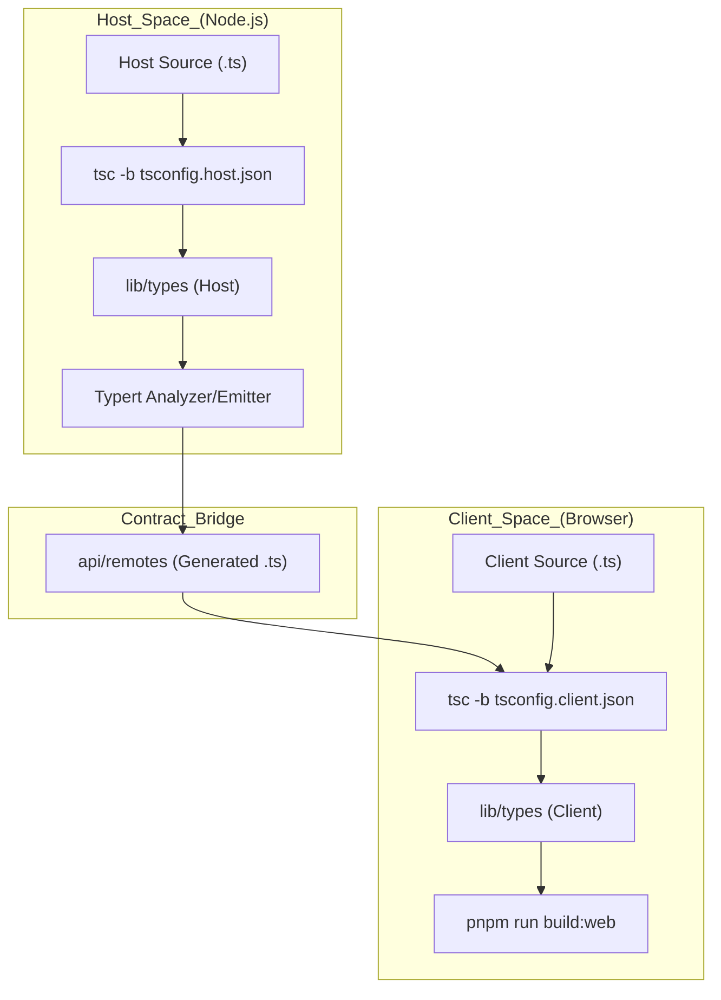
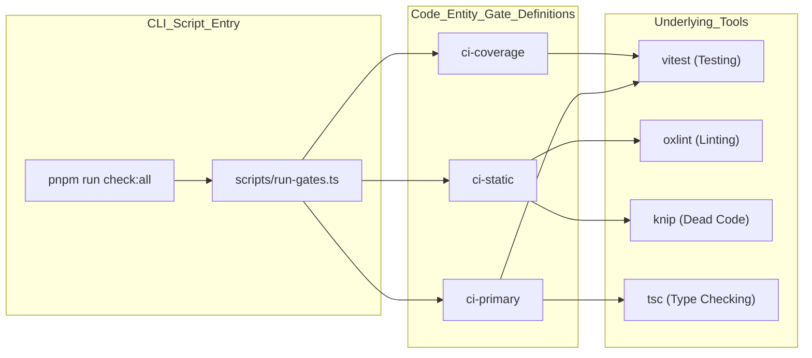

# Getting Started & Development Setup

<details>
<summary>Relevant source files</summary>

The following files were used as context for generating this wiki page:

- [.agents/notes/implemented/process/2026-06-11-quality-gates.md](.agents/notes/implemented/process/2026-06-11-quality-gates.md)
- [.agents/notes/implemented/process/2026-07-22-fast-local-git-hooks.i18n.yaml](.agents/notes/implemented/process/2026-07-22-fast-local-git-hooks.i18n.yaml)
- [.agents/notes/implemented/process/2026-07-22-fast-local-git-hooks.md](.agents/notes/implemented/process/2026-07-22-fast-local-git-hooks.md)
- [.agents/notes/implemented/process/2026-07-22-fast-local-git-hooks.zh.md](.agents/notes/implemented/process/2026-07-22-fast-local-git-hooks.zh.md)
- [.agents/notes/implemented/process/2026-07-27-worktree-local-lefthook.i18n.yaml](.agents/notes/implemented/process/2026-07-27-worktree-local-lefthook.i18n.yaml)
- [.agents/notes/implemented/process/2026-07-27-worktree-local-lefthook.md](.agents/notes/implemented/process/2026-07-27-worktree-local-lefthook.md)
- [.agents/notes/implemented/process/2026-07-27-worktree-local-lefthook.zh.md](.agents/notes/implemented/process/2026-07-27-worktree-local-lefthook.zh.md)
- [.agents/notes/implemented/process/2026-07-30-generated-third-party-notices.i18n.yaml](.agents/notes/implemented/process/2026-07-30-generated-third-party-notices.i18n.yaml)
- [.agents/notes/implemented/process/2026-07-30-generated-third-party-notices.md](.agents/notes/implemented/process/2026-07-30-generated-third-party-notices.md)
- [.agents/notes/implemented/process/2026-07-30-generated-third-party-notices.zh.md](.agents/notes/implemented/process/2026-07-30-generated-third-party-notices.zh.md)
- [AGENTS.md](AGENTS.md)
- [THIRD_PARTY_NOTICES.md](THIRD_PARTY_NOTICES.md)
- [apps/cli/README.i18n.yaml](apps/cli/README.i18n.yaml)
- [apps/cli/README.md](apps/cli/README.md)
- [apps/cli/README.zh.md](apps/cli/README.zh.md)
- [apps/cli/package.json](apps/cli/package.json)
- [apps/cli/reference/README.i18n.yaml](apps/cli/reference/README.i18n.yaml)
- [apps/cli/reference/README.md](apps/cli/reference/README.md)
- [apps/cli/reference/README.zh.md](apps/cli/reference/README.zh.md)
- [apps/cli/src/args.ts](apps/cli/src/args.ts)
- [apps/cli/src/bin.ts](apps/cli/src/bin.ts)
- [apps/cli/src/profile-boot.ts](apps/cli/src/profile-boot.ts)
- [apps/cli/tests/args.spec.ts](apps/cli/tests/args.spec.ts)
- [apps/cli/tests/built-bin.e2e.ts](apps/cli/tests/built-bin.e2e.ts)
- [apps/cli/tsconfig.json](apps/cli/tsconfig.json)
- [docs/development.i18n.yaml](docs/development.i18n.yaml)
- [docs/development.md](docs/development.md)
- [docs/development.zh.md](docs/development.zh.md)
- [lefthook.yml](lefthook.yml)
- [package.json](package.json)
- [packages/README.i18n.yaml](packages/README.i18n.yaml)
- [packages/README.md](packages/README.md)
- [packages/README.zh.md](packages/README.zh.md)
- [scripts/gen-third-party-notices.spec.ts](scripts/gen-third-party-notices.spec.ts)
- [scripts/gen-third-party-notices.ts](scripts/gen-third-party-notices.ts)
- [scripts/install-lefthook.mjs](scripts/install-lefthook.mjs)
- [scripts/install-lefthook.spec.ts](scripts/install-lefthook.spec.ts)
- [scripts/run-gates.ts](scripts/run-gates.ts)

</details>


This page provides the technical foundation for setting up and developing DeepSeek Harness (dsh) locally. It covers the monorepo environment, the build system's dual-aggregate architecture, and the quality gate infrastructure.

## 1. Environment Prerequisites

The repository requires specific engine versions and tools to ensure stability across the plugin-based architecture.

*   **Node.js**: Supports versions `^22.19.0` or `>=24.0.0` [[package.json:8-10]]().
*   **pnpm**: Version `11.7.0` is pinned via Corepack [[package.json:7]](). Run `corepack enable` if `pnpm --version` does not resolve [[docs/development.md:12]]().
*   **Git**: Version `2.26+` is required for worktree-specific configuration extensions [[docs/development.md:13]]().
*   **API Key**: A `DEEPSEEK_API_KEY` in a root `.env` file is required for real-API tests and demos [[AGENTS.md:94-96]](), [[docs/development.md:92-97]]().

**Sources:** [[package.json:7-10]](), [[docs/development.md:9-15]](), [[AGENTS.md:94-96]]()

## 2. Installation & Initial Setup

The installation process initializes both dependencies and specialized Git integrations.

```sh
git clone https://github.com/deepseek-ai/deepseek-harness.git
cd deepseek-harness
pnpm install
```

### Git Hooks and Merge Drivers
The `postinstall` script triggers `scripts/install-lefthook.mjs` [[docs/development.md:24-30]](). This sets up:
1.  **Lefthook**: Configures worktree-local hooks for `pre-commit`, `pre-merge-commit`, and `pre-push` [[docs/development.md:107-112]]().
2.  **dsh-translation-pairing**: A custom Git merge driver for `.i18n.yaml` files to handle bilingual documentation synchronization [[docs/development.md:24-25]](), [[docs/development.zh.md:103-105]]().

### Verification
After installation, run a full typecheck to verify the environment:
```sh
pnpm run typecheck
```
Setup is complete when this exits successfully [[docs/development.md:40]]().

**Sources:** [[docs/development.md:16-41]](), [[docs/development.zh.md:16-40]]()

## 3. The dsh CLI & Profile Booting

The `dsh` command (defined in `apps/cli`) is the primary product launcher. It manages **Profiles**, which are ordered stacks of plugin-bundle patch layers [[apps/cli/README.md:5]]().

### Command Modes
| Command | Purpose |
| :--- | :--- |
| `dsh web` | Alias for `--profile web`, starts the Web UI [[apps/cli/README.md:13]](). |
| `dsh --profile headless "task"` | Runs a single session for a specific task and exits [[apps/cli/README.md:12]](). |
| `dsh plugin --profile <name> <args>` | Forwards commands to `pnpm` within the profile directory to manage plugins [[apps/cli/README.md:14]](). |

### Profile Composition
A profile is assembled from multiple layers in a specific precedence order [[apps/cli/README.md:32-39]]():
1.  **Bundles**: Base patches from `@deepseek-ai/dsh-base`, etc., defined in `dsh.profile.bundles`.
2.  **Local Patch**: The profile's `cordis.patch.yml`.
3.  **User Patch**: Global overrides in `$DSH_HOME/cordis.patch.yml`.
4.  **CLI Overlays**: Explicit `--patch` flags passed at runtime.

**Sources:** [[apps/cli/README.md:1-43]](), [[apps/cli/package.json:1-102]](), [[apps/cli/src/bin.ts:1-20]]()

## 4. Dual-Aggregate Build System

DSH uses two isolated TypeScript aggregates—**Host** and **Client**—to avoid `Context` declaration collisions in the Cordis framework [[docs/development.md:45-56]]().

### Aggregate Architecture
The repository splits logic into two programs because both sides merge different services into the same Cordis `Context` keys; a single program seeing both would report a collision [[docs/development.md:56-60]]().

| Aggregate | Config | Scope |
| :--- | :--- | :--- |
| **Host** | `tsconfig.host.json` | Node.js runtime, agents, tools, scripts, and `api/remotes` (Host side) [[docs/development.md:51]](). |
| **Client** | `tsconfig.client.json` | Browser runtime, UI packages, `apps/web`, and `api/remotes` (Client side) [[docs/development.md:52]](). |

### Build Data Flow
The build process follows a strict order to satisfy Typert RPC requirements:

1.  **Host Emit**: `tsc -b tsconfig.host.json` generates JS/Types for the host [[docs/development.md:67]]().
2.  **Host Bundle & Typert**: `tsdown` (Host face) analyzes types and generates RPC contracts [[docs/development.md:68]](), [[docs/development.md:76-77]]().
3.  **Client Emit**: `tsc -b tsconfig.client.json` consumes generated RPC types [[docs/development.md:69]]().
4.  **Client Bundle**: `tsdown` (Client face) bundles browser artifacts [[docs/development.md:70]]().

### Build Process Data Flow

**Sources:** [[docs/development.md:45-78]](), [[package.json:20-24]]()

## 5. Quality Gate System

The repository enforces high code quality through a "Quality Gate" system managed by `scripts/run-gates.ts` [[scripts/run-gates.ts:1-7]]().

### Key Gates
*   **`ci-primary`**: Core logic and unit tests [[scripts/run-gates.ts:23]]().
*   **`ci-coverage`**: Enforces **100% per-file coverage** for all packages [[AGENTS.md:66]](), [[scripts/run-gates.ts:27]]().
*   **`ci-snapshot`**: Headless replay tests against expected outputs [[AGENTS.md:68]](), [[scripts/run-gates.ts:28]]().
*   **`hygiene`**: Runs `knip` (dead code), `publint` (package exports), and workspace constraint checks [[AGENTS.md:74]]().
*   **`doc-sync`**: Synchronizes bilingual docs and verifies documentation integrity [[AGENTS.md:76]](), [[scripts/run-gates.ts:36]]().

### Gate Execution Model
Gates are executed with bounded parallelism based on available CPUs, with specific caps for memory-intensive tasks like documentation building [[scripts/run-gates.ts:142-158]]().

### Quality Gate System Mapping

**Sources:** [[scripts/run-gates.ts:1-210]](), [[package.json:49-80]](), [[AGENTS.md:59-80]]()

## 6. Local Development Workflow

1.  **Source Execution**: Use `pnpm dsh` to run the CLI directly from source. Modules reached must stay ESM as source launch runs via `tsx` ESM hooks [[AGENTS.md:102]](), [[apps/cli/README.md:47-48]]().
2.  **Relevant Checks**: Do not run the full suite for every change. CI owns exhaustive coverage; local development should focus on behavior-specific tests or snapshots [[AGENTS.md:86-92]]().
3.  **Bilingual Docs**: When editing documentation, update both `.md` and `.zh.md` files. Use `pnpm run verify-translation-pairing --write <file>` to update consistency records in `.i18n.yaml` [[docs/development.i18n.yaml:1-6]](), [[docs/development.zh.md:103-105]]().
4.  **Cleaning**: Use `pnpm run clean` to remove build outputs and residue from deleted packages [[AGENTS.md:64]]().

**Sources:** [[AGENTS.md:86-102]](), [[docs/development.md:123-130]](), [[package.json:26]]()
