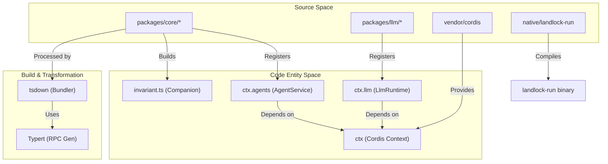
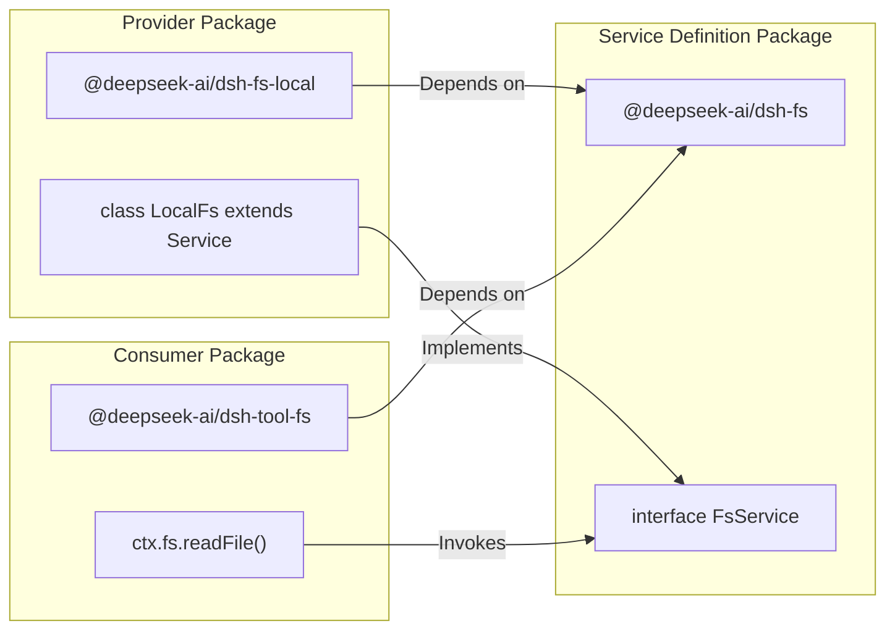

# Monorepo Structure & Package Families

Relevant source files

The following files were used as context for generating this wiki page:

- [.agents/notes/implemented/architecture/2026-07-19-package-owned-invariant-service.i18n.yaml](.agents/notes/implemented/architecture/2026-07-19-package-owned-invariant-service.i18n.yaml)
- [.agents/notes/implemented/architecture/2026-07-19-package-owned-invariant-service.md](.agents/notes/implemented/architecture/2026-07-19-package-owned-invariant-service.md)
- [.agents/notes/implemented/architecture/2026-07-19-package-owned-invariant-service.zh.md](.agents/notes/implemented/architecture/2026-07-19-package-owned-invariant-service.zh.md)
- [.agents/notes/implemented/process/2026-07-27-worktree-local-lefthook.i18n.yaml](.agents/notes/implemented/process/2026-07-27-worktree-local-lefthook.i18n.yaml)
- [.agents/notes/implemented/process/2026-07-27-worktree-local-lefthook.md](.agents/notes/implemented/process/2026-07-27-worktree-local-lefthook.md)
- [.agents/notes/implemented/process/2026-07-27-worktree-local-lefthook.zh.md](.agents/notes/implemented/process/2026-07-27-worktree-local-lefthook.zh.md)
- [.agents/notes/implemented/simplification/2026-08-03-omit-invariants-from-shipped-config.i18n.yaml](.agents/notes/implemented/simplification/2026-08-03-omit-invariants-from-shipped-config.i18n.yaml)
- [.agents/notes/implemented/simplification/2026-08-03-omit-invariants-from-shipped-config.md](.agents/notes/implemented/simplification/2026-08-03-omit-invariants-from-shipped-config.md)
- [.agents/notes/implemented/simplification/2026-08-03-omit-invariants-from-shipped-config.zh.md](.agents/notes/implemented/simplification/2026-08-03-omit-invariants-from-shipped-config.zh.md)
- [.agents/skills/dsh-code-review/SKILL.md](.agents/skills/dsh-code-review/SKILL.md)
- [AGENTS.md](AGENTS.md)
- [docs/cookbook/adding-a-package.i18n.yaml](docs/cookbook/adding-a-package.i18n.yaml)
- [docs/cookbook/adding-a-package.md](docs/cookbook/adding-a-package.md)
- [docs/cookbook/adding-a-package.zh.md](docs/cookbook/adding-a-package.zh.md)
- [docs/cookbook/adding-a-tool.i18n.yaml](docs/cookbook/adding-a-tool.i18n.yaml)
- [docs/cookbook/adding-a-tool.md](docs/cookbook/adding-a-tool.md)
- [docs/cookbook/adding-a-tool.zh.md](docs/cookbook/adding-a-tool.zh.md)
- [docs/cookbook/adding-a-vendored-package.i18n.yaml](docs/cookbook/adding-a-vendored-package.i18n.yaml)
- [docs/cookbook/adding-a-vendored-package.zh.md](docs/cookbook/adding-a-vendored-package.zh.md)
- [docs/cookbook/extension-cookbook.i18n.yaml](docs/cookbook/extension-cookbook.i18n.yaml)
- [docs/cookbook/extension-cookbook.md](docs/cookbook/extension-cookbook.md)
- [docs/cookbook/extension-cookbook.zh.md](docs/cookbook/extension-cookbook.zh.md)
- [docs/development.i18n.yaml](docs/development.i18n.yaml)
- [docs/development.md](docs/development.md)
- [docs/development.zh.md](docs/development.zh.md)
- [package.json](package.json)
- [packages/AGENTS.md](packages/AGENTS.md)
- [packages/README.i18n.yaml](packages/README.i18n.yaml)
- [packages/README.md](packages/README.md)
- [packages/README.zh.md](packages/README.zh.md)
- [packages/core/tools/src/invariant.ts](packages/core/tools/src/invariant.ts)
- [packages/hooks/hook-protocol/src/invariant.ts](packages/hooks/hook-protocol/src/invariant.ts)
- [packages/util/brand/README.md](packages/util/brand/README.md)
- [scripts/install-lefthook.mjs](scripts/install-lefthook.mjs)
- [scripts/install-lefthook.spec.ts](scripts/install-lefthook.spec.ts)
- [scripts/package-invariants.ts](scripts/package-invariants.ts)
- [scripts/run-gates.ts](scripts/run-gates.ts)
- [scripts/test-invariants.spec.ts](scripts/test-invariants.spec.ts)
- [scripts/test-invariants.ts](scripts/test-invariants.ts)

The DeepSeek Harness (dsh) codebase is organized as a high-density pnpm monorepo. It utilizes a plugin-based architecture where functionality is decomposed into small, versioned packages that communicate via a service-oriented microkernel [packages/README.md:5-9](). This structure enforces the "capability seam" pattern, ensuring that core logic remains decoupled from specific implementations like local filesystems or cloud sandboxes [packages/README.md:67-68]().

## Directory Layout

The repository is divided into several top-level directories, each serving a distinct role in the development and distribution lifecycle [AGENTS.md:9-56]().

| Directory | Purpose | Implementation Detail |
| :--- | :--- | :--- |
| `apps/` | Entry-point applications. | Contains the main web frontend and application launchers [package.json:16](). |
| `packages/` | The primary functional units. | Grouped into families (e.g., `core/`, `llm/`). All packages use the `@deepseek-ai/dsh-` prefix [packages/README.md:9-11](). |
| `vendor/` | Local forks of upstream libraries. | Includes a customized version of the Cordis framework [AGENTS.md:12](). |
| `native/` | Platform-specific binaries. | Contains components like `landlock-run` for Linux process confinement [AGENTS.md:50](). |
| `python/` | Python SDK and runtimes. | Houses the `deepseek-harness-sdk` and bundled runtime logic [AGENTS.md:49](). |
| `scripts/` | Tooling and quality gates. | Contains CI checks, module graph generators, and build automation [AGENTS.md:54](). |
| `examples/` | Runnable demo configurations. | Runnable `cordis.yml` leaves that compose packages for specific use cases [AGENTS.md:51](). |

### Workspace Data Flow: Code to Artifact
The following diagram illustrates how source entities across the monorepo are transformed into published artifacts and runtime services.

**Monorepo Entity Mapping**

**Sources:** [AGENTS.md:12-56](), [package.json:23-24](), [packages/README.md:5-15](), [docs/development.md:46-77]()

---

## Package Families

Packages are organized into "families" located in `packages/<family>/<pkg>`. This grouping provides a logical hierarchy for the hundreds of small plugins in the system [packages/README.md:7-9]().

### Core Family (`packages/core/`)
The "Product API Spine." This family contains the essential services for running an agentic loop.
*   **`dsh-agent`**: Defines the `Agent` interface and `ctx.agents` service [packages/README.md:13]().
*   **`dsh-agent-loop`**: The concrete implementation of the ReAct-style execution loop [packages/README.md:13]().
*   **`dsh-tools`**: The central registry for tool definitions and execution waterfalls [docs/cookbook/extension-cookbook.md:7-10]().

### LLM Family (`packages/llm/`)
Provides the `LlmRuntime` (`ctx.llm`) service. It abstracts model providers into a unified streaming interface [packages/README.md:20]().
*   **Adapters**: Concrete implementations (e.g., `dsh-llm-deepseek`) register via the LLM capability seam [AGENTS.md:17]().

### Session & Query Family (`packages/session/` & `packages/session-query/`)
Manages the durable data plane.
*   **`dsh-session`**: Handles persistence backends (JSONL, SQLite), projection, and log-backed titles [packages/README.md:46]().
*   **`dsh-session-query`**: Provides logical corpus retrieval, lineage, and full-text search [packages/README.md:47]().

### Capability Families
These families follow the **Service Definition / Provider / Consumer** split [packages/README.md:67-68]().
*   **`fs/`**: Filesystem capability and policy [packages/README.md:27]().
*   **`subprocess/`**: Spawning and managing local process trees [packages/README.md:22]().
*   **`shell/`**: Bash capability including the executor seam and model-facing tools [packages/README.md:23]().
*   **`subagent/`**: Subagent provider-registry and delegation tools [packages/README.md:32]().

---

## Rules for Adding New Packages

The monorepo enforces strict constraints on new packages to maintain architectural integrity and quality [AGENTS.md:99-106]().

### 1. Structure and Naming
*   **Location**: New packages must join an existing family directory or create a new one with a corresponding README update [packages/README.md:61-62]().
*   **Naming**: Must use the `@deepseek-ai/dsh-` prefix in `package.json` [AGENTS.md:101]().
*   **Module Type**: All packages must be ESM (`"type": "module"`) [AGENTS.md:102]().

### 2. Dependency Rules
*   **Seam Dependency**: Extension plugins should depend on **Service Definitions** (interfaces), never on concrete providers [packages/README.md:67-68]().
*   **Cordis Peer**: `@deepseek-ai/cordis` must be a `peerDependency` and `devDependency` of every harness package [AGENTS.md:101]().
*   **Invariants**: Every package should include a `./src/invariant.ts` file. This "companion" is used for runtime validation and proves that the package can be safely disposed of [AGENTS.md:103-104](), [scripts/test-invariants.spec.ts:148-152]().

### 3. Documentation Requirements
*   **Bilingual Docs**: Every package README must have a corresponding `README.zh.md` and be tracked in a `README.i18n.yaml` file to ensure translation parity [packages/README.i18n.yaml:1-5](), [docs/development.md:24-25]().
*   **Model Experience**: READMEs must document the "Model Experience"—how the package's tools and prompts appear to the LLM [packages/README.md:70]().

### Package Dependency and Service Flow
This diagram shows the relationship between different package roles when a new capability is added.

**Capability Seam Pattern**

**Sources:** [packages/README.md:67-68](), [docs/cookbook/extension-cookbook.md:23-31](), [AGENTS.md:103-104]()

---
**Sources:**
*   `AGENTS.md:9-106`
*   `package.json:11-88`
*   `packages/README.md:5-71`
*   `docs/development.md:44-82`
*   `scripts/run-gates.ts:21-37`
*   `scripts/test-invariants.spec.ts:121-152`
*   `docs/cookbook/extension-cookbook.md:7-60`
