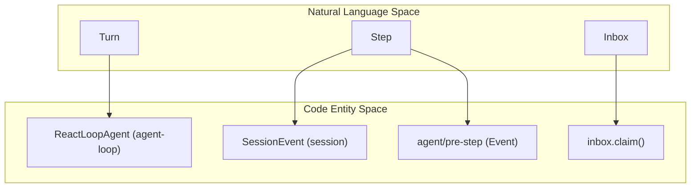
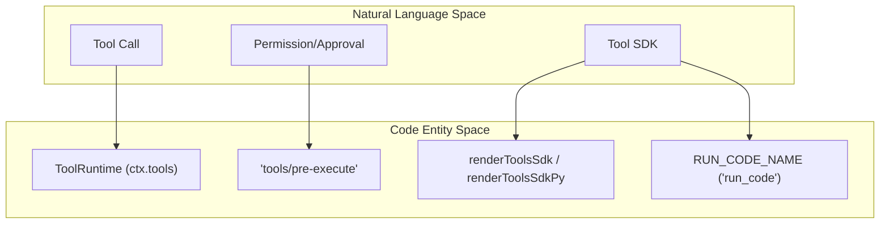

# Glossary

Relevant source files

The following files were used as context for generating this wiki page:

- [.agents/notes/implemented/bug-fix/2026-07-20-config-hot-reload-resilience.i18n.yaml](.agents/notes/implemented/bug-fix/2026-07-20-config-hot-reload-resilience.i18n.yaml)
- [.agents/notes/implemented/bug-fix/2026-07-20-config-hot-reload-resilience.md](.agents/notes/implemented/bug-fix/2026-07-20-config-hot-reload-resilience.md)
- [.agents/notes/implemented/bug-fix/2026-07-20-config-hot-reload-resilience.zh.md](.agents/notes/implemented/bug-fix/2026-07-20-config-hot-reload-resilience.zh.md)
- [.agents/notes/implemented/feature/2026-07-31-code-mode-language-dispatch.i18n.yaml](.agents/notes/implemented/feature/2026-07-31-code-mode-language-dispatch.i18n.yaml)
- [.agents/notes/implemented/feature/2026-07-31-code-mode-language-dispatch.md](.agents/notes/implemented/feature/2026-07-31-code-mode-language-dispatch.md)
- [.agents/notes/implemented/feature/2026-07-31-code-mode-language-dispatch.zh.md](.agents/notes/implemented/feature/2026-07-31-code-mode-language-dispatch.zh.md)
- [.agents/notes/implemented/process/2026-07-27-worktree-local-lefthook.i18n.yaml](.agents/notes/implemented/process/2026-07-27-worktree-local-lefthook.i18n.yaml)
- [.agents/notes/implemented/process/2026-07-27-worktree-local-lefthook.md](.agents/notes/implemented/process/2026-07-27-worktree-local-lefthook.md)
- [.agents/notes/implemented/process/2026-07-27-worktree-local-lefthook.zh.md](.agents/notes/implemented/process/2026-07-27-worktree-local-lefthook.zh.md)
- [.agents/notes/implemented/simplification/2026-07-23-acp-automation-only-protocol.i18n.yaml](.agents/notes/implemented/simplification/2026-07-23-acp-automation-only-protocol.i18n.yaml)
- [.agents/notes/implemented/simplification/2026-07-23-acp-automation-only-protocol.md](.agents/notes/implemented/simplification/2026-07-23-acp-automation-only-protocol.md)
- [.agents/notes/implemented/simplification/2026-07-23-acp-automation-only-protocol.zh.md](.agents/notes/implemented/simplification/2026-07-23-acp-automation-only-protocol.zh.md)
- [AGENTS.md](AGENTS.md)
- [docs/architecture.i18n.yaml](docs/architecture.i18n.yaml)
- [docs/architecture.md](docs/architecture.md)
- [docs/architecture.zh.md](docs/architecture.zh.md)
- [docs/capability-seams.md](docs/capability-seams.md)
- [docs/config-catalog.i18n.yaml](docs/config-catalog.i18n.yaml)
- [docs/config-catalog.md](docs/config-catalog.md)
- [docs/config-catalog.zh.md](docs/config-catalog.zh.md)
- [docs/development.i18n.yaml](docs/development.i18n.yaml)
- [docs/development.md](docs/development.md)
- [docs/development.zh.md](docs/development.zh.md)
- [docs/event-producer-consumer.md](docs/event-producer-consumer.md)
- [docs/module-graph.i18n.yaml](docs/module-graph.i18n.yaml)
- [docs/module-graph.md](docs/module-graph.md)
- [docs/module-graph.zh.md](docs/module-graph.zh.md)
- [docs/persistence-catalog.md](docs/persistence-catalog.md)
- [knip.json](knip.json)
- [package.json](package.json)
- [packages/README.i18n.yaml](packages/README.i18n.yaml)
- [packages/README.md](packages/README.md)
- [packages/README.zh.md](packages/README.zh.md)
- [packages/acp/acp/README.i18n.yaml](packages/acp/acp/README.i18n.yaml)
- [packages/acp/acp/README.md](packages/acp/acp/README.md)
- [packages/acp/acp/README.zh.md](packages/acp/acp/README.zh.md)
- [packages/acp/acp/src/codec.ts](packages/acp/acp/src/codec.ts)
- [packages/acp/acp/src/index.ts](packages/acp/acp/src/index.ts)
- [packages/acp/acp/tests/bridge.spec.ts](packages/acp/acp/tests/bridge.spec.ts)
- [packages/acp/acp/tests/codec.spec.ts](packages/acp/acp/tests/codec.spec.ts)
- [packages/acp/acp/tests/dispose.spec.ts](packages/acp/acp/tests/dispose.spec.ts)
- [packages/acp/acp/tests/edges.spec.ts](packages/acp/acp/tests/edges.spec.ts)
- [packages/acp/acp/tests/harness.ts](packages/acp/acp/tests/harness.ts)
- [packages/acp/acp/tests/turns.spec.ts](packages/acp/acp/tests/turns.spec.ts)
- [packages/client/connection/src/client/fixture.ts](packages/client/connection/src/client/fixture.ts)
- [packages/client/ui-conversation/tests/skeleton.client.spec.tsx](packages/client/ui-conversation/tests/skeleton.client.spec.tsx)
- [packages/core/agent-loop/README.md](packages/core/agent-loop/README.md)
- [packages/core/agent-loop/src/agent.ts](packages/core/agent-loop/src/agent.ts)
- [packages/core/agent-loop/src/index.ts](packages/core/agent-loop/src/index.ts)
- [packages/core/agent-loop/tests/agent.spec.ts](packages/core/agent-loop/tests/agent.spec.ts)
- [packages/core/agent-loop/tests/cancel.spec.ts](packages/core/agent-loop/tests/cancel.spec.ts)
- [packages/core/agent-loop/tests/config-session-id.spec.ts](packages/core/agent-loop/tests/config-session-id.spec.ts)
- [packages/core/agent-loop/tests/contract-regressions.spec.ts](packages/core/agent-loop/tests/contract-regressions.spec.ts)
- [packages/core/agent-loop/tests/coverage-edges.spec.ts](packages/core/agent-loop/tests/coverage-edges.spec.ts)
- [packages/core/agent-loop/tests/interception.spec.ts](packages/core/agent-loop/tests/interception.spec.ts)
- [packages/core/agent-loop/tests/loop.spec.ts](packages/core/agent-loop/tests/loop.spec.ts)
- [packages/core/agent-loop/tests/resume.spec.ts](packages/core/agent-loop/tests/resume.spec.ts)
- [packages/core/agent/README.md](packages/core/agent/README.md)
- [packages/core/agent/src/index.ts](packages/core/agent/src/index.ts)
- [packages/core/agent/src/types.ts](packages/core/agent/src/types.ts)
- [packages/core/agent/tests/agent.spec.ts](packages/core/agent/tests/agent.spec.ts)
- [packages/core/tools/README.i18n.yaml](packages/core/tools/README.i18n.yaml)
- [packages/core/tools/README.md](packages/core/tools/README.md)
- [packages/core/tools/README.zh.md](packages/core/tools/README.zh.md)
- [packages/core/tools/src/code-mode.ts](packages/core/tools/src/code-mode.ts)
- [packages/core/tools/src/index.ts](packages/core/tools/src/index.ts)
- [packages/core/tools/src/py-types.ts](packages/core/tools/src/py-types.ts)
- [packages/core/tools/tests/code-mode.spec.ts](packages/core/tools/tests/code-mode.spec.ts)
- [packages/core/tools/tests/py-types.spec.ts](packages/core/tools/tests/py-types.spec.ts)
- [packages/core/tools/tests/tools.spec.ts](packages/core/tools/tests/tools.spec.ts)
- [packages/extensions/cordis-client-runner/src/client/slot-catalog.ts](packages/extensions/cordis-client-runner/src/client/slot-catalog.ts)
- [packages/host/apiproxy/README.i18n.yaml](packages/host/apiproxy/README.i18n.yaml)
- [packages/host/apiproxy/README.md](packages/host/apiproxy/README.md)
- [packages/host/apiproxy/README.zh.md](packages/host/apiproxy/README.zh.md)
- [packages/host/apiproxy/src/api-proxy.ts](packages/host/apiproxy/src/api-proxy.ts)
- [packages/host/apiproxy/src/api/events.schema.ts](packages/host/apiproxy/src/api/events.schema.ts)
- [packages/host/apiproxy/src/api/events.ts](packages/host/apiproxy/src/api/events.ts)
- [packages/host/apiproxy/src/api/rpc-map.ts](packages/host/apiproxy/src/api/rpc-map.ts)
- [packages/host/apiproxy/src/api/sessions.schema.ts](packages/host/apiproxy/src/api/sessions.schema.ts)
- [packages/host/apiproxy/src/api/sessions.ts](packages/host/apiproxy/src/api/sessions.ts)
- [packages/host/apiproxy/src/fetch/client.ts](packages/host/apiproxy/src/fetch/client.ts)
- [packages/host/apiproxy/src/fetch/handler.ts](packages/host/apiproxy/src/fetch/handler.ts)
- [packages/host/apiproxy/tests/api-proxy-models.spec.ts](packages/host/apiproxy/tests/api-proxy-models.spec.ts)
- [packages/host/apiproxy/tests/api-proxy-projections.spec.ts](packages/host/apiproxy/tests/api-proxy-projections.spec.ts)
- [packages/host/apiproxy/tests/client-handler.spec.ts](packages/host/apiproxy/tests/client-handler.spec.ts)
- [packages/host/apiproxy/tests/fetch-carrier.spec.ts](packages/host/apiproxy/tests/fetch-carrier.spec.ts)
- [packages/host/apiproxy/tests/rpc-schemas.spec.ts](packages/host/apiproxy/tests/rpc-schemas.spec.ts)
- [packages/llm/llm-pi-ai/README.i18n.yaml](packages/llm/llm-pi-ai/README.i18n.yaml)
- [packages/llm/llm-pi-ai/README.md](packages/llm/llm-pi-ai/README.md)
- [packages/llm/llm-pi-ai/README.zh.md](packages/llm/llm-pi-ai/README.zh.md)
- [packages/llm/llm-pi-ai/src/adapter.ts](packages/llm/llm-pi-ai/src/adapter.ts)
- [packages/llm/llm-pi-ai/src/catalog.ts](packages/llm/llm-pi-ai/src/catalog.ts)
- [packages/llm/llm-pi-ai/src/config.ts](packages/llm/llm-pi-ai/src/config.ts)
- [packages/llm/llm-pi-ai/src/index.ts](packages/llm/llm-pi-ai/src/index.ts)
- [packages/llm/llm-pi-ai/tests/adapter.spec.ts](packages/llm/llm-pi-ai/tests/adapter.spec.ts)
- [packages/llm/llm-pi-ai/tests/catalog.spec.ts](packages/llm/llm-pi-ai/tests/catalog.spec.ts)
- [packages/llm/llm-pi-ai/tests/dynamic-config.spec.ts](packages/llm/llm-pi-ai/tests/dynamic-config.spec.ts)
- [pnpm-lock.yaml](pnpm-lock.yaml)
- [scripts/gen-cordis-catalog.ts](scripts/gen-cordis-catalog.ts)
- [scripts/gen-doc-graphs.ts](scripts/gen-doc-graphs.ts)
- [scripts/install-lefthook.mjs](scripts/install-lefthook.mjs)
- [scripts/install-lefthook.spec.ts](scripts/install-lefthook.spec.ts)
- [scripts/run-gates.ts](scripts/run-gates.ts)
- [scripts/type-equiv.manifest.json](scripts/type-equiv.manifest.json)
- [tsconfig.base.json](tsconfig.base.json)
- [tsconfig.json](tsconfig.json)
- [vendor/README.md](vendor/README.md)
- [vendor/cordis/src/context.ts](vendor/cordis/src/context.ts)
- [vendor/cordis/src/events.ts](vendor/cordis/src/events.ts)
- [vendor/cordis/src/fiber.ts](vendor/cordis/src/fiber.ts)
- [vendor/cordis/src/logger.ts](vendor/cordis/src/logger.ts)
- [vendor/cordis/src/reflect.ts](vendor/cordis/src/reflect.ts)
- [vendor/cordis/src/registry.ts](vendor/cordis/src/registry.ts)
- [vendor/cordis/src/service.ts](vendor/cordis/src/service.ts)
- [vendor/hmr/src/index.ts](vendor/hmr/src/index.ts)
- [vendor/include/src/index.ts](vendor/include/src/index.ts)
- [vendor/loader/src/config/entry.ts](vendor/loader/src/config/entry.ts)
- [vendor/loader/src/config/group.ts](vendor/loader/src/config/group.ts)
- [vendor/loader/src/config/isolate.ts](vendor/loader/src/config/isolate.ts)
- [vendor/loader/src/config/tree.ts](vendor/loader/src/config/tree.ts)
- [vendor/loader/src/index.ts](vendor/loader/src/index.ts)
- [vendor/loader/src/internal.ts](vendor/loader/src/internal.ts)
- [vendor/logger-console/src/browser.ts](vendor/logger-console/src/browser.ts)
- [vendor/logger-console/src/index.ts](vendor/logger-console/src/index.ts)

This glossary defines codebase-specific terms, jargon, and domain concepts used throughout the DeepSeek Harness (dsh) repository. It serves as a technical reference for onboarding engineers to understand how natural language concepts map to specific code entities.

## Core Concepts & Framework

### Cordis
The underlying plugin framework for dsh. In dsh, "everything is a plugin" [AGENTS.md:3-3](). Cordis manages a shared `Context` where plugins contribute services, events, and reversible effects [docs/architecture.md:9-14]().

### Context (`ctx`)
The central object in the Cordis framework. Services are attached to this object (e.g., `ctx.llm`, `ctx.tools`) and are accessible to any plugin injected into that context [docs/architecture.md:43-51]().

### Service
A named capability exposed on the Cordis `Context`. Services are defined by an interface and implemented by a provider [docs/architecture.md:98-102]().
- **Service Definition**: Declares the interface [docs/architecture.md:99-99]().
- **Service Provider**: Implements the interface [docs/architecture.md:99-99]().
- **Consumer**: Uses the service, typically a model-facing tool [docs/architecture.md:100-100]().

### Profile
A named composition of dsh, listing the bundles to stack and user-specific configuration (e.g., `web`, `headless`) [docs/architecture.md:19-20](). Composition mechanics are managed in `app-boot` [docs/architecture.md:37-37]().

### Bundle
A distribution format for Cordis configuration rows and the code they mount. The first layer of every profile is typically `dsh-base` [docs/architecture.md:21-25]().

### Capability Seam
A swappable architectural point where a Service Definition, Provider, and Consumer meet. Seams allow swapping implementations (e.g., local FS vs. remote sandbox) without changing the consumer logic [docs/architecture.md:98-103]().

---

## Agent & Execution Loop

### Turn
A high-level unit of interaction that opens when input is claimed and closes once the agent has no more work to perform (nothing "owed") [docs/architecture.md:65-66]().

### Step
A single iteration within a turn, consisting of one model request and the subsequent execution of the tools it calls [docs/architecture.md:65-65]().

### Inbox
The mechanism through which input reaches the agent driver. It handles user messages, follow-ups, and injected context [docs/architecture.md:86-87]().

### Waterfall
A Cordis event pattern where listeners are called sequentially, and each can modify the result or decide whether to call `next()` to delegate to the next listener [docs/architecture.md:84-84](). Key waterfalls include `agent/pre-step` [docs/event-producer-consumer.md:18-18]() and `tools/execute` [packages/core/tools/src/index.ts:163-163]().

### Code Mode
A tool execution strategy where the agent is provided with a `run_code` tool and an SDK representing available tools. Instead of calling tools directly, the agent writes and executes code to interact with the environment [packages/core/tools/src/index.ts:24-28]().

**Mapping: Natural Language to Code Entities (Loop)**

Sources: [docs/architecture.md:63-82](), [packages/core/agent/src/runtime-types.ts:231-231](), [packages/core/session/src/types.ts:25-28]()

---

## Data & Persistence

### Session Log
The append-only, durable record of all `SessionEvent`s. It is the single source of truth for the model's context [docs/architecture.md:92-94]().

### Surface
The in-memory projection or "view" derived from the Session Log. While the log is append-only, the surface provides the current state for the UI or model history derivation [docs/architecture.md:45-45](). The `foldSurface` function is used to project state [packages/client/connection/src/client/fixture.ts:33-33]().

### deriveMessages()
A core function that projects the model-visible history from the raw Session Log [docs/architecture.md:94-94]().

### SESSION_FORMAT_VERSION
A versioning constant used to track the schema of on-disk session data. During pre-release, this is kept at `0` with no compatibility promises [AGENTS.md:7-7]().

---

## Tooling & Interaction

### Tool Registry
The service (`ctx.tools`) responsible for managing available tools, their schemas, and the execution pipeline [docs/architecture.md:47-47]().

### Pre-execute / Execute / Post-execute
The three stages of the tool execution waterfall [packages/core/tools/src/index.ts:142-170]().
1. **Pre-execute**: Used for approval or denial [packages/core/tools/src/index.ts:152-152]().
2. **Execute**: The actual dispatch of the tool logic [packages/core/tools/src/index.ts:163-163]().
3. **Post-execute**: Used for enriching or blocking results [packages/core/tools/src/index.ts:165-165]().

### Approval Seam
An optional interaction point where a user or policy must approve a tool execution (e.g., `approval/request`) [docs/event-producer-consumer.md:24-24]().

**Mapping: Natural Language to Code Entities (Tools)**

Sources: [packages/core/tools/src/index.ts:137-165](), [packages/core/tools/src/code-mode.ts:24-24]()

---

## Domain Jargon

| Term | Definition | Code Pointer |
| :--- | :--- | :--- |
| **ACP** | Agent Client Protocol. An automation-focused protocol for driving agents. | [packages/acp/acp/src/index.ts:71]() |
| **BFF** | Backend-for-Frontend. The API layer (Typert/RPC) serving the web client. | [AGENTS.md:15-15]() |
| **DSH_HOME** | The home directory for DeepSeek Harness configuration and profiles. | [docs/config-catalog.md:112-112]() |
| **Landlock** | A Linux security feature used for filesystem sandboxing. | [AGENTS.md:50-50]() |
| **MCP** | Model Context Protocol. Used for bridging external tool providers. | [docs/module-graph.md:201-203]() |
| **Typert** | The internal system for type-safe RPC generation between host and client. | [AGENTS.md:16-16]() |
| **Zstandard** | The compression algorithm used for session artifact storage. | [docs/config-catalog.md:68-69]() |

Sources: [AGENTS.md:1-55](), [docs/config-catalog.md:1-120](), [packages/core/tools/src/index.ts:1-150]()
