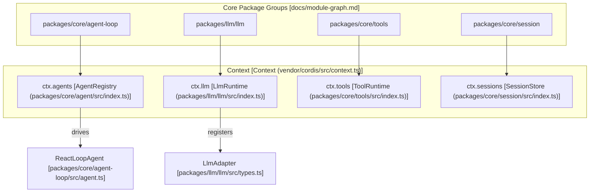

# Core Architecture

<details>
<summary>Relevant source files</summary>

The following files were used as context for generating this wiki page:

- [.agents/notes/implemented/bug-fix/2026-07-20-config-hot-reload-resilience.i18n.yaml](.agents/notes/implemented/bug-fix/2026-07-20-config-hot-reload-resilience.i18n.yaml)
- [.agents/notes/implemented/bug-fix/2026-07-20-config-hot-reload-resilience.md](.agents/notes/implemented/bug-fix/2026-07-20-config-hot-reload-resilience.md)
- [.agents/notes/implemented/bug-fix/2026-07-20-config-hot-reload-resilience.zh.md](.agents/notes/implemented/bug-fix/2026-07-20-config-hot-reload-resilience.zh.md)
- [docs/architecture.i18n.yaml](docs/architecture.i18n.yaml)
- [docs/architecture.md](docs/architecture.md)
- [docs/architecture.zh.md](docs/architecture.zh.md)
- [docs/capability-seams.md](docs/capability-seams.md)
- [docs/config-catalog.i18n.yaml](docs/config-catalog.i18n.yaml)
- [docs/config-catalog.md](docs/config-catalog.md)
- [docs/config-catalog.zh.md](docs/config-catalog.zh.md)
- [docs/event-producer-consumer.md](docs/event-producer-consumer.md)
- [docs/module-graph.i18n.yaml](docs/module-graph.i18n.yaml)
- [docs/module-graph.md](docs/module-graph.md)
- [docs/module-graph.zh.md](docs/module-graph.zh.md)
- [docs/persistence-catalog.md](docs/persistence-catalog.md)
- [knip.json](knip.json)
- [packages/client/ui-conversation/tests/skeleton.client.spec.tsx](packages/client/ui-conversation/tests/skeleton.client.spec.tsx)
- [packages/core/agent-loop/README.md](packages/core/agent-loop/README.md)
- [packages/core/agent-loop/src/agent.ts](packages/core/agent-loop/src/agent.ts)
- [packages/core/agent-loop/src/index.ts](packages/core/agent-loop/src/index.ts)
- [packages/core/agent-loop/tests/agent.spec.ts](packages/core/agent-loop/tests/agent.spec.ts)
- [packages/core/agent-loop/tests/cancel.spec.ts](packages/core/agent-loop/tests/cancel.spec.ts)
- [packages/core/agent-loop/tests/config-session-id.spec.ts](packages/core/agent-loop/tests/config-session-id.spec.ts)
- [packages/core/agent-loop/tests/contract-regressions.spec.ts](packages/core/agent-loop/tests/contract-regressions.spec.ts)
- [packages/core/agent-loop/tests/coverage-edges.spec.ts](packages/core/agent-loop/tests/coverage-edges.spec.ts)
- [packages/core/agent-loop/tests/interception.spec.ts](packages/core/agent-loop/tests/interception.spec.ts)
- [packages/core/agent-loop/tests/loop.spec.ts](packages/core/agent-loop/tests/loop.spec.ts)
- [packages/core/agent-loop/tests/resume.spec.ts](packages/core/agent-loop/tests/resume.spec.ts)
- [packages/core/agent/README.md](packages/core/agent/README.md)
- [packages/core/agent/src/index.ts](packages/core/agent/src/index.ts)
- [packages/core/agent/src/types.ts](packages/core/agent/src/types.ts)
- [packages/core/agent/tests/agent.spec.ts](packages/core/agent/tests/agent.spec.ts)
- [packages/extensions/cordis-client-runner/src/client/slot-catalog.ts](packages/extensions/cordis-client-runner/src/client/slot-catalog.ts)
- [packages/llm/llm-pi-ai/README.i18n.yaml](packages/llm/llm-pi-ai/README.i18n.yaml)
- [packages/llm/llm-pi-ai/README.md](packages/llm/llm-pi-ai/README.md)
- [packages/llm/llm-pi-ai/README.zh.md](packages/llm/llm-pi-ai/README.zh.md)
- [packages/llm/llm-pi-ai/src/adapter.ts](packages/llm/llm-pi-ai/src/adapter.ts)
- [packages/llm/llm-pi-ai/src/catalog.ts](packages/llm/llm-pi-ai/src/catalog.ts)
- [packages/llm/llm-pi-ai/src/config.ts](packages/llm/llm-pi-ai/src/config.ts)
- [packages/llm/llm-pi-ai/src/index.ts](packages/llm/llm-pi-ai/src/index.ts)
- [packages/llm/llm-pi-ai/tests/adapter.spec.ts](packages/llm/llm-pi-ai/tests/adapter.spec.ts)
- [packages/llm/llm-pi-ai/tests/catalog.spec.ts](packages/llm/llm-pi-ai/tests/catalog.spec.ts)
- [packages/llm/llm-pi-ai/tests/dynamic-config.spec.ts](packages/llm/llm-pi-ai/tests/dynamic-config.spec.ts)
- [pnpm-lock.yaml](pnpm-lock.yaml)
- [scripts/gen-cordis-catalog.ts](scripts/gen-cordis-catalog.ts)
- [scripts/gen-doc-graphs.ts](scripts/gen-doc-graphs.ts)
- [scripts/type-equiv.manifest.json](scripts/type-equiv.manifest.json)
- [tsconfig.base.json](tsconfig.base.json)
- [tsconfig.json](tsconfig.json)
- [vendor/README.md](vendor/README.md)
- [vendor/cordis/src/context.ts](vendor/cordis/src/context.ts)
- [vendor/cordis/src/events.ts](vendor/cordis/src/events.ts)
- [vendor/cordis/src/fiber.ts](vendor/cordis/src/fiber.ts)
- [vendor/cordis/src/logger.ts](vendor/cordis/src/logger.ts)
- [vendor/cordis/src/reflect.ts](vendor/cordis/src/reflect.ts)
- [vendor/cordis/src/registry.ts](vendor/cordis/src/registry.ts)
- [vendor/cordis/src/service.ts](vendor/cordis/src/service.ts)
- [vendor/hmr/src/index.ts](vendor/hmr/src/index.ts)
- [vendor/include/src/index.ts](vendor/include/src/index.ts)
- [vendor/loader/src/config/entry.ts](vendor/loader/src/config/entry.ts)
- [vendor/loader/src/config/group.ts](vendor/loader/src/config/group.ts)
- [vendor/loader/src/config/isolate.ts](vendor/loader/src/config/isolate.ts)
- [vendor/loader/src/config/tree.ts](vendor/loader/src/config/tree.ts)
- [vendor/loader/src/index.ts](vendor/loader/src/index.ts)
- [vendor/loader/src/internal.ts](vendor/loader/src/internal.ts)
- [vendor/logger-console/src/browser.ts](vendor/logger-console/src/browser.ts)
- [vendor/logger-console/src/index.ts](vendor/logger-console/src/index.ts)

</details>


DeepSeek Harness (dsh) is built on a modular, plugin-first architecture using the **Cordis** framework. Every functional component—from the LLM adapters and tool registries to the session logs and the agent loop itself—is a plugin that contributes services and effects to a shared context [docs/architecture.md:9-14]().

## The Cordis Plugin Framework

DSH leverages a vendored version of the **Cordis** framework to manage its lifecycle. Plugins are the fundamental unit of composition; they provide **Services** (accessible via `ctx.serviceName`), listen to **Events**, and manage reversible side effects [docs/architecture.md:9-14]().

*   **Service Injection:** Plugins declare dependencies using the `inject` property. The runtime ensures that a plugin only starts once its required services are available [docs/config-catalog.md:10-10]().
*   **Context Declaration Merging:** TypeScript interfaces are merged to provide type-safe access to services on the `Context` object (e.g., `ctx.llm`, `ctx.agents`) [tsconfig.base.json:31-103]().
*   **Disposable Effects:** When a plugin is unloaded, all its registrations (tools, events, services) are automatically cleaned up [docs/architecture.md:13-14]().

For details, see [Cordis Framework & Vendored Dependencies](#2.1).

## Plugin Composition: Profiles & Bundles

A running instance of `dsh` is assembled from ordered layers of configuration and code [docs/architecture.md:17-17]().

| Entity | Description |
| :--- | :--- |
| **Profile** | A named composition (e.g., `web`, `headless`) that defines which bundles to stack and provides user-level patches [docs/architecture.md:19-21](). |
| **Bundle** | A distribution of Cordis config rows (e.g., `dsh-base`) that provides a baseline set of features [docs/architecture.md:21-23](). |
| **Patch** | A YAML-based override (`cordis.patch.yml`) that can modify any configuration row in the tree by its ID [docs/architecture.md:27-28](). |

The final configuration tree can be inspected using the `dsh --profile web --dump-config` command [docs/architecture.md:29-33]().

For details, see [Plugin Composition: Profiles, Bundles & Configuration](#2.2).

## Event Bus & Capability Seams

Communication between subsystems is handled via a central event bus and well-defined "capability seams."

### The Event Bus
DSH uses three primary event domains to facilitate decoupled communication [docs/architecture.md:53-60]():
1.  **Session Events:** Durable facts appended to the log (e.g., `user/message`, `assistant/chunk`) [docs/architecture.md:57-57]().
2.  **Agent Events:** Live lifecycle hooks for the agent loop (e.g., `agent/pre-step`, `agent/status`) [docs/architecture.md:58-58]().
3.  **Capability Events:** Policy and adapter attachments for specific seams (e.g., `fs/*`, `tools/*`) [docs/architecture.md:59-59]().

### Capability Seams
A **seam** is a swappable interface that allows the system to change behavior by swapping a provider without changing the consumer [docs/architecture.md:98-103](). For example, swapping the `fs` provider moves all filesystem tools (Read, Write, Search) from local disk to a remote sandbox [docs/architecture.md:101-103]().

### System Component Map
The following diagram maps high-level system concepts to their specific code entities and service keys.

**Architecture Component Map**

Sources: [docs/architecture.md:43-51](), [packages/core/agent-loop/src/agent.ts:64-64](), [docs/module-graph.md:19-35](), [docs/event-producer-consumer.md:8-23]()

For details, see [Event Bus & Capability Seams](#2.3).

## Turn Flow and Execution

The **Agent Loop** orchestrates the interaction between the LLM and the execution environment through **Turns** and **Steps** [docs/architecture.md:63-65]().

1.  **Turn:** A complete interaction cycle that opens on user input and closes when no further model actions are owed [docs/architecture.md:65-65]().
2.  **Step:** A single model request followed by the execution of any resulting tool calls [docs/architecture.md:63-63]().

**Step Execution Pipeline**
```mermaid
sequenceDiagram
    participant AL as ReactLoopAgent [packages/core/agent-loop/src/agent.ts]
    participant EV as EventBus [ctx.emit / ctx.waterfall]
    participant LLM as LlmRuntime [ctx.llm]
    participant TR as ToolRuntime [ctx.tools]

    Note over AL, TR: Turn starts on inbox claim
    AL->>EV: "agent/pre-step" (waterfall)
    AL->>LLM: "agent/request" -> llm.generate()
    LLM-->>AL: "assistant/chunk" -> "assistant/message"
    AL->>EV: "tools/pre-execute" (waterfall)
    AL->>TR: tools.execute()
    TR-->>AL: "tool/result"
    AL->>EV: "tools/post-execute" (waterfall)
    Note over AL, TR: Step ends; check for followup
```
Sources: [docs/architecture.md:67-82](), [packages/core/agent-loop/src/agent.ts:86-111](), [docs/event-producer-consumer.md:18-20]()

## Subsystem Navigation

*   **[Cordis Framework & Vendored Dependencies](#2.1):** Lifecycle, service injection, and modifications to the upstream framework.
*   **[Plugin Composition: Profiles, Bundles & Configuration](#2.2):** How the system is assembled and patched.
*   **[Event Bus & Capability Seams](#2.3):** Detailed map of event flows and swappable capability interfaces.
