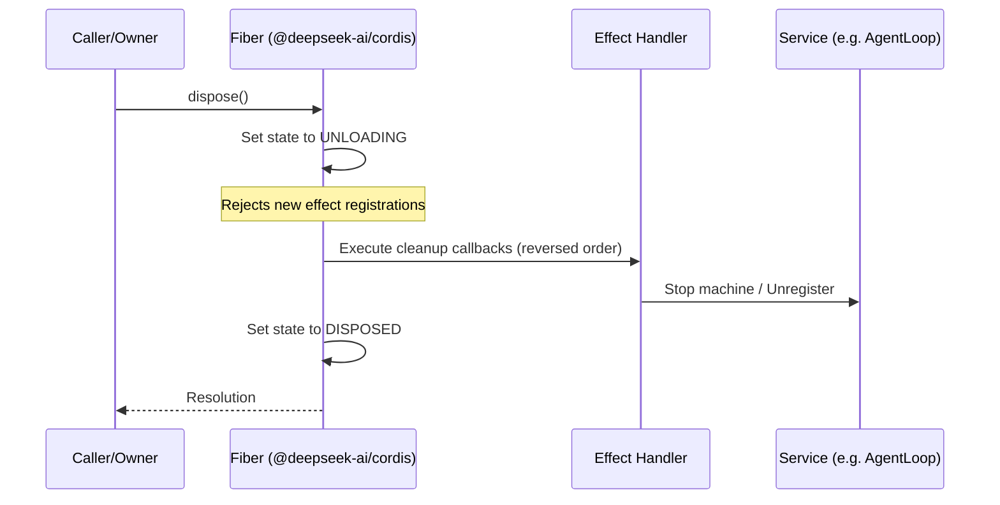
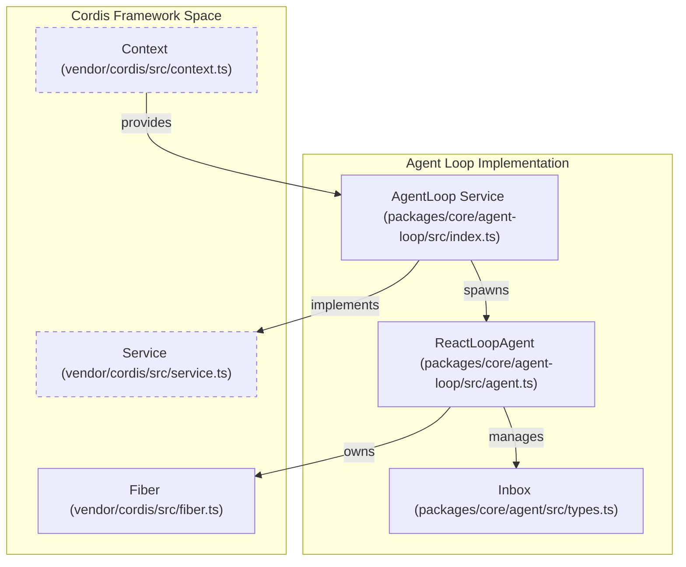

# Cordis Framework & Vendored Dependencies

<details>
<summary>Relevant source files</summary>

The following files were used as context for generating this wiki page:

- [.agents/notes/implemented/bug-fix/2026-07-20-config-hot-reload-resilience.i18n.yaml](.agents/notes/implemented/bug-fix/2026-07-20-config-hot-reload-resilience.i18n.yaml)
- [.agents/notes/implemented/bug-fix/2026-07-20-config-hot-reload-resilience.md](.agents/notes/implemented/bug-fix/2026-07-20-config-hot-reload-resilience.md)
- [.agents/notes/implemented/bug-fix/2026-07-20-config-hot-reload-resilience.zh.md](.agents/notes/implemented/bug-fix/2026-07-20-config-hot-reload-resilience.zh.md)
- [docs/capability-seams.md](docs/capability-seams.md)
- [docs/config-catalog.i18n.yaml](docs/config-catalog.i18n.yaml)
- [docs/config-catalog.md](docs/config-catalog.md)
- [docs/config-catalog.zh.md](docs/config-catalog.zh.md)
- [docs/event-producer-consumer.md](docs/event-producer-consumer.md)
- [docs/module-graph.i18n.yaml](docs/module-graph.i18n.yaml)
- [docs/module-graph.md](docs/module-graph.md)
- [docs/module-graph.zh.md](docs/module-graph.zh.md)
- [docs/persistence-catalog.md](docs/persistence-catalog.md)
- [knip.json](knip.json)
- [packages/client/ui-conversation/tests/skeleton.client.spec.tsx](packages/client/ui-conversation/tests/skeleton.client.spec.tsx)
- [packages/extensions/cordis-client-runner/src/client/slot-catalog.ts](packages/extensions/cordis-client-runner/src/client/slot-catalog.ts)
- [packages/llm/llm-pi-ai/README.i18n.yaml](packages/llm/llm-pi-ai/README.i18n.yaml)
- [packages/llm/llm-pi-ai/README.md](packages/llm/llm-pi-ai/README.md)
- [packages/llm/llm-pi-ai/README.zh.md](packages/llm/llm-pi-ai/README.zh.md)
- [packages/llm/llm-pi-ai/src/adapter.ts](packages/llm/llm-pi-ai/src/adapter.ts)
- [packages/llm/llm-pi-ai/src/catalog.ts](packages/llm/llm-pi-ai/src/catalog.ts)
- [packages/llm/llm-pi-ai/src/config.ts](packages/llm/llm-pi-ai/src/config.ts)
- [packages/llm/llm-pi-ai/src/index.ts](packages/llm/llm-pi-ai/src/index.ts)
- [packages/llm/llm-pi-ai/tests/adapter.spec.ts](packages/llm/llm-pi-ai/tests/adapter.spec.ts)
- [packages/llm/llm-pi-ai/tests/catalog.spec.ts](packages/llm/llm-pi-ai/tests/catalog.spec.ts)
- [packages/llm/llm-pi-ai/tests/dynamic-config.spec.ts](packages/llm/llm-pi-ai/tests/dynamic-config.spec.ts)
- [pnpm-lock.yaml](pnpm-lock.yaml)
- [scripts/gen-cordis-catalog.ts](scripts/gen-cordis-catalog.ts)
- [scripts/gen-doc-graphs.ts](scripts/gen-doc-graphs.ts)
- [scripts/type-equiv.manifest.json](scripts/type-equiv.manifest.json)
- [tsconfig.base.json](tsconfig.base.json)
- [tsconfig.json](tsconfig.json)
- [vendor/README.md](vendor/README.md)
- [vendor/cordis/src/context.ts](vendor/cordis/src/context.ts)
- [vendor/cordis/src/events.ts](vendor/cordis/src/events.ts)
- [vendor/cordis/src/fiber.ts](vendor/cordis/src/fiber.ts)
- [vendor/cordis/src/logger.ts](vendor/cordis/src/logger.ts)
- [vendor/cordis/src/reflect.ts](vendor/cordis/src/reflect.ts)
- [vendor/cordis/src/registry.ts](vendor/cordis/src/registry.ts)
- [vendor/cordis/src/service.ts](vendor/cordis/src/service.ts)
- [vendor/hmr/src/index.ts](vendor/hmr/src/index.ts)
- [vendor/include/src/index.ts](vendor/include/src/index.ts)
- [vendor/loader/src/config/entry.ts](vendor/loader/src/config/entry.ts)
- [vendor/loader/src/config/group.ts](vendor/loader/src/config/group.ts)
- [vendor/loader/src/config/isolate.ts](vendor/loader/src/config/isolate.ts)
- [vendor/loader/src/config/tree.ts](vendor/loader/src/config/tree.ts)
- [vendor/loader/src/index.ts](vendor/loader/src/index.ts)
- [vendor/loader/src/internal.ts](vendor/loader/src/internal.ts)
- [vendor/logger-console/src/browser.ts](vendor/logger-console/src/browser.ts)
- [vendor/logger-console/src/index.ts](vendor/logger-console/src/index.ts)

</details>


DeepSeek Harness (dsh) is built upon the **Cordis** plugin framework. In dsh, every component—from model adapters and tool registries to the agent loop itself—is a plugin that contributes services, events, and effects to a shared context [docs/architecture.md:9-13](). This architecture ensures that no part of the system is a "privileged core"; everything is replaceable via configuration [docs/architecture.md:11-13]().

To ensure stability, auditability, and the ability to apply custom fixes, dsh **vendors** the Cordis framework and its foundation libraries into the `@deepseek-ai` scope [vendor/README.md:1-5]().

## 1. Vendored Dependencies & Modifications

The `vendor/` directory contains source-vendored copies of Cordis and its ecosystem. These are pinned and locally patched to meet the harness's strict reliability requirements [vendor/README.md:3-5]().

### 1.1 Dependency Manifest
The following core framework packages are vendored:

| Package | Scoped Name | Role |
| :--- | :--- | :--- |
| `cordis` | `@deepseek-ai/cordis` | Core dependency injection and plugin lifecycle framework [vendor/README.md:17](). |
| `loader` | `@deepseek-ai/cordis-plugin-loader` | Manages plugin loading, configuration, and HMR [vendor/README.md:18](). |
| `schemastery` | `@deepseek-ai/schemastery` | Structural typing and configuration schema validation [vendor/README.md:16](). |
| `cosmokit` | `@deepseek-ai/cosmokit` | General purpose utility library used by the framework [vendor/README.md:15](). |

### 1.2 Local Modifications
Significant hardening has been applied to the upstream source to support the complex lifecycle of autonomous agents:
*   **Fiber Lifecycle Hardening**: Fixed reentrant disposal gaps in `cordis/src/fiber.ts`. Effect creation is now rejected while an owner is `UNLOADING`, and synchronous setup failures trigger immediate rollbacks [vendor/README.md:38]().
*   **JSDoc Enrichment**: Extensive documentation of disposal semantics, waterfall vetoes, and error cases was added to the public API surface [vendor/README.md:39]().
*   **Loader Improvements**: `Fiber.update()` was modified to return waterfall results, allowing callers to await restarts while preserving synchronous validation [vendor/README.md:38]().
*   **Scoped Path Aliases**: The repository uses `tsconfig.base.json` to redirect imports from `@deepseek-ai/cordis` directly to `./vendor/cordis/src`, ensuring all packages compile against the vendored source [tsconfig.base.json:30-39]().

Sources: [vendor/README.md:1-39](), [vendor/cordis/src/fiber.ts:1-50](), [tsconfig.base.json:30-39]()

## 2. Plugin Lifecycle & Fiber Disposal

Cordis operates on a **Fiber**-based system. Every plugin instance is a fiber that manages its own resources and effects.

### 2.1 Service Injection & Context
Plugins interact via a `Context` object. Services are registered on this context and can be injected into other plugins using `ctx.inject` or by declaring them as dependencies.
*   **Declaration Merging**: Services are added to the `Context` interface via TypeScript declaration merging. For example, `packages/core/agent-loop` merges the `agentLoop` key into the `Context` interface [docs/config-catalog.md:139]().
*   **Reversible Effects**: Registrations (like events or services) are "effects" that are automatically unwound when the plugin's fiber is disposed [docs/architecture.md:13]().

### 2.2 The Disposal Flow
When a plugin or a specific `Agent` is torn down, Cordis ensures a clean unwinding of the stack.

Title: Cordis Fiber Disposal Sequence

Sources: [vendor/README.md:38](), [vendor/cordis/src/fiber.ts:1-100](), [vendor/cordis/src/context.ts:1-50]()

## 3. Implementation: The Agent Loop Seam

The `AgentLoop` service illustrates how dsh leverages Cordis to manage complex lifecycles. It provides the `AgentFactory` contract and drives the `ReactLoopAgent` [packages/core/agent-loop/src/index.ts:8-30]().

### 3.1 Scoped Contexts
Each `Agent` instance receives a **scoped context** via the `dsh-scope` library. This allows plugins to register tools or listeners that apply *only* to a specific agent session, preventing cross-agent event leakage [packages/core/agent/src/runtime-types.ts:159-168]().

### 3.2 System Interaction Map
This diagram bridges the framework concepts (Context, Service) to the concrete loop implementation.

Title: Agent Loop Context & Service Association

Sources: [packages/core/agent-loop/src/index.ts:8-30](), [packages/core/agent-loop/src/agent.ts:64-97](), [vendor/cordis/src/service.ts:1-40]()

## 4. Event Bus & Waterfalls

Cordis provides a typed event bus. dsh categorizes these into three domains [docs/event-producer-consumer.md:8-32]():

1.  **Session Events**: Durable facts (e.g., `agent/created`, `agent/disposed`) appended to the log [docs/event-producer-consumer.md:12-13]().
2.  **Agent Events**: Live lifecycle hooks (e.g., `agent/pre-step`, `agent/status`) [docs/event-producer-consumer.md:18-22]().
3.  **Capability Events**: Policy and adapter attachments (e.g., `llm/stream`, `fs/*`) [docs/event-producer-consumer.md:33-40]().

### 4.1 Waterfall Mechanics
Events like `agent/pre-step` or `agent/request` are **waterfalls**. Listeners receive a `next` callback and must call it to allow the chain to continue. This pattern is used for intercepting and modifying model requests or injecting context [docs/event-producer-consumer.md:18-20]().

### 4.2 Data Flow Diagram
Title: Event Dispatch and Lifecycle Flow
```mermaid
flowchart LR
    A["User Input"] -->|wakeup| IB["Inbox (packages/core/agent-loop/src/agent.ts)"]
    IB -->|claim| TS["agent/inbox/claimed (Event)"]
    TS -->|assemble| PS["agent/pre-step (Waterfall)"]
    PS -->|next()| AR["agent/request (Waterfall)"]
    AR -->|stream| LLM["llm/stream (packages/llm/llm)"]
    LLM -->|chunk| AC["llm/stream-chunk (Event)"]
    AC -->|finalize| AM["llm/stream-end (Event)"]
    AM -->|close| TE["agent/turn-stopping (Serial)"]

    subgraph "Extension Points"
        PS
        AR
    end
```
Sources: [docs/event-producer-consumer.md:8-40](), [packages/core/agent-loop/src/agent.ts:113-134](), [vendor/cordis/src/events.ts:1-60]()

## 5. Configuration & Bootstrapping

The `loader` plugin manages the assembly of the plugin tree at boot. It uses `cordis.yml` to define the tree structure and provides the `Config` interface for each plugin [docs/config-catalog.md:6-10]().

*   **Plugin Config Catalog**: Every harness package declares a `Config` interface (e.g., `AcpConfig`, `AgentInstructionsConfig`) that the loader validates using `schemastery` [docs/config-catalog.md:19-28]().
*   **Service Requirements**: Plugins declare their dependencies via a `Requires:` line (e.g., `@deepseek-ai/dsh-agent-loop` requires `agents`, `sessions`, `llm`, `tools`, and `systemPrompt`) [docs/config-catalog.md:139]().
*   **Isolate Realm**: Used in configuration to ensure certain services are isolated to specific agent instances rather than shared globally, managed via `vendor/loader/src/config/isolate.ts` [vendor/loader/src/config/isolate.ts:1-15]().

Sources: [docs/config-catalog.md:1-145](), [vendor/loader/src/index.ts:1-20](), [vendor/loader/src/config/tree.ts:1-30]()
