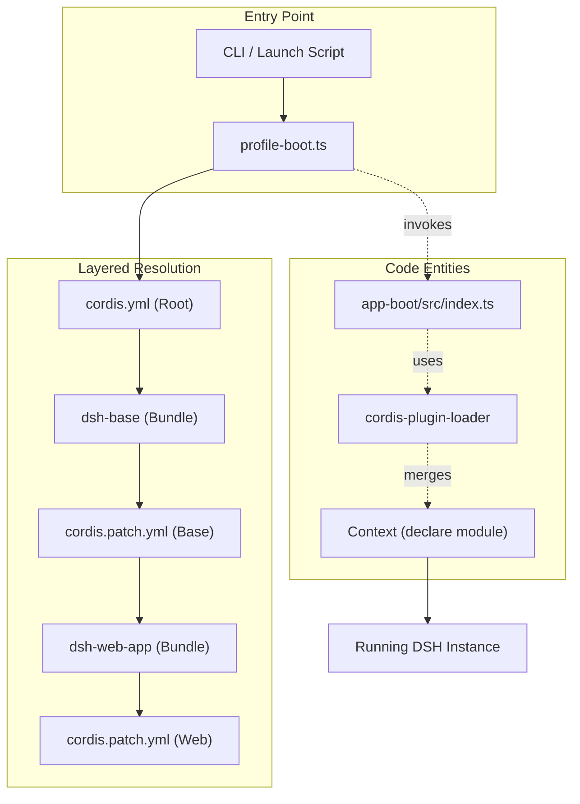
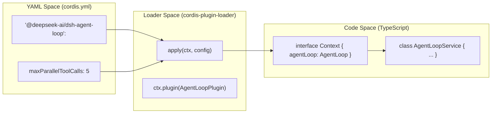

# Plugin Composition: Profiles, Bundles & Configuration

<details>
<summary>Relevant source files</summary>

The following files were used as context for generating this wiki page:

- [.agents/notes/implemented/architecture/2026-08-11-loader-entry-disabled-interpolation.i18n.yaml](.agents/notes/implemented/architecture/2026-08-11-loader-entry-disabled-interpolation.i18n.yaml)
- [.agents/notes/implemented/architecture/2026-08-11-loader-entry-disabled-interpolation.md](.agents/notes/implemented/architecture/2026-08-11-loader-entry-disabled-interpolation.md)
- [.agents/notes/implemented/architecture/2026-08-11-loader-entry-disabled-interpolation.zh.md](.agents/notes/implemented/architecture/2026-08-11-loader-entry-disabled-interpolation.zh.md)
- [.agents/notes/implemented/feature/2026-08-01-windows-pwsh-default.i18n.yaml](.agents/notes/implemented/feature/2026-08-01-windows-pwsh-default.i18n.yaml)
- [.agents/notes/implemented/feature/2026-08-01-windows-pwsh-default.md](.agents/notes/implemented/feature/2026-08-01-windows-pwsh-default.md)
- [.agents/notes/implemented/feature/2026-08-01-windows-pwsh-default.zh.md](.agents/notes/implemented/feature/2026-08-01-windows-pwsh-default.zh.md)
- [.agents/notes/implemented/simplification/2026-08-12-production-dsh-excludes-product-subagent-providers.i18n.yaml](.agents/notes/implemented/simplification/2026-08-12-production-dsh-excludes-product-subagent-providers.i18n.yaml)
- [.agents/notes/implemented/simplification/2026-08-12-production-dsh-excludes-product-subagent-providers.md](.agents/notes/implemented/simplification/2026-08-12-production-dsh-excludes-product-subagent-providers.md)
- [.agents/notes/implemented/simplification/2026-08-12-production-dsh-excludes-product-subagent-providers.zh.md](.agents/notes/implemented/simplification/2026-08-12-production-dsh-excludes-product-subagent-providers.zh.md)
- [apps/cli/composition.md](apps/cli/composition.md)
- [apps/cli/config/agent-presets/code/agent.cordis.yml](apps/cli/config/agent-presets/code/agent.cordis.yml)
- [apps/cli/config/agent-presets/cordis/agent.cordis.yml](apps/cli/config/agent-presets/cordis/agent.cordis.yml)
- [apps/cli/config/agent-presets/standard/agent.cordis.yml](apps/cli/config/agent-presets/standard/agent.cordis.yml)
- [apps/cli/tests/web-agent-presets.e2e.ts](apps/cli/tests/web-agent-presets.e2e.ts)
- [apps/cli/tests/windows-shell.spec.ts](apps/cli/tests/windows-shell.spec.ts)
- [docs/capability-seams.md](docs/capability-seams.md)
- [docs/config-catalog.i18n.yaml](docs/config-catalog.i18n.yaml)
- [docs/config-catalog.md](docs/config-catalog.md)
- [docs/config-catalog.zh.md](docs/config-catalog.zh.md)
- [docs/event-producer-consumer.md](docs/event-producer-consumer.md)
- [docs/module-graph.i18n.yaml](docs/module-graph.i18n.yaml)
- [docs/module-graph.md](docs/module-graph.md)
- [docs/module-graph.zh.md](docs/module-graph.zh.md)
- [docs/persistence-catalog.md](docs/persistence-catalog.md)
- [examples/README.md](examples/README.md)
- [examples/acp-agent/README.md](examples/acp-agent/README.md)
- [examples/acp-agent/composition.md](examples/acp-agent/composition.md)
- [examples/acp-agent/cordis.snapshot.yml](examples/acp-agent/cordis.snapshot.yml)
- [examples/acp-agent/cordis.yml](examples/acp-agent/cordis.yml)
- [examples/acp-agent/tests/acp.e2e.ts](examples/acp-agent/tests/acp.e2e.ts)
- [examples/acp-agent/tests/cleanup.e2e.ts](examples/acp-agent/tests/cleanup.e2e.ts)
- [examples/acp-agent/tests/cleanup.ts](examples/acp-agent/tests/cleanup.ts)
- [examples/acp-agent/tests/escalation.e2e.ts](examples/acp-agent/tests/escalation.e2e.ts)
- [examples/acp-agent/tests/hooks.e2e.ts](examples/acp-agent/tests/hooks.e2e.ts)
- [examples/headless-agent/composition.md](examples/headless-agent/composition.md)
- [examples/headless-agent/cordis.yml](examples/headless-agent/cordis.yml)
- [knip.json](knip.json)
- [packages/acp/README.md](packages/acp/README.md)
- [packages/boot/cmdline/package.json](packages/boot/cmdline/package.json)
- [packages/boot/cmdline/src/invariant.ts](packages/boot/cmdline/src/invariant.ts)
- [packages/bundle/base/README.i18n.yaml](packages/bundle/base/README.i18n.yaml)
- [packages/bundle/base/README.md](packages/bundle/base/README.md)
- [packages/bundle/base/README.zh.md](packages/bundle/base/README.zh.md)
- [packages/bundle/base/cordis.patch.yml](packages/bundle/base/cordis.patch.yml)
- [packages/bundle/base/package.json](packages/bundle/base/package.json)
- [packages/bundle/base/tests/base.spec.ts](packages/bundle/base/tests/base.spec.ts)
- [packages/bundle/headless/src/startup.ts](packages/bundle/headless/src/startup.ts)
- [packages/bundle/headless/tests/startup.spec.ts](packages/bundle/headless/tests/startup.spec.ts)
- [packages/bundle/web-app/README.i18n.yaml](packages/bundle/web-app/README.i18n.yaml)
- [packages/bundle/web-app/README.md](packages/bundle/web-app/README.md)
- [packages/bundle/web-app/README.zh.md](packages/bundle/web-app/README.zh.md)
- [packages/bundle/web-app/cordis.patch.yml](packages/bundle/web-app/cordis.patch.yml)
- [packages/bundle/web-app/package.json](packages/bundle/web-app/package.json)
- [packages/bundle/web-app/src/index.ts](packages/bundle/web-app/src/index.ts)
- [packages/bundle/web-app/src/startup.ts](packages/bundle/web-app/src/startup.ts)
- [packages/bundle/web-app/tests/startup.spec.ts](packages/bundle/web-app/tests/startup.spec.ts)
- [packages/bundle/web-app/tests/web-app.spec.ts](packages/bundle/web-app/tests/web-app.spec.ts)
- [packages/client/ui-conversation/tests/skeleton.client.spec.tsx](packages/client/ui-conversation/tests/skeleton.client.spec.tsx)
- [packages/extensions/cordis-client-runner/src/client/slot-catalog.ts](packages/extensions/cordis-client-runner/src/client/slot-catalog.ts)
- [packages/llm/llm-pi-ai/README.i18n.yaml](packages/llm/llm-pi-ai/README.i18n.yaml)
- [packages/llm/llm-pi-ai/README.md](packages/llm/llm-pi-ai/README.md)
- [packages/llm/llm-pi-ai/README.zh.md](packages/llm/llm-pi-ai/README.zh.md)
- [packages/llm/llm-pi-ai/src/adapter.ts](packages/llm/llm-pi-ai/src/adapter.ts)
- [packages/llm/llm-pi-ai/src/catalog.ts](packages/llm/llm-pi-ai/src/catalog.ts)
- [packages/llm/llm-pi-ai/src/config.ts](packages/llm/llm-pi-ai/src/config.ts)
- [packages/llm/llm-pi-ai/src/index.ts](packages/llm/llm-pi-ai/src/index.ts)
- [packages/llm/llm-pi-ai/tests/adapter.spec.ts](packages/llm/llm-pi-ai/tests/adapter.spec.ts)
- [packages/llm/llm-pi-ai/tests/catalog.spec.ts](packages/llm/llm-pi-ai/tests/catalog.spec.ts)
- [packages/llm/llm-pi-ai/tests/dynamic-config.spec.ts](packages/llm/llm-pi-ai/tests/dynamic-config.spec.ts)
- [pnpm-lock.yaml](pnpm-lock.yaml)
- [scripts/demo-code-mode.mjs](scripts/demo-code-mode.mjs)
- [scripts/gen-cordis-catalog.ts](scripts/gen-cordis-catalog.ts)
- [scripts/gen-doc-graphs.ts](scripts/gen-doc-graphs.ts)
- [scripts/type-equiv.manifest.json](scripts/type-equiv.manifest.json)
- [tsconfig.base.json](tsconfig.base.json)
- [tsconfig.json](tsconfig.json)

</details>


DeepSeek Harness (dsh) is assembled as a layered composition of Cordis plugins. A running instance is not a monolithic application but a dynamic tree of services and events defined by ordered configuration patches. This architecture allows the same codebase to run in diverse environments—from a local CLI to a web-hosted application or a headless agent—by swapping "bundles" and "profiles."

## Composition Layers: Profiles & Bundles

A dsh instance is booted by selecting a **Profile**, which specifies the entry point and the initial set of plugins. The composition is further organized into **Bundles**, which are packages that group related plugins and provide base configurations via `cordis.patch.yml` files.

### 1. Profiles
Profiles are the primary entry point for the application. They determine which environment is initialized (e.g., CLI, Web).
- **CLI Profile**: Managed via `apps/cli/src/profile-boot.ts`, it handles local execution and command-line argument parsing [apps/cli/src/profile-boot.ts:1-50]().
- **Agent Presets**: Specific configurations like `standard`, `code`, or `cordis` (for meta-programming dsh itself) are defined as presets [apps/cli/config/agent-presets/standard/agent.cordis.yml:1-10]().

### 2. Bundles
Bundles provide the structural foundation of the harness.
- **dsh-base**: The minimal set of plugins required for any harness instance, including core agent logic and basic filesystem access [packages/bundle/base/package.json:1-20]().
- **dsh-headless**: Extends base for non-interactive automation [packages/bundle/headless/package.json:1-20]().
- **dsh-web-app**: Adds the API gateway, web server, and browser-side client modules [packages/bundle/web-app/package.json:1-20]().

### Diagram: Composition Assembly Flow
The following diagram illustrates how the `AppBoot` service resolves the final plugin tree.


**Sources:** [apps/cli/src/profile-boot.ts:1-30](), [packages/boot/app-boot/src/index.ts:1-50](), [packages/bundle/base/README.md:1-10]().

---

## Configuration Mechanism

The harness uses `cordis.yml` and `cordis.patch.yml` files to define the plugin tree. The `cordis-plugin-loader` (a vendored dependency) processes these files to instantiate plugins and inject services.

### The Config Catalog
Every loadable harness package defines a `Config` interface in its entry point. These interfaces are extracted by `scripts/gen-config-catalog.ts` into a centralized reference document: `docs/config-catalog.md` [docs/config-catalog.md:1-10]().

Key characteristics of the configuration system:
- **Service Injection**: Plugins declare dependencies via `Requires:` lines in the catalog, mapping to Cordis `inject` properties [docs/config-catalog.md:10-10]().
- **Type Safety**: Config blocks are validated against Zod schemas generated from the TypeScript interfaces [docs/config-catalog.md:8-9]().
- **Deployment Axis**: Settings like `provider`, `model`, and `persistenceRoot` are swappable per deployment [docs/config-catalog.md:40-47]().

### Example: ACP Plugin Config
The Agent Client Protocol (ACP) plugin configuration demonstrates how runtime behavior is controlled:
```ts
/** Plugin config: the provider/model selection used for each ACP-created agent. */
export interface AcpConfig {
  /** Provider route for created agents. */
  provider?: string
  /** Model name for created agents. */
  model?: string
  /** Runtime-only transport override; production uses stdio. */
  stream?: Stream
}
```
**Sources:** [docs/config-catalog.md:14-32](), [packages/acp/acp/src/index.ts:71-80]().

---

## Inspection & Debugging Tools

To manage complex, multi-layered configurations, dsh provides tools to inspect the active state of the harness.

### dump-config
The `dump-config` utility (often used during development or CI) outputs the fully resolved plugin tree after all patches and environment variables have been applied. This is critical for debugging why a specific service failed to load or which plugin is providing a shared capability.

### Config-to-Code Mapping
The system maps YAML keys directly to `ctx` (Context) keys in the code via the `SERVICE_PAGE` mapping in the generator scripts [scripts/gen-cordis-catalog.ts:52-111]().

| YAML Plugin Key | Service Key (`ctx.<key>`) | Subsystem Page |
| :--- | :--- | :--- |
| `agent-loop` | `agentLoop` | `core.md` |
| `llm-deepseek` | `llm` | `llm-streaming.md` |
| `fs-local` | `fs` | `filesystem.md` |
| `api-gateway` | `typertGateway` | `typert.md` |

**Sources:** [docs/config-catalog.md:1-10](), [scripts/gen-cordis-catalog.ts:52-109]().

### Diagram: Data Flow from YAML to Service
This diagram bridges the gap between the natural language configuration and the TypeScript service entities.


**Sources:** [docs/config-catalog.md:145-150](), [scripts/gen-cordis-catalog.ts:53-53](), [packages/core/agent-loop/src/index.ts:1-10]().

---

## Service Roles & Implementations

The composition process determines which "Seam" implementations are active. A seam is a service key that can be fulfilled by different plugins depending on the bundle or profile [scripts/gen-doc-graphs.ts:99-100]().

| Service Key | Role | Common Implementations |
| :--- | :--- | :--- |
| `llm` | LLM adapter registry | `llm-deepseek`, `llm-pi-ai` [scripts/gen-doc-graphs.ts:110-117]() |
| `sessions` | In-memory session store | `session` [scripts/gen-doc-graphs.ts:135-141]() |
| `sessionPersistence` | Durable storage seam | `session-persistence-jsonl`, `session-persistence-sqlite` [scripts/gen-doc-graphs.ts:166-173]() |
| `attachments` | Binary storage | `attachment-local` [scripts/gen-doc-graphs.ts:100-108]() |

**Sources:** [docs/event-producer-consumer.md:8-33](), [scripts/gen-doc-graphs.ts:98-210]().
