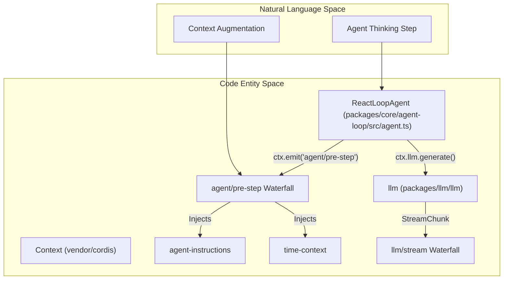
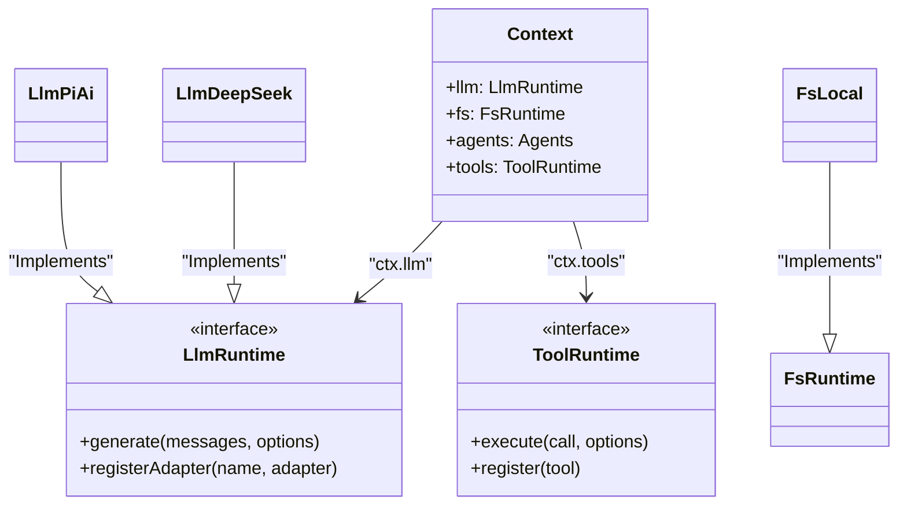

# Event Bus & Capability Seams

Relevant source files

The following files were used as context for generating this wiki page:

- [.agents/notes/implemented/architecture/2026-07-28-directory-picker-capability-seam.i18n.yaml](.agents/notes/implemented/architecture/2026-07-28-directory-picker-capability-seam.i18n.yaml)
- [.agents/notes/implemented/architecture/2026-07-28-directory-picker-capability-seam.md](.agents/notes/implemented/architecture/2026-07-28-directory-picker-capability-seam.md)
- [.agents/notes/implemented/architecture/2026-07-28-directory-picker-capability-seam.zh.md](.agents/notes/implemented/architecture/2026-07-28-directory-picker-capability-seam.zh.md)
- [docs/architecture.i18n.yaml](docs/architecture.i18n.yaml)
- [docs/architecture.md](docs/architecture.md)
- [docs/architecture.zh.md](docs/architecture.zh.md)
- [docs/capability-seams.md](docs/capability-seams.md)
- [docs/config-catalog.i18n.yaml](docs/config-catalog.i18n.yaml)
- [docs/config-catalog.md](docs/config-catalog.md)
- [docs/config-catalog.zh.md](docs/config-catalog.zh.md)
- [docs/event-producer-consumer.md](docs/event-producer-consumer.md)
- [docs/module-graph.i18n.yaml](docs/module-graph.i18n.yaml)
- [docs/module-graph.md](docs/module-graph.md)
- [docs/module-graph.zh.md](docs/module-graph.zh.md)
- [docs/persistence-catalog.md](docs/persistence-catalog.md)
- [knip.json](knip.json)
- [packages/client/ui-conversation/tests/skeleton.client.spec.tsx](packages/client/ui-conversation/tests/skeleton.client.spec.tsx)
- [packages/core/agent-loop/README.md](packages/core/agent-loop/README.md)
- [packages/core/agent-loop/src/agent.ts](packages/core/agent-loop/src/agent.ts)
- [packages/core/agent-loop/src/index.ts](packages/core/agent-loop/src/index.ts)
- [packages/core/agent-loop/tests/agent.spec.ts](packages/core/agent-loop/tests/agent.spec.ts)
- [packages/core/agent-loop/tests/cancel.spec.ts](packages/core/agent-loop/tests/cancel.spec.ts)
- [packages/core/agent-loop/tests/config-session-id.spec.ts](packages/core/agent-loop/tests/config-session-id.spec.ts)
- [packages/core/agent-loop/tests/contract-regressions.spec.ts](packages/core/agent-loop/tests/contract-regressions.spec.ts)
- [packages/core/agent-loop/tests/coverage-edges.spec.ts](packages/core/agent-loop/tests/coverage-edges.spec.ts)
- [packages/core/agent-loop/tests/interception.spec.ts](packages/core/agent-loop/tests/interception.spec.ts)
- [packages/core/agent-loop/tests/loop.spec.ts](packages/core/agent-loop/tests/loop.spec.ts)
- [packages/core/agent-loop/tests/resume.spec.ts](packages/core/agent-loop/tests/resume.spec.ts)
- [packages/core/agent/README.md](packages/core/agent/README.md)
- [packages/core/agent/src/index.ts](packages/core/agent/src/index.ts)
- [packages/core/agent/src/types.ts](packages/core/agent/src/types.ts)
- [packages/core/agent/tests/agent.spec.ts](packages/core/agent/tests/agent.spec.ts)
- [packages/extensions/cordis-client-runner/src/client/slot-catalog.ts](packages/extensions/cordis-client-runner/src/client/slot-catalog.ts)
- [packages/host/apiproxy/src/api/host.schema.ts](packages/host/apiproxy/src/api/host.schema.ts)
- [packages/host/apiproxy/src/api/host.ts](packages/host/apiproxy/src/api/host.ts)
- [packages/host/directory-picker-browse/README.i18n.yaml](packages/host/directory-picker-browse/README.i18n.yaml)
- [packages/host/directory-picker-browse/README.md](packages/host/directory-picker-browse/README.md)
- [packages/host/directory-picker-browse/README.zh.md](packages/host/directory-picker-browse/README.zh.md)
- [packages/host/directory-picker-browse/src/index.ts](packages/host/directory-picker-browse/src/index.ts)
- [packages/host/directory-picker-browse/tests/service.spec.ts](packages/host/directory-picker-browse/tests/service.spec.ts)
- [packages/host/directory-picker/src/index.ts](packages/host/directory-picker/src/index.ts)
- [packages/llm/llm-pi-ai/README.i18n.yaml](packages/llm/llm-pi-ai/README.i18n.yaml)
- [packages/llm/llm-pi-ai/README.md](packages/llm/llm-pi-ai/README.md)
- [packages/llm/llm-pi-ai/README.zh.md](packages/llm/llm-pi-ai/README.zh.md)
- [packages/llm/llm-pi-ai/src/adapter.ts](packages/llm/llm-pi-ai/src/adapter.ts)
- [packages/llm/llm-pi-ai/src/catalog.ts](packages/llm/llm-pi-ai/src/catalog.ts)
- [packages/llm/llm-pi-ai/src/config.ts](packages/llm/llm-pi-ai/src/config.ts)
- [packages/llm/llm-pi-ai/src/index.ts](packages/llm/llm-pi-ai/src/index.ts)
- [packages/llm/llm-pi-ai/tests/adapter.spec.ts](packages/llm/llm-pi-ai/tests/adapter.spec.ts)
- [packages/llm/llm-pi-ai/tests/catalog.spec.ts](packages/llm/llm-pi-ai/tests/catalog.spec.ts)
- [packages/llm/llm-pi-ai/tests/dynamic-config.spec.ts](packages/llm/llm-pi-ai/tests/dynamic-config.spec.ts)
- [pnpm-lock.yaml](pnpm-lock.yaml)
- [scripts/gen-cordis-catalog.ts](scripts/gen-cordis-catalog.ts)
- [scripts/gen-doc-graphs.ts](scripts/gen-doc-graphs.ts)
- [scripts/type-equiv.manifest.json](scripts/type-equiv.manifest.json)
- [tsconfig.base.json](tsconfig.base.json)
- [tsconfig.json](tsconfig.json)

DeepSeek Harness (dsh) employs an event-driven architecture built upon the Cordis plugin framework. Communication between decoupled subsystems is mediated by a central **Event Bus**, while external interactions (I/O, LLM calls, filesystem access) are abstracted through **Capability Seams**. This design allows the core agent logic to remain agnostic of specific implementations, such as whether a shell command runs locally or in an E2B sandbox.

## 1. Event-Driven Communication

The system uses three primary event patterns: `emit` (one-to-many notification), `parallel` (concurrent execution), and `waterfall` (sequential data transformation).

### 1.1 Session & Agent Events
The lifecycle of an agent and its interactions are broadcast via the event bus. The `sessions` service acts as the primary coordinator for these events [docs/architecture.md:45-45]().

*   **`agent/created`**: Dispatched when a new agent instance is initialized [docs/event-producer-consumer.md:12-12]().
*   **`agent/pre-step`**: A critical `waterfall` event where plugins (like `agent-instructions` or `time-context`) inject information into the agent's context before the LLM is called [docs/event-producer-consumer.md:18-18]().
*   **`agent/status`**: Signals state changes in the agent loop (e.g., `idle`, `running`) [docs/event-producer-consumer.md:22-22]().
*   **`agent/inbox/claimed`**: Dispatched when the driver picks up a message from the inbox to start a turn [docs/event-producer-consumer.md:15-15]().

### 1.2 LLM & Stream Waterfalls
LLM interactions are handled via the `llm` service, which manages a registry of adapters [docs/architecture.md:51-51](). Streaming responses use a waterfall pattern to allow middleware to process chunks (e.g., token metering or reasoning extraction) before they reach the UI or session log.

### Event Flow: Agent Step Execution
This diagram bridges the conceptual "Agent Step" to the internal Cordis event dispatchers.

**Sources:** [docs/event-producer-consumer.md:18-20](), [docs/architecture.md:67-82](), [packages/core/agent-loop/src/agent.ts:86-97]()

---

## 2. Capability Seams

Capability Seams are Cordis services that define a standard interface for sensitive or environment-dependent operations. By injecting these seams, the `agent-loop` and `tools` remain portable across different host environments [docs/architecture.md:98-103]().

### 2.1 Key Capability Seams
The following table maps the capability seams to their primary implementations and consumers.

| Seam (Service Key) | Purpose | Primary Implementation | Key Consumers |
| :--- | :--- | :--- | :--- |
| `ctx.llm` | LLM Provider Abstraction | `llm-deepseek`, `llm-pi-ai` | `agent-loop`, `compaction-basic` |
| `ctx.fs` | Filesystem Access | `fs-local`, `fs-sandbox` | `tool-fs`, `agent-instructions` |
| `ctx.shell` | Command Execution | `pwsh-local` | `tool-bash`, `tool-pwsh` |
| `ctx.subprocess` | Process Spawning | `subprocess-local` | `code-runtime`, `terminal` |
| `ctx.tools` | Tool Registry | `tools` | `agent-loop`, `subagent` |
| `ctx.agents` | Agent Registry | `agent` | `apiproxy`, `acp` |

**Sources:** [docs/architecture.md:43-51](), [docs/module-graph.md:19-69](), [docs/config-catalog.md:139-141]()

### 2.2 The Seam Pattern Implementation
Seams are defined as services that contribute to a shared context. A **Service Definition** declares the interface, a **Service Provider** implements it, and a **Consumer** uses it [docs/architecture.md:100-100]().

**Sources:** [docs/architecture.md:43-51](), [docs/config-catalog.md:139-141](), [packages/core/agent-loop/src/agent.ts:70-71]()

---

## 3. Event Producer-Consumer Map

The interaction between packages is strictly governed by the event bus. Below is a subset of the high-traffic events within the harness.

| Event | Mode | Dispatcher (Producer) | Listeners (Consumers) |
| :--- | :--- | :--- | :--- |
| `agent/inbox/inserted` | `emit` | `agent-loop` | `goal-round-driver` |
| `agent/request` | `waterfall` | `agent-loop` | `agent` |
| `agent/pre-step` | `waterfall` | `agent-loop` | `agent-instructions`, `time-context`, `plan-mode` |
| `llm/stream` | `waterfall` | `llm` | `token-meter`, `apiproxy` |
| `approval/request` | `waterfall` | `user-approval` | `acp`, `apiproxy` |
| `session/event` | `emit` | `sessions` | `persistence`, `session-query` |

**Sources:** [docs/event-producer-consumer.md:8-40](), [packages/core/agent-loop/src/agent.ts:88-91]()

### 3.1 Data Flow: Tool Execution Seam
When an agent decides to use a tool, it goes through the `tools` capability seam, which triggers a series of events to ensure safety and logging [docs/architecture.md:77-77]().

1.  **`agent-loop`** identifies tool calls in the LLM response.
2.  **`executeToolCalls`** is invoked in `packages/core/agent-loop/src/tool-calls.ts` [packages/core/agent-loop/src/agent.ts:36-36]().
3.  **`tool/pre-execute`** waterfall allows `sandbox` or `approval` services to intercept the call.
4.  The tool implementation executes (potentially using `ctx.fs` or `ctx.shell`).
5.  **`tool/post-execute`** waterfall allows for result pruning or metadata attachment.
6.  The result is returned to the `agent-loop` and appended to the session log as a `tool/result` event [docs/architecture.md:77-77]().

**Sources:** [docs/architecture.md:67-82](), [packages/core/agent-loop/src/agent.ts:36-36](), [docs/event-producer-consumer.md:18-20]()
