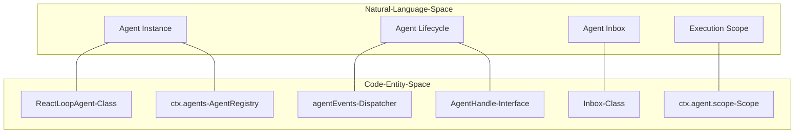
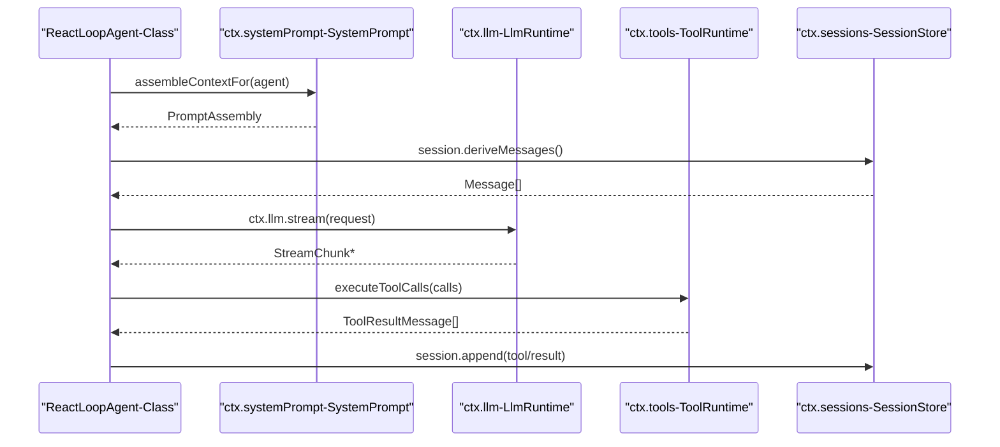

# Agent System

Relevant source files

The following files were used as context for generating this wiki page:

- [docs/architecture.i18n.yaml](docs/architecture.i18n.yaml)
- [docs/architecture.md](docs/architecture.md)
- [docs/architecture.zh.md](docs/architecture.zh.md)
- [packages/core/agent-loop/README.md](packages/core/agent-loop/README.md)
- [packages/core/agent-loop/src/agent.ts](packages/core/agent-loop/src/agent.ts)
- [packages/core/agent-loop/src/index.ts](packages/core/agent-loop/src/index.ts)
- [packages/core/agent-loop/tests/agent.spec.ts](packages/core/agent-loop/tests/agent.spec.ts)
- [packages/core/agent-loop/tests/cancel.spec.ts](packages/core/agent-loop/tests/cancel.spec.ts)
- [packages/core/agent-loop/tests/config-session-id.spec.ts](packages/core/agent-loop/tests/config-session-id.spec.ts)
- [packages/core/agent-loop/tests/contract-regressions.spec.ts](packages/core/agent-loop/tests/contract-regressions.spec.ts)
- [packages/core/agent-loop/tests/coverage-edges.spec.ts](packages/core/agent-loop/tests/coverage-edges.spec.ts)
- [packages/core/agent-loop/tests/interception.spec.ts](packages/core/agent-loop/tests/interception.spec.ts)
- [packages/core/agent-loop/tests/loop.spec.ts](packages/core/agent-loop/tests/loop.spec.ts)
- [packages/core/agent-loop/tests/resume.spec.ts](packages/core/agent-loop/tests/resume.spec.ts)
- [packages/core/agent/README.md](packages/core/agent/README.md)
- [packages/core/agent/src/index.ts](packages/core/agent/src/index.ts)
- [packages/core/agent/src/types.ts](packages/core/agent/src/types.ts)
- [packages/core/agent/tests/agent.spec.ts](packages/core/agent/tests/agent.spec.ts)
- [packages/core/session/README.md](packages/core/session/README.md)
- [packages/core/session/src/index.ts](packages/core/session/src/index.ts)
- [packages/core/session/src/surface.ts](packages/core/session/src/surface.ts)
- [packages/core/session/src/types.ts](packages/core/session/src/types.ts)
- [packages/core/session/tests/session.spec.ts](packages/core/session/tests/session.spec.ts)
- [packages/core/session/tests/surface.spec.ts](packages/core/session/tests/surface.spec.ts)
- [packages/session-query/session-query/src/tracing.ts](packages/session-query/session-query/src/tracing.ts)
- [packages/session-query/session-query/tests/tracing.spec.ts](packages/session-query/session-query/tests/tracing.spec.ts)

The Agent System is the core orchestration layer of DeepSeek Harness. It manages the lifecycle of autonomous agents, their interaction with LLMs, and the execution of tools. The system is built on a plugin-based architecture using the **Cordis** framework, where the agent loop itself is a replaceable service.

## Architectural Overview

Agents in `dsh` are driven by a turn-based state machine. A **Turn** represents a complete cycle of work, starting from a user input and ending when no further actions are required. Each turn consists of one or more **Steps**, where a step is defined as a single LLM request followed by the execution of any resulting tool calls [docs/architecture.md:67-82]().

### Core Components

| Service | Context Key | Responsibility |
|---|---|---|
| `AgentRegistry` | `ctx.agents` | Tracks live agents and carries the initiating initiator scope [packages/core/agent/README.md:9-11](). |
| `AgentLoop` | `ctx.agentLoop` | The concrete implementation of the agent driver and factory [packages/core/agent-loop/README.md:9-10](). |
| `ReactLoopAgent` | N/A | The default internal implementation of the `Agent` interface [packages/core/agent-loop/src/agent.ts:64-80](). |

### Entity Mapping: Natural Language to Code
The following diagram maps high-level agent concepts to their corresponding classes and service keys in the codebase.

Agent System Entity Map

Sources: [packages/core/agent-loop/src/agent.ts:64-97](), [packages/core/agent/README.md:9-15](), [packages/core/agent-loop/README.md:44-45]()

## Agent Lifecycle & The Loop
The `AgentLoop` service (provided by `dsh-agent-loop`) manages the creation and resumption of agents. Agents are identified by a `SessionId`, which is shared with their durable session log [packages/core/agent-loop/README.md:17-19](). 

The loop follows a `React` pattern managed by `ReactLoopAgent`:
1. **Claim**: Claim input from the `Inbox` [packages/core/agent-loop/src/agent.ts:87-91]().
2. **Assemble**: Gather system prompts and tool schemas via `assembleContextFor` [packages/core/agent/README.md:15-15]().
3. **Request**: Call the LLM via `ctx.llm` using `agent/request` [docs/architecture.md:76-76]().
4. **Execute**: Run tools via `ctx.tools` [docs/architecture.md:77-77]().
5. **Repeat**: If tools owe another request, start a new step [docs/architecture.md:79-79]().

For a deep dive into the state machine, cancellation, and turn boundaries, see **[Agent Loop & Lifecycle (#3.1)]**.

Sources: [docs/architecture.md:67-82](), [packages/core/agent-loop/src/agent.ts:172-183](), [packages/core/agent-loop/README.md:13-26]()

## Tool Registry & Execution
Capabilities are exposed to agents as tools. The `ToolRuntime` service (`ctx.tools`) manages a scoped registry where tools can be registered globally or for specific agents. The execution pipeline is guarded by a waterfall of events: `tools/pre-execute`, `tools/execute`, and `tools/post-execute` [docs/architecture.md:77-77]().

For details on tool registration, parallel execution, and "Code Mode," see **[Tool Registry & Execution Pipeline (#3.2)]**.

Sources: [docs/architecture.md:47-47](), [packages/core/agent-loop/src/tool-calls.ts:36-36]()

## Session Log & Persistence
Every action taken by an agent is recorded in an append-only `SessionEvent` log. This log is the "source of truth" for the agent's interaction history; the model's history is projected from this log using `deriveMessages()` [packages/core/session/README.md:5-7](). This ensures that any agent state can be reconstructed for resumption or forking [docs/architecture.md:92-94]().

For information on the event schema, lineage, and persistence backends (JSONL/SQLite), see **[Session Log & Persistence (#3.3)]**.

Sources: [docs/architecture.md:45-45](), [packages/core/session/README.md:39-46](), [packages/core/session/src/index.ts:71-76]()

## Subagent Orchestration
Agents can delegate tasks to subagents. This is handled via a capability seam (`ctx.subagents`), allowing for various implementations—from in-process child agents to out-of-process agents communicating via the **Agent Client Protocol (ACP)** [docs/architecture.md:100-102](). Runtime ownership is tracked via `ctx.agents.isOwnedBy()` [packages/core/agent/README.md:22-22]().

For orchestration policies and delegation mechanisms, see **[Subagent Orchestration (#3.4)]**.

Sources: [packages/core/agent/README.md:21-24](), [docs/architecture.md:100-102]()

## LLM Adapters
The agent loop is decoupled from specific LLM providers through the `LlmRuntime` (`ctx.llm`). Adapters translate the internal `Message` and `StreamChunk` vocabulary into provider-specific formats [docs/architecture.md:51-51]().

For details on streaming, block assembly, and adapter registration, see **[LLM Adapters & Streaming (#3.5)]**.

Sources: [docs/architecture.md:51-51](), [packages/core/agent-loop/src/agent.ts:19-27]()

## Service Interactions
The following diagram illustrates how the `AgentLoop` orchestrates various services during a single step.

Agent Step Orchestration

Sources: [docs/architecture.md:67-82](), [packages/core/agent-loop/src/agent.ts:18-37](), [packages/core/agent-loop/src/tool-calls.ts:36-36](), [packages/core/session/README.md:39-41]()
