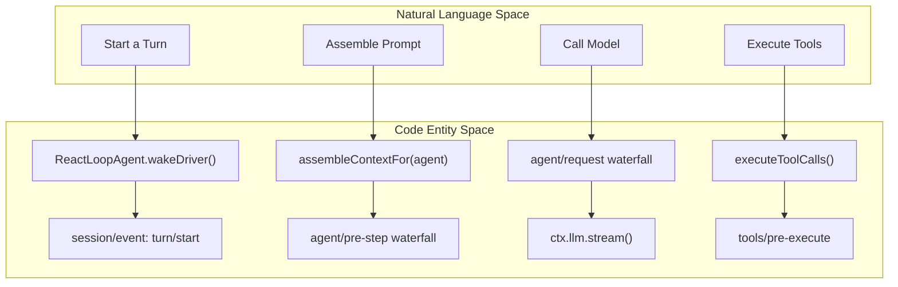
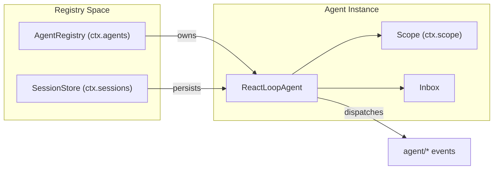

# Agent Loop & Lifecycle

<details>
<summary>Relevant source files</summary>

The following files were used as context for generating this wiki page:

- [.agents/notes/implemented/architecture/2026-07-12-scoped-layers-store.i18n.yaml](.agents/notes/implemented/architecture/2026-07-12-scoped-layers-store.i18n.yaml)
- [.agents/notes/implemented/architecture/2026-07-12-scoped-layers-store.md](.agents/notes/implemented/architecture/2026-07-12-scoped-layers-store.md)
- [.agents/notes/implemented/architecture/2026-07-12-scoped-layers-store.zh.md](.agents/notes/implemented/architecture/2026-07-12-scoped-layers-store.zh.md)
- [.agents/notes/implemented/architecture/2026-08-08-per-preset-standing-mounts.i18n.yaml](.agents/notes/implemented/architecture/2026-08-08-per-preset-standing-mounts.i18n.yaml)
- [.agents/notes/implemented/architecture/2026-08-08-per-preset-standing-mounts.md](.agents/notes/implemented/architecture/2026-08-08-per-preset-standing-mounts.md)
- [.agents/notes/implemented/architecture/2026-08-08-per-preset-standing-mounts.zh.md](.agents/notes/implemented/architecture/2026-08-08-per-preset-standing-mounts.zh.md)
- [docs/architecture.i18n.yaml](docs/architecture.i18n.yaml)
- [docs/architecture.md](docs/architecture.md)
- [docs/architecture.zh.md](docs/architecture.zh.md)
- [packages/core/agent-loop/README.md](packages/core/agent-loop/README.md)
- [packages/core/agent-loop/src/agent.ts](packages/core/agent-loop/src/agent.ts)
- [packages/core/agent-loop/src/index.ts](packages/core/agent-loop/src/index.ts)
- [packages/core/agent-loop/tests/agent.spec.ts](packages/core/agent-loop/tests/agent.spec.ts)
- [packages/core/agent-loop/tests/cancel.spec.ts](packages/core/agent-loop/tests/cancel.spec.ts)
- [packages/core/agent-loop/tests/config-session-id.spec.ts](packages/core/agent-loop/tests/config-session-id.spec.ts)
- [packages/core/agent-loop/tests/contract-regressions.spec.ts](packages/core/agent-loop/tests/contract-regressions.spec.ts)
- [packages/core/agent-loop/tests/coverage-edges.spec.ts](packages/core/agent-loop/tests/coverage-edges.spec.ts)
- [packages/core/agent-loop/tests/interception.spec.ts](packages/core/agent-loop/tests/interception.spec.ts)
- [packages/core/agent-loop/tests/loop.spec.ts](packages/core/agent-loop/tests/loop.spec.ts)
- [packages/core/agent-loop/tests/resume.spec.ts](packages/core/agent-loop/tests/resume.spec.ts)
- [packages/core/agent-loop/tests/scope-lifecycle.spec.ts](packages/core/agent-loop/tests/scope-lifecycle.spec.ts)
- [packages/core/agent/README.md](packages/core/agent/README.md)
- [packages/core/agent/src/index.ts](packages/core/agent/src/index.ts)
- [packages/core/agent/src/types.ts](packages/core/agent/src/types.ts)
- [packages/core/agent/tests/agent.spec.ts](packages/core/agent/tests/agent.spec.ts)
- [packages/core/scope/README.i18n.yaml](packages/core/scope/README.i18n.yaml)
- [packages/core/scope/README.md](packages/core/scope/README.md)
- [packages/core/scope/README.zh.md](packages/core/scope/README.zh.md)
- [packages/core/scope/src/index.ts](packages/core/scope/src/index.ts)
- [packages/core/scope/src/store.ts](packages/core/scope/src/store.ts)
- [packages/core/scope/tests/scope.spec.ts](packages/core/scope/tests/scope.spec.ts)
- [packages/core/scope/tests/store.spec.ts](packages/core/scope/tests/store.spec.ts)

</details>


The Agent Loop is the concrete driver that orchestrates the interaction between the user, the LLM, and the tool registry. In DeepSeek Harness (dsh), this is implemented by the `ReactLoopAgent`, which manages the state machine of turns and steps, handles message inboxes, and ensures that every model-visible action is recorded in the durable session log.

## Overview of ReactLoopAgent

The `ReactLoopAgent` is the default driver for a session [packages/core/agent-loop/src/agent.ts:64-64](). It implements the `Agent` interface and is responsible for consuming input from an `Inbox` and driving the session through turn and step boundaries [packages/core/agent-loop/src/agent.ts:4-5]().

### The Turn/Step State Machine

The lifecycle is divided into two primary units:
*   **Step**: A single model request and the execution of the tools it calls [docs/architecture.md:67-67]().
*   **Turn**: A sequence of zero or more steps. A turn opens when the first input is claimed and closes when no further work (like tool results) is owed [docs/architecture.md:67-69]().

The agent operates in one of three phases: `idle`, `maintenance`, or `running` [packages/core/agent-loop/src/agent.ts:38-46]().

### Agent Phase Transitions
```mermaid
stateDiagram-v2
    [*] --> "idle"
    "idle" --> "running": "wakeDriver()" / "send(wakeup=true)"
    "idle" --> "maintenance" : "runMaintenance(job)"
    "running" --> "idle": "turn/end"
    "maintenance" --> "idle": "job completion"
    "maintenance" --> "running": "wakeRequested = true (latched)"
    "running" --> "running": "next step (tool results)"
```
Sources: [packages/core/agent-loop/src/agent.ts:38-46](), [packages/core/agent-loop/src/agent.ts:142-162](), [packages/core/agent-loop/src/agent.ts:172-183]()

## Inbox Management

The agent manages three types of input through its `Inbox` [packages/core/agent-loop/src/agent.ts:65-65]():

1.  **Followup**: Added to `next-turn`. It wakes the driver and starts a new turn [packages/core/agent-loop/src/agent.ts:122-124]().
2.  **Steer**: Added to `next-step`. It wakes the driver to influence the *current* turn's next step [packages/core/agent-loop/src/agent.ts:126-128]().
3.  **Inject**: Added to `next-step` but does **not** wake the driver. It waits until the next model request occurs naturally [packages/core/agent-loop/src/agent.ts:130-132]().

The inbox supports `splice` operations that are durable session events, ensuring that user intent is recorded even if it hasn't been processed by the model yet [packages/core/agent/src/types.ts:19-26]().

Sources: [packages/core/agent-loop/src/agent.ts:113-132](), [packages/core/agent/src/types.ts:9-10](), [packages/core/agent/src/types.ts:19-26]()

## Execution Lifecycle (Turn Flow)

The turn flow is a strictly ordered sequence of events and waterfall hooks.

### Sequence of a Step
1.  **Claiming Input**: The driver claims messages from the inbox [docs/architecture.md:69-69]().
2.  **Prompt Assembly**: The `ctx.systemPrompt` service assembles registered sections and tool schemas [docs/architecture.md:70-70]().
3.  **agent/pre-step**: A waterfall hook where listeners can rewrite messages or reject the step [docs/architecture.md:71-72]().
4.  **agent/request**: The driver triggers the LLM request via `ctx.llm` [docs/architecture.md:76-76]().
5.  **Tool Execution**: If the model calls tools, the `executeToolCalls` function manages the `tools/pre-execute` -> `execute` -> `post-execute` pipeline [packages/core/agent-loop/src/agent.ts:36-36](), [docs/architecture.md:77-77]().
6.  **Turn Continuation**: If tools owe another request, the driver claims the results and loops back to a new step [docs/architecture.md:79-79]().

### Natural Language to Code Entity Mapping

Sources: [packages/core/agent-loop/src/agent.ts:172-183](), [packages/core/agent-loop/src/agent.ts:36-36](), [docs/architecture.md:67-82](), [packages/core/agent/README.md:15-15]()

## Cancellation & Maintenance

### Cancellation Mechanics
The `cancel()` method accepts an `AgentCancelCause` and optional `CancelOptions` [packages/core/agent-loop/src/agent.ts:134-134]().
*   **Default**: Clears the inbox and aborts the active `AbortController` [packages/core/agent-loop/src/agent.ts:135-139]().
*   **keepInbox**: Aborts the current execution but leaves pending messages in the inbox for a future wake [packages/core/agent-loop/tests/cancel.spec.ts:103-103]().
*   **Disposal**: If the cause is `disposed`, the agent does not latch future wakes [packages/core/agent-loop/src/agent.ts:177-179]().

### Maintenance Mode
`runMaintenance()` allows executing background jobs while the agent is idle [packages/core/agent-loop/src/agent.ts:142-142](). While in maintenance, any waking input is **latched** (`wakeRequested = true`) and replayed only after the maintenance job completes [packages/core/agent-loop/src/agent.ts:178-180]().

Sources: [packages/core/agent-loop/src/agent.ts:134-162](), [packages/core/agent-loop/tests/loop.spec.ts:80-109]()

## Epoch Headers & Publication

The agent uses a **Publication Transaction Pattern** to ensure consistency between the in-memory agent and the durable session store.

### Epoch Headers
Every model request is preceded by an `EpochHeader` [packages/core/agent-loop/src/agent.ts:30-31](). This header anchors the LLM configuration (model, provider, maxTokens) to the session log [packages/core/agent-loop/src/agent.ts:55-61](). The agent removes adapter-derived values before plugins propose the next request config to maintain a clean proposal state [packages/core/agent-loop/src/agent.ts:55-61]().

### Publication Transaction
When an agent is created or resumed, it follows a strict protocol:
1.  **Preparation**: Create private session and agent instances [packages/core/agent-loop/README.md:13-13]().
2.  **Setup**: Run optional `AgentSetup` code while the agent is still **unpublished** (not in the global registry) [packages/core/agent-loop/README.md:13-13]().
3.  **Publication**: Enter the `ctx.sessions` and `ctx.agents` registries. If a collision occurs (same ID), the transaction rolls back [packages/core/agent-loop/README.md:17-17]().
4.  **Announcement**: Emit `agent/created` and start the driver loop [packages/core/agent-loop/README.md:13-13]().

### Lifecycle Entity Relationship

Sources: [packages/core/agent-loop/src/agent.ts:80-97](), [packages/core/agent-loop/README.md:13-20](), [packages/core/agent/README.md:9-15]()
