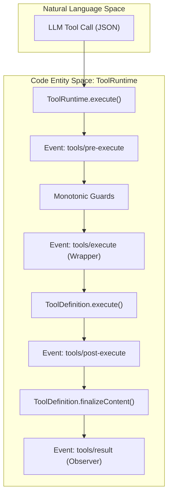
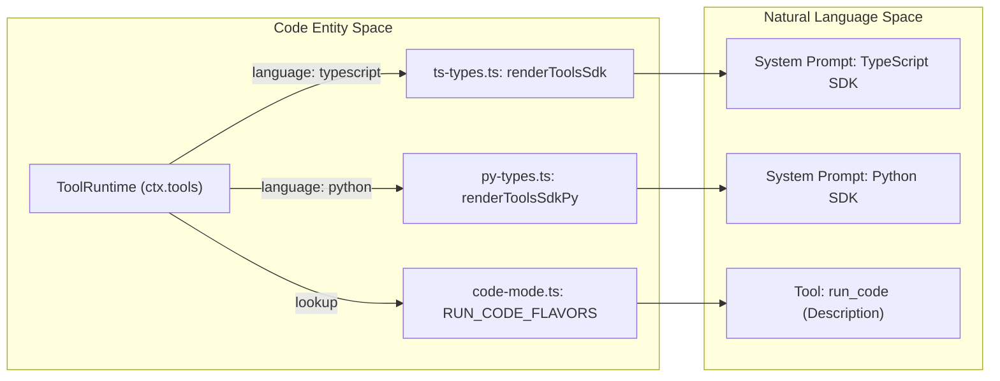

# Tool Registry & Execution Pipeline

Relevant source files

The following files were used as context for generating this wiki page:

- [.agents/notes/implemented/architecture/2026-06-20-generic-long-running-tool-runtime.i18n.yaml](.agents/notes/implemented/architecture/2026-06-20-generic-long-running-tool-runtime.i18n.yaml)
- [.agents/notes/implemented/architecture/2026-06-20-generic-long-running-tool-runtime.md](.agents/notes/implemented/architecture/2026-06-20-generic-long-running-tool-runtime.md)
- [.agents/notes/implemented/architecture/2026-06-20-generic-long-running-tool-runtime.zh.md](.agents/notes/implemented/architecture/2026-06-20-generic-long-running-tool-runtime.zh.md)
- [.agents/notes/implemented/feature/2026-06-15-code-mode.i18n.yaml](.agents/notes/implemented/feature/2026-06-15-code-mode.i18n.yaml)
- [.agents/notes/implemented/feature/2026-06-15-code-mode.md](.agents/notes/implemented/feature/2026-06-15-code-mode.md)
- [.agents/notes/implemented/feature/2026-06-15-code-mode.zh.md](.agents/notes/implemented/feature/2026-06-15-code-mode.zh.md)
- [.agents/notes/implemented/feature/2026-07-20-code-mode-typed-tool-returns.i18n.yaml](.agents/notes/implemented/feature/2026-07-20-code-mode-typed-tool-returns.i18n.yaml)
- [.agents/notes/implemented/feature/2026-07-20-code-mode-typed-tool-returns.md](.agents/notes/implemented/feature/2026-07-20-code-mode-typed-tool-returns.md)
- [.agents/notes/implemented/feature/2026-07-20-code-mode-typed-tool-returns.zh.md](.agents/notes/implemented/feature/2026-07-20-code-mode-typed-tool-returns.zh.md)
- [.agents/notes/implemented/feature/2026-07-31-code-mode-language-dispatch.i18n.yaml](.agents/notes/implemented/feature/2026-07-31-code-mode-language-dispatch.i18n.yaml)
- [.agents/notes/implemented/feature/2026-07-31-code-mode-language-dispatch.md](.agents/notes/implemented/feature/2026-07-31-code-mode-language-dispatch.md)
- [.agents/notes/implemented/feature/2026-07-31-code-mode-language-dispatch.zh.md](.agents/notes/implemented/feature/2026-07-31-code-mode-language-dispatch.zh.md)
- [docs/event-producer-consumer.i18n.yaml](docs/event-producer-consumer.i18n.yaml)
- [docs/event-producer-consumer.zh.md](docs/event-producer-consumer.zh.md)
- [docs/persistence-catalog.i18n.yaml](docs/persistence-catalog.i18n.yaml)
- [docs/persistence-catalog.zh.md](docs/persistence-catalog.zh.md)
- [docs/subsystems/llm-streaming.i18n.yaml](docs/subsystems/llm-streaming.i18n.yaml)
- [docs/subsystems/llm-streaming.md](docs/subsystems/llm-streaming.md)
- [docs/subsystems/llm-streaming.zh.md](docs/subsystems/llm-streaming.zh.md)
- [docs/tool-catalog.i18n.yaml](docs/tool-catalog.i18n.yaml)
- [docs/tool-catalog.md](docs/tool-catalog.md)
- [docs/tool-catalog.zh.md](docs/tool-catalog.zh.md)
- [packages/core/agent-loop/tests/tool-order.spec.ts](packages/core/agent-loop/tests/tool-order.spec.ts)
- [packages/core/system-prompt/README.md](packages/core/system-prompt/README.md)
- [packages/core/system-prompt/src/index.ts](packages/core/system-prompt/src/index.ts)
- [packages/core/system-prompt/tests/scoped.spec.ts](packages/core/system-prompt/tests/scoped.spec.ts)
- [packages/core/system-prompt/tests/system-prompt.spec.ts](packages/core/system-prompt/tests/system-prompt.spec.ts)
- [packages/core/system-prompt/tests/tool-order.spec.ts](packages/core/system-prompt/tests/tool-order.spec.ts)
- [packages/core/tools/README.i18n.yaml](packages/core/tools/README.i18n.yaml)
- [packages/core/tools/README.md](packages/core/tools/README.md)
- [packages/core/tools/README.zh.md](packages/core/tools/README.zh.md)
- [packages/core/tools/src/code-mode.ts](packages/core/tools/src/code-mode.ts)
- [packages/core/tools/src/index.ts](packages/core/tools/src/index.ts)
- [packages/core/tools/src/py-types.ts](packages/core/tools/src/py-types.ts)
- [packages/core/tools/tests/code-mode.spec.ts](packages/core/tools/tests/code-mode.spec.ts)
- [packages/core/tools/tests/gen-tool-catalog.spec.ts](packages/core/tools/tests/gen-tool-catalog.spec.ts)
- [packages/core/tools/tests/py-types.spec.ts](packages/core/tools/tests/py-types.spec.ts)
- [packages/core/tools/tests/scoped.spec.ts](packages/core/tools/tests/scoped.spec.ts)
- [packages/core/tools/tests/tools.spec.ts](packages/core/tools/tests/tools.spec.ts)
- [packages/extensions/tool-cordis/src/api-catalog.ts](packages/extensions/tool-cordis/src/api-catalog.ts)
- [scripts/gen-tool-catalog.ts](scripts/gen-tool-catalog.ts)

The `ToolRuntime` service (ctx key: `tools`) is the central authority for tool registration, discovery, and execution within the DeepSeek Harness. It manages the lifecycle of tool calls, enforces concurrency policies, and handles the projection of tools into the LLM's context via **Native Function Calling** or **Code Mode**.

## Tool Registration & Discovery

Tools are registered as `ToolDefinition` objects, which include a name, description, JSON Schema for parameters, and an `execute` function [packages/core/tools/src/index.ts:20-20](). Registration is scope-aware: global registration on the root context makes tools available to all agents, while registration on an `agent.ctx` shadows global tools for that specific agent [packages/core/tools/README.md:20-20]().

### Key Registration Concepts
| Feature | Implementation Detail |
| :--- | :--- |
| **Shadowing** | Agent-local tools override global tools with the same name [packages/core/tools/README.md:20-20](). |
| **Restriction** | `ctx.tools.restrict(filter)` allows agents to mask specific global tools [packages/core/tools/README.md:22-22](). |
| **Validation** | The registry validates JSON schemas and ensures `output` declarations are present at registration time [packages/core/tools/README.md:20-20](). |
| **Cataloging** | The `docs/tool-catalog.md` is generated by booting all plugins and calling `ctx.tools.schemas()` [docs/tool-catalog.md:8-10](). |

Sources: [packages/core/tools/src/index.ts](), [packages/core/tools/README.md](), [docs/tool-catalog.md]()

## Execution Pipeline

The execution pipeline is a structured waterfall that wraps every tool call. It ensures that concerns like security, logging, and metrics are handled orthogonally to the tool's logic.

### The Waterfall Sequence
1.  **`tools/pre-execute`**: An extensible waterfall for allow/deny/ask decisions (e.g., User Approval) [packages/core/tools/src/index.ts:152-152]().
2.  **Monotonic Guards**: Synchronous, non-bypassable checks registered via `ctx.tools.guard()` [packages/core/tools/README.md:25-25]().
3.  **`tools/execute`**: An around-dispatch wrapper used for timeouts, retries, and metrics [packages/core/tools/src/index.ts:163-163]().
4.  **Dispatch**: The actual execution of the tool's `execute` function [packages/core/tools/README.md:26-26]().
5.  **`tools/post-execute`**: Allows modification or enrichment of the result before it is finalized [packages/core/tools/src/index.ts:173-173]().
6.  **`finalizeContent`**: A tool-defined boundary for final model-facing content normalization [packages/core/tools/README.md:20-20]().
7.  **`tools/result`**: A terminal, observe-only notification event [packages/core/tools/README.md:39-39]().

### Pipeline Data Flow
The diagram below bridges the "Natural Language Space" (Tool Call) to the "Code Entity Space" (Execution Pipeline).

**Title: Tool Execution Pipeline Flow**

Sources: [packages/core/tools/src/index.ts:137-180](), [packages/core/tools/README.md:5-40]()

## Code Mode (run_code + SDK)

Code Mode is an alternative tool presentation where the LLM writes a program to call tools rather than emitting individual tool calls.

*   **`run_code` Transport**: A reserved tool that acts as the entry point for programs [packages/core/tools/src/code-mode.ts:20-20]().
*   **SDK Generation**: The registry projects all available tools into a type-safe SDK (TypeScript or Python) included in the system prompt [packages/core/tools/src/index.ts:60-63]().
*   **Mode Selection**: Configured via `tools.mode` (`native`, `code`, or `both`) [packages/core/tools/README.md:13-13]().

### SDK Rendering & Language Dispatch
The registry uses specific renderers and schema flavors based on the `ctx.codeRuntime.language`. This is managed via two parallel lookup tables: `SDK_RENDERERS` for code generation and `RUN_CODE_FLAVORS` for the model-facing `run_code` description [.agents/notes/implemented/feature/2026-07-31-code-mode-language-dispatch.md:15-18]().

*   **TypeScript**: Handled by `renderToolsSdk` in `ts-types.ts` [packages/core/tools/src/index.ts:61-61]().
*   **Python**: Handled by `renderToolsSdkPy` in `py-types.ts` [packages/core/tools/src/index.ts:62-62]().
    *   Generates `TypedDict` definitions for tool arguments to ensure type safety [packages/core/tools/src/py-types.ts:11-13]().
    *   Enforces `MAX_LIST_NESTING` to ensure Python tokenizer compatibility [packages/core/tools/src/py-types.ts:61-61]().
    *   Validates identifiers using `isBareIdentifier` to ensure NFKC stability and CPython compatibility [packages/core/tools/src/py-types.ts:99-101]().

**Title: Code Mode SDK Generation Bridge**

Sources: [packages/core/tools/src/index.ts:60-63](), [packages/core/tools/src/py-types.ts:1-101](), [packages/core/tools/src/code-mode.ts:84-88](), [.agents/notes/implemented/feature/2026-07-31-code-mode-language-dispatch.md:15-20]()

## Scheduling: Parallel vs. Exclusive

The registry determines the concurrency mode of a tool call via `ctx.tools.executionMode(exec)` [packages/core/tools/README.md:27-27]().

*   **Parallel**: Allowed only if the tool definition explicitly declares `isConcurrencySafe(args)` as `true` [packages/core/tools/README.md:27-27]().
*   **Exclusive**: The default mode. The registry ensures that exclusive tools do not overlap with other tool executions to prevent race conditions (e.g., multiple tools editing the same file) [packages/core/tools/README.md:27-27]().

Sources: [packages/core/tools/README.md:27-27](), [packages/core/tools/src/index.ts:16-16]()

## Cooperative Cancellation

Tool execution in DeepSeek Harness is cooperative. Every execution context provides an `AbortSignal` via `exec.signal` [packages/core/tools/README.md:35-35]().
*   **Pre-dispatch**: If the signal is aborted before the tool body is called, the registry skips execution and returns `ABORTED_BEFORE_DISPATCH` [packages/core/tools/README.md:35-35]().
*   **In-flight**: Tool implementations must monitor `exec.signal` and cease operations (e.g., killing a subprocess) when triggered [packages/core/tools/README.md:35-35]().

Sources: [packages/core/tools/README.md:33-35](), [packages/core/tools/src/code-mode.ts:133-139]()
