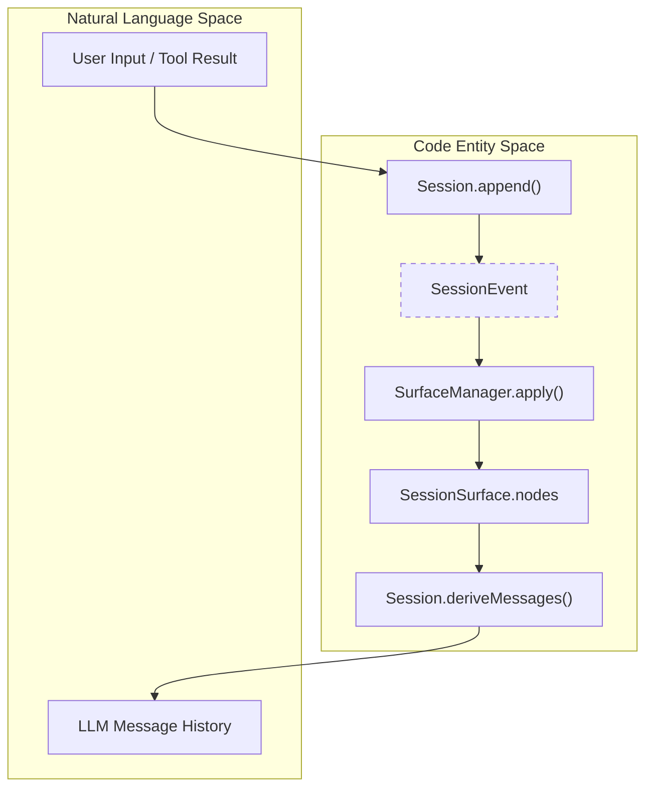
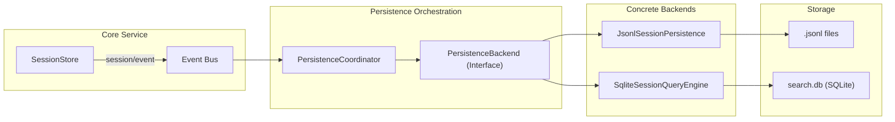

# Session Log & Persistence

Relevant source files

The following files were used as context for generating this wiki page:

- [.agents/notes/implemented/architecture/2026-06-18-shared-persistence-write-coordinator.i18n.yaml](.agents/notes/implemented/architecture/2026-06-18-shared-persistence-write-coordinator.i18n.yaml)
- [.agents/notes/implemented/architecture/2026-06-18-shared-persistence-write-coordinator.md](.agents/notes/implemented/architecture/2026-06-18-shared-persistence-write-coordinator.md)
- [.agents/notes/implemented/architecture/2026-06-18-shared-persistence-write-coordinator.zh.md](.agents/notes/implemented/architecture/2026-06-18-shared-persistence-write-coordinator.zh.md)
- [.agents/notes/implemented/architecture/2026-07-05-windows-jsonl-durable-publish.md](.agents/notes/implemented/architecture/2026-07-05-windows-jsonl-durable-publish.md)
- [.agents/notes/implemented/bug-fix/2026-07-20-jsonl-storage-identity.i18n.yaml](.agents/notes/implemented/bug-fix/2026-07-20-jsonl-storage-identity.i18n.yaml)
- [.agents/notes/implemented/bug-fix/2026-07-20-jsonl-storage-identity.md](.agents/notes/implemented/bug-fix/2026-07-20-jsonl-storage-identity.md)
- [.agents/notes/implemented/bug-fix/2026-07-20-jsonl-storage-identity.zh.md](.agents/notes/implemented/bug-fix/2026-07-20-jsonl-storage-identity.zh.md)
- [.agents/notes/implemented/feature/2026-07-10-sqlite-session-query-provider.md](.agents/notes/implemented/feature/2026-07-10-sqlite-session-query-provider.md)
- [.agents/notes/implemented/feature/2026-07-24-model-facing-session-query-tools.i18n.yaml](.agents/notes/implemented/feature/2026-07-24-model-facing-session-query-tools.i18n.yaml)
- [.agents/notes/implemented/feature/2026-07-24-model-facing-session-query-tools.md](.agents/notes/implemented/feature/2026-07-24-model-facing-session-query-tools.md)
- [.agents/notes/implemented/feature/2026-07-24-model-facing-session-query-tools.zh.md](.agents/notes/implemented/feature/2026-07-24-model-facing-session-query-tools.zh.md)
- [.agents/notes/implemented/testing/2026-06-22-subagent-snapshot-replay.i18n.yaml](.agents/notes/implemented/testing/2026-06-22-subagent-snapshot-replay.i18n.yaml)
- [.agents/notes/implemented/testing/2026-06-22-subagent-snapshot-replay.md](.agents/notes/implemented/testing/2026-06-22-subagent-snapshot-replay.md)
- [.agents/notes/implemented/testing/2026-06-22-subagent-snapshot-replay.zh.md](.agents/notes/implemented/testing/2026-06-22-subagent-snapshot-replay.zh.md)
- [packages/core/session/README.md](packages/core/session/README.md)
- [packages/core/session/src/index.ts](packages/core/session/src/index.ts)
- [packages/core/session/src/surface.ts](packages/core/session/src/surface.ts)
- [packages/core/session/src/types.ts](packages/core/session/src/types.ts)
- [packages/core/session/tests/session.spec.ts](packages/core/session/tests/session.spec.ts)
- [packages/core/session/tests/surface.spec.ts](packages/core/session/tests/surface.spec.ts)
- [packages/session-query/session-query-sqlite/README.md](packages/session-query/session-query-sqlite/README.md)
- [packages/session-query/session-query-sqlite/src/index.ts](packages/session-query/session-query-sqlite/src/index.ts)
- [packages/session-query/session-query-sqlite/src/query.ts](packages/session-query/session-query-sqlite/src/query.ts)
- [packages/session-query/session-query-sqlite/src/schema.ts](packages/session-query/session-query-sqlite/src/schema.ts)
- [packages/session-query/session-query-sqlite/tests/query.spec.ts](packages/session-query/session-query-sqlite/tests/query.spec.ts)
- [packages/session-query/session-query-sqlite/tests/sqlite.spec.ts](packages/session-query/session-query-sqlite/tests/sqlite.spec.ts)
- [packages/session-query/session-query/README.md](packages/session-query/session-query/README.md)
- [packages/session-query/session-query/src/config.ts](packages/session-query/session-query/src/config.ts)
- [packages/session-query/session-query/src/corpus.ts](packages/session-query/session-query/src/corpus.ts)
- [packages/session-query/session-query/src/index.ts](packages/session-query/session-query/src/index.ts)
- [packages/session-query/session-query/src/tracing.ts](packages/session-query/session-query/src/tracing.ts)
- [packages/session-query/session-query/tests/session-query.spec.ts](packages/session-query/session-query/tests/session-query.spec.ts)
- [packages/session-query/session-query/tests/tracing.spec.ts](packages/session-query/session-query/tests/tracing.spec.ts)
- [packages/session-query/tool-session-query/README.md](packages/session-query/tool-session-query/README.md)
- [packages/session-query/tool-session-query/src/index.ts](packages/session-query/tool-session-query/src/index.ts)
- [packages/session-query/tool-session-query/tests/tool-session-query.spec.ts](packages/session-query/tool-session-query/tests/tool-session-query.spec.ts)
- [packages/session/session-persistence/src/coordinator.ts](packages/session/session-persistence/src/coordinator.ts)
- [packages/session/session-persistence/tests/persistence.spec.ts](packages/session/session-persistence/tests/persistence.spec.ts)

The session system provides an event-sourced, append-only log that serves as the single source of truth for all agent interactions. Instead of storing mutable state, the system records discrete `SessionEvent` objects, from which the model-visible message history (the "Surface") and other projections are derived.

## Session Event Log

A `Session` is a plain class that manages a sequence of immutable events [packages/core/session/src/index.ts:149-152](). Each event in the log is a `SessionEvent`, which wraps a type-specific payload in a standard envelope containing a monotonic sequence number (`seq`) and a Unix epoch timestamp (`time`) [packages/core/session/src/types.ts:372-381]().

### Event Envelope Structure
The envelope is a discriminated union over the `type` field, allowing the TypeScript compiler to narrow the `data` payload [packages/core/session/src/types.ts:372-404]().

| Field | Type | Description |
| :--- | :--- | :--- |
| `type` | `SessionEventType` | The unique key for the event type (e.g., `user/message`, `turn/start`). |
| `seq` | `number` | Monotonic sequence number within the session. |
| `time` | `number` | Unix epoch milliseconds. |
| `data` | `SessionEventMap[K]` | The actual payload for this event type. |
| `ignorable` | `true?` | If true, readers can safely skip this event if they don't recognize the type. |
| `surfaceOp` | `SurfaceOp?` | Metadata for events that appear on the LLM-visible surface (append or replace). |

Sources: [packages/core/session/src/types.ts:372-404](), [packages/core/session/README.md:39-46]()

### Data Flow: Append & Projection
The following diagram illustrates how a raw event enters the system and is projected into the model's message history.

**Event Projection Diagram**

Sources: [packages/core/session/src/index.ts:168-200](), [packages/core/session/src/surface.ts:137-142]()

## Surface Projection & `deriveMessages()`

The **Surface** is an ordered projection of events that produce LLM messages (currently `user/message`, `assistant/message`, and `tool/result`) [packages/core/session/src/surface.ts:14-19](). While the log is strictly append-only, the Surface supports **positional replacements** to allow for history compaction and refinement [packages/core/session/src/surface.ts:57-68]().

### `deriveMessages()`
This function iterates over the `nodes` (sequence numbers) currently in the Surface and converts each corresponding event into a `Message` object for the LLM [packages/core/session/src/index.ts:221-235]().
- **Injected Context:** `user/message` events from plugins are projected as standard user roles, preserving the exact identified content [packages/core/session/src/surface.ts:87-98]().
- **Assistant Chunks:** Individual `assistant/chunk` events are ignored by the surface; only the final `assistant/message` is projected to avoid partial turns in the provider transcript [packages/core/session/src/surface.ts:99-105]().
- **Compaction & Replacement:** When a `SurfaceOp` of type `replace` is encountered, the `SurfaceManager` removes the shadowed range from the active nodes list and inserts the new event seq [packages/core/session/src/surface.ts:116-126](). This is used for tool result updates or history rewriting.

Sources: [packages/core/session/src/surface.ts:83-114](), [packages/core/session/README.md:39-43](), [packages/core/session/tests/session.spec.ts:23-59]()

## Session Forking & Lineage

The `SessionStore` (accessible via `ctx.sessions`) manages the lifecycle of sessions, including creating new ones and forking existing ones [packages/core/session/src/index.ts:39-54]().

### Forking Mechanics
`ctx.sessions.fork(source, boundary?)` creates a new session that inherits a prefix of events from a parent session [packages/core/session/README.md:17-17]().
- **Boundary:** An inclusive sequence number defining where the parent's history ends for the child.
- **Lineage Metadata:** The new session's `SessionHeader` records the `parentSession` ID and `seedLength` [packages/core/session/src/types.ts:74-80]().
- **Safety:** Forking requires the boundary to end outside an open turn to ensure the child starts in a clean state [packages/core/session/README.md:17-17]().

Sources: [packages/core/session/src/index.ts:474-508](), [packages/core/session/src/types.ts:61-99]()

## Persistence Architecture

Persistence is implemented as a plugin concern. Plugins subscribe to `session/event` to receive live updates and `session/flush` to ensure durability checkpoints [packages/core/session/src/index.ts:3-5](). The `PersistenceCoordinator` provides shared buffering and crash-repair orchestration for first-party backends [packages/session/session-persistence/src/coordinator.ts:1-6]().

### Persistence Coordinator & Write-Behind
The `PersistenceCoordinator` manages the transition from live memory to durable storage:
- **Write-Behind:** Events are buffered and written in batches to reduce I/O overhead [packages/session/session-persistence/src/coordinator.ts:84-89]().
- **Crash Repair:** On reload, the coordinator uses `interruptedTurnClosers` to synthesize `turn/end` markers for turns that were left open during a crash [packages/session/session-persistence/src/coordinator.ts:10-12]().
- **Revisions:** A `SessionPersistenceRevision` identifies the exact state of a stored log [packages/session/session-persistence/src/revision.ts]().

### SQLite Backend (`session-query-sqlite`)
The SQLite backend provides a derived index for full-text search (FTS5) and complex filtering [packages/session-query/session-query-sqlite/src/index.ts:196-212]().
- **Schema:** Maintains tables for `sessions` (headers) and `events` (payloads and FTS snippets) [packages/session-query/session-query-sqlite/src/schema.ts]().
- **Query Engine:** Implements the `SessionQueryEngine` abstract class, providing methods like `searchSessions` and `searchEvents` [packages/session-query/session-query-sqlite/src/index.ts:196-198]().

**Persistence Architecture Diagram**

Sources: [packages/core/session/src/index.ts:65-86](), [packages/session/session-persistence/src/coordinator.ts:127-160](), [packages/session-query/session-query-sqlite/src/index.ts:88-114]()

## Session Query & Tracing

The `SessionQueryEngine` (accessible via `ctx.sessionQuery`) provides a unified interface for inspecting both live and persisted sessions [packages/session-query/session-query/src/index.ts:81-105]().

### Tracing & Search Utilities
- **Lineage Tracing:** `traceSession(sessionId)` reconstructs the ancestor/descendant tree by following `parentSession` pointers in headers [packages/session-query/session-query/README.md:17-17]().
- **Event Provenance:** `traceEvent(request)` follows direct positional replacements and cited source-event links [packages/session-query/session-query/README.md:18-18]().
- **FTS Search:** `searchSessions` and `searchEvents` use the SQLite backend to perform full-text queries, returning snippets and ranked hits [packages/session-query/session-query-sqlite/src/index.ts:410-450]().
- **Logical Filtering:** `filterSessions` and `filterEvents` apply provider-independent metadata predicates (e.g., `cwd`, `time` ranges) [packages/session-query/session-query/README.md:23-26]().

Sources: [packages/session-query/session-query/src/index.ts:134-210](), [packages/session-query/session-query-sqlite/src/query.ts](), [packages/session-query/session-query/README.md:7-20]()
