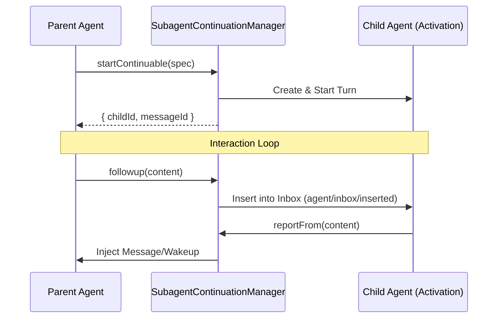

# Subagent Orchestration

<details>
<summary>Relevant source files</summary>

The following files were used as context for generating this wiki page:

- [.agents/notes/implemented/architecture/2026-08-06-subagent-list-identity-projection.i18n.yaml](.agents/notes/implemented/architecture/2026-08-06-subagent-list-identity-projection.i18n.yaml)
- [.agents/notes/implemented/architecture/2026-08-06-subagent-list-identity-projection.md](.agents/notes/implemented/architecture/2026-08-06-subagent-list-identity-projection.md)
- [.agents/notes/implemented/architecture/2026-08-06-subagent-list-identity-projection.zh.md](.agents/notes/implemented/architecture/2026-08-06-subagent-list-identity-projection.zh.md)
- [.agents/notes/implemented/architecture/2026-08-10-product-subagent-providers-in-shared-host.i18n.yaml](.agents/notes/implemented/architecture/2026-08-10-product-subagent-providers-in-shared-host.i18n.yaml)
- [.agents/notes/implemented/architecture/2026-08-10-product-subagent-providers-in-shared-host.md](.agents/notes/implemented/architecture/2026-08-10-product-subagent-providers-in-shared-host.md)
- [.agents/notes/implemented/architecture/2026-08-10-product-subagent-providers-in-shared-host.zh.md](.agents/notes/implemented/architecture/2026-08-10-product-subagent-providers-in-shared-host.zh.md)
- [.agents/notes/implemented/feature/2026-07-22-durable-subagent-catalog-and-list-agents.i18n.yaml](.agents/notes/implemented/feature/2026-07-22-durable-subagent-catalog-and-list-agents.i18n.yaml)
- [.agents/notes/implemented/feature/2026-07-22-durable-subagent-catalog-and-list-agents.md](.agents/notes/implemented/feature/2026-07-22-durable-subagent-catalog-and-list-agents.md)
- [.agents/notes/implemented/feature/2026-07-22-durable-subagent-catalog-and-list-agents.zh.md](.agents/notes/implemented/feature/2026-07-22-durable-subagent-catalog-and-list-agents.zh.md)
- [.agents/notes/implemented/feature/2026-08-04-claude-code-and-codex-subagent-backends.i18n.yaml](.agents/notes/implemented/feature/2026-08-04-claude-code-and-codex-subagent-backends.i18n.yaml)
- [.agents/notes/implemented/feature/2026-08-04-claude-code-and-codex-subagent-backends.md](.agents/notes/implemented/feature/2026-08-04-claude-code-and-codex-subagent-backends.md)
- [.agents/notes/implemented/feature/2026-08-04-claude-code-and-codex-subagent-backends.zh.md](.agents/notes/implemented/feature/2026-08-04-claude-code-and-codex-subagent-backends.zh.md)
- [.agents/notes/implemented/feature/2026-08-15-product-subagent-noninteractive-permissions.i18n.yaml](.agents/notes/implemented/feature/2026-08-15-product-subagent-noninteractive-permissions.i18n.yaml)
- [.agents/notes/implemented/feature/2026-08-15-product-subagent-noninteractive-permissions.md](.agents/notes/implemented/feature/2026-08-15-product-subagent-noninteractive-permissions.md)
- [.agents/notes/implemented/feature/2026-08-15-product-subagent-noninteractive-permissions.zh.md](.agents/notes/implemented/feature/2026-08-15-product-subagent-noninteractive-permissions.zh.md)
- [examples/acp-agent/tests/fixtures/subagent-result-diagnostic.ts](examples/acp-agent/tests/fixtures/subagent-result-diagnostic.ts)
- [packages/fs/tool-fs-search/tests/rg-sidecar.spec.ts](packages/fs/tool-fs-search/tests/rg-sidecar.spec.ts)
- [packages/host/apiproxy/src/api/subagents.ts](packages/host/apiproxy/src/api/subagents.ts)
- [packages/host/apiproxy/tests/api-proxy-subagents.spec.ts](packages/host/apiproxy/tests/api-proxy-subagents.spec.ts)
- [packages/subagent/README.i18n.yaml](packages/subagent/README.i18n.yaml)
- [packages/subagent/README.md](packages/subagent/README.md)
- [packages/subagent/README.zh.md](packages/subagent/README.zh.md)
- [packages/subagent/subagent-acp/README.md](packages/subagent/subagent-acp/README.md)
- [packages/subagent/subagent-acp/package.json](packages/subagent/subagent-acp/package.json)
- [packages/subagent/subagent-acp/src/index.ts](packages/subagent/subagent-acp/src/index.ts)
- [packages/subagent/subagent-acp/src/run.ts](packages/subagent/subagent-acp/src/run.ts)
- [packages/subagent/subagent-acp/tests/mock-acp-server.ts](packages/subagent/subagent-acp/tests/mock-acp-server.ts)
- [packages/subagent/subagent-acp/tests/subagent-acp.spec.ts](packages/subagent/subagent-acp/tests/subagent-acp.spec.ts)
- [packages/subagent/subagent-acp/tsconfig.json](packages/subagent/subagent-acp/tsconfig.json)
- [packages/subagent/subagent-claude-code/README.i18n.yaml](packages/subagent/subagent-claude-code/README.i18n.yaml)
- [packages/subagent/subagent-claude-code/README.md](packages/subagent/subagent-claude-code/README.md)
- [packages/subagent/subagent-claude-code/README.zh.md](packages/subagent/subagent-claude-code/README.zh.md)
- [packages/subagent/subagent-claude-code/src/index.ts](packages/subagent/subagent-claude-code/src/index.ts)
- [packages/subagent/subagent-claude-code/src/process.ts](packages/subagent/subagent-claude-code/src/process.ts)
- [packages/subagent/subagent-claude-code/src/run.ts](packages/subagent/subagent-claude-code/src/run.ts)
- [packages/subagent/subagent-claude-code/tests/messages-fixture.ts](packages/subagent/subagent-claude-code/tests/messages-fixture.ts)
- [packages/subagent/subagent-claude-code/tests/real-product.spec.ts](packages/subagent/subagent-claude-code/tests/real-product.spec.ts)
- [packages/subagent/subagent-claude-code/tests/subagent-claude-code.spec.ts](packages/subagent/subagent-claude-code/tests/subagent-claude-code.spec.ts)
- [packages/subagent/subagent-codex/README.i18n.yaml](packages/subagent/subagent-codex/README.i18n.yaml)
- [packages/subagent/subagent-codex/README.md](packages/subagent/subagent-codex/README.md)
- [packages/subagent/subagent-codex/README.zh.md](packages/subagent/subagent-codex/README.zh.md)
- [packages/subagent/subagent-codex/src/index.ts](packages/subagent/subagent-codex/src/index.ts)
- [packages/subagent/subagent-codex/src/run.ts](packages/subagent/subagent-codex/src/run.ts)
- [packages/subagent/subagent-codex/src/wire.ts](packages/subagent/subagent-codex/src/wire.ts)
- [packages/subagent/subagent-codex/tests/real-deepseek.e2e.ts](packages/subagent/subagent-codex/tests/real-deepseek.e2e.ts)
- [packages/subagent/subagent-codex/tests/real-product.spec.ts](packages/subagent/subagent-codex/tests/real-product.spec.ts)
- [packages/subagent/subagent-codex/tests/responses-fixture.ts](packages/subagent/subagent-codex/tests/responses-fixture.ts)
- [packages/subagent/subagent-codex/tests/subagent-codex.spec.ts](packages/subagent/subagent-codex/tests/subagent-codex.spec.ts)
- [packages/subagent/subagent/README.i18n.yaml](packages/subagent/subagent/README.i18n.yaml)
- [packages/subagent/subagent/README.md](packages/subagent/subagent/README.md)
- [packages/subagent/subagent/README.zh.md](packages/subagent/subagent/README.zh.md)
- [packages/subagent/subagent/src/continuation.ts](packages/subagent/subagent/src/continuation.ts)
- [packages/subagent/subagent/src/index.ts](packages/subagent/subagent/src/index.ts)
- [packages/subagent/subagent/src/list-children.ts](packages/subagent/subagent/src/list-children.ts)
- [packages/subagent/subagent/src/out-of-process.ts](packages/subagent/subagent/src/out-of-process.ts)
- [packages/subagent/subagent/src/run-settlement.ts](packages/subagent/subagent/src/run-settlement.ts)
- [packages/subagent/subagent/src/types.ts](packages/subagent/subagent/src/types.ts)
- [packages/subagent/subagent/tests/continuation.spec.ts](packages/subagent/subagent/tests/continuation.spec.ts)
- [packages/subagent/subagent/tests/list-children.spec.ts](packages/subagent/subagent/tests/list-children.spec.ts)
- [packages/subagent/subagent/tests/service.spec.ts](packages/subagent/subagent/tests/service.spec.ts)
- [packages/subagent/tool-subagent-control/README.i18n.yaml](packages/subagent/tool-subagent-control/README.i18n.yaml)
- [packages/subagent/tool-subagent-control/README.md](packages/subagent/tool-subagent-control/README.md)
- [packages/subagent/tool-subagent-control/README.zh.md](packages/subagent/tool-subagent-control/README.zh.md)
- [packages/subagent/tool-subagent-control/src/list-agents.ts](packages/subagent/tool-subagent-control/src/list-agents.ts)
- [packages/subagent/tool-subagent-control/tests/list-agents.spec.ts](packages/subagent/tool-subagent-control/tests/list-agents.spec.ts)
- [packages/subagent/tool-subagent/README.md](packages/subagent/tool-subagent/README.md)
- [packages/subagent/tool-subagent/src/index.ts](packages/subagent/tool-subagent/src/index.ts)
- [packages/subagent/tool-subagent/tests/tool-subagent.spec.ts](packages/subagent/tool-subagent/tests/tool-subagent.spec.ts)
- [scripts/cordis-yaml.ts](scripts/cordis-yaml.ts)
- [scripts/verify-cordis-config.spec.ts](scripts/verify-cordis-config.spec.ts)
- [scripts/verify-cordis-config.ts](scripts/verify-cordis-config.ts)

</details>


Subagent orchestration in DeepSeek Harness (dsh) is managed through a dedicated capability seam that allows a parent agent to delegate tasks to child agents. This system abstracts the underlying transport (in-process, forked, or out-of-process via ACP) while providing a unified interface for lifecycle management, policy inheritance, and result reporting.

## Overview of the Subagent Seam

The `SubagentRuntime` service, registered under `ctx.subagents`, acts as a named-provider registry. It handles the transition from a model's intent to delegate (via tools) to the actual execution of a child agent.

### Key Delegation Modes

| Mode | Lifecycle | Ownership |
| :--- | :--- | :--- |
| **One-shot** | Runs for a single turn and returns a final result. | Owned by the caller via a `SubagentRun` handle. |
| **Continuable** | Establishes a durable session that persists across multiple turns. | Managed by the `SubagentContinuationManager`. |

Sources: `[packages/subagent/subagent/src/index.ts:1-32]()`, `[packages/subagent/subagent/src/index.ts:171-180]()`, `[packages/subagent/subagent/README.md:11-27]()`

---

## Architecture and Data Flow

The orchestration flow bridges the gap between the high-level tool execution and the low-level process management.

### Subagent Execution Flow
The following diagram illustrates how a `tool-subagent` call is transformed into a running agent through the `SubagentRuntime`.

```mermaid
graph TD
    subgraph "Natural Language Space"
        A["Model Tool Call"] -->|"{prompt, description}"| B["tool-subagent"]
    end

    subgraph "Code Entity Space (packages/subagent)"
        B -->| "ctx.subagents.start()" | C["SubagentRuntime"]
        C -->| "resolve descriptor" | D["SubagentProvider"]
        
        D -->| "In-Process" | E["SubagentSpawnProvider"]
        D -->| "Out-of-Process" | F["AcpSubagentProvider"]
        D -->| "Claude Code" | G2["ClaudeCodeRunSpec"]
        D -->| "Codex" | G3["CodexRunSpec"]
        
        E -->| "create" | G["AgentLoop"]
        F -->| "spawn" | H["SubprocessRuntime"]
        G2 -->| "officialQuery" | H
        G3 -->| "codexAppServerArgv" | H
    end

    G --> I["Child Session Log"]
    H --> I
```
Sources: `[packages/subagent/tool-subagent/src/index.ts:167-180]()`, `[packages/subagent/subagent/src/index.ts:171-175]()`, `[packages/subagent/subagent-acp/src/run.ts:34-86]()`, `[packages/subagent/subagent-claude-code/src/run.ts:149-163]()`, `[packages/subagent/subagent-codex/src/run.ts:137-150]()`

---

## Subagent Providers

Providers implement the `SubagentProvider` interface and register themselves with a unique name. They advertise their capabilities (e.g., `outputSchema`, `depthLimit`) which the runtime validates before dispatching a request.

### Provider Types

1.  **In-Process (`spawn`/`fork`)**: Runs the child agent within the same Node.js process using the local `AgentLoop`.
    *   `spawn`: A fresh agent context. `[packages/subagent/subagent/tests/continuation.spec.ts:73-73]()`
    *   `fork`: Inherits the parent's completed turns. `[packages/subagent/subagent/tests/continuation.spec.ts:74-74]()`
2.  **Agent Client Protocol (ACP)**: Spawns an external process (e.g., `mock-acp-server.ts`) that communicates via the ACP JSON-RPC protocol over stdio. `[packages/subagent/subagent-acp/tests/subagent-acp.spec.ts:18-24]()`
    *   Implements a cooperative teardown ladder: `stdin.end()` -> `SIGTERM` -> `SIGKILL`. `[packages/subagent/subagent-acp/src/run.ts:147-163]()`
3.  **Product Drivers**:
    *   **Claude Code**: Wraps the official `@anthropic-ai/claude-agent-sdk`. It manages a `ManagedClaudeCodeProcess` and maps SDK results to `SubagentResult`. `[packages/subagent/subagent-claude-code/src/run.ts:2-6]()`, `[packages/subagent/subagent-claude-code/src/run.ts:204-219]()`
    *   **Codex**: Spawns the `codex app-server --stdio` child. Uses `CodexAppServerWire` to handle the JSON-RPC line transport and thread initialization. `[packages/subagent/subagent-codex/src/run.ts:1-5]()`, `[packages/subagent/subagent-codex/src/wire.ts:212-213]()`

### Provider Capabilities
Providers must declare support for specific features:
*   `depthLimit`: Enables enforcement of `maxDepth`.
*   `toolFilter`: Allows restricting which tools the child can access.
*   `persona`: Allows overriding the child's system persona.

Sources: `[packages/subagent/subagent/src/types.ts:86-91]()`, `[packages/subagent/subagent-acp/src/run.ts:106-127]()`, `[packages/subagent/tool-subagent/src/index.ts:54-68]()`, `[packages/subagent/subagent/README.md:34-45]()`

---

## Continuable Subagents

Continuable subagents are designed for long-running interactions where the parent and child can exchange multiple messages over time.

### The Continuation Manager
The `SubagentContinuationManager` (internal to `SubagentRuntime`) tracks the residency of continuable children. `[packages/subagent/subagent/src/index.ts:56-56]()`
*   **Activation**: A process-local residency epoch for a child agent. `[packages/subagent/subagent/tests/continuation.spec.ts:138-143]()`
*   **Cold Resume**: If a child is not resident, the manager reconstructs it from the persisted session log (e.g., `JsonlSessionPersistence`) when a new message arrives. `[packages/subagent/subagent/tests/continuation.spec.ts:60-71]()`
*   **Admission**: The manager ensures only one Activation exists per `SessionId` and handles the FIFO turn queue via the Agent's inbox.

### Communication Mechanism: Report and Followup
*   **`followup`**: The parent sends a message to the child. `[packages/subagent/subagent/src/index.ts:120-123]()`
*   **`reportFrom`**: The child sends a message back to the parent. `[packages/subagent/subagent/src/continuation.ts:60-63]()`
*   **Delivery Policy**: Reports can be `quiet` (injected into context) or `wakeup` (triggers a new parent turn).


Sources: `[packages/subagent/subagent/src/continuation.ts:7-19]()`, `[packages/subagent/subagent/src/index.ts:16-24]()`, `[packages/subagent/subagent/tests/continuation.spec.ts:173-176]()`, `[packages/subagent/subagent/README.md:19-22]()`

---

## Policy Inheritance and Depth Control

To prevent infinite recursion and ensure security, subagents inherit policies from their parents.

### Delegation Depth
The system tracks `delegationDepth` by inspecting the session lineage.
*   `assertSubagentMaxDepth`: Throws a `SubagentDepthError` if the child would exceed the configured `maxDepth` (default is 3). `[packages/subagent/subagent/src/depth.ts:1-15]()`, `[packages/subagent/tool-subagent/src/index.ts:98-98]()`

### Policy Composition
The function `applyChildComposition` is used for in-process agents to merge the parent's preset composition with the child's specific overrides. `[packages/subagent/subagent/src/child-agent.ts:106-111]()`
*   **Tool Filtering**: Tools can be explicitly allowed or denied for the child via `toolFilter`. `[packages/subagent/tool-subagent/src/index.ts:63-68]()`
*   **Persona Shadowing**: A child can have a specific `persona` that shadows the deployment persona. `[packages/subagent/tool-subagent/src/index.ts:54-57]()`

Sources: `[packages/subagent/subagent/src/depth.ts:1-15]()`, `[packages/subagent/subagent/src/child-agent.ts:102-111]()`, `[packages/subagent/subagent/README.md:43-45]()`

---

## Implementation Details

### SubagentRuntime Class
The core service implementation in `packages/subagent/subagent/src/index.ts`.

| Method | Role |
| :--- | :--- |
| `registerProvider` | Adds a `SubagentProvider` to the registry. |
| `start` | Initiates a one-shot run. Returns `SubagentRun`. |
| `startContinuable` | Initiates a durable child. Returns `ContinuableStart`. |
| `listChildren` | Queries the session store/persistence for subagents of a parent. |

### SubagentRun Interface
Represents an active one-shot delegation:
*   `id`: The `SubagentRunId`. `[packages/subagent/subagent/src/index.ts:73-73]()`
*   `result`: A Promise resolving to `SubagentResult` (contains `output` and `stopReason`). `[packages/subagent/subagent/src/types.ts:161-175]()`
*   `dispose()`: Cleans up resources using product-specific logic (e.g., `disposeCodexChild`, `disposeClaudeCodeChild`). `[packages/subagent/subagent-codex/src/run.ts:185-188]()`, `[packages/subagent/subagent-claude-code/src/run.ts:48-49]()`

Sources: `[packages/subagent/subagent/src/index.ts:171-185]()`, `[packages/subagent/subagent/src/types.ts:161-175]()`, `[packages/subagent/subagent/src/list-children.ts:25-40]()`
