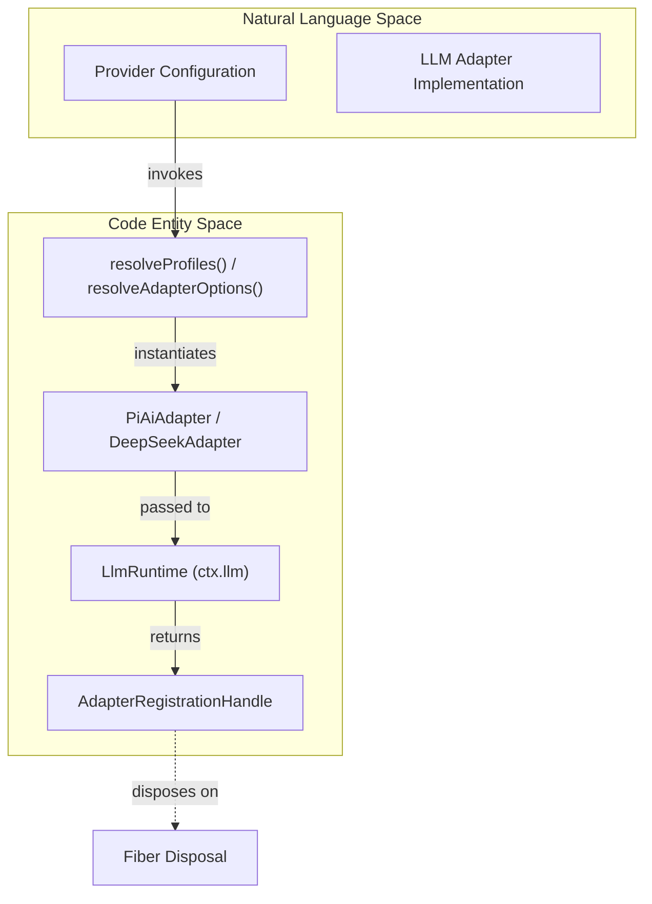
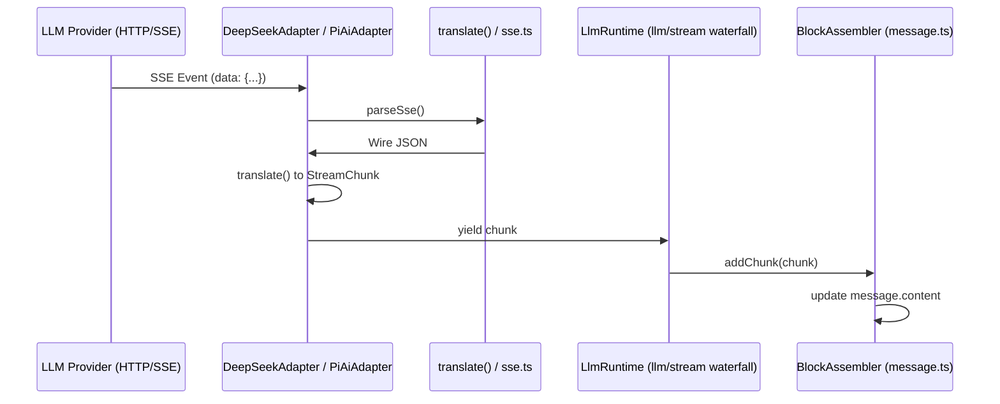

# LLM Adapters & Streaming

Relevant source files

The following files were used as context for generating this wiki page:

- [.agents/notes/implemented/architecture/2026-06-21-bounded-llm-request-recovery.i18n.yaml](.agents/notes/implemented/architecture/2026-06-21-bounded-llm-request-recovery.i18n.yaml)
- [.agents/notes/implemented/architecture/2026-06-21-bounded-llm-request-recovery.md](.agents/notes/implemented/architecture/2026-06-21-bounded-llm-request-recovery.md)
- [.agents/notes/implemented/architecture/2026-06-21-bounded-llm-request-recovery.zh.md](.agents/notes/implemented/architecture/2026-06-21-bounded-llm-request-recovery.zh.md)
- [.agents/notes/implemented/bug-fix/2026-08-18-request-image-payload-bound.i18n.yaml](.agents/notes/implemented/bug-fix/2026-08-18-request-image-payload-bound.i18n.yaml)
- [.agents/notes/implemented/bug-fix/2026-08-18-request-image-payload-bound.md](.agents/notes/implemented/bug-fix/2026-08-18-request-image-payload-bound.md)
- [.agents/notes/implemented/bug-fix/2026-08-18-request-image-payload-bound.zh.md](.agents/notes/implemented/bug-fix/2026-08-18-request-image-payload-bound.zh.md)
- [.agents/notes/implemented/bug-fix/2026-08-19-deepseek-reasoning-passback-every-turn.i18n.yaml](.agents/notes/implemented/bug-fix/2026-08-19-deepseek-reasoning-passback-every-turn.i18n.yaml)
- [.agents/notes/implemented/bug-fix/2026-08-19-deepseek-reasoning-passback-every-turn.md](.agents/notes/implemented/bug-fix/2026-08-19-deepseek-reasoning-passback-every-turn.md)
- [.agents/notes/implemented/bug-fix/2026-08-19-deepseek-reasoning-passback-every-turn.zh.md](.agents/notes/implemented/bug-fix/2026-08-19-deepseek-reasoning-passback-every-turn.zh.md)
- [.agents/notes/implemented/feature/2026-07-24-provider-retry-policies.i18n.yaml](.agents/notes/implemented/feature/2026-07-24-provider-retry-policies.i18n.yaml)
- [.agents/notes/implemented/feature/2026-07-24-provider-retry-policies.md](.agents/notes/implemented/feature/2026-07-24-provider-retry-policies.md)
- [.agents/notes/implemented/feature/2026-07-24-provider-retry-policies.zh.md](.agents/notes/implemented/feature/2026-07-24-provider-retry-policies.zh.md)
- [.agents/notes/implemented/feature/2026-08-19-direct-deepseek-vision-input.i18n.yaml](.agents/notes/implemented/feature/2026-08-19-direct-deepseek-vision-input.i18n.yaml)
- [.agents/notes/implemented/feature/2026-08-19-direct-deepseek-vision-input.md](.agents/notes/implemented/feature/2026-08-19-direct-deepseek-vision-input.md)
- [.agents/notes/implemented/feature/2026-08-19-direct-deepseek-vision-input.zh.md](.agents/notes/implemented/feature/2026-08-19-direct-deepseek-vision-input.zh.md)
- [apps/web/tests/shipped-composition.e2e.ts](apps/web/tests/shipped-composition.e2e.ts)
- [docs/capability-seams.md](docs/capability-seams.md)
- [docs/config-catalog.i18n.yaml](docs/config-catalog.i18n.yaml)
- [docs/config-catalog.md](docs/config-catalog.md)
- [docs/config-catalog.zh.md](docs/config-catalog.zh.md)
- [docs/event-producer-consumer.md](docs/event-producer-consumer.md)
- [docs/module-graph.i18n.yaml](docs/module-graph.i18n.yaml)
- [docs/module-graph.md](docs/module-graph.md)
- [docs/module-graph.zh.md](docs/module-graph.zh.md)
- [docs/persistence-catalog.md](docs/persistence-catalog.md)
- [examples/headless-agent/tests/fixtures/deepseek-defaults.cordis.yml](examples/headless-agent/tests/fixtures/deepseek-defaults.cordis.yml)
- [knip.json](knip.json)
- [packages/client/ui-conversation/tests/skeleton.client.spec.tsx](packages/client/ui-conversation/tests/skeleton.client.spec.tsx)
- [packages/extensions/cordis-client-runner/src/client/slot-catalog.ts](packages/extensions/cordis-client-runner/src/client/slot-catalog.ts)
- [packages/llm/llm-deepseek/README.i18n.yaml](packages/llm/llm-deepseek/README.i18n.yaml)
- [packages/llm/llm-deepseek/README.md](packages/llm/llm-deepseek/README.md)
- [packages/llm/llm-deepseek/README.zh.md](packages/llm/llm-deepseek/README.zh.md)
- [packages/llm/llm-deepseek/package.json](packages/llm/llm-deepseek/package.json)
- [packages/llm/llm-deepseek/src/adapter.ts](packages/llm/llm-deepseek/src/adapter.ts)
- [packages/llm/llm-deepseek/src/index.ts](packages/llm/llm-deepseek/src/index.ts)
- [packages/llm/llm-deepseek/src/serialize.ts](packages/llm/llm-deepseek/src/serialize.ts)
- [packages/llm/llm-deepseek/src/sse.ts](packages/llm/llm-deepseek/src/sse.ts)
- [packages/llm/llm-deepseek/src/types.ts](packages/llm/llm-deepseek/src/types.ts)
- [packages/llm/llm-deepseek/tests/adapter.e2e.ts](packages/llm/llm-deepseek/tests/adapter.e2e.ts)
- [packages/llm/llm-deepseek/tests/adapter.spec.ts](packages/llm/llm-deepseek/tests/adapter.spec.ts)
- [packages/llm/llm-deepseek/tests/dynamic-config.spec.ts](packages/llm/llm-deepseek/tests/dynamic-config.spec.ts)
- [packages/llm/llm-deepseek/tests/mock-server.ts](packages/llm/llm-deepseek/tests/mock-server.ts)
- [packages/llm/llm-deepseek/tests/serialize.spec.ts](packages/llm/llm-deepseek/tests/serialize.spec.ts)
- [packages/llm/llm-deepseek/tests/sse.spec.ts](packages/llm/llm-deepseek/tests/sse.spec.ts)
- [packages/llm/llm-deepseek/tsconfig.json](packages/llm/llm-deepseek/tsconfig.json)
- [packages/llm/llm-pi-ai/README.i18n.yaml](packages/llm/llm-pi-ai/README.i18n.yaml)
- [packages/llm/llm-pi-ai/README.md](packages/llm/llm-pi-ai/README.md)
- [packages/llm/llm-pi-ai/README.zh.md](packages/llm/llm-pi-ai/README.zh.md)
- [packages/llm/llm-pi-ai/src/adapter.ts](packages/llm/llm-pi-ai/src/adapter.ts)
- [packages/llm/llm-pi-ai/src/catalog.ts](packages/llm/llm-pi-ai/src/catalog.ts)
- [packages/llm/llm-pi-ai/src/config.ts](packages/llm/llm-pi-ai/src/config.ts)
- [packages/llm/llm-pi-ai/src/context.ts](packages/llm/llm-pi-ai/src/context.ts)
- [packages/llm/llm-pi-ai/src/index.ts](packages/llm/llm-pi-ai/src/index.ts)
- [packages/llm/llm-pi-ai/src/stream.ts](packages/llm/llm-pi-ai/src/stream.ts)
- [packages/llm/llm-pi-ai/tests/adapter.spec.ts](packages/llm/llm-pi-ai/tests/adapter.spec.ts)
- [packages/llm/llm-pi-ai/tests/catalog.spec.ts](packages/llm/llm-pi-ai/tests/catalog.spec.ts)
- [packages/llm/llm-pi-ai/tests/context.spec.ts](packages/llm/llm-pi-ai/tests/context.spec.ts)
- [packages/llm/llm-pi-ai/tests/convert.spec.ts](packages/llm/llm-pi-ai/tests/convert.spec.ts)
- [packages/llm/llm-pi-ai/tests/dynamic-config.spec.ts](packages/llm/llm-pi-ai/tests/dynamic-config.spec.ts)
- [packages/llm/llm-retry/README.i18n.yaml](packages/llm/llm-retry/README.i18n.yaml)
- [packages/llm/llm-retry/README.md](packages/llm/llm-retry/README.md)
- [packages/llm/llm-retry/README.zh.md](packages/llm/llm-retry/README.zh.md)
- [packages/llm/llm-retry/src/history.ts](packages/llm/llm-retry/src/history.ts)
- [packages/llm/llm-retry/src/index.ts](packages/llm/llm-retry/src/index.ts)
- [packages/llm/llm-retry/src/invariant.ts](packages/llm/llm-retry/src/invariant.ts)
- [packages/llm/llm-retry/tests/invariant.spec.ts](packages/llm/llm-retry/tests/invariant.spec.ts)
- [packages/llm/llm-retry/tests/retry.spec.ts](packages/llm/llm-retry/tests/retry.spec.ts)
- [packages/llm/llm/README.i18n.yaml](packages/llm/llm/README.i18n.yaml)
- [packages/llm/llm/README.md](packages/llm/llm/README.md)
- [packages/llm/llm/README.zh.md](packages/llm/llm/README.zh.md)
- [packages/llm/llm/src/adapter-failure.ts](packages/llm/llm/src/adapter-failure.ts)
- [packages/llm/llm/src/index.ts](packages/llm/llm/src/index.ts)
- [packages/llm/llm/src/types.ts](packages/llm/llm/src/types.ts)
- [packages/llm/llm/tests/service.spec.ts](packages/llm/llm/tests/service.spec.ts)
- [packages/sandbox/sandbox-local/tests/packed-install.e2e.ts](packages/sandbox/sandbox-local/tests/packed-install.e2e.ts)
- [pnpm-lock.yaml](pnpm-lock.yaml)
- [scripts/gen-cordis-catalog.ts](scripts/gen-cordis-catalog.ts)
- [scripts/gen-doc-graphs.ts](scripts/gen-doc-graphs.ts)
- [scripts/type-equiv.manifest.json](scripts/type-equiv.manifest.json)
- [tsconfig.base.json](tsconfig.base.json)
- [tsconfig.json](tsconfig.json)

The LLM subsystem in DeepSeek Harness (DSH) provides a provider-neutral abstraction for large language model interactions. It centers around a streaming protocol that enables real-time token delivery, reasoning transparency, and robust error recovery.

## LlmRuntime & Adapter Registration

The `LlmRuntime` service acts as the central registry and dispatching hub for all LLM operations. It defines a capability seam that decouples the agent loop and other plugins from specific provider implementations (e.g., DeepSeek, Pi.ai).

### Key Service Methods
- **`registerAdapter(providers, adapter)`**: Mounts an `LlmAdapter` instance to specific provider route strings. Registration is atomic and fiber-scoped [packages/llm/llm/src/index.ts:47-66]().
- **`prepareCall(config, signal)`**: A critical optimization that resolves model metadata (context window, reasoning efforts) and captures the current adapter registration and retry policy into a one-shot executable object [packages/llm/llm/src/index.ts:100-112]().
- **`stream(options)`**: The primary entry point for generating completions. It returns an `AsyncIterableIterator<StreamChunk>` and triggers the `llm/stream` waterfall [packages/llm/llm/src/index.ts:153-172]().

### The LlmAdapter Seam
Every provider backend must implement the `LlmAdapter` interface. This requires implementing metadata discovery (`listModels`) and the core `stream` logic which yields normalized chunks [packages/llm/llm/src/types.ts:254-282]().

### Code Entity Mapping: Registration Flow
This diagram shows how configuration leads to a registered `LlmAdapter` within the `LlmRuntime`.

Sources: [packages/llm/llm/src/index.ts:48-49](), [packages/llm/llm-pi-ai/src/index.ts:150-168](), [packages/llm/llm-deepseek/src/index.ts:166-180]()

## Streaming Protocol & Chunk Assembly

DSH uses a unified `StreamChunk` protocol to represent all LLM outputs, including text, reasoning, tool calls, and usage statistics.

### StreamChunk Types
- `block-start` / `block-end`: Demarcates the beginning and end of a content block (e.g., `text` or `reasoning`) [packages/llm/llm/src/types.ts:110-120]().
- `text-delta`: Contains a fragment of generated text [packages/llm/llm/src/types.ts:122-126]().
- `reasoning-delta`: Contains a fragment of the model's internal reasoning process [packages/llm/llm/src/types.ts:128-132]().
- `usage`: Provides token counts (input/output) [packages/llm/llm/src/types.ts:152-162]().
- `finish`: The terminal chunk indicating success (`stop`), `length` exhaustion, or `error` [packages/llm/llm/src/types.ts:164-168]().

### BlockAssembler
Since raw streams are fragmented, the `BlockAssembler` is used by consumers (like the Agent Loop) to reconstruct the full message and track state during iteration [packages/llm/llm/src/message.ts:261]().

### Data Flow: SSE to StreamChunk

Sources: [packages/llm/llm-deepseek/src/adapter.ts:25-26](), [packages/llm/llm-deepseek/src/serialize.ts:1-50](), [packages/llm/llm/src/message.ts:261]()

## Implementation: DeepSeek Adapter
The `DeepSeekAdapter` is a direct implementation using `fetch` and a custom SSE parser. It targets the `deepseek-official` provider route [packages/llm/llm-deepseek/src/index.ts:46-47]().

- **Protocol**: OpenAI-compatible chat completions with DeepSeek-specific extensions for `reasoning_effort` and `thinking` mode [packages/llm/llm-deepseek/src/serialize.ts:10-60]().
- **Attribution**: Automatically injects `x-deepseek-harness-user-id` and `x-deepseek-harness-session-id` headers for telemetry and trajectory routing [packages/llm/llm-deepseek/src/adapter.ts:100-110]().
- **Idle Timeout**: Implements an `idleWatchdog` to abort requests if the provider stops sending chunks for a configured duration [packages/llm/llm-deepseek/src/adapter.ts:88-94]().

## Implementation: Pi.ai Adapter
The `PiAiAdapter` acts as a multi-provider gateway backed by the `@earendil-works/pi-ai` library. It allows DSH to support OpenAI, Anthropic, and other providers through a single adapter instance [packages/llm/llm-pi-ai/src/index.ts:10-20]().

- **Dynamic Catalog**: Resolves a `PiAiProviderProfile` which can override endpoints, protocols, and model catalogs field-by-field [packages/llm/llm-pi-ai/src/config.ts:65-92]().
- **Reasoning Dialects**: Maps DSH reasoning levels (`off`, `high`, `max`) to provider-specific wire spellings via `thinkingFormat` [packages/llm/llm-pi-ai/src/catalog.ts:24-31]().

## Retry Policies & Error Handling

Retry logic is handled at two levels:
1. **Provider-Level**: Captured during registration via `ctx.llm.providerRetryPolicy(provider)`. This policy defines how the adapter itself should behave for transient network issues [packages/llm/llm/src/index.ts:68-76]().
2. **Agent-Level**: The `llm-retry` plugin intercepts the `llm/stream` waterfall. It uses the `ResolvedRetryPolicy` to wrap the stream generation in a retry loop [packages/llm/llm-retry/src/index.ts:35-55]().

### Error Normalization
Adapters map HTTP status codes and provider-specific error bodies to stable `LlmError` codes [packages/llm/llm/src/types.ts:194-205]().

| Error Code | Meaning | Source |
| :--- | :--- | :--- |
| `AUTH` | API key is missing or invalid | [packages/llm/llm/src/types.ts:196-196]() |
| `TIMEOUT` | `streamIdleTimeoutMs` exceeded during iteration | [packages/llm/llm-deepseek/src/adapter.ts:94-94]() |
| `CONTEXT_WINDOW_EXCEEDED` | Request exceeds model token limits | [packages/llm/llm/src/types.ts:198-198]() |

Sources: [packages/llm/llm/src/index.ts:1-100](), [packages/llm/llm-retry/src/index.ts:1-60](), [packages/llm/llm-deepseek/src/adapter.ts:130-150]()
