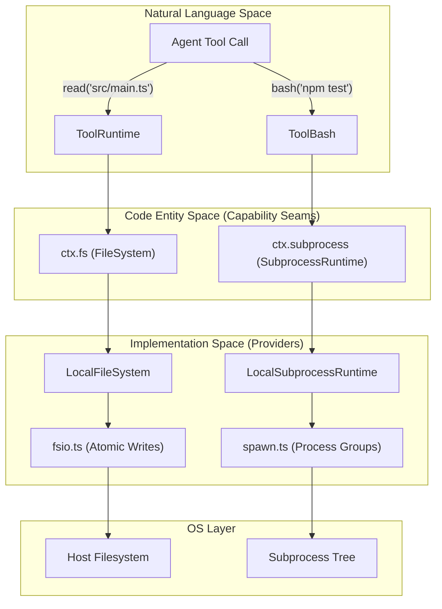
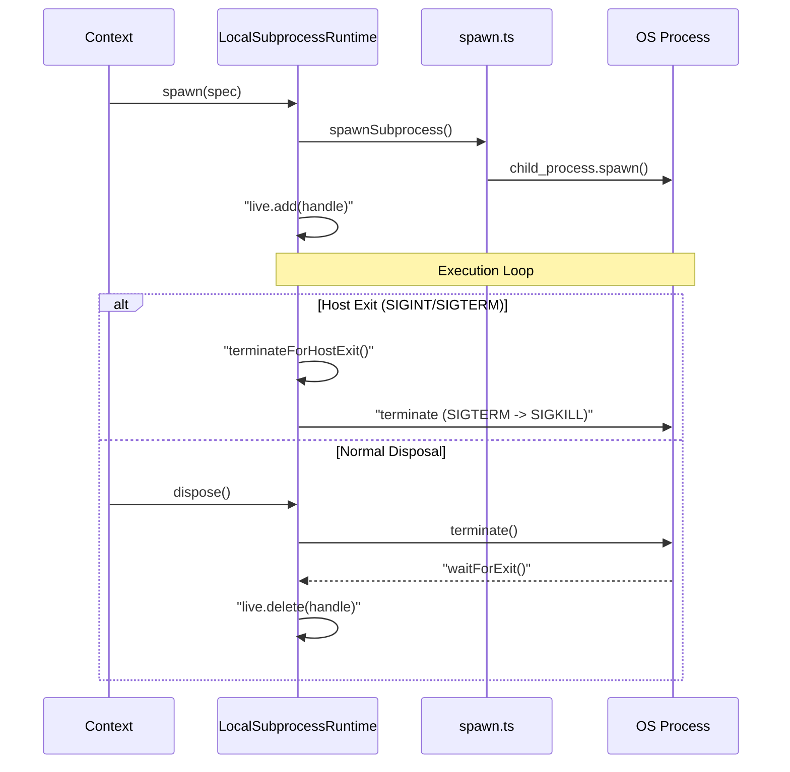

# Execution Environment

Relevant source files

The following files were used as context for generating this wiki page:

- [packages/fs/fs-local/README.md](packages/fs/fs-local/README.md)
- [packages/fs/fs-local/package.json](packages/fs/fs-local/package.json)
- [packages/fs/fs-local/src/fsio.ts](packages/fs/fs-local/src/fsio.ts)
- [packages/fs/fs-local/src/index.ts](packages/fs/fs-local/src/index.ts)
- [packages/fs/fs-local/tests/filesystem.spec.ts](packages/fs/fs-local/tests/filesystem.spec.ts)
- [packages/fs/fs-local/tests/fsio.spec.ts](packages/fs/fs-local/tests/fsio.spec.ts)
- [packages/fs/fs/README.md](packages/fs/fs/README.md)
- [packages/fs/fs/package.json](packages/fs/fs/package.json)
- [packages/fs/fs/src/index.ts](packages/fs/fs/src/index.ts)
- [packages/fs/fs/src/types.ts](packages/fs/fs/src/types.ts)
- [packages/fs/fs/tests/service.spec.ts](packages/fs/fs/tests/service.spec.ts)
- [packages/fs/tool-fs/README.i18n.yaml](packages/fs/tool-fs/README.i18n.yaml)
- [packages/fs/tool-fs/README.md](packages/fs/tool-fs/README.md)
- [packages/fs/tool-fs/README.zh.md](packages/fs/tool-fs/README.zh.md)
- [packages/fs/tool-fs/package.json](packages/fs/tool-fs/package.json)
- [packages/fs/tool-fs/src/edit.ts](packages/fs/tool-fs/src/edit.ts)
- [packages/fs/tool-fs/src/index.ts](packages/fs/tool-fs/src/index.ts)
- [packages/fs/tool-fs/src/read-image.ts](packages/fs/tool-fs/src/read-image.ts)
- [packages/fs/tool-fs/src/read-target.ts](packages/fs/tool-fs/src/read-target.ts)
- [packages/fs/tool-fs/src/read.ts](packages/fs/tool-fs/src/read.ts)
- [packages/fs/tool-fs/src/write.ts](packages/fs/tool-fs/src/write.ts)
- [packages/fs/tool-fs/tests/integration.spec.ts](packages/fs/tool-fs/tests/integration.spec.ts)
- [packages/fs/tool-fs/tests/tools.spec.ts](packages/fs/tool-fs/tests/tools.spec.ts)
- [packages/subprocess/README.i18n.yaml](packages/subprocess/README.i18n.yaml)
- [packages/subprocess/README.md](packages/subprocess/README.md)
- [packages/subprocess/README.zh.md](packages/subprocess/README.zh.md)
- [packages/subprocess/subprocess-local/README.i18n.yaml](packages/subprocess/subprocess-local/README.i18n.yaml)
- [packages/subprocess/subprocess-local/README.md](packages/subprocess/subprocess-local/README.md)
- [packages/subprocess/subprocess-local/README.zh.md](packages/subprocess/subprocess-local/README.zh.md)
- [packages/subprocess/subprocess-local/package.json](packages/subprocess/subprocess-local/package.json)
- [packages/subprocess/subprocess-local/src/index.ts](packages/subprocess/subprocess-local/src/index.ts)
- [packages/subprocess/subprocess-local/src/spawn.ts](packages/subprocess/subprocess-local/src/spawn.ts)
- [packages/subprocess/subprocess-local/tests/local.spec.ts](packages/subprocess/subprocess-local/tests/local.spec.ts)
- [packages/subprocess/subprocess-local/tests/spawn.spec.ts](packages/subprocess/subprocess-local/tests/spawn.spec.ts)
- [packages/subprocess/subprocess-local/tsconfig.json](packages/subprocess/subprocess-local/tsconfig.json)
- [packages/subprocess/subprocess/README.i18n.yaml](packages/subprocess/subprocess/README.i18n.yaml)
- [packages/subprocess/subprocess/README.md](packages/subprocess/subprocess/README.md)
- [packages/subprocess/subprocess/README.zh.md](packages/subprocess/subprocess/README.zh.md)
- [packages/subprocess/subprocess/src/index.ts](packages/subprocess/subprocess/src/index.ts)
- [packages/subprocess/subprocess/src/types.ts](packages/subprocess/subprocess/src/types.ts)
- [packages/subprocess/subprocess/tests/service.spec.ts](packages/subprocess/subprocess/tests/service.spec.ts)

The **Execution Environment** in `dsh` manages how the system interacts with the host filesystem, spawns processes, and maintains security boundaries. It is built on the **Capability Seam** pattern, where high-level tools interact with abstract interfaces (`ctx.fs`, `ctx.subprocess`) that are fulfilled by specific provider plugins (e.g., `LocalFileSystem`, `LocalSubprocessRuntime`).

### Core Subsystems

The environment is divided into three primary functional areas:

| Area | Responsibility | Primary Services |
| :--- | :--- | :--- |
| **Filesystem** | File I/O, atomic writes, and observation tracking. | `FileSystem` [packages/fs/fs/src/index.ts:25-27](), `LocalFileSystem` [packages/fs/fs-local/src/index.ts:64-64]() |
| **Subprocess** | Shell execution, PTY management, and process trees. | `SubprocessRuntime` [packages/subprocess/subprocess/src/index.ts:23-23](), `LocalSubprocessRuntime` [packages/subprocess/subprocess-local/src/index.ts:37-37]() |
| **Sandboxing** | Resource restriction and security policies. | `SandboxPolicyService`, `Landlock` (Linux), `Windows ACL` |

### System Architecture: From Tools to OS

The following diagram illustrates how natural language tool calls from an agent are translated into concrete OS-level operations through the capability seams.

**Tool-to-Entity Mapping**

Sources: [packages/fs/tool-fs/src/read.ts:136-163](), [packages/subprocess/subprocess-local/src/index.ts:146-157](), [packages/fs/fs-local/src/index.ts:64-77]()

---

### Filesystem & Observation

The filesystem layer provides a unified interface for file operations with a focus on safety and consistency.
*   **Atomic Operations**: All writes are performed via a "write-then-rename" pattern to prevent partial file corruption [packages/fs/fs-local/src/fsio.ts:4-5](). Writes stage an exclusive owner-only file in a private sibling directory and atomically publish it [packages/fs/fs-local/src/fsio.ts:2-4]().
*   **Target Identity**: Files are identified by their `realpath` (`targetKey`), ensuring that symlinks and aliases share the same stale-check state [packages/fs/fs-local/src/index.ts:2-4]().
*   **Observation Policy**: Tools like `read`, `write`, and `edit` emit `fs/observed` events [packages/fs/tool-fs/src/read.ts:162-162](). This allows a policy plugin to enforce that a file must be read before it can be edited, using version tokens derived from high-resolution identity and freshness metadata [packages/fs/fs-local/src/fsio.ts:73-76]().
*   **Concurrency**: Mutating operations (writes and edits) are serialized per `targetKey` using a mutation lock to prevent interleaving [packages/fs/fs-local/src/index.ts:74-77]().

For details on I/O primitives and search tools, see [Filesystem Tools & Observation](#4.1).

### Shell, Subprocess & Terminal

`dsh` manages processes as **detached process trees**. This ensures that if a parent process is killed, all descendants (like a compiler spawned by a build script) are also reaped.
*   **Local Subprocess**: Uses POSIX process groups or Windows `taskkill` to manage trees [packages/subprocess/subprocess-local/src/spawn.ts:2-6](). It includes a `SIGTERM` → grace period → `SIGKILL` escalation ladder [packages/subprocess/subprocess-local/src/index.ts:33-35]().
*   **PTY Support**: Provides persistent terminal sessions via `node-pty`, allowing interactive shell tools to maintain state across steps [packages/subprocess/subprocess-local/src/index.ts:161-180]().
*   **Output Collection**: Streams are captured by `OutputCollector` with bounded in-memory tails and optional "spill files" for large logs [packages/subprocess/subprocess-local/src/spawn.ts:104-113]().

For details on shell tools and PTY management, see [Shell, Subprocess & Terminal](#4.2).

### Sandboxing & Security

The execution environment is designed to be restricted by default.
*   **Linux**: Uses `Landlock` to provide fine-grained filesystem access control at the kernel level.
*   **Windows**: Employs Restricted Tokens and ACLs to limit process capabilities.
*   **Approval Seam**: High-risk operations (like modifying files outside a workspace) can be routed through an approval flow (`ctx.approval`) before execution [packages/fs/tool-fs/README.md:54-54]().
*   **Environment Scrubbing**: Subprocesses are spawned with a credential-scrubbed environment to prevent leaking host secrets [packages/subprocess/subprocess-local/src/index.ts:31-35]().

For details on security configurations and platform-specific sandboxing, see [Sandboxing & Security](#4.3).

---

### Execution Lifecycle

The following diagram shows the lifecycle of a subprocess managed by `LocalSubprocessRuntime`, including how it handles clean teardown during host exit.

**Subprocess Lifecycle & Cleanup**

Sources: [packages/subprocess/subprocess-local/src/index.ts:49-60](), [packages/subprocess/subprocess-local/src/index.ts:79-102](), [packages/subprocess/subprocess-local/src/spawn.ts:169-181]()

**Sources:**
- [packages/fs/fs-local/src/fsio.ts:1-111]()
- [packages/subprocess/subprocess-local/src/index.ts:37-157]()
- [packages/fs/fs-local/src/index.ts:64-171]()
- [packages/fs/tool-fs/src/read.ts:136-163]()
- [packages/subprocess/subprocess-local/src/spawn.ts:1-181]()
