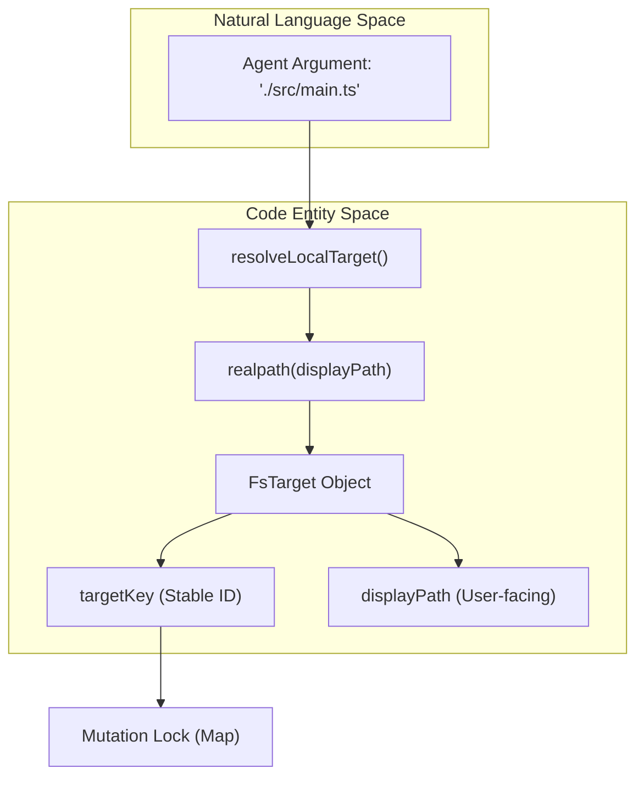

# Filesystem Tools & Observation

Relevant source files

The following files were used as context for generating this wiki page:

- [.agents/notes/implemented/architecture/2026-07-10-single-file-executable-sdk-runtime-distribution.i18n.yaml](.agents/notes/implemented/architecture/2026-07-10-single-file-executable-sdk-runtime-distribution.i18n.yaml)
- [.agents/notes/implemented/architecture/2026-07-10-single-file-executable-sdk-runtime-distribution.md](.agents/notes/implemented/architecture/2026-07-10-single-file-executable-sdk-runtime-distribution.md)
- [.agents/notes/implemented/architecture/2026-07-10-single-file-executable-sdk-runtime-distribution.zh.md](.agents/notes/implemented/architecture/2026-07-10-single-file-executable-sdk-runtime-distribution.zh.md)
- [.github/workflows/build-exe-for-python-sdk.yml](.github/workflows/build-exe-for-python-sdk.yml)
- [.gitlab-ci.yml](.gitlab-ci.yml)
- [packages/fs/fs-local/README.md](packages/fs/fs-local/README.md)
- [packages/fs/fs-local/package.json](packages/fs/fs-local/package.json)
- [packages/fs/fs-local/src/fsio.ts](packages/fs/fs-local/src/fsio.ts)
- [packages/fs/fs-local/src/index.ts](packages/fs/fs-local/src/index.ts)
- [packages/fs/fs-local/tests/filesystem.spec.ts](packages/fs/fs-local/tests/filesystem.spec.ts)
- [packages/fs/fs-local/tests/fsio.spec.ts](packages/fs/fs-local/tests/fsio.spec.ts)
- [packages/fs/fs/README.md](packages/fs/fs/README.md)
- [packages/fs/fs/package.json](packages/fs/fs/package.json)
- [packages/fs/fs/src/index.ts](packages/fs/fs/src/index.ts)
- [packages/fs/fs/src/types.ts](packages/fs/fs/src/types.ts)
- [packages/fs/fs/tests/service.spec.ts](packages/fs/fs/tests/service.spec.ts)
- [packages/fs/tool-fs-search/README.i18n.yaml](packages/fs/tool-fs-search/README.i18n.yaml)
- [packages/fs/tool-fs-search/README.md](packages/fs/tool-fs-search/README.md)
- [packages/fs/tool-fs-search/README.zh.md](packages/fs/tool-fs-search/README.zh.md)
- [packages/fs/tool-fs-search/src/glob.ts](packages/fs/tool-fs-search/src/glob.ts)
- [packages/fs/tool-fs-search/src/grep.ts](packages/fs/tool-fs-search/src/grep.ts)
- [packages/fs/tool-fs-search/src/index.ts](packages/fs/tool-fs-search/src/index.ts)
- [packages/fs/tool-fs-search/src/search-core.ts](packages/fs/tool-fs-search/src/search-core.ts)
- [packages/fs/tool-fs-search/tests/integration.spec.ts](packages/fs/tool-fs-search/tests/integration.spec.ts)
- [packages/fs/tool-fs-search/tests/tools.spec.ts](packages/fs/tool-fs-search/tests/tools.spec.ts)
- [packages/fs/tool-fs/README.i18n.yaml](packages/fs/tool-fs/README.i18n.yaml)
- [packages/fs/tool-fs/README.md](packages/fs/tool-fs/README.md)
- [packages/fs/tool-fs/README.zh.md](packages/fs/tool-fs/README.zh.md)
- [packages/fs/tool-fs/package.json](packages/fs/tool-fs/package.json)
- [packages/fs/tool-fs/src/edit.ts](packages/fs/tool-fs/src/edit.ts)
- [packages/fs/tool-fs/src/index.ts](packages/fs/tool-fs/src/index.ts)
- [packages/fs/tool-fs/src/read-image.ts](packages/fs/tool-fs/src/read-image.ts)
- [packages/fs/tool-fs/src/read-target.ts](packages/fs/tool-fs/src/read-target.ts)
- [packages/fs/tool-fs/src/read.ts](packages/fs/tool-fs/src/read.ts)
- [packages/fs/tool-fs/src/write.ts](packages/fs/tool-fs/src/write.ts)
- [packages/fs/tool-fs/tests/integration.spec.ts](packages/fs/tool-fs/tests/integration.spec.ts)
- [packages/fs/tool-fs/tests/tools.spec.ts](packages/fs/tool-fs/tests/tools.spec.ts)
- [python/sdk-runtime/README.i18n.yaml](python/sdk-runtime/README.i18n.yaml)
- [python/sdk-runtime/README.md](python/sdk-runtime/README.md)
- [python/sdk-runtime/README.zh.md](python/sdk-runtime/README.zh.md)
- [python/sdk-runtime/src/deepseek_harness_runtime/__init__.py](python/sdk-runtime/src/deepseek_harness_runtime/__init__.py)
- [python/sdk/tests/test_smoke_model.py](python/sdk/tests/test_smoke_model.py)
- [scripts/smoke-python-runtime.py](scripts/smoke-python-runtime.py)
- [scripts/verify-runtime-closure.spec.ts](scripts/verify-runtime-closure.spec.ts)
- [scripts/verify-runtime-closure.ts](scripts/verify-runtime-closure.ts)

The DeepSeek Harness (DSH) filesystem architecture provides a unified, capability-based interface for interacting with the host filesystem. It separates low-level I/O mechanics from model-facing tools and security policies. The system is built around the `ctx.fs` capability seam, allowing for interchangeable backends (e.g., local, remote, or sandboxed) while maintaining a consistent toolset for agents.

## 1. Filesystem Capability Seam (`ctx.fs`)

The core of the filesystem subsystem is the `FileSystem` abstract class, which defines the primitive operations required by the harness.

### Key Primitives
*   **`resolve(path, opts)`**: Converts a relative or absolute path into a `FsTarget`, which contains a stable `targetKey` (the realpath) and a `displayPath` [packages/fs/fs-local/src/fsio.ts:146-151]().
*   **`stat` / `lstat`**: Returns metadata including an opaque `FsVersion` token derived from high-resolution identity and freshness metadata (`dev:ino:size:mtimeNs:ctimeNs`) [packages/fs/fs-local/src/fsio.ts:74-76]().
*   **`readText` / `streamText`**: Reads UTF-8 text. Large files are streamed to avoid memory exhaustion, rejecting binary data and invalid UTF-8 via NUL-byte sampling [packages/fs/fs-local/src/fsio.ts:20-22]().
*   **`writeText` / `editText`**: Atomic mutation operations that support optional "intents" (optimistic locking guards) [packages/fs/fs-local/src/fsio.ts:23-26]().

### Data Flow: Path Resolution to Entity
The following diagram illustrates how a natural language path provided by an agent is resolved to a stable code entity used for I/O.

**Path Resolution Flow**

Sources: [packages/fs/fs-local/src/fsio.ts:146-151](), [packages/fs/fs-local/src/index.ts:91-104]()

---

## 2. Local Filesystem Implementation (`fs-local`)

The `LocalFileSystem` class implements the `FileSystem` seam for the host machine.

### Atomic Writes and Windows Safety
To ensure data integrity, writes are atomic:
1.  A temporary file is created in a private staging directory sibling to the target [packages/fs/fs-local/src/fsio.ts:4-5]().
2.  On Windows, the target's DACL (security descriptor) is copied to the temp file to preserve permissions using `copyFileDaclWin32` [packages/fs/fs-local/src/fsio.ts:15]().
3.  The file is `fsync`'d and then atomically renamed (using `replaceFileWin32` or `ReplaceFileW` on Windows) to the target path [packages/fs/fs-local/src/fsio.ts:15](), [packages/fs/fs-local/README.md:23]().

### Concurrency Control
The backend maintains a `locks` Map of `targetKey` to `Promise<unknown>`. All mutating operations (`writeText`, `editText`) for a specific file are queued to ensure that the read-guard-write cycle is never interleaved [packages/fs/fs-local/src/index.ts:74-77]().

Sources: [packages/fs/fs-local/src/fsio.ts:1-25](), [packages/fs/fs-local/src/index.ts:91-104](), [packages/fs/fs-local/README.md:15-25]()

---

## 3. Model-Facing Tools (`tool-fs`)

The `tool-fs` package provides the JSON-RPC tools exposed to the LLM.

### Read Tool & Windowing
The `read` tool handles line-numbered output and pagination.
*   **Line Windowing**: It caps output at `READ_LIMIT` (default 2000 lines) and `readMaxBytes` (default 51,200 bytes) [packages/fs/tool-fs/README.md:23-27]().
*   **Streaming**: Files larger than `STREAM_MIN_SIZE` (10 MiB) are processed via `AsyncIterable` to build the window without loading the full file into memory [packages/fs/tool-fs/src/read.ts:27]().

### Edit Tool (`str-replace-editor` pattern)
The `edit` tool performs literal string replacement.
*   **Validation**: It requires the `old_string` to be unique within the file unless `replace_all` is set to `true` [packages/fs/tool-fs/src/edit.ts:90]().
*   **Implementation**: It uses a literal match-and-replace strategy, normalizing line endings (LF/CRLF) during the process and rejecting ambiguous matches [packages/fs/fs-local/README.md:24]().

### Write Tool
Replaces the entire content of a file. It returns a structured outcome indicating if the file was `created` or `updated` [packages/fs/tool-fs/src/write.ts:36-43]().

Sources: [packages/fs/tool-fs/src/read.ts:15-34](), [packages/fs/tool-fs/src/edit.ts:76-81](), [packages/fs/tool-fs/src/write.ts:62-67]()

---

## 4. Search Tools (`tool-fs-search`)

Search capabilities are provided by wrapping the `ripgrep` (`rg`) binary, which is bundled in the Python runtime distribution [python/sdk-runtime/README.zh.md:11]().

### Glob and Grep Tools
*   **`glob`**: Discovers files matching a pattern, sorted by modification time [packages/fs/tool-fs-search/src/glob.ts:90-95]().
*   **`grep`**: Searches for regex patterns within file contents.
*   **VCS Protection**: Both tools automatically exclude `.git`, `.svn`, and other version control directories using negated globs [packages/fs/tool-fs-search/src/glob.ts:38]().

### Implementation via Subprocess
The search tools do not use Node's `fs` for searching. Instead, they spawn `rg` via `ctx.subprocess.spawn` [packages/fs/tool-fs-search/src/glob.ts:3-8](). This ensures high performance and honors the same execution boundaries as shell tools.

**Search Execution Flow**

Sources: [packages/fs/tool-fs-search/src/glob.ts:18-20](), [packages/fs/tool-fs-search/src/glob.ts:158-165](), [packages/fs/tool-fs-search/tests/tools.spec.ts:149-165]()

---

## 5. Observation & Freshness Policy

The `fs-observation-policy` plugin implements optimistic concurrency control for the filesystem.

### The "Read-Before-Write" Invariant
By default, the harness enforces a policy where an agent must have "observed" (read) a file version before it is allowed to modify it.
1.  **Observation**: When `read` or `read_image` succeeds, the tool emits a `fs/observed` event [packages/fs/tool-fs/src/read.ts:162]().
2.  **Intent**: When `write` or `edit` is called, the tool requests an "intent" via `ctx.waterfall('fs/write-intent', ...)` [packages/fs/tool-fs/src/write.ts:111]().
3.  **Validation**: The policy plugin checks its internal cache. If the file has changed since the last observation, it returns a `replaceIfVersion` guard or throws `FS_NOT_OBSERVED` [packages/fs/tool-fs/README.md:52]().

### Error Remediation
If a mutation fails due to a stale version, the system catches the `FsError` and provides a model-facing remedy, instructing the agent to "read the file again to see the latest changes" [packages/fs/tool-fs/src/edit.ts:134-139]().

Sources: [packages/fs/tool-fs/README.md:43-52](), [packages/fs/tool-fs/src/read.ts:159-162](), [packages/fs/tool-fs/src/write.ts:109-111]()

---

## 6. Runtime Distribution & Packaging

For Python SDK users, the filesystem tools are bundled into a single-file executable (`single-exe`) [python/sdk-runtime/README.zh.md:5]().

### Bundled Binaries
*   **Node Runtime**: The exe carries its own Node 24 runtime via `@yao-pkg/pkg` SEA mode [.agents/notes/implemented/architecture/2026-07-10-single-file-executable-sdk-runtime-distribution.md:19-22]().
*   **Ripgrep**: A platform-specific `rg` binary is bundled as a companion file to support `tool-fs-search` [python/sdk-runtime/README.zh.md:11]().
*   **Native Addons**: `node-pty` is rebuilt for the target architecture (e.g., manylinux 2.28) during the CI build process [.github/workflows/build-exe-for-python-sdk.yml:185-195]().

Sources: [python/sdk-runtime/README.zh.md:5-20](), [.github/workflows/build-exe-for-python-sdk.yml:185-195](), [.agents/notes/implemented/architecture/2026-07-10-single-file-executable-sdk-runtime-distribution.md:19-25]()
