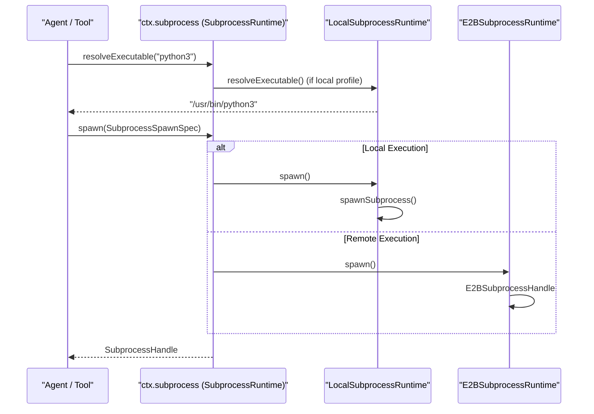
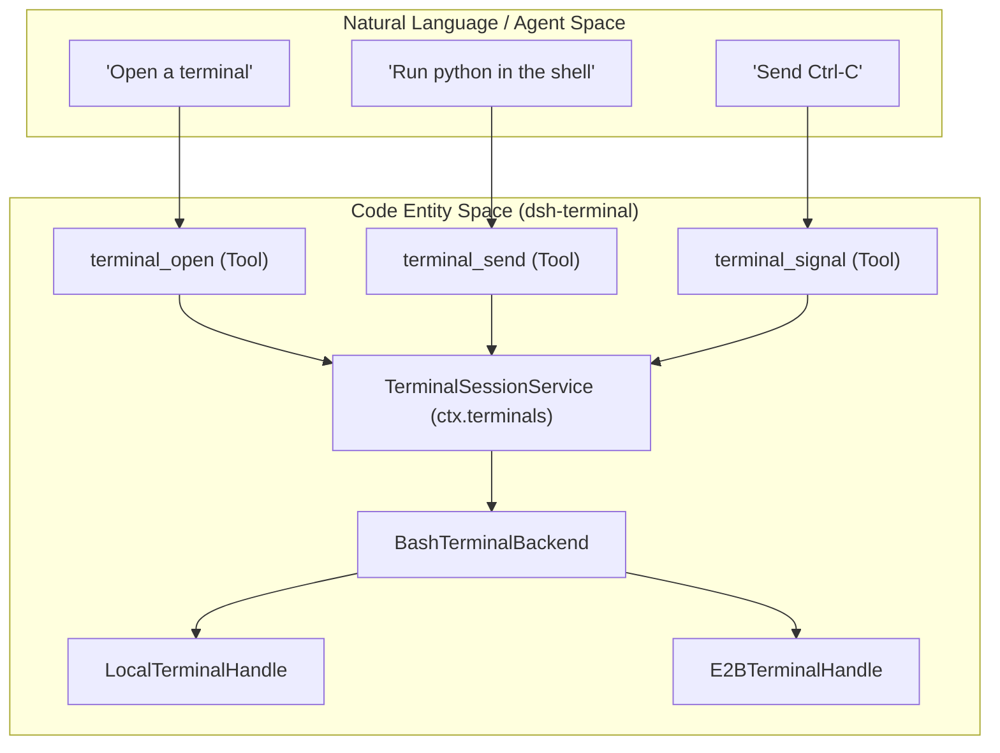

# Shell, Subprocess & Terminal

Relevant source files

The following files were used as context for generating this wiki page:

- [.agents/notes/implemented/feature/2026-07-16-persistent-pty-sessions.i18n.yaml](.agents/notes/implemented/feature/2026-07-16-persistent-pty-sessions.i18n.yaml)
- [.agents/notes/implemented/feature/2026-07-16-persistent-pty-sessions.md](.agents/notes/implemented/feature/2026-07-16-persistent-pty-sessions.md)
- [.agents/notes/implemented/feature/2026-07-16-persistent-pty-sessions.zh.md](.agents/notes/implemented/feature/2026-07-16-persistent-pty-sessions.zh.md)
- [examples/headless-agent/tests/fixtures/e2b/e2b/bin.ts](examples/headless-agent/tests/fixtures/e2b/e2b/bin.ts)
- [packages/e2b/e2b/README.i18n.yaml](packages/e2b/e2b/README.i18n.yaml)
- [packages/e2b/e2b/README.md](packages/e2b/e2b/README.md)
- [packages/e2b/e2b/README.zh.md](packages/e2b/e2b/README.zh.md)
- [packages/e2b/e2b/src/index.ts](packages/e2b/e2b/src/index.ts)
- [packages/e2b/e2b/tests/composition.e2e.ts](packages/e2b/e2b/tests/composition.e2e.ts)
- [packages/e2b/e2b/tests/e2b.spec.ts](packages/e2b/e2b/tests/e2b.spec.ts)
- [packages/e2b/subprocess-e2b/README.i18n.yaml](packages/e2b/subprocess-e2b/README.i18n.yaml)
- [packages/e2b/subprocess-e2b/README.md](packages/e2b/subprocess-e2b/README.md)
- [packages/e2b/subprocess-e2b/README.zh.md](packages/e2b/subprocess-e2b/README.zh.md)
- [packages/e2b/subprocess-e2b/src/index.ts](packages/e2b/subprocess-e2b/src/index.ts)
- [packages/e2b/subprocess-e2b/src/process.ts](packages/e2b/subprocess-e2b/src/process.ts)
- [packages/e2b/subprocess-e2b/src/terminal.ts](packages/e2b/subprocess-e2b/src/terminal.ts)
- [packages/e2b/subprocess-e2b/tests/subprocess.spec.ts](packages/e2b/subprocess-e2b/tests/subprocess.spec.ts)
- [packages/e2b/subprocess-e2b/tests/terminal.spec.ts](packages/e2b/subprocess-e2b/tests/terminal.spec.ts)
- [packages/subprocess/README.i18n.yaml](packages/subprocess/README.i18n.yaml)
- [packages/subprocess/README.md](packages/subprocess/README.md)
- [packages/subprocess/README.zh.md](packages/subprocess/README.zh.md)
- [packages/subprocess/subprocess-local/README.i18n.yaml](packages/subprocess/subprocess-local/README.i18n.yaml)
- [packages/subprocess/subprocess-local/README.md](packages/subprocess/subprocess-local/README.md)
- [packages/subprocess/subprocess-local/README.zh.md](packages/subprocess/subprocess-local/README.zh.md)
- [packages/subprocess/subprocess-local/package.json](packages/subprocess/subprocess-local/package.json)
- [packages/subprocess/subprocess-local/src/index.ts](packages/subprocess/subprocess-local/src/index.ts)
- [packages/subprocess/subprocess-local/src/spawn.ts](packages/subprocess/subprocess-local/src/spawn.ts)
- [packages/subprocess/subprocess-local/tests/local.spec.ts](packages/subprocess/subprocess-local/tests/local.spec.ts)
- [packages/subprocess/subprocess-local/tests/spawn.spec.ts](packages/subprocess/subprocess-local/tests/spawn.spec.ts)
- [packages/subprocess/subprocess-local/tsconfig.json](packages/subprocess/subprocess-local/tsconfig.json)
- [packages/subprocess/subprocess/README.i18n.yaml](packages/subprocess/subprocess/README.i18n.yaml)
- [packages/subprocess/subprocess/README.md](packages/subprocess/subprocess/README.md)
- [packages/subprocess/subprocess/README.zh.md](packages/subprocess/subprocess/README.zh.md)
- [packages/subprocess/subprocess/src/index.ts](packages/subprocess/subprocess/src/index.ts)
- [packages/subprocess/subprocess/src/types.ts](packages/subprocess/subprocess/src/types.ts)
- [packages/subprocess/subprocess/tests/service.spec.ts](packages/subprocess/subprocess/tests/service.spec.ts)

The Shell, Subprocess, and Terminal subsystems provide the harness with the capability to execute arbitrary code, manage process lifecycles, and maintain interactive sessions. This infrastructure is built on the **Capability Seam** pattern, allowing the agent to interact with either a local host or a remote sandboxed environment (like E2B) through a unified interface.

## Overview of the Subprocess Seam

The `SubprocessRuntime` serves as the abstract base for all execution backends. It defines how the system resolves executables, spawns one-shot processes, and allocates persistent PTY (Pseudo-Terminal) handles.

### Key Data Structures

| Entity | Description |
|---|---|
| `SubprocessSpawnSpec` | Defines command arguments, working directory, environment variables, and stdio dispositions (pipe, inherit, or collect). [packages/subprocess/subprocess/src/types.ts:130-155]() |
| `SubprocessHandle` | A handle to a running process, providing access to `stdin` (Writable), `stdout`/`stderr` (Readable), and a `done` promise. [packages/subprocess/subprocess/src/types.ts:182-205]() |
| `SubprocessOutcome` | The final result of a process, containing the `exitCode` or the terminating `signal`. [packages/subprocess/subprocess/src/types.ts:210-215]() |

### Subprocess Data Flow
This diagram illustrates how a tool call (like `bash`) moves from the Agent through the capability seam to a concrete execution backend.

**Diagram: Subprocess Execution Flow**

Sources: [packages/subprocess/subprocess/src/index.ts:17-30](), [packages/subprocess/subprocess-local/src/index.ts:37-45](), [packages/e2b/subprocess-e2b/src/process.ts:159-170]()

---

## Local Subprocess Spawning

The `LocalSubprocessRuntime` implements execution on the host machine. It manages detached process trees and ensures that child processes do not outlive the harness.

### Process Tree Management
On Linux/macOS, the runtime uses POSIX process groups. On Windows, it utilizes `taskkill /T` to ensure entire trees are reaped. [packages/subprocess/subprocess-local/src/spawn.ts:2-8]()

### Output Collection & Spilling
To prevent memory exhaustion while allowing agents to read large logs, the `OutputCollector` implements a "tail-keep" strategy:
1.  **In-Memory Tail**: A bounded buffer (e.g., 64KB) keeps the most recent output. [packages/subprocess/subprocess-local/src/spawn.ts:115-116]()
2.  **Spill to Disk**: If a spill cap is provided, the full stream is written to a temporary file once the in-memory cap is exceeded. [packages/subprocess/subprocess-local/src/spawn.ts:156-173]()
3.  **Truncation**: If the spill cap is also exceeded, the head of the stream is discarded, but the in-memory tail remains preserved. [packages/subprocess/subprocess-local/src/spawn.ts:137-152]()

### Synchronous Host-Exit Cleanup
A critical feature of the local runtime is the `terminateForHostExit` method. It attaches a listener to the Node.js `exit` event to force-kill all managed process trees synchronously. This prevents "zombie" processes from persisting if the harness crashes or is terminated. [packages/subprocess/subprocess-local/src/index.ts:62-77](), [packages/subprocess/subprocess-local/tests/local.spec.ts:41-80]()

Sources: [packages/subprocess/subprocess-local/src/spawn.ts:104-153](), [packages/subprocess/subprocess-local/src/index.ts:37-60]()

---

## Persistent PTY Sessions

While one-shot `bash` calls are stateless, the `TerminalSessionService` (`ctx.terminals`) allows for interactive, stateful terminal sessions. This enables workflows like REPL exploration or multi-step debugging where environment variables and `cwd` must persist. [.agents/notes/implemented/feature/2026-07-16-persistent-pty-sessions.md:9-15]()

### Implementation Details
*   **Ownership**: Every PTY session is owned by a specific `Agent`. Other agents cannot read or signal these sessions. [.agents/notes/implemented/feature/2026-07-16-persistent-pty-sessions.md:33-35]()
*   **Readiness Detection**: The `dsh-terminal-bash` backend uses OSC (Operating System Command) markers and shell prompt heuristics to determine when a command has finished and the shell is ready for new input. [.agents/notes/implemented/feature/2026-07-16-persistent-pty-sessions.zh.md:75-76]()
*   **Linux Syscall Inspection**: On Linux, the system inspects `/proc/<pid>/stat` to check if the foreground process group is waiting on `stdin` (e.g., via `read` or `poll` on fd 0). [.agents/notes/implemented/feature/2026-07-16-persistent-pty-sessions.zh.md:77-78]()

**Diagram: Terminal Capability Mapping**

Sources: [.agents/notes/implemented/feature/2026-07-16-persistent-pty-sessions.md:23-27](), [.agents/notes/implemented/feature/2026-07-16-persistent-pty-sessions.zh.md:50-60]()

---

## E2B Cloud Sandbox Backend

The E2B backend (`subprocess-e2b`) projects remote cloud execution onto the local subprocess seam.

### Remote Environment Bootstrapping
Because E2B execution happens in a fresh VM, the harness must bootstrap the environment:
1.  **Environment Sync**: Local environment variables (scrubbed of secrets) are serialized and sent to the remote sandbox using `serializeRemoteEnvironment`. [packages/e2b/subprocess-e2b/src/process.ts:113-115](), [packages/e2b/subprocess-e2b/src/environment.ts:1-10]()
2.  **Wrapper Scripts**: Commands are wrapped in a bash bootstrap that handles PID tracking and exit status reporting via remote files. [packages/e2b/subprocess-e2b/src/process.ts:122-138]()

### Remote PTY Management
The `spawnE2BTerminal` function allocates a PTY in the E2B sandbox. It uses a custom `TERMINAL_RUNNER_SOURCE` script to ensure that the remote shell environment matches the agent's expectations and that output markers are correctly emitted for readiness detection. [packages/e2b/subprocess-e2b/src/terminal.ts:30-45](), [packages/e2b/subprocess-e2b/src/terminal.ts:161-175]()

### Cleanup & Rollback
If an E2B process spawn is cancelled before it finishes initializing, the `rollbackUnpublishedTerminal` function ensures that the remote process and its associated session are killed to avoid leaking resources in the cloud sandbox. [packages/e2b/subprocess-e2b/src/terminal.ts:198-215]()

Sources: [packages/e2b/subprocess-e2b/src/process.ts:159-175](), [packages/e2b/subprocess-e2b/src/terminal.ts:1-29](), [packages/e2b/subprocess-e2b/src/terminal.ts:198-215]()
